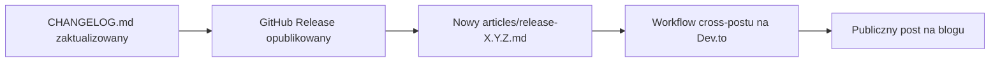

# articles

# Moduł `articles/`

Katalog treści zawierający artykuły w formacie Markdown publikowane na zewnętrznych platformach (Dev.to, blog projektu itd.) w celu ogłaszania wydań, premier i kamieni milowych. To **nie jest** kod źródłowy — to treść gotowa do publikacji z ustandaryzowanym nagłówkiem YAML front matter, przetwarzaną przez zautomatyzowany potok publikacji.

## Cel

Moduł pełni trzy funkcje:

1. **Ogłoszenia wydań** — jeden artykuł na tag wydania, odzwierciedlający notatki z GitHub Release w bardziej narracyjnym, skierowanym do programistów tonie. To dominujący typ treści (18 z 20 plików).
2. **Posty o premierach / kamieniach milowych** — artykuły typu evergreen, takie jak `hello-librefang.md` (wprowadzenie do projektu) i `new-website-launch.md` (ogłoszenie przebudowy strony).
3. **Źródło syndykacji zewnętrznej** — nagłówek front matter zawiera `canonical_url` i `tags`, które są odczytywane przez narzędzia podrzędne (workflow cross-postowania na Dev.to, do którego odnosi się `release-0.5.6.md`), aby publikować automatycznie.

Notatki z wydania wspominają, że „LibreFang teraz automatycznie generuje artykuły na Dev.to dla wydań" — te pliki Markdown są wejściem dla tej automatyzacji.

## Inwentaryzacja plików

| Plik | Typ | Schemat wersji |
|------|------|----------------|
| `hello-librefang.md` | Wprowadzenie / evergreen | — |
| `new-website-launch.md` | Ogłoszenie premiery | — |
| `release-0.5.6.md` → `release-0.7.0.md` | Notatki z wydania | SemVer (`0.x.y`) |
| `release-2026.3.21.md` → `release-2026.7.31.md` | Notatki z wydania | CalVer (`YYYY.M.DD[HH]`) |

Podział schematu wersjonowania przy `release-2026.3.21.md` odzwierciedla migrację LibreFang z SemVer na **Kalendarzowy Schemat Wersjonowania (`YYYY.M.DDHH`)**, co jest wyraźnie zaznaczone w artykułach dotkniętych zmianą.

## Konwencje

Każdy plik podąża za wspólną umową. Odchylenie od tej umowy spowoduje przerwanie potoku publikacji.

### Front matter (wymagany)

```yaml
---
title: "LibreFang <version> Released"        # lub opisowy tytuł
published: true                               # wszystkie obecne pliki są opublikowane
description: "<jednolinijkowe podsumowanie>"
tags: rust, ai, opensource[, release]         # notatki z wydania dodają `release`
canonical_url: https://github.com/librefang/librefang/releases/tag/v<version>
cover_image: https://raw.githubusercontent.com/librefang/librefang/main/public/assets/logo.png
---
```

- `canonical_url` w notatkach z wydania wskazuje na tag wydania GitHub, nie na post na Dev.to.
- `cover_image` jest stałe we wszystkich plikach — nie należy go zmieniać.
- Tag `release` jest dodawany tylko w artykułach z notatkami z wydania; posty evergreen używają podstawowych czterech tagów.

### Struktura treści (notatki z wydania)

Artykuły z notatkami z wydania mają rozpoznawalny kształt:

1. **Tytuł H1** zgodny z polem `title` w front matter.
2. **Jednoparagrafowy lead** opisujący, o czym jest wydanie.
3. **Sekcje tematyczne** (`## …`) grupujące zmiany — najważniejsze funkcje, bezpieczeństwo, poprawki błędów itd. Prefiksy emoji są konwencjonalne, ale nie wymagane.
4. **`## Install / Upgrade`** — identyczny blok czterech poleceń w każdym pliku (binarny `curl|sh`, `cargo add`, `npm install`, `pip install`).
5. **`## Links`** — Pełny Changelog, GitHub Release, repozytorium GitHub, Discord, Przewodnik współtwórców.

Sekcje `Install / Upgrade` i `Links` są w praktyce kopiowane dosłownie między wydaniami — jedyną zmienną jest numer wersji w URL GitHub Release.

### Drift linków do obserwacji

Starsze artykuły (`release-0.5.6` → `release-0.6.5`) wskazują Przewodnik współtwórców na `…/blob/main/CONTRIBUTING.md`. Nowsze artykuły (`release-2026.6.29` i nowsze) wskazują na `…/blob/main/docs/CONTRIBUTING.md`. Przy dodawaniu nowego artykułu używaj ścieżki **`docs/`** — plik został przeniesiony.

## Wzorce treści według ery wydawniczej

### Era SemVer (`0.5.x`–`0.7.0`)

Krótkie notatki w stylu narracyjnym. Każde wydanie zazwyczaj obejmuje kilka tematów z opisami w formie prozy. Numery PR są podawane w tekście (`#441`, `#317`), ale nie wyczerpująco.

### Przejście na CalVer (`2026.3.21`, `2026.3.22`)

Te dwa artykuły obejmują niemal identyczną treść (to samo wydanie, opowiedziane dwukrotnie w innej ramie narracyjnej). Są pierwszymi, które używają CalVer i wyraźnie zaznaczają zmianę schematu wersjonowania.

### Dojrzała era CalVer (`2026.4.27` i dalej)

Artykuły stają się znacznie dłuższe. `release-2026.4.27.md` jest największym plikiem w module — reprodukuje pełne sekcje Keep-a-Changelog (`### Added`, `### Fixed`, `### Changed`, `### Documentation`, `### Maintenance`, `### Other`) z numerami PR w punktorach i przypisaniem autorstwa (`@username`). Późniejsze wydania CalVer (`2026.7.21`, `2026.7.31`) kontynuują ten wzorzec, czasem zwijając zmiany wewnętrzne w bloki ujawniania `<details>`.

## Znane problemy na poziomie plików

Dwa pliki w module mają defekty, o których powinien wiedzieć opiekun:

### `release-0.6.5.md` — nieprawidłowo sformatowany front matter

Plik otwiera się nagim H1 *przed* nagłówkiem YAML front matter:

```markdown
# LibreFang 0.6.5 Released

---
title: "LibreFang 0.6.5 Released"
…
---
```

Powoduje to, że blok YAML jest parsowany jako sekcja dokumentu drugiego poziomu, a nie jako metadane. Każdy parser front matter oczekujący ogrodzenia `---` od bajtu zerowego nie wyłapie metadanych tego pliku.

### `release-0.6.6.md` — zawiera redakcyjne metakomentarze

Plik zawiera notatki recenzenta/autora poza ogrodzeniem kodu Markdown („Perfect! Now I'll rewrite the article…", „Key improvements in this rewrite:", punktowana lista celów redakcyjnych). Ta treść zostanie opublikowana dosłownie, jeśli nie zostanie usunięta przed syndykacją. Właściwy artykuł jest poprawnie ogrodzony w bloku markdown następującym po komentarzach.

## Jak ten moduł łączy się z resztą repozytorium

Katalog articles to **czysty konsument artefaktów wydań** — nie ma żadnych wejściowych ani wyjściowych zależności kodowych (potwierdzone przez dane grafu wywołań). Jego wejściami są:

- **`CHANGELOG.md`** w katalogu głównym repozytorium — proza w notatkach z wydania jest kondensowana z sekcji Keep-a-Changelog tam zawartych. `release-2026.4.27.md` linkuje do niej sekcjonalnie (`…/CHANGELOG.md#2026-4-27`).
- **GitHub Releases** — wpisy `canonical_url` oraz `Links → GitHub Release` wskazują na `github.com/librefang/librefang/releases/tag/v<version>`.
- **Workflow wydania** — wspomniany w `release-0.5.6.md` („LibreFang teraz automatycznie generuje artykuły na Dev.to dla wydań"). Workflow, który konsumuje te pliki, znajduje się poza tym katalogiem (prawdopodobnie pod `.github/workflows/`).

Po wydaniu nowej wersji typowy przepływ wkładu to:



## Wskazówki dotyczące wkładu

Przy dodawaniu nowego artykułu o wydaniu:

1. **Skopiuj najnowszy plik CalVer** jako szablon — będzie miał poprawne ścieżki linków, zestaw tagów i strukturę sekcji.
2. **Zaktualizuj cztery lokalizacje z nową wersją**: nazwę pliku, H1, pole `title` w front matter i segment tagu wydania w `canonical_url`.
3. **Czerp treść z `CHANGELOG.md`** dla odpowiedniej sekcji wydania; nie wymyślaj numerów PR ani nazwisk współtwórców.
4. **Zachowaj bloki `Install / Upgrade` i `Links` dosłownie** — są celowo jednolite.
5. **Sprawdź, czy front matter jest pierwszą rzeczą w pliku** — bez wiodącego H1, bez komentarzy, bez HTML. Zobacz `release-0.6.5.md` i `release-0.6.6.md` jako przykład, jak **nie** należy tego robić.
6. **Dla treści niebędących wydaniem** (posty o premierach, głębokie analizy), użyj `hello-librefang.md` jako modelu strukturalnego: usuń tag `release`, usuń konwencję sekcji tematycznych, ale zachowaj pola front matter i końcową sekcję Links.
