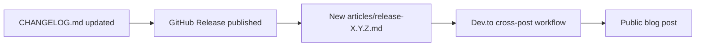

# articles

# `articles/` Module

A content directory holding Markdown articles published to external platforms (Dev.to, the project blog, etc.) to announce releases, launches, and milestones. These are **not** source code — they are publication-ready content with standardized YAML front matter consumed by an automated publishing pipeline.

## Purpose

The module serves three functions:

1. **Release announcements** — One article per release tag, mirroring the GitHub release notes in a more narrative, developer-facing voice. This is the dominant content type (18 of 20 files).
2. **Launch / milestone posts** — Evergreen articles like `hello-librefang.md` (the project introduction) and `new-website-launch.md` (website redesign announcement).
3. **External syndication source** — The front matter carries `canonical_url` and `tags` that downstream tooling (the Dev.to cross-post workflow referenced in `release-0.5.6.md`) reads to publish automatically.

The release notes mention "LibreFang now automatically generates Dev.to articles for releases" — these Markdown files are the input to that automation.

## File Inventory

| File | Type | Version scheme |
|------|------|----------------|
| `hello-librefang.md` | Intro / evergreen | — |
| `new-website-launch.md` | Launch announcement | — |
| `release-0.5.6.md` → `release-0.7.0.md` | Release notes | SemVer (`0.x.y`) |
| `release-2026.3.21.md` → `release-2026.7.31.md` | Release notes | CalVer (`YYYY.M.DD[HH]`) |

The version-scheme split at `release-2026.3.21.md` reflects LibreFang's migration from SemVer to **Calendar Versioning (`YYYY.M.DDHH`)**, which is called out explicitly in the affected articles.

## Conventions

Every file follows a shared contract. Drift from this contract will break the publishing pipeline.

### Front matter (required)

```yaml
---
title: "LibreFang <version> Released"        # or descriptive title
published: true                               # all current files are published
description: "<one-line summary>"
tags: rust, ai, opensource[, release]         # release notes append `release`
canonical_url: https://github.com/librefang/librefang/releases/tag/v<version>
cover_image: https://raw.githubusercontent.com/librefang/librefang/main/public/assets/logo.png
---
```

- `canonical_url` for release notes points at the GitHub release tag, not the Dev.to post.
- `cover_image` is constant across every file — do not vary it.
- The `release` tag is added only on release-note articles; evergreen posts use the base four tags.

### Body structure (release notes)

Release-note articles share a recognizable shape:

1. **H1 title** matching the front-matter `title`.
2. **One-paragraph lede** stating what the release is about.
3. **Themed sections** (`## …`) grouping changes — feature highlights, security, bug fixes, etc. Emoji prefixes are conventional but not enforced.
4. **`## Install / Upgrade`** — identical four-command block across every file (binary `curl|sh`, `cargo add`, `npm install`, `pip install`).
5. **`## Links`** — Full Changelog, GitHub Release, GitHub repo, Discord, Contributing Guide.

The `Install / Upgrade` and `Links` sections are effectively copy-pasted verbatim between releases — only the version number in the GitHub Release URL changes.

### Link drift to watch

Older articles (`release-0.5.6` → `release-0.6.5`) point the Contributing Guide at `…/blob/main/CONTRIBUTING.md`. Newer articles (`release-2026.6.29` onward) point at `…/blob/main/docs/CONTRIBUTING.md`. When adding a new article, use the **`docs/`** path — the file moved.

## Content Patterns by Release Era

### SemVer era (`0.5.x`–`0.7.0`)

Short, narrative-style notes. Each release typically covers a handful of themes with prose explanations. PR numbers are referenced inline (`#441`, `#317`) but not exhaustively listed.

### CalVer transition (`2026.3.21`, `2026.3.22`)

These two articles cover nearly identical content (the same release, narrated twice with different framing). They are the first to use CalVer and explicitly call out the versioning switch.

### CalVer mature era (`2026.4.27` onward)

Articles grow substantially longer. `release-2026.4.27.md` is the largest file in the module — it reproduces the full Keep-a-Changelog sections (`### Added`, `### Fixed`, `### Changed`, `### Documentation`, `### Maintenance`, `### Other`) with PR-numbered bullets and contributor attribution (`@username`). Later CalVer releases (`2026.7.21`, `2026.7.31`) continue this pattern, sometimes collapsing internal-only changes into `<details>` disclosure blocks.

## Known File-Level Issues

Two files in the module have defects that a maintainer should be aware of:

### `release-0.6.5.md` — malformed front matter

The file opens with a bare H1 *before* the YAML front matter:

```markdown
# LibreFang 0.6.5 Released

---
title: "LibreFang 0.6.5 Released"
…
---
```

This makes the YAML block parse as a second-level document section rather than metadata. Any front-matter parser expecting the `---` fence at byte zero will not pick up the metadata for this file.

### `release-0.6.6.md` — contains editorial meta-commentary

The file includes reviewer/author notes outside the Markdown code fence ("Perfect! Now I'll rewrite the article…", "Key improvements in this rewrite:", a bulleted list of editorial goals). This content will be published verbatim unless stripped before syndication. The actual article is correctly fenced inside the markdown block following the commentary.

## How This Module Connects to the Rest of the Repo

The articles directory is a **pure consumer of release artifacts** — it has no inbound or outbound code dependencies (confirmed by the call-graph data). Its inputs are:

- **`CHANGELOG.md`** at the repo root — release-note prose is condensed from the Keep-a-Changelog sections there. `release-2026.4.27.md` links to it sectionally (`…/CHANGELOG.md#2026-4-27`).
- **GitHub Releases** — the `canonical_url` and `Links → GitHub Release` entries point at `github.com/librefang/librefang/releases/tag/v<version>`.
- **The release workflow** — referenced in `release-0.5.6.md` ("LibreFang now automatically generates Dev.to articles for releases"). The workflow that consumes these files lives outside this directory (likely under `.github/workflows/`).

When a new release is cut, the typical contribution flow is:



## Contribution Guidance

When adding a new release article:

1. **Copy the most recent CalVer file** as a template — it will have the correct link paths, tag set, and section structure.
2. **Update four locations with the new version**: the filename, the H1, the `title` in front matter, and the `canonical_url` release-tag segment.
3. **Source the body from `CHANGELOG.md`** for the corresponding release section; do not invent PR numbers or contributor handles.
4. **Keep the `Install / Upgrade` and `Links` blocks verbatim** — they are intentionally uniform.
5. **Verify the front matter is the first thing in the file** — no leading H1, no commentary, no HTML. See `release-0.6.5.md` and `release-0.6.6.md` for what *not* to do.
6. **For non-release content** (launch posts, deep dives), follow `hello-librefang.md` as the structural model: drop the `release` tag, drop the themed-section convention, but keep the front-matter fields and the closing Links section.