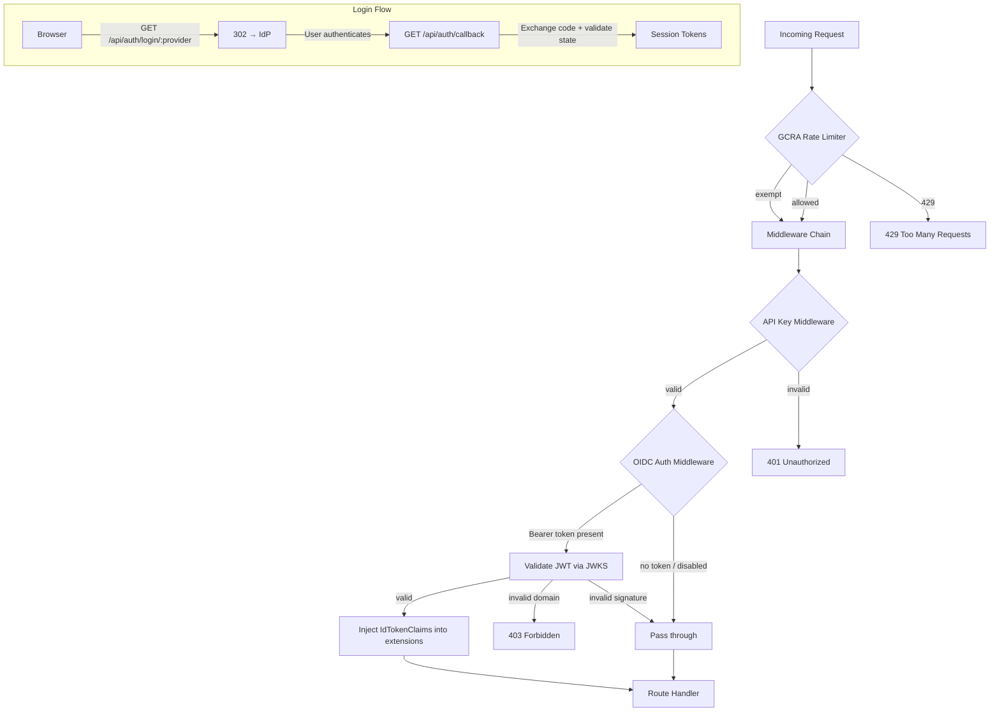

# Authentication & Security — librefang-api-src

# Authentication & Security — `librefang-api-src`

This module provides three layers of protection for the LibreFang API server:

| Layer | File | Purpose |
|-------|------|---------|
| **OAuth2/OIDC** | `oauth.rs` | External identity provider federation |
| **Password Hashing** | `password_hash.rs` | Argon2id dashboard authentication with transparent migration |
| **Rate Limiting** | `rate_limiter.rs` | Cost-aware GCRA per-IP throttling |

## Architecture Overview



---

## OAuth2/OIDC — `oauth.rs`

### Multi-Provider OIDC Federation

Supports Google, GitHub, Azure AD, Keycloak, and any standards-compliant OIDC provider. Each provider is resolved at request time from `ExternalAuthConfig` — either through OIDC discovery or explicit endpoint URLs.

**Provider resolution flow** (`resolve_providers`):

1. Iterate `config.providers` and call `resolve_single_provider` for each.
2. If a provider has explicit `auth_url` and `token_url`, use those directly (e.g., GitHub which is OAuth2 but not full OIDC).
3. If a provider has an `issuer_url`, perform OIDC discovery at `{issuer}/.well-known/openid-configuration`.
4. If no providers resolved and legacy single-provider config (`issuer_url` + `client_id`) exists, fall back to that as provider `"default"`.

### Caching

Both discovery documents and JWKS keysets are cached in global `LazyLock` instances:

| Cache | TTL | Storage |
|-------|-----|---------|
| `DISCOVERY_CACHE` | 1 hour | `HashMap<String, CachedDiscovery>` keyed by issuer URL |
| `JWKS_CACHE` | 1 hour | `HashMap<String, CachedJwks>` keyed by JWKS URI |

Both use `RwLock` for concurrent read-heavy access. Cache TTL is checked against `fetched_at` timestamps — expired entries are re-fetched on next access.

### CSRF Protection (State Tokens)

The OAuth2 `state` parameter is an HMAC-SHA256-signed JSON payload:

```
base64url(JSON).base64url(HMAC-SHA256-signature)
```

The payload (`OAuthStatePayload`) contains:
- `provider` — which IdP to route back to during the callback
- `nonce` — random UUID for OIDC nonce parameter and replay protection
- `ts` — Unix timestamp; tokens expire after 10 minutes (`STATE_TOKEN_TTL_SECS`)

The HMAC key is derived from the `LIBREFANG_STATE_SECRET` environment variable. If unset, a random per-process key is generated (meaning state tokens are invalidated on restart).

**Key functions:**
- `build_state_token(provider_id)` → creates a signed state token
- `verify_state_token(state)` → validates HMAC, decodes payload, checks expiry

### Token Store

An in-memory `TokenStore` (`HashMap<String, StoredTokens>`) keyed by user `sub` claim. Stores access tokens, refresh tokens, and metadata for session management.

- **TTL**: 24 hours — entries older than this are evicted on read.
- **Methods**: `store`, `get`, `remove`, `find_by_provider`, `find_any_with_refresh`

The token store enables `POST /api/auth/refresh` to work without requiring the client to manage refresh tokens explicitly (though clients can also supply their own).

### API Routes

| Method | Path | Handler | Purpose |
|--------|------|---------|---------|
| `GET` | `/api/auth/providers` | `auth_providers` | List available OAuth providers |
| `GET` | `/api/auth/login` | `auth_login` | Redirect to first configured IdP (legacy) |
| `GET` | `/api/auth/login/:provider` | `auth_login_provider` | Redirect to a specific IdP |
| `GET` | `/api/auth/callback` | `auth_callback` | Handle IdP redirect with auth code |
| `POST` | `/api/auth/callback` | `auth_callback_post` | Programmatic callback |
| `GET` | `/api/auth/userinfo` | `auth_userinfo` | Return current user claims |
| `POST` | `/api/auth/introspect` | `auth_introspect` | RFC 7662-style token validation |
| `POST` | `/api/auth/refresh` | `auth_refresh` | Exchange refresh token for new access token |

### Login Flow (End-to-End)

1. **Client** calls `GET /api/auth/login/google`.
2. `build_login_redirect` creates an HMAC-signed state token, builds the authorization URL with `response_type=code`, `client_id`, `redirect_uri`, `scope`, `state`, and `nonce`.
3. **Browser** is redirected (302) to the IdP's authorization endpoint.
4. After authentication, the IdP redirects to `GET /api/auth/callback?code=...&state=...`.
5. `auth_callback` validates the state token (HMAC + expiry), extracts the provider ID and nonce.
6. `handle_code_exchange` looks up the provider, reads the client secret from the environment variable specified in `client_secret_env`, and calls `exchange_code` to POST to the token endpoint.
7. If an ID token is present, `validate_jwt_cached` fetches JWKS keys, finds the matching key by `kid` or key type, and validates the JWT (audience, expiration, signature). The nonce from the ID token is compared against the nonce from the state token.
8. If no ID token or validation fails, falls back to `fetch_userinfo` using the access token against the provider's userinfo endpoint.
9. **Domain restriction**: If `allowed_domains` is configured and the user's email domain doesn't match, the request is rejected with 403.
10. Tokens are stored in `TokenStore` and a `CallbackResponse` is returned containing the access token, refresh token, and user info.

### JWT Validation

`validate_jwt_cached(token, jwks_uri, expected_audience)`:

1. Decode JWT header to get `kid` and `alg`.
2. Fetch JWKS keys (via cache).
3. Match key by `kid`, or by key type (`RSA`/`EC`) if no `kid`.
4. Build `DecodingKey` from RSA components (`n`, `e`) or EC components (`x`, `y`).
5. Validate signature, expiration, and audience using `jsonwebtoken::decode`.

Supports RS256/RS384/RS512 and ES256/ES384 algorithms.

### OIDC Auth Middleware

`oidc_auth_middleware` is an Axum middleware layer that:

1. If external auth is disabled, passes through immediately.
2. Extracts `Bearer` token from the `Authorization` header.
3. Attempts JWT validation against each configured provider's JWKS.
4. On success, checks `allowed_domains` if configured (rejects tokens without email claims when domain filtering is active).
5. Injects validated `IdTokenClaims` into request extensions for downstream handlers.
6. Does **not** block unauthenticated requests — the API key middleware handles access control. This middleware only enriches requests with identity data.

**Public API**: `validate_external_token(token, config)` — used by other modules to verify OAuth session tokens.

### Domain Restriction

When `allowed_domains` is non-empty on a provider:
- Tokens/claims **must** contain an `email` field, or the request is rejected (403).
- The email's domain (after `@`) must appear in the allowed list.
- This check is enforced in both the callback handler and the middleware.

---

## Password Hashing — `password_hash.rs`

### Argon2id Dashboard Authentication

Provides password hashing and verification for the local dashboard login, replacing a previous plaintext comparison.

**Hashing parameters** (via `hash_password`):
- Algorithm: Argon2id
- Memory: 19,456 KiB
- Iterations: 2
- Parallelism: 1
- Output: PHC-format string (`$argon2id$v=19$m=19456,t=2,p=1$<salt>$<hash>`)

### Transparent Migration

`verify_dashboard_password` handles the transition from legacy plaintext passwords:

1. If `pass_hash` (Argon2id PHC string) is set → verify with Argon2id only.
2. If only `cfg_pass` (plaintext) is set → constant-time plaintext comparison. On success, returns an `upgrade_hash` (fresh Argon2id hash) for the caller to persist.
3. If neither is set → runs a dummy Argon2id hash to maintain constant timing, then returns `Denied`.

The `VerifyResult` enum communicates this:

```rust
pub enum VerifyResult {
    Ok { token: SessionToken, upgrade_hash: Option<String> },
    Denied,
}
```

Downstream, `change_password` in `server.rs` calls `hash_password` directly, and `dashboard_login` calls `verify_dashboard_password`.

### Timing Safety

To prevent username enumeration via timing side-channels:
- Username comparison uses `subtle::ConstantTimeEq`.
- Password verification always runs (Argon2id takes ~tens of ms) even if the username didn't match — no early return on username mismatch.
- When no credentials are configured, a dummy `hash_password` call maintains the same timing profile.

### Session Tokens

Session tokens are 256-bit random values generated by `generate_session_token`:

- Uses `OsRng` (OS-level CSPRNG).
- Stored as 64-character hex strings.
- Paired with a `created_at` Unix timestamp for expiration checks.
- Default TTL: 30 days (`DEFAULT_SESSION_TTL_SECS`).
- Each login produces a unique token (unlike the deprecated HMAC-derived deterministic tokens).

`is_token_expired(token, ttl_secs)` checks whether a token has exceeded its lifetime. This is used by `auth` middleware, `agent_ws`, `load_sessions`, and `run_daemon`.

**Deprecated functions** (`derive_session_token`, `derive_dashboard_session_token`): Legacy HMAC-SHA256-based deterministic token derivation. Retained for backward compatibility with existing sessions during migration.

---

## Rate Limiting — `rate_limiter.rs`

### GCRA (Generic Cell Rate Algorithm)

Uses the `governor` crate to implement per-IP rate limiting with a token-bucket model. Default budget: **500 tokens per minute** per IP address.

Each API operation has a **cost** assigned by `operation_cost(method, path)`:

| Cost | Operations |
|------|-----------|
| 1 | `GET /api/health`, `/api/status`, `/api/version`, `/api/tools` |
| 2 | `GET /api/agents`, `/api/skills`, `/api/peers`, `/api/config` |
| 3 | `GET /api/usage` |
| 5 | `GET /api/audit/*`, unauthenticated/fallback paths |
| 10 | `GET /api/marketplace/*`, `PUT */update`, `POST /api/skills/uninstall` |
| 30 | `POST */message` |
| 50 | `POST /api/agents`, `POST /api/skills/install` |
| 100 | `POST */run`, `POST /api/migrate` |

### Static Asset Exemption

`is_rate_limit_exempt(path)` bypasses the limiter for non-API paths:

- `/` (root)
- `/favicon.ico`, `/logo.png`
- `/dashboard/*` (SPA bundle, assets)
- `/locales/*` (i18n JSON files)

This prevents a cold dashboard page load (~20+ asset requests at the default fallback cost of 5 tokens each) from exhausting the 500-token budget before the page finishes rendering.

**Prefix discipline**: Exemptions are exact-prefix-based. `/dashboard-login` and `/dashboardz` are **not** exempt. `/api/*`, `/v1/*`, `/mcp`, `/hooks/*`, and `/channels/*` are always metered.

### Middleware Behavior

`gcra_rate_limit` middleware:

1. Checks if the path is exempt → passes through immediately.
2. Extracts client IP from `ConnectInfo<SocketAddr>` (falls back to `127.0.0.1`).
3. Computes operation cost.
4. Calls `limiter.check_key_n(&ip, cost)` — a nested `Result<Result<(), NotUntil>, InsufficientCapacity>`.
5. If rate-limited, returns **429** with `Retry-After` header and JSON error body.
6. Otherwise, passes to the next handler.

### Critical Implementation Detail

The `check_key_n` return type is a nested `Result`. The normal "out of tokens" condition surfaces as `Ok(Err(NotUntil))`, while `Err(InsufficientCapacity)` means the cost exceeds the burst size entirely. Both cases must be treated as rate-limited. An earlier version only checked `.is_err()` on the outer `Result`, which allowed the `NotUntil` path to slip through unthrottled.

### Setup

`build_router` in `server.rs` creates the rate limiter via `create_rate_limiter(tokens_per_minute)` and wraps it in `GcraState`:

```rust
GcraState {
    limiter: create_rate_limiter(tokens_per_minute),
    retry_after_secs: 60,
}
```

The middleware is applied as an Axum layer via `from_fn_with_state`.

---

## Configuration

All three layers are driven by `ExternalAuthConfig` and related types from `librefang-types::config`:

- **`external_auth.enabled`** — master switch for OIDC.
- **`external_auth.providers[]`** — array of `OidcProvider` entries, each with `id`, `issuer_url` or explicit endpoint URLs, `client_id`, `client_secret_env`, `scopes`, `allowed_domains`, `audience`.
- **`external_auth.session_ttl_secs`** — session lifetime (default 86400 = 24 hours).
- **Dashboard credentials** — `dashboard_user`, `dashboard_pass` (plaintext), or `dashboard_pass_hash` (Argon2id PHC string).
- **Rate limit** — configured at router build time, default 500 tokens/minute.

Client secrets are **never** stored in config files. Each provider specifies an environment variable name in `client_secret_env` (e.g., `LIBREFANG_OAUTH_CLIENT_SECRET`), and the secret is read at runtime.