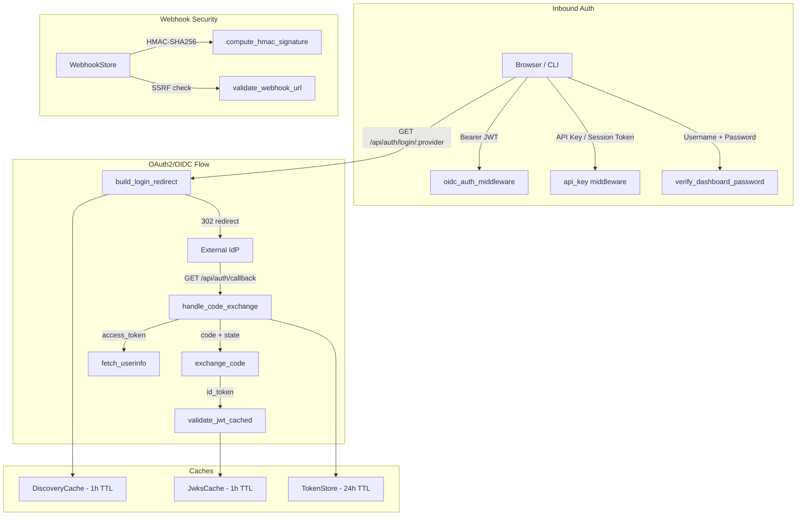

# Authentication & Security — librefang-api-src

# Authentication & Security — `librefang-api`

This module provides the full authentication and security layer for the LibreFang API: OAuth2/OIDC external identity provider integration, Argon2id-based dashboard password authentication, and a webhook subscription system with SSRF mitigations and HMAC-signed deliveries.

---

## Architecture Overview



---

## Module Composition

| File | Responsibility |
|------|---------------|
| `oauth.rs` | OAuth2/OIDC provider integration, JWT validation, token lifecycle |
| `password_hash.rs` | Argon2id password hashing, dashboard session management |
| `webhook_store.rs` | Webhook subscription CRUD, HMAC signing, SSRF protection |

---

## OAuth2/OIDC — `oauth.rs`

### Purpose

Enables users to authenticate against external identity providers (Google, GitHub, Azure AD, Keycloak, or any OIDC-compliant IdP) instead of managing local credentials. The module handles the full authorization code flow with PKCSRF protection, JWT validation via JWKS, and transparent token refresh.

### Provider Resolution

Providers are resolved from `ExternalAuthConfig` in one of two modes:

- **Multi-provider**: Each entry in `config.providers` is resolved independently. Providers with explicit `auth_url`/`token_url` use those directly (e.g., GitHub). Providers with only `issuer_url` trigger OIDC discovery.
- **Legacy single-provider fallback**: If no `providers` array entries resolve but `issuer_url` and `client_id` are set at the top level, a single `"default"` provider is constructed from discovery.

The function `resolve_providers()` orchestrates this and is called at the start of every auth route. Resolution failures for individual providers are logged but do not prevent other providers from functioning.

### OIDC Discovery

`discover_oidc_cached()` fetches `{issuer_url}/.well-known/openid-configuration` and extracts endpoints, supported scopes, and the JWKS URI. Results are cached globally in `DISCOVERY_CACHE` (a `LazyLock<RwLock<HashMap>>`) with a 1-hour TTL. Cache hits skip the HTTP fetch entirely.

### CSRF State Tokens

The `state` parameter in OAuth redirects is an HMAC-SHA256-signed JSON payload, not a random string. This allows the callback to determine which provider to route to without additional server-side state.

**Token structure**: `base64url(json_payload).base64url(hmac_signature)`

The `OAuthStatePayload` contains:
- `provider` — the provider ID string (e.g., `"google"`)
- `nonce` — a UUID v4 random value, also used as the OIDC `nonce` parameter
- `ts` — UNIX timestamp; tokens older than 10 minutes (`STATE_TOKEN_TTL_SECS = 600`) are rejected

The HMAC key is derived from `LIBREFANG_STATE_SECRET` env var, falling back to a random per-process key on first access. If the process restarts without the env var set, in-flight state tokens become invalid — this is intentional for local-agent deployments.

Key functions:
- `build_state_token(provider_id)` — creates and signs a new state token
- `verify_state_token(state)` — validates HMAC, decodes payload, checks expiry

### Authentication Flow

#### Login Redirect

```
GET /api/auth/login          → redirects to first configured provider
GET /api/auth/login/:provider → redirects to the named provider
```

`build_login_redirect()` constructs the authorization URL with `response_type=code`, the client ID, redirect URI, scopes, and the signed state token. The nonce is extracted from the state token (re-verified internally) and passed as the OIDC `nonce` parameter.

#### Authorization Code Callback

```
GET  /api/auth/callback   → browser redirect from IdP
POST /api/auth/callback   → programmatic clients (JSON body)
```

Both routes delegate to `handle_code_exchange()`, which:

1. Validates the `state` parameter via `verify_state_token()` — rejects expired, tampered, or malformed tokens
2. Routes to the provider encoded in the state payload
3. Reads the client secret from the env var named in `provider.client_secret_env`
4. Calls `exchange_code()` to POST to the token endpoint
5. Attempts JWT validation of the `id_token` (if present) via `validate_jwt_cached()`
6. Verifies the `nonce` in the ID token matches the state token nonce
7. Falls back to `fetch_userinfo()` if no ID token or validation fails
8. Checks `allowed_domains` against the email claim if configured
9. Stores tokens in `TOKEN_STORE` for later refresh
10. Returns a `CallbackResponse` with the access token, user info, and optional refresh token

**Security note on refresh tokens**: The refresh token is returned to the client because LibreFang is a local-agent system bound to `127.0.0.1`. The existing API key middleware provides an additional access control layer.

### JWT Validation

`validate_jwt_cached()` validates a JWT against the provider's JWKS:

1. Decodes the JWT header to extract `kid` and algorithm
2. Fetches JWKS from `fetch_jwks_cached()` (1-hour TTL, global `JWKS_CACHE`)
3. Matches the key by `kid`, or by key type (`RSA`/`EC`) if no `kid`
4. Builds a `DecodingKey` from the JWK components (`n`/`e` for RSA, `x`/`y` for EC)
5. Validates signature, expiration, and audience

Supported algorithms: RS256, RS384, RS512, ES256, ES384.

### Token Introspection

```
POST /api/auth/introspect
```

Follows RFC 7662 conventions. Accepts a `token` and optional `provider` hint. Tries JWT validation against candidate providers and returns `{"active": true, ...}` with claims or `{"active": false}`.

### Token Refresh

```
POST /api/auth/refresh
```

Resolves the refresh token from one of three sources (in priority order):
1. The `refresh_token` field in the request body
2. The `TOKEN_STORE` lookup by provider ID
3. Any stored entry with a refresh token (when no provider specified)

Calls `exchange_refresh_token()` and updates `TOKEN_STORE` with the new tokens.

### Token Store

`TOKEN_STORE` is a global in-memory `HashMap<String, StoredTokens>` keyed by user `sub`. Entries older than 24 hours are evicted on access. The store is used to:
- Look up refresh tokens for the `/api/auth/refresh` endpoint
- Track provider associations per user

### Auth Middleware

`oidc_auth_middleware()` is an Axum middleware layer that:

1. Extracts the `Bearer` token from the `Authorization` header
2. Validates it against each configured provider's JWKS
3. If valid, checks `allowed_domains` and injects `IdTokenClaims` into request extensions
4. Does **not** block requests — the API key middleware handles access control separately

Downstream handlers can retrieve claims via `request.extensions().get::<IdTokenClaims>()`.

### Public Helper

`validate_external_token(token, config)` — validates a token against all configured providers. Used by external modules (e.g., `librefang-api/src/server.rs`) for session token verification.

### Key Types

| Type | Description |
|------|-------------|
| `OidcDiscovery` | Subset of the OIDC discovery document (issuer, endpoints, JWKS URI) |
| `JwksKey` | Single JWK entry — supports RSA (`n`, `e`) and EC (`x`, `y`, `crv`) |
| `IdTokenClaims` | Extracted user claims: `sub`, `email`, `name`, `picture`, `roles`, `nonce` |
| `OidcAudience` | Union type for `aud` — either a single string or array |
| `ResolvedProvider` | Fully resolved provider with endpoints, client ID, scopes, and domain restrictions |

---

## Password Hashing — `password_hash.rs`

### Purpose

Provides Argon2id password hashing for dashboard authentication, replacing plaintext comparison. Supports transparent migration from legacy plaintext passwords.

### Password Hashing

`hash_password(password)` generates an Argon2id PHC-format hash with:
- **Memory**: 19,456 KiB
- **Iterations**: 2
- **Parallelism**: 1
- **Salt**: random, from OS CSPRNG

Output format: `$argon2id$v=19$m=19456,t=2,p=1$<base64-salt>$<base64-hash>`

`verify_password(password, hash_str)` parses the PHC string and verifies against it. Returns `false` for malformed hash strings rather than panicking.

### Dashboard Authentication

`verify_dashboard_password()` handles the full credential verification flow:

```
verify_dashboard_password(input_user, input_pass, cfg_user, cfg_pass, pass_hash) -> VerifyResult
```

**Verification paths**:
1. If `pass_hash` is non-empty → Argon2id verification only
2. If only `cfg_pass` is set → constant-time plaintext comparison via `subtle::ConstantTimeEq`
3. If neither is set → runs a dummy Argon2id hash to maintain constant timing, returns `Denied`

**Timing safety**: The password verification path always executes regardless of whether the username matched. This prevents username enumeration via timing differences (Argon2id takes ~tens of milliseconds).

**Migration support**: When legacy plaintext succeeds, the `VerifyResult::Ok` variant includes `upgrade_hash` — an Argon2id hash of the input password that the caller should persist for future logins.

### Session Tokens

Session tokens are cryptographically random 256-bit values (32 bytes from `OsRng`, hex-encoded to 64 characters) paired with a `created_at` timestamp.

- `generate_session_token()` — creates a new random token
- `is_token_expired(token, ttl_secs)` — checks if the token age exceeds the TTL
- Default TTL: 30 days (`DEFAULT_SESSION_TTL_SECS = 30 * 24 * 3600`)

Each successful login produces a unique token, enabling per-session revocation and expiration-based invalidation. This replaces the deprecated `derive_session_token()` which used deterministic HMAC-SHA256 derivation that could not be revoked.

**Deprecated functions** (kept for migration compatibility):
- `derive_session_token(username, password)` — HMAC-SHA256 derivation
- `derive_dashboard_session_token(username, cfg_pass, pass_hash)` — picks the available credential and derives a token

### VerifyResult Enum

```rust
pub enum VerifyResult {
    Ok {
        token: SessionToken,
        upgrade_hash: Option<String>,  // Some when migrating from plaintext
    },
    Denied,
}
```

---

## Webhook Store — `webhook_store.rs`

### Purpose

Manages outbound webhook subscriptions with file persistence, HMAC-SHA256 payload signing, and SSRF protection.

### Data Model

| Type | Description |
|------|-------------|
| `WebhookId(Uuid)` | Unique subscription identifier |
| `WebhookEvent` | Enum of subscribable events: `AgentSpawned`, `AgentStopped`, `MessageReceived`, `MessageCompleted`, `AgentError`, `CronFired`, `TriggerFired`, `All` |
| `WebhookSubscription` | Full subscription: ID, name, URL, secret, events, enabled flag, timestamps |

### WebhookStore Operations

`WebhookStore` wraps a `std::sync::RwLock<StoreData>` with JSON file persistence:

- `load(path)` — reads existing JSON or creates empty store
- `list()` → `Vec<WebhookSubscription>`
- `get(id)` → `Option<WebhookSubscription>`
- `create(req)` — validates, assigns UUID, persists. Max 100 subscriptions.
- `update(id, req)` — partial update with per-field validation, persists
- `delete(id)` → removes and persists

All mutations immediately persist to disk. The persistence file is created with mode `0o600` on Unix systems (owner read/write only) since it contains webhook secrets.

### Validation

`CreateWebhookRequest::validate()` enforces:
- Non-empty name (max 128 chars)
- Non-empty URL (max 2048 chars)
- Non-empty events list
- Secret max 256 chars
- Valid URL scheme (http/https only)
- SSRF protection via `validate_webhook_url()`

### SSRF Protection

`validate_webhook_url()` blocks requests to internal/private addresses:

| Category | What's blocked |
|----------|---------------|
| IPv4 loopback | `127.0.0.0/8` |
| IPv4 private | `10.0.0.0/8`, `172.16.0.0/12`, `192.168.0.0/16` |
| IPv4 CGNAT | `100.64.0.0/10` |
| IPv4 link-local | `169.254.0.0/16` (includes cloud metadata endpoint `169.254.169.254`) |
| IPv4-mapped IPv6 | `::ffff:127.0.0.1`, `::ffff:10.0.0.1`, etc. — canonicalized via `canonical_ip()` |
| Internal hostnames | `localhost`, `metadata.google.internal`, `*.internal` |

The `canonical_ip()` function unwraps IPv4-mapped IPv6 addresses (e.g., `::ffff:7f00:1` → `127.0.0.1`) before checking against the blocklist. Without this step, the OS would transparently connect to the embedded IPv4 address while the checks would miss it in the V6 arm.

### HMAC Signing

`compute_hmac_signature(secret, payload)` produces a `sha256=<hex>` signature string for outbound webhook payloads. Recipients verify this against the `X-Webhook-Signature` header.

`redact_webhook_secret()` replaces the secret with `"***"` in API responses to prevent leakage in list/get endpoints.

---

## Configuration Reference

### External Auth (`ExternalAuthConfig`)

| Field | Default | Description |
|-------|---------|-------------|
| `enabled` | `false` | Enables OAuth2/OIDC |
| `issuer_url` | `""` | Legacy single-provider issuer |
| `client_id` | `""` | Legacy client ID |
| `client_secret_env` | `"LIBREFANG_OAUTH_CLIENT_SECRET"` | Env var name for client secret |
| `scopes` | `["openid", "profile", "email"]` | Default OAuth scopes |
| `redirect_url` | `""` | OAuth callback URL |
| `session_ttl_secs` | `86400` | Token lifetime (24h) |
| `allowed_domains` | `[]` | Restrict login to these email domains |
| `providers` | `[]` | Multi-provider array |

### Per-provider (`OidcProvider`)

| Field | Description |
|-------|-------------|
| `id` | Unique provider identifier (e.g., `"google"`) |
| `display_name` | Human-readable name for the UI |
| `issuer_url` | Issuer URL for OIDC discovery |
| `auth_url` | Explicit authorization endpoint (skips discovery) |
| `token_url` | Explicit token endpoint |
| `userinfo_url` | Explicit userinfo endpoint |
| `jwks_uri` | Explicit JWKS URI |
| `client_id` | OAuth client ID |
| `client_secret_env` | Env var name holding the client secret |
| `redirect_url` | Callback URL for this provider |
| `scopes` | Scopes for this provider |
| `allowed_domains` | Domain restriction for this provider |
| `audience` | Expected JWT audience (defaults to `client_id`) |

### Environment Variables

| Variable | Used by | Description |
|----------|---------|-------------|
| `LIBREFANG_STATE_SECRET` | `oauth.rs` | HMAC key for state tokens (random per-process if unset) |
| `LIBREFANG_OAUTH_CLIENT_SECRET` | `oauth.rs` | Default client secret (legacy) |
| Per-provider `client_secret_env` | `oauth.rs` | Provider-specific client secret |

---

## Cache TTLs

| Cache | TTL | Storage |
|-------|-----|---------|
| OIDC Discovery (`DISCOVERY_CACHE`) | 1 hour | `LazyLock<RwLock<HashMap>>` |
| JWKS Keys (`JWKS_CACHE`) | 1 hour | `LazyLock<RwLock<HashMap>>` |
| Token Store (`TOKEN_STORE`) | 24 hours (entry eviction) | `LazyLock<RwLock<HashMap>>` |
| State Tokens | 10 minutes | Stateless (embedded expiry) |

---

## API Endpoints Summary

| Method | Path | Handler | Auth |
|--------|------|---------|------|
| GET | `/api/auth/providers` | `auth_providers` | None |
| GET | `/api/auth/login` | `auth_login` | None |
| GET | `/api/auth/login/:provider` | `auth_login_provider` | None |
| GET | `/api/auth/callback` | `auth_callback` | None |
| POST | `/api/auth/callback` | `auth_callback_post` | None |
| GET | `/api/auth/userinfo` | `auth_userinfo` | Bearer token |
| POST | `/api/auth/introspect` | `auth_introspect` | API key |
| POST | `/api/auth/refresh` | `auth_refresh` | None |

---

## Security Considerations

- **CSRF protection**: OAuth state tokens are HMAC-signed with embedded expiry. Tampering or replay beyond 10 minutes is rejected.
- **Nonce verification**: The OIDC `nonce` parameter is bound to the state token and verified in the ID token callback.
- **Timing-constant verification**: Dashboard login always runs password hashing even on username mismatch, preventing enumeration attacks.
- **SSRF mitigation**: Webhook URLs are validated against private/link-local IPs, including IPv4-mapped IPv6 canonicalization that catches `::ffff:127.0.0.1` etc.
- **Secret redaction**: Webhook secrets are replaced with `"***"` in all API responses.
- **File permissions**: Webhook store persistence files are created with `0o600` on Unix.
- **Error messages**: Detailed token exchange errors are logged at debug level; generic messages are returned to clients.