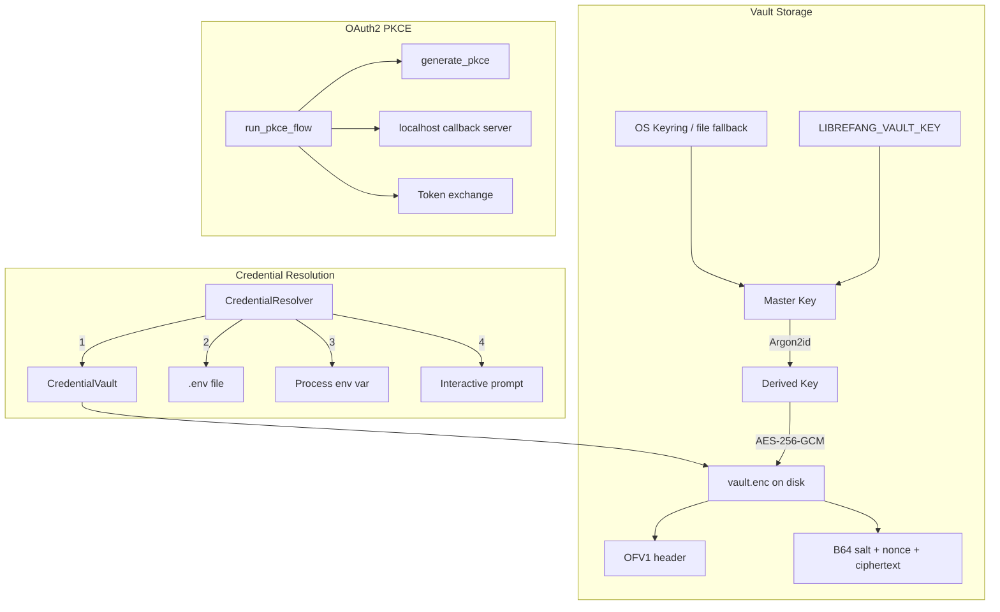
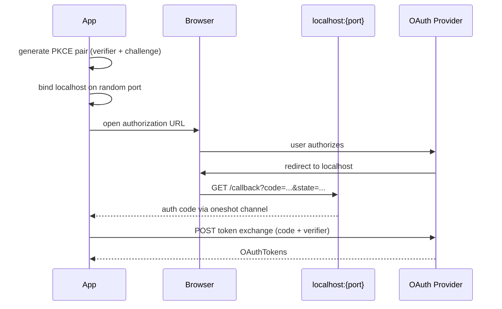

# Authentication & Security — librefang-extensions-src

# Authentication & Security — `librefang-extensions-src`

This module provides the credential management layer for Librefang. It handles encrypted secret storage, a multi-source credential resolution chain, and browser-based OAuth2 PKCE authentication flows. Every secret in memory is wrapped in `Zeroizing<String>` so it is zeroed on drop.

## Architecture Overview



## Modules

| File | Purpose |
|---|---|
| `vault.rs` | AES-256-GCM encrypted secret storage at `~/.librefang/vault.enc` |
| `credentials.rs` | Multi-source credential resolver with priority chain |
| `oauth.rs` | OAuth2 PKCE browser flows for Google/GitHub/Microsoft/Slack |

---

## `vault.rs` — CredentialVault

### Encryption Scheme

The vault file (`vault.enc`) uses a layered encryption scheme:

1. **Master key** — 32 random bytes, stored in the OS keyring or `LIBREFANG_VAULT_KEY` env var (base64-encoded).
2. **Key derivation** — Each save generates a fresh random 16-byte salt. Argon2id derives a 256-bit encryption key from `master_key + salt`.
3. **Encryption** — AES-256-GCM with a random 12-byte nonce per save. Provides authenticated encryption (integrity + confidentiality).
4. **On-disk format** — `OFV1` magic header (4 bytes) followed by a JSON `VaultFile` containing base64-encoded salt, nonce, and ciphertext.

### File Format

```
[4 bytes: OFV1][JSON VaultFile]
```

The `VaultFile` JSON structure:

```rust
struct VaultFile {
    version: u8,        // Currently 1
    salt: String,       // base64, 16 bytes
    nonce: String,      // base64, 12 bytes
    ciphertext: String, // base64, AES-256-GCM output
}
```

Legacy vault files without the `OFV1` header (starting with `{`) are still supported for backward compatibility.

### Master Key Resolution

`resolve_master_key()` tries sources in this order:

1. **Cached key** — if the vault was previously unlocked or initialized in this process, the key is held in `cached_key` to avoid repeated keyring/env lookups and race conditions in parallel tests.
2. **OS keyring** — loaded via `load_keyring_key()`.
3. **Environment variable** — `LIBREFANG_VAULT_KEY` (base64 of the 32-byte key).

If none are available, the vault cannot be unlocked and returns `ExtensionError::VaultLocked`.

### Keyring Fallback

When the OS keyring is unavailable, the module falls back to a file-based keyring at `{local_data_dir}/librefang/.keyring`. The master key is wrapped with AES-256-GCM using a key derived from a machine fingerprint (SHA-256 of `username + hostname + "librefang-vault-v1"`) via Argon2id.

The keyring file supports two versions:
- **v2** (current) — AES-256-GCM wrapped with Argon2id-derived key. Stored as `KeyringFile` JSON.
- **v1** (legacy) — XOR-obfuscated with a SHA-256 mask. Automatically migrated to v2 on first load.

### Key API

```rust
let mut vault = CredentialVault::new(PathBuf::from("~/.librefang/vault.enc"));

// Initialize a new vault (generates master key, stores in keyring)
vault.init()?;

// Or use an explicit key (testing/programmatic)
vault.init_with_key(master_key)?;

// Unlock for reading
vault.unlock()?;
// Or with explicit key
vault.unlock_with_key(master_key)?;

// CRUD operations (require unlocked vault)
vault.set("GITHUB_TOKEN".into(), Zeroizing::new("ghp_...".into()))?;
let value: Option<Zeroizing<String>> = vault.get("GITHUB_TOKEN");
let removed: bool = vault.remove("GITHUB_TOKEN")?;
let keys: Vec<&str> = vault.list_keys();

// State queries
vault.exists();    // Does vault.enc exist on disk?
vault.is_unlocked();
vault.len();
vault.is_empty();
```

### Zeroization

`CredentialVault` implements `Drop` to explicitly clear `entries` and `cached_key`. Since all values are `Zeroizing<String>`, the underlying memory is zeroed when the map is cleared. The `unlocked` flag is also reset.

### Key Derivation Function

```rust
fn derive_key(master_key: &[u8; 32], salt: &[u8]) -> ExtensionResult<Zeroizing<[u8; 32]>>
```

Uses `Argon2::default()` (Argon2id) to derive a 256-bit key. Deterministic for the same inputs. A fresh salt is generated on every `save()`, so the derived key changes with every write even if the master key doesn't.

---

## `credentials.rs` — CredentialResolver

### Resolution Priority

The resolver tries four sources in strict priority order. The first source that produces a value wins:

| Priority | Source | Configuration |
|---|---|---|
| 1 | Encrypted vault (`~/.librefang/vault.enc`) | `vault: Option<CredentialVault>` |
| 2 | Dotenv file (`~/.librefang/.env`) | `dotenv_path: Option<&Path>` |
| 3 | Process environment variable | Automatic via `std::env::var` |
| 4 | Interactive prompt (stdin) | `.with_interactive(true)` |

**Dotenv takes priority over environment variables.** This is intentional — a project-level `.env` file should override system-level env vars to ensure reproducible behavior.

### Key API

```rust
let vault = CredentialVault::new(vault_path);
// vault.unlock()?;  // unlock before using in resolver

let resolver = CredentialResolver::new(
    Some(vault),
    Some(Path::new("~/.librefang/.env")),
)
.with_interactive(true);

// Resolve a single credential
let token: Option<Zeroizing<String>> = resolver.resolve("GITHUB_TOKEN");

// Batch resolve multiple keys
let creds: HashMap<String, Zeroizing<String>> = resolver.resolve_all(&[
    "GITHUB_TOKEN",
    "SLACK_TOKEN",
    "OPENAI_API_KEY",
]);

// Check availability without triggering a prompt
let has: bool = resolver.has_credential("GITHUB_TOKEN");

// Find which required credentials are missing
let missing: Vec<String> = resolver.missing_credentials(&[
    "GITHUB_TOKEN", "SLACK_TOKEN",
]);

// Store a credential in the vault (if vault is configured and unlocked)
resolver.store_in_vault("NEW_KEY", Zeroizing::new("value".into()))?;

// Evict a key from the in-memory dotenv cache (e.g., after dashboard deletion)
resolver.clear_dotenv_cache("STALE_KEY");
```

### Dotenv Parsing

The `load_dotenv()` function handles:
- Comment lines (starting with `#`)
- Empty lines
- `KEY=VALUE` pairs with optional surrounding quotes (single or double)
- Empty values (`KEY=`)

The dotenv file is loaded once at resolver construction time and held in memory. If a credential is deleted externally (e.g., via the dashboard), call `clear_dotenv_cache()` to prevent stale values from being returned.

### Interactive Prompt

When `interactive` is enabled and no other source has the credential, `prompt_secret()` writes to stderr and reads from stdin. This is intended for CLI use only — services and daemons should not enable interactive mode. The prompt is a last resort; `has_credential()` deliberately skips the interactive check.

---

## `oauth.rs` — OAuth2 PKCE Flows

### PKCE Flow

The module implements the full Authorization Code Flow with PKCE (RFC 7636), which is required for public clients (native apps, CLIs) that cannot protect a client secret.



### Key API

```rust
// run_pkce_flow is the main entry point
let tokens: OAuthTokens = run_pkce_flow(&oauth_template, &client_id).await?;

// Tokens provide zeroizing accessors
let access: Zeroizing<String> = tokens.access_token_zeroizing();
let refresh: Option<Zeroizing<String>> = tokens.refresh_token_zeroizing();
```

`run_pkce_flow` requires an `OAuthTemplate` (from `librefang_types`) which provides `auth_url`, `token_url`, and `scopes`. The `client_id` comes from configuration or defaults.

### PKCE Implementation

```rust
fn generate_pkce() -> PkcePair
```

Generates a 32-byte random verifier, then computes the challenge as `base64url(sha256(verifier))` — the S256 method per RFC 7636. Both the verifier (in `Zeroizing<String>`) and challenge are URL-safe base64 with no padding.

CSRF protection uses a random 16-byte state parameter, also base64url-encoded.

### Client ID Configuration

```rust
let defaults = default_client_ids();  // placeholder IDs for google/github/microsoft/slack
let resolved = resolve_client_ids(&config);  // applies config overrides on top of defaults
```

`resolve_client_ids()` merges `OAuthConfig` overrides (e.g., `google_client_id`) onto the built-in defaults. Any provider not explicitly configured falls back to the default placeholder.

### Callback Server

The flow binds to `127.0.0.1:0` (OS-assigned random port), serves a single `GET /callback` route via `axum`, and waits up to 5 minutes for the authorization code. The server sends the code back through a `tokio::sync::oneshot` channel, then the server task is aborted.

The callback handler validates the `state` parameter against the expected value (CSRF protection) and returns an HTML response to the browser indicating success or failure.

### Browser Launch

`open_browser()` uses platform-specific commands:
- **Windows**: `cmd /C start`
- **macOS**: `open`
- **Linux**: `xdg-open`

If the browser cannot be opened, the authorization URL is printed to stderr so the user can copy-paste it manually.

### Token Exchange

The authorization code is exchanged via a `POST` form request to the provider's token endpoint with `grant_type=authorization_code`, the code, `redirect_uri`, `client_id`, and `code_verifier`. No `client_secret` is sent — PKCE replaces the need for it.

---

## Integration Points

### How Other Modules Reach the Vault

From the execution flows, the vault is typically reached through this path:

1. An API route handler (e.g., `totp_revoke`, `rename_window`) calls an authorization function.
2. Authorization needs a credential (dashboard session token, TOTP secret, etc.).
3. The credential resolver or vault is called to `unlock()` the vault.
4. `unlock()` calls `resolve_master_key()`, which tries the cached key, keyring, or env var.
5. If the keyring is used, `machine_fingerprint()` computes the machine binding.

The vault's `exists()` method is also used extensively by the skills system (marketplace, loader, evolution, registry, openclaw_compat) for checking if vault files are present — though in many of those cases it's the generic `Path::exists()` rather than `CredentialVault::exists()`, since the call graph shows many skill operations checking path existence.

### Error Types

All vault and OAuth errors flow through `ExtensionError`:

| Variant | When |
|---|---|
| `ExtensionError::Vault(message)` | File I/O, serialization, encryption/decryption, bad format, wrong version |
| `ExtensionError::VaultLocked` | Attempting operations on a locked vault, or no master key available |
| `ExtensionError::OAuth(message)` | Network failures, token exchange errors, timeout, CSRF mismatch |

### Security Considerations

- **No plaintext on disk** — The vault file is always encrypted. The `.env` file is plaintext by design (it's a convenience layer for development).
- **Zeroizing everywhere** — All secret values use `Zeroizing<String>` or `Zeroizing<[u8; 32]>`, which zero memory on drop.
- **Fresh nonce per save** — Each vault write generates a new random salt and nonce, preventing nonce reuse even if the vault is saved multiple times with the same master key.
- **PKCE over client secret** — The OAuth flow uses S256 PKCE, which is secure for public clients without requiring an embeddable secret.
- **Keyring migration** — Legacy v1 XOR-obfuscated keyring files are automatically upgraded to AES-256-GCM wrapped v2 format on first load.
- **Machine binding** — The file-based keyring fallback derives its wrapping key from username and hostname, providing basic machine-specific protection.