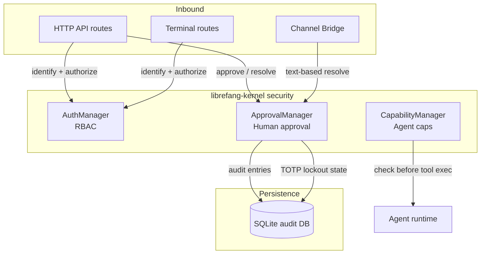
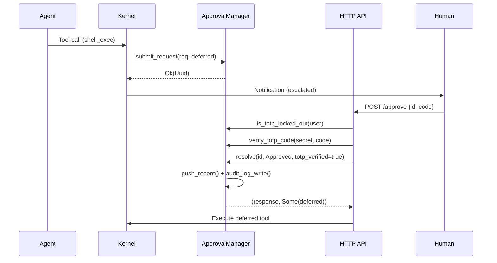

# Authentication & Security — librefang-kernel-src

# Authentication & Security — `librefang-kernel-src`

This module implements the three-layer security model that controls who can interact with the system, what operations require human confirmation, and what capabilities each agent possesses. It lives in three source files:

| File | Responsibility |
|---|---|
| `auth.rs` | RBAC user identity and action authorization |
| `approval.rs` | Human-in-the-loop gating for dangerous tool executions |
| `capabilities.rs` | Per-agent capability grants and checks |

---

## Architecture Overview



---

## 1. RBAC — `auth.rs`

### `UserRole` Hierarchy

Roles are ordered numerically so that standard comparison operators enforce hierarchy:

```
Viewer (0) < User (1) < Admin (2) < Owner (3)
```

| Role | Abilities |
|---|---|
| **Viewer** | Read-only dashboard access; cannot chat with agents |
| **User** | Chat with agents, view configuration |
| **Admin** | Spawn/kill agents, install skills, view usage |
| **Owner** | Full access: user management, config changes, everything below |

### `Action` and Required Roles

Each action declares its minimum required role via `Action::required_role()`:

| Action | Min Role |
|---|---|
| `ChatWithAgent` | User |
| `ViewConfig` | User |
| `ViewUsage` | Admin |
| `SpawnAgent` | Admin |
| `KillAgent` | Admin |
| `InstallSkill` | Admin |
| `ModifyConfig` | Owner |
| `ManageUsers` | Owner |

### `AuthManager`

The manager holds two concurrent index structures:

- **`users: DashMap<UserId, UserIdentity>`** — primary user store keyed by internal LibreFang user ID.
- **`channel_index: DashMap<String, UserId>`** — reverse lookup mapping `"channel_type:platform_id"` (e.g., `"telegram:123456"`) to a UserId.

#### Construction

```rust
let auth = AuthManager::new(&user_configs);
```

`AuthManager::new` iterates the provided `UserConfig` list, assigns each user a fresh `UserId`, and builds the channel binding index. If `user_configs` is empty, `is_enabled()` returns `false`, meaning RBAC is not active.

#### Identifying users

```rust
let user_id: Option<UserId> = auth.identify("telegram", "123456");
```

The `identify` method looks up `"telegram:123456"` in the channel index. A single user can be bound to multiple channels — they all resolve to the same `UserId`.

#### Authorizing actions

```rust
auth.authorize(user_id, &Action::SpawnAgent)?;
```

Returns `Ok(())` if the user's role ≥ the action's required role, or `LibreFangError::AuthDenied` otherwise. Attempting to authorize an unknown `UserId` also returns `AuthDenied`.

### Integration points

The routes layer calls `AuthManager` during terminal session authorization (`authorize_terminal_request` in `src/routes/terminal.rs`) and API key validation (`configured_user_api_keys` in `librefang-api/src/server.rs`). The `from_str_role` method is used when parsing role strings from configuration.

---

## 2. Execution Approval — `approval.rs`

This is the largest and most feature-rich component. It gates dangerous tool invocations behind human approval, supporting both synchronous (blocking) and asynchronous (deferred) workflows.

### Core Constants

| Constant | Value | Purpose |
|---|---|---|
| `MAX_PENDING_PER_AGENT` | 5 | Back-pressure limit per agent |
| `MAX_RECENT_APPROVALS` | 100 | In-memory history ring buffer size |
| `MAX_ESCALATIONS` | 3 | Escalation rounds before final timeout |
| `TOTP_MAX_FAILURES` | 5 | Consecutive TOTP failures before lockout |
| `TOTP_LOCKOUT_SECS` | 300 | Lockout duration (5 minutes) |

### Policy Evaluation

`ApprovalManager` holds an `ApprovalPolicy` behind an `RwLock`, enabling hot-reload via `update_policy()`. Policy evaluation checks, in order:

1. **Trusted sender bypass** — If `sender_id` is in `policy.trusted_senders`, all tools are auto-approved.
2. **Channel deny rules** — If a `ChannelToolRule` explicitly denies the tool for the given channel, approval is required (and the tool may be hard-blocked).
3. **Channel allow rules** — If a `ChannelToolRule` explicitly allows the tool, approval is bypassed.
4. **Default `require_approval` list** — Falls back to glob-pattern matching against `policy.require_approval`.

The two context-aware methods are:

- **`requires_approval_with_context(tool_name, sender_id, channel)`** — Returns `true` if approval is needed.
- **`is_tool_denied_with_context(tool_name, sender_id, channel)`** — Returns `true` if the tool is hard-denied regardless of approval.

Wildcard patterns use `glob_matches` from `librefang_types::capability`:
- `"file_*"` matches `file_read`, `file_write`, etc.
- `"*_exec"` matches `shell_exec`, etc.
- `"*"` matches everything.

### Two Execution Paths

#### Blocking path — `request_approval(req)`

Used when the caller needs to await the decision inline (e.g., during a synchronous API call).

1. Checks per-agent pending limit (`MAX_PENDING_PER_AGENT`). If exceeded, returns `Denied` immediately.
2. Creates a `tokio::sync::oneshot` channel and inserts a `PendingRequest` into the `pending` DashMap.
3. Awaits resolution with a timeout computed by `effective_timeout_secs()`.
4. On timeout, behavior depends on `TimeoutFallback`:
   - **`Escalate`** — Increments `escalation_count` and re-inserts the request (up to `MAX_ESCALATIONS`). The caller is expected to re-notify and re-call.
   - **`Skip`** — Resolves as `Skipped`.
   - **Default (Deny/TimedOut)** — Resolves as `TimedOut`.

#### Deferred (non-blocking) path — `submit_request(req, deferred)`

Used when the kernel needs to park a tool execution and continue processing (e.g., during streaming LLM responses).

1. Checks for duplicate `tool_use_id` in pending requests.
2. Checks per-agent pending limit.
3. Stores the `DeferredToolExecution` payload alongside the request.
4. Returns the `Uuid` immediately.

The kernel calls `expire_pending_requests()` periodically to sweep timed-out deferred requests. This returns:
- **`escalated`** — `Vec<EscalatedApproval>` for requests that should be re-notified.
- **`expired`** — `Vec<(Uuid, ApprovalDecision, DeferredToolExecution)>` for terminal decisions (TimedOut/Skipped).

### Resolution — `resolve()`

```rust
let (response, deferred) = mgr.resolve(
    request_id,
    ApprovalDecision::Approved,
    Some("admin".to_string()),
    totp_verified,     // bool
    Some("user123"),   // user_id for grace tracking
)?;
```

This is called by the API/UI when a human makes a decision. It:

1. Checks the TOTP gate (only for `Approved` decisions on tools requiring TOTP).
2. Removes the pending request.
3. Records TOTP grace period on successful approval with TOTP verification.
4. Pushes an `ApprovalRecord` to the in-memory ring buffer and writes an `ApprovalAuditEntry` to SQLite.
5. Sends the decision to the blocking oneshot channel if present.
6. Returns the `ApprovalResponse` and any stored `DeferredToolExecution`.

If the request was already resolved, the error message includes who resolved it and what decision was made.

`resolve_batch()` is available for bulk operations but does not support TOTP — individual resolution is required when second-factor authentication is active.

### TOTP Second Factor

When `policy.second_factor == SecondFactor::Totp`, approvals for tools in `policy.totp_tools` (or all tools if the list is empty) require a valid TOTP code.

#### Secret setup

```rust
let (base32_secret, otpauth_uri, qr_base64_png) =
    ApprovalManager::generate_totp_secret("LibreFang", "admin@example.com")?;
```

Uses RFC 6238 with SHA-1, 6 digits, 30-second step, and ±1 window tolerance.

#### Verification

```rust
let valid: bool = ApprovalManager::verify_totp_code(&secret, "123456")?;
```

Or with a custom issuer:

```rust
ApprovalManager::verify_totp_code_with_issuer(&secret, code, "MyOrg")?;
```

#### Grace period

After a successful TOTP-verified approval, the manager records a grace timestamp for that `user_id`. Subsequent approvals by the same user within `policy.totp_grace_period_secs` skip TOTP verification. Set `totp_grace_period_secs: 0` to disable.

Grace is tracked in-memory (`totp_grace: Mutex<HashMap<String, Instant>>`) and keyed by `user_id` (not `sender_id` or `decided_by`), which is the actual human operator identity.

#### Lockout

After `TOTP_MAX_FAILURES` (5) consecutive failures, the user is locked out for `TOTP_LOCKOUT_SECS` (300 seconds). Lockout state is persisted to SQLite (`totp_lockout` table) and restored on daemon restart. Expired lockouts are discarded during load.

- `record_totp_failure(sender_id)` — Increments failure counter and persists.
- `is_totp_locked_out(sender_id)` — Checks if currently locked out.
- A successful TOTP verification clears the failure counter.

#### Recovery codes

```rust
let codes: Vec<String> = ApprovalManager::generate_recovery_codes();
// Returns 8 codes in "xxxx-xxxx" format

let (matched, updated_json) = ApprovalManager::verify_recovery_code(stored_json, code)?;
```

Recovery codes are consumed on use. `is_recovery_code_format()` checks whether a string matches the `DDDD-DDDD` pattern.

### Risk Classification

`ApprovalManager::classify_risk(tool_name)` returns a static risk level:

| Tool | Risk Level |
|---|---|
| `shell_exec` | Critical |
| `file_write`, `file_delete`, `apply_patch` | High |
| `web_fetch`, `browser_navigate` | Medium |
| Everything else | Low |

This is a class method (no state required) used for display and prioritization.

### Audit Logging

When constructed with `new_with_db()`, the manager writes every resolved approval to the `approval_audit` SQLite table. Query via:

```rust
let entries: Vec<ApprovalAuditEntry> = mgr.query_audit(50, 0, Some("agent-1"), None);
let total: usize = mgr.audit_count(Some("agent-1"), None);
```

Filters are optional — pass `None` to skip. Results are ordered by `decided_at DESC`.

### Integration points

| Caller | Method(s) used |
|---|---|
| `src/routes/system.rs` — `approve_request` | `is_totp_locked_out`, `get_pending`, `policy`, `verify_totp_code_with_issuer`, `verify_recovery_code`, `is_recovery_code_format`, `record_totp_failure`, `resolve` |
| `src/routes/system.rs` — `create_approval` | `policy`, `request_approval` |
| `src/routes/system.rs` — `batch_resolve` | `policy`, `get_pending`, `resolve_batch` |
| `src/routes/system.rs` — `list_approvals` | `list_pending`, `list_recent` |
| `src/routes/system.rs` — `audit_log` | `query_audit`, `audit_count` |
| `src/routes/system.rs` — `totp_setup` | `is_totp_locked_out`, `generate_totp_secret`, `generate_recovery_codes`, `verify_totp_code_with_issuer`, `verify_recovery_code`, `is_recovery_code_format`, `record_totp_failure` |
| `librefang-api/src/channel_bridge.rs` — `resolve_approval_text` | `is_recovery_code_format`, `verify_recovery_code`, `verify_totp_code_with_issuer` |
| `librefang-api/src/server.rs` — `dashboard_login` | `verify_totp_code_with_issuer`, `policy` |

---

## 3. Capabilities — `capabilities.rs`

### `CapabilityManager`

A simple grant-check-revoke model keyed by `AgentId`:

```rust
let caps = CapabilityManager::new();

// Grant
caps.grant(agent_id, vec![
    Capability::ToolInvoke("file_read".to_string()),
    Capability::ToolInvoke("file_write".to_string()),
]);

// Check
let result = caps.check(agent_id, &Capability::ToolInvoke("file_read".to_string()));
// result.is_granted() == true

// List
let all: Vec<Capability> = caps.list(agent_id);

// Revoke on agent shutdown
caps.revoke_all(agent_id);
```

The `check()` method delegates pattern matching to `capability_matches()` from `librefang_types::capability`, which supports the same glob-style wildcards used in approval policy. If no capabilities are registered for an agent, `check()` returns `Denied`.

---

## Concurrency Model

All three managers use `DashMap` as their primary concurrent data structure:

- **`AuthManager`** — `DashMap<UserId, UserIdentity>` and `DashMap<String, UserId>` for lock-free reads during identification and authorization.
- **`ApprovalManager`** — `DashMap<Uuid, PendingRequest>` for pending requests. The `recent` history uses `std::sync::Mutex<VecDeque<ApprovalRecord>>` (contention is rare — only on resolution). The policy uses `std::sync::RwLock<ApprovalPolicy>` to allow concurrent reads during hot-reload. TOTP state uses `std::sync::Mutex` for both `totp_grace` and `totp_failures`.
- **`CapabilityManager`** — `DashMap<AgentId, Vec<Capability>>`.

The approval manager's `request_approval` method is `async` and uses a `tokio::sync::oneshot` channel to communicate the decision back to the blocking caller. All other methods are synchronous — the kernel's periodic sweep (`expire_pending_requests`) handles timeout progression for the deferred path.

---

## Typical Request Lifecycle

For a deferred approval request flowing through the system:



---

## Configuration

All three managers are configured through the kernel's `UserConfig` and `ApprovalPolicy` types (defined in `librefang-types`):

- **`UserConfig`** — Name, role string, channel bindings, optional API key hash.
- **`ApprovalPolicy`** — `require_approval` list (glob patterns), `trusted_senders`, `channel_rules`, `timeout_fallback`, `second_factor`, `totp_tools`, `totp_grace_period_secs`, `auto_approve_autonomous`, etc.

Policy can be hot-reloaded at runtime via `ApprovalManager::update_policy(new_policy)`.