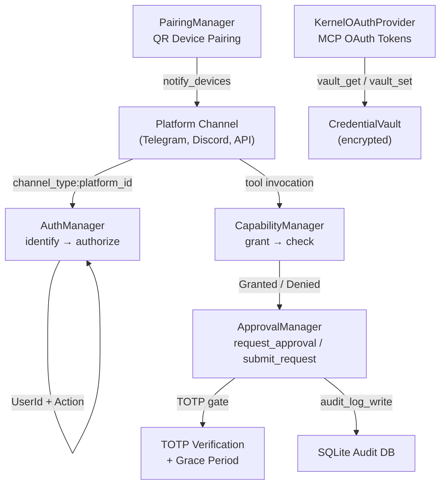

# Authentication & Security — librefang-kernel-src

# Authentication & Security — `librefang-kernel-src`

## Overview

This module implements the security layer for the LibreFang kernel, controlling who can interact with the system and what dangerous operations require human approval. It is organized into five concerns:

| Submodule | Responsibility |
|---|---|
| `auth` | Role-based access control (RBAC) for multi-user identification and authorization |
| `approval` | Human-in-the-loop gating of dangerous tool executions |
| `capabilities` | Per-agent capability grants for tool invocation |
| `pairing` | QR-code device pairing and push notification delivery |
| `mcp_oauth_provider` | OAuth token management for MCP server authentication |

All managers are designed for concurrent use — they rely on `DashMap` and `std::sync::Mutex` rather than async locks, so they can be freely called from both async and sync contexts without holding a runtime handle.

## Architecture



---

## RBAC — `auth.rs`

### Role Hierarchy

Roles are ordered: `Viewer(0) < User(1) < Admin(2) < Owner(3)`. The `PartialOrd`/`Ord` derives mean authorization checks are a simple comparison: `user.role >= action.required_role()`.

| Role | Capabilities |
|---|---|
| **Viewer** | Read-only access to agent output |
| **User** | Chat with agents, view kernel config |
| **Admin** | Spawn/kill agents, install skills, view usage |
| **Owner** | Full access: user management, config changes |

### User Identification

`AuthManager` maintains two indexes backed by `DashMap`:

- **`users`**: `UserId → UserIdentity` — the canonical user record
- **`channel_index`**: `"channel_type:platform_id" → UserId` — maps platform identities to LibreFang users

A user is identified in two steps:

```rust
// 1. Resolve platform identity to UserId
let user_id = auth.identify("telegram", "123456")?;

// 2. Authorize the resolved user for an action
auth.authorize(user_id, &Action::SpawnAgent)?;
```

`identify` returns `None` for unrecognized users — callers should treat this as implicit denial. `authorize` returns `Ok(())` on success or `LibreFangError::AuthDenied` with a human-readable message explaining the shortfall.

### Construction from Config

`AuthManager::new(&[UserConfig])` iterates the kernel config's user list, assigns each a fresh `UserId`, indexes all `channel_bindings`, and logs registrations. When the config is empty, `is_enabled()` returns `false`, allowing callers to skip auth entirely in single-user deployments.

### Actions

The `Action` enum enumerates all authorizable operations. Each variant declares its minimum role via `required_role()`:

- `ChatWithAgent`, `ViewConfig` → `User`
- `SpawnAgent`, `KillAgent`, `InstallSkill`, `ViewUsage` → `Admin`
- `ModifyConfig`, `ManageUsers` → `Owner`

---

## Approval System — `approval.rs`

The approval manager gates dangerous tool executions behind human decisions. It supports two execution paths and a configurable second factor.

### Two Execution Paths

**Blocking path** — `request_approval(req)`:
Used by the kernel when an agent is actively waiting. The call creates a `tokio::sync::oneshot` channel, parks the current task, and waits for a human to call `resolve()`. If the timeout expires before resolution, the fallback policy determines the outcome (deny, skip, or escalate).

**Non-blocking (deferred) path** — `submit_request(req, deferred)`:
Used when the kernel doesn't want to block the agent loop. Stores a `DeferredToolExecution` alongside the request and returns the request UUID immediately. On `resolve()`, the deferred payload is returned atomically so the kernel can execute the tool.

### Request Lifecycle

```
submit → [PENDING] → resolve → [APPROVED / DENIED / SKIPPED / TimedOut]
                 ↘ timeout → [ESCALATE (up to 3×)] → resolve or TimedOut
```

Key constants governing the lifecycle:

| Constant | Value | Purpose |
|---|---|---|
| `MAX_PENDING_PER_AGENT` | 5 | Prevents any single agent from flooding the approval queue |
| `MAX_RECENT_APPROVALS` | 100 | In-memory history ring buffer for dashboard display |
| `MAX_ESCALATIONS` | 3 | Maximum re-notification rounds before force-timing out |

### Timeout and Fallback

The `TimeoutFallback` policy controls what happens when nobody responds:

- **`Deny`** (default) → `ApprovalDecision::TimedOut`
- **`Skip`** → `ApprovalDecision::Skipped` (tool not executed, agent continues)
- **`Escalate { extra_timeout_secs }`** → re-inserts with `escalation_count += 1`, giving the UI another chance to notify. After `MAX_ESCALATIONS` rounds, falls back to `TimedOut`.

The effective timeout for escalation is computed as:
```
timeout_secs + (extra_timeout_secs × escalation_count)
```

### Policy-Driven Approval Checks

`requires_approval(tool_name)` checks the `require_approval` list, which supports glob patterns via `glob_matches`:

- `"shell_exec"` — exact match
- `"file_*"` — prefix wildcard (matches `file_read`, `file_write`, etc.)
- `"*"` — match all tools

`requires_approval_with_context(tool_name, sender_id, channel)` adds layered bypass logic:

1. **Trusted sender** — if `sender_id` is in `trusted_senders`, all approval is bypassed
2. **Channel rules** — if a `ChannelToolRule` explicitly allows the tool for the given channel, approval is bypassed; if it explicitly denies, approval is forced
3. **Default** — falls back to the `require_approval` glob list

The `is_tool_denied_with_context` companion returns `true` only when a channel rule explicitly denies a tool, and trusted senders bypass this check as well.

### TOTP Second Factor

When `policy.second_factor == SecondFactor::Totp`, approving a request requires a valid TOTP code.

**Verification flow:**

1. Caller verifies the code externally using `verify_totp_code(secret_base32, code)` or `verify_totp_code_with_issuer(secret, code, issuer)`
2. Caller passes `totp_verified: true` to `resolve()`
3. If TOTP is required but not verified, `resolve()` returns `Err("TOTP code required...")`

**Grace period:** After a successful TOTP verification, subsequent approvals from the same `user_id` within `totp_grace_period_secs` skip the TOTP requirement. Set `totp_grace_period_secs: 0` to disable grace (every approval requires a fresh code).

**Lockout:** After `TOTP_MAX_FAILURES` (5) consecutive failures, the sender is locked out for `TOTP_LOCKOUT_SECS` (300 seconds). Lockout state is persisted to SQLite (`totp_lockout` table) and restored on daemon restart, but expired lockouts are discarded at load time.

**Per-tool TOTP:** The `totp_tools` policy field restricts TOTP requirements to specific tools. If empty, all tools require TOTP.

**Recovery codes:** `generate_recovery_codes()` produces 8 codes in `DDDD-DDDD` format. `verify_recovery_code(stored_json, code)` does a case-insensitive match and consumes the code on success, returning the updated JSON for persistence.

### Risk Classification

`classify_risk(tool_name)` provides a static risk level:

| Tool | Risk |
|---|---|
| `shell_exec` | Critical |
| `file_write`, `file_delete`, `apply_patch` | High |
| `web_fetch`, `browser_navigate` | Medium |
| Everything else | Low |

### Audit Logging

When constructed with `new_with_db(policy, conn)`, every resolved approval is persisted to an `approval_audit` SQLite table. Query with `query_audit(limit, offset, agent_id, tool_name)` and `audit_count(agent_id, tool_name)`.

### Policy Hot-Reload

`update_policy(new_policy)` replaces the active policy under a write lock. The policy is only held for the duration of each check, so hot-reloads are safe during active request processing.

---

## Capabilities — `capabilities.rs`

Fine-grained per-agent capability grants. An agent must have a matching capability before a tool invocation is even considered for approval.

```rust
mgr.grant(agent_id, vec![Capability::ToolInvoke("file_read".into())]);
let check = mgr.check(agent_id, &Capability::ToolInvoke("file_read".into()));
// check.is_granted() == true
```

`capability_matches(granted, required)` (defined in `librefang-types`) handles pattern matching — e.g., a grant of `Capability::ToolInvoke("file_*")` satisfies a check for `Capability::ToolInvoke("file_read")`.

Use `revoke_all(agent_id)` to clean up when an agent is killed.

---

## Device Pairing — `pairing.rs`

Manages QR-code-based pairing for mobile/desktop companion apps.

### Pairing Flow

1. **Create request**: `create_pairing_request()` generates a 32-byte random token (64 hex chars), stores it with an expiry timestamp, and returns it for QR encoding
2. **Device completes**: Device scans QR, submits token + `PairedDevice` info to `complete_pairing()`
3. **Token consumed**: The pairing token is removed; the device is registered

**Security measures:**
- Constant-time token comparison via `subtle::ConstantTimeEq` in `complete_pairing()`
- Max pending requests (`MAX_PENDING_REQUESTS = 5`) prevents token flooding
- Max paired devices enforced from `PairingConfig.max_devices`
- Expired tokens cleaned by `clean_expired()`

### Persistence

The manager is persistence-agnostic. Inject a callback via `set_persist(fn)`:

```rust
pairing.set_persist(Box::new(|device, op| match op {
    PersistOp::Save => db.save_device(device),
    PersistOp::Remove => db.remove_device(&device.device_id),
}));
```

Load existing devices at boot with `load_devices(vec![...])`.

### Push Notifications

`notify_devices(title, body)` sends to all paired devices via the configured provider:

- **ntfy** — POST to `{ntfy_url}/{ntfy_topic}` with `Title` header
- **gotify** — POST to `{GOTIFY_SERVER_URL}/message` with `X-Gotify-Key` header, JSON body
- **none** — silent (default)

Provider is selected by `PairingConfig.push_provider`.

---

## MCP OAuth Provider — `mcp_oauth_provider.rs`

Implements `McpOAuthProvider` for authenticating with OAuth-protected MCP servers (e.g., Notion). Tokens are stored in the encrypted `CredentialVault` at `~/.librefang/vault.enc`.

### Vault Key Scheme

```
mcp_oauth:{server_url}:{field}
```

Fields: `access_token`, `refresh_token`, `expires_at`, `token_endpoint`, `client_id`, `pkce_verifier`, `pkce_state`, `redirect_uri`.

### Token Lifecycle

- **Load**: `load_token(server_url)` reads the vault, checks expiry, and auto-refreshes if the refresh token is valid
- **Refresh**: `try_refresh()` POSTs `grant_type=refresh_token` to the stored `token_endpoint`
- **Clear**: `clear_tokens(server_url)` removes all vault fields for that server

### Dynamic Client Registration

`register_client(registration_endpoint, redirect_uri, server_url)` performs RFC 7591 dynamic client registration as a public client (`token_endpoint_auth_method: "none"`). Any `client_secret` returned by the authorization server is intentionally ignored and not persisted.

---

## Integration with the Rest of the Codebase

The security managers are consumed by:

- **API layer** (`librefang-api/src/server.rs`): `dashboard_login` uses `verify_totp_code_with_issuer` and `AuthManager::from_str_role` for session authentication
- **System routes** (`src/routes/system.rs`): approval CRUD, TOTP setup/confirm/revoke, audit log queries — all delegate to `ApprovalManager` methods
- **Channel bridge** (`librefang-api/src/channel_bridge.rs`): `resolve_approval_text` parses text-based approval responses from chat platforms, verifying TOTP codes and recovery codes
- **MCP auth routes** (`src/routes/mcp_oauth.rs`): OAuth callback handling uses `KernelOAuthProvider.vault_get`/`vault_set` through the vault unlock chain