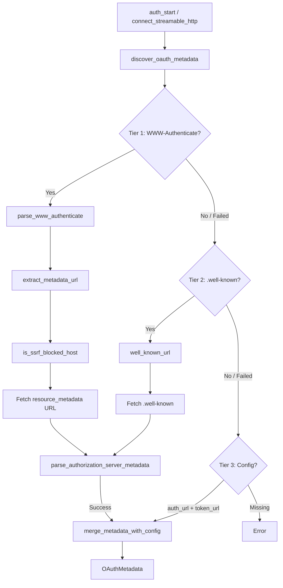

# Authentication & Security — librefang-runtime-mcp-src

# MCP OAuth Discovery & Authentication (`mcp_oauth`)

This module implements OAuth 2.0 discovery and authentication for MCP (Model Context Protocol) Streamable HTTP connections. It follows **RFC 8414** (OAuth Authorization Server Metadata) with additional support for PKCE, WWW-Authenticate header parsing, dynamic client registration hints, and SSRF-hardened metadata resolution.

## Architecture



## Core Types

### `OAuthMetadata`

Resolved OAuth metadata for an MCP server. Contains all information needed to initiate an authorization flow:

| Field | Description |
|---|---|
| `authorization_endpoint` | OAuth authorize URL |
| `token_endpoint` | Token exchange URL |
| `client_id` | Optional pre-configured client ID |
| `registration_endpoint` | RFC 7591 Dynamic Client Registration URL |
| `scopes` | OAuth scopes to request |
| `user_scopes` | Slack-style user scopes (appended as `&user_scope=...`) |
| `server_url` | Original MCP server URL |

### `McpAuthState`

Tagged enum tracking the authentication lifecycle per server:

- **`NotRequired`** — No auth needed for this server.
- **`Authorized`** — Tokens available. Carries optional `expires_at` and `OAuthTokens`.
- **`NeedsAuth`** — Server returned 401; user hasn't started the flow.
- **`PendingAuth`** — OAuth flow in progress; contains the `auth_url` for browser redirect.
- **`Expired`** — Token has expired; re-authentication required.
- **`Error`** — Auth failure with a human-readable message.

Shared state across servers uses `McpAuthStates` — a `tokio::sync::Mutex<HashMap<String, McpAuthState>>`.

### `OAuthTokens`

Standard token response: `access_token`, optional `refresh_token`, `token_type` (defaults to `"Bearer"`), `expires_in`, and `scope`.

## Three-Tier Metadata Discovery

`discover_oauth_metadata` is the main entry point, called from [`connect_streamable_http`](librefang-runtime-mcp/src/lib.rs) during connection setup and from [`auth_start`](src/routes/mcp_auth.rs) when a user initiates auth. It resolves OAuth endpoints through three fallback tiers:

### Tier 1 — WWW-Authenticate Resource Metadata

When an MCP server returns HTTP 401 with a `WWW-Authenticate: Bearer ...` header containing a `resource_metadata` parameter, that URL is fetched for the metadata document.

The `extract_metadata_url` function enforces three security layers before the fetch proceeds:

1. **HTTPS-only** — plain HTTP URLs are rejected outright.
2. **Same-origin** — the metadata URL's scheme, host, and port must match the MCP server URL. This prevents a rogue server from redirecting discovery to an attacker-controlled domain.
3. **SSRF blocklist** — even when same-origin passes, `is_ssrf_blocked_host` rejects loopback (`127.0.0.0/8`, `::1`), private (`10.0.0.0/8`, `172.16.0.0/12`, `192.168.0.0/16`, `fc00::/7`), link-local (`169.254.0.0/16`, `fe80::/10`), and known metadata endpoints (`localhost`, `metadata.google.internal`).

### Tier 2 — `.well-known` Convention

Constructs `{origin}/.well-known/oauth-authorization-server` via `well_known_url` and fetches the RFC 8414 metadata document directly.

### Tier 3 — Config Fallback

Uses `McpOAuthConfig` from application config. Requires both `auth_url` and `token_url` to be set. This is the only tier that doesn't involve a network fetch.

### Merge Behavior

If discovery succeeds (Tier 1 or 2) **and** config is provided, `merge_metadata_with_config` applies config values as overrides:

- `auth_url` / `token_url` override discovered endpoints
- `client_id` overrides or fills in a discovered value
- Non-empty `scopes` / `user_scopes` in config replace discovered scopes; empty config scopes keep discovered values
- `registration_endpoint` always comes from discovery

## WWW-Authenticate Parsing

### `parse_www_authenticate(header: &str) -> HashMap<String, String>`

Strips the `Bearer ` prefix (case-insensitive), splits on commas while respecting quoted strings (via `split_auth_params`), and returns key-value pairs with lowercased keys and unquoted values.

Example input:
```
Bearer realm="OAuth", error="invalid_token", resource_metadata="https://example.com/.well-known/oauth-authorization-server"
```
Produces: `{"realm": "OAuth", "error": "invalid_token", "resource_metadata": "https://example.com/.well-known/oauth-authorization-server"}`

## PKCE Support

### `generate_pkce() -> (String, String)`

Returns a `(verifier, challenge)` pair for OAuth PKCE (Proof Key for Code Exchange):

- **Verifier**: 32 random bytes → base64url (no padding) = 43 characters
- **Challenge**: SHA-256 of verifier → base64url (no padding) = 43 characters

### `generate_state() -> String`

Generates a random OAuth `state` parameter: 16 random bytes → base64url (22 characters). Used to correlate authorization callbacks.

## Token Storage — `McpOAuthProvider` Trait

```rust
#[async_trait]
pub trait McpOAuthProvider: Send + Sync {
    async fn load_token(&self, server_url: &str) -> Option<String>;
    async fn store_tokens(&self, server_url: &str, tokens: OAuthTokens) -> Result<(), String>;
    async fn clear_tokens(&self, server_url: &str) -> Result<(), String>;
}
```

Implementors handle token persistence (the kernel provides an encrypted vault implementation). The trait is intentionally narrow — it deals only with token CRUD, not with the OAuth flow itself. The API layer drives the PKCE flow and browser redirect; the provider is called to store resulting tokens and retrieve them on subsequent connections.

## Integration Points

| Caller | Trigger |
|---|---|
| `connect_streamable_http` | Initial MCP connection setup — attempts discovery when server requires auth |
| `auth_start` | User-initiated OAuth flow from the API layer |
| `McpOAuthProvider` impl (kernel) | Token persistence backend |

The `McpOAuthConfig` type consumed by `merge_metadata_with_config` and Tier 3 fallback is defined in `librefang_types::config`.

## Error Handling

`discover_oauth_metadata` returns `Result<OAuthMetadata, String>`. When all three tiers fail, the error message identifies which tiers were attempted. Individual tier failures log warnings via `tracing::warn` but don't short-circuit — the function falls through to the next tier.

`parse_authorization_server_metadata` returns `Result<OAuthMetadata, String>` when the JSON body doesn't contain the required `authorization_endpoint` and `token_endpoint` fields.