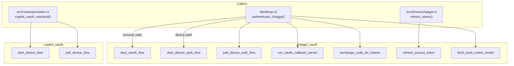
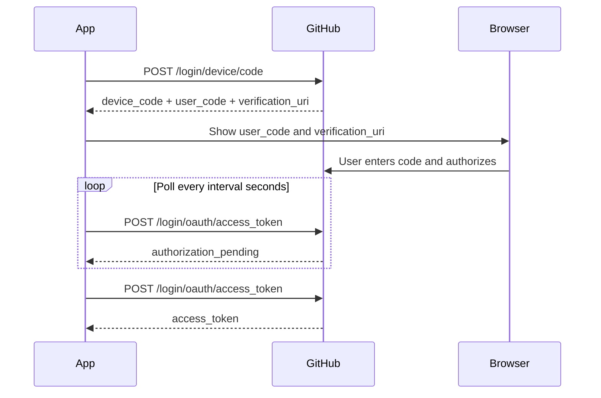

# Authentication & Security — librefang-runtime-oauth-src

# librefang-runtime-oauth

OAuth 2.0 authentication for ChatGPT and GitHub Copilot. This crate provides two independent authentication modules — one for OpenAI's ChatGPT backend and one for GitHub's Copilot device flow — consumed by the CLI and the web API layer at runtime.

## Module Layout

```
librefang-runtime-oauth/src/
├── lib.rs               # Re-exports chatgpt_oauth and copilot_oauth
├── chatgpt_oauth.rs     # OpenAI/ChatGPT OAuth (browser + device flows)
└── copilot_oauth.rs     # GitHub Copilot device flow
```

## Architecture



---

## ChatGPT Authentication

The `chatgpt_oauth` module supports two mutually exclusive paths to obtain OAuth tokens from OpenAI's `auth.openai.com` endpoint. Both produce a `ChatGptAuthResult` containing a bearer access token and an optional refresh token (wrapped in `Zeroizing<String>` to minimize credential exposure in memory).

### Flow Selection

| Environment | Recommended Flow | Rationale |
|---|---|---|
| Desktop with browser | Browser callback | Seamless UX — browser opens, user authenticates, auto-redirected |
| Headless / SSH / CI | Device auth | No localhost port or browser required; user visits a URL on another device |

### Browser Callback Flow

**Step 1 — Initiate**

```rust
let (auth_url, port, pkce_verifier, state) = chatgpt_oauth::start_oauth_flow().await?;
```

`start_oauth_flow` performs:
1. Probes `127.0.0.1:1455` to confirm the port is available (matches OpenAI's registered redirect URI).
2. Generates a PKCE verifier/challenge pair via `generate_pkce()`.
3. Generates a random state parameter via `create_state()`.
4. Assembles the full authorization URL via `build_authorization_url()`.

Open the returned `auth_url` in the user's browser.

**Step 2 — Wait for callback**

```rust
let code = chatgpt_oauth::run_oauth_callback_server(port, &state).await?;
```

Spawns a minimal async HTTP server on `127.0.0.1:{port}` that:
- Accepts `GET /auth/callback?code=...&state=...`
- Validates the `state` parameter against CSRF
- Returns an HTML success or error page to the browser
- Sends the authorization code back through a oneshot channel
- Times out after `AUTH_TIMEOUT_SECS` (300 seconds)

**Step 3 — Exchange code for tokens**

```rust
let result = chatgpt_oauth::exchange_code_for_tokens(&code, &pkce_verifier, port).await?;
```

Posts to `https://auth.openai.com/oauth/token` with the authorization code, PKCE verifier, and redirect URI. Returns `ChatGptAuthResult`.

### Device Auth Flow

Designed for headless environments. Returns `DeviceAuthFlowError::BrowserFallback` if the user's OpenAI account/workspace doesn't support device auth, allowing the caller to fall back to the browser flow.

**Step 1 — Request user code**

```rust
let prompt = chatgpt_oauth::start_device_auth_flow().await?;
// prompt.device_auth_id  — used for polling
// prompt.user_code       — e.g. "ABCD-EFGH"
// prompt.interval_secs   — recommended poll interval
```

Instruct the user to visit `DEVICE_AUTH_URL` (`https://auth.openai.com/codex/device`) and enter the code.

**Step 2 — Poll until complete**

```rust
let result = chatgpt_oauth::poll_device_auth_flow(&prompt).await?;
```

Polls `DEVICE_AUTH_TOKEN_URL` at the server-recommended interval. HTTP 403/404 responses are treated as "authorization pending" (user hasn't completed yet). On success (HTTP 200), the response contains an `authorization_code` and `code_verifier` which are exchanged for tokens via `exchange_code_for_tokens_with_redirect_uri()` using `DEVICE_AUTH_REDIRECT_URI`. Times out after `DEVICE_AUTH_TIMEOUT_SECS` (15 minutes).

### Token Refresh

```rust
let result = chatgpt_oauth::refresh_access_token(&refresh_token).await?;
```

Posts to the token endpoint with `grant_type=refresh_token`. Used by `src/drivers/chatgpt.rs` when the stored access token expires.

### Model Discovery

```rust
let model = chatgpt_oauth::fetch_best_codex_model(&access_token).await;
```

Calls `GET {CHATGPT_BASE_URL}/codex/models?client_version={VERSION}` and returns the model slug with the highest `priority` value. Falls back to `"gpt-5.1-codex-mini"` on any failure.

### Key Types

#### `ChatGptAuthResult`

```rust
pub struct ChatGptAuthResult {
    pub access_token: Zeroizing<String>,
    pub refresh_token: Option<Zeroizing<String>>,
    pub expires_in: Option<u64>,
}
```

All credential fields use `Zeroizing<String>` from the `zeroize` crate to ensure memory is overwritten when dropped.

#### `DeviceAuthPrompt`

```rust
pub struct DeviceAuthPrompt {
    pub device_auth_id: String,
    pub user_code: String,
    pub interval_secs: u64,
}
```

#### `DeviceAuthFlowError`

```rust
pub enum DeviceAuthFlowError {
    BrowserFallback { message: String },  // Caller should try browser flow
    Fatal(String),                         // Do not silently fall back
}
```

#### `PkceChallenge`

```rust
pub struct PkceChallenge {
    pub verifier: String,    // 64 random bytes, base64url-encoded (86 chars)
    pub challenge: String,   // SHA-256 of verifier, base64url-encoded
}
```

### PKCE Details

`generate_pkce()` produces a 64-byte random verifier base64url-encoded to 86 characters. The challenge is the SHA-256 hash of the verifier, also base64url-encoded. The `S256` method is used per RFC 7636.

### Callback Server Internals

`run_oauth_callback_server` spawns a tokio TCP listener that:
1. Reads raw HTTP requests (up to 8192 bytes).
2. Parses the request path for `GET /auth/callback`.
3. Extracts query parameters via `parse_query_params()` (handles `%XX` and `+` encoding).
4. Validates state, checks for OAuth error parameters, extracts the code.
5. Sends the code through a `oneshot::Sender` protected by an `Arc<Mutex<Option<Sender>>>`.
6. Serves an HTML success or error page back to the browser.
7. Non-`/auth/callback` paths receive a 404.

### Session Token Detection

`chatgpt_session_available()` checks whether the `CHATGPT_SESSION_TOKEN` environment variable is set and non-empty, allowing callers to skip OAuth entirely if a direct session token is available.

---

## Copilot Authentication

The `copilot_oauth` module implements the GitHub OAuth 2.0 Device Authorization Grant (RFC 8628) using the public Copilot client ID (`Iv1.b507a08c87ecfe98` — same as the VS Code Copilot extension).

### Device Flow



**Step 1 — Request device code**

```rust
let response = copilot_oauth::start_device_flow().await?;
// response.device_code       — internal code for polling
// response.user_code         — e.g. "A1B2-C3D4"
// response.verification_uri  — "https://github.com/login/device"
// response.interval          — poll interval in seconds
```

**Step 2 — Poll for completion**

```rust
let status = copilot_oauth::poll_device_flow(&response.device_code).await;
match status {
    DeviceFlowStatus::Pending => { /* keep polling */ }
    DeviceFlowStatus::Complete { access_token } => { /* done */ }
    DeviceFlowStatus::SlowDown { new_interval } => { /* increase interval */ }
    DeviceFlowStatus::Expired => { /* restart flow */ }
    DeviceFlowStatus::AccessDenied => { /* user denied */ }
    DeviceFlowStatus::Error(msg) => { /* handle error */ }
}
```

### Key Types

#### `DeviceCodeResponse`

```rust
pub struct DeviceCodeResponse {
    pub device_code: String,
    pub user_code: String,
    pub verification_uri: String,
    pub expires_in: u64,
    pub interval: u64,
}
```

#### `DeviceFlowStatus`

```rust
pub enum DeviceFlowStatus {
    Pending,
    Complete { access_token: Zeroizing<String> },
    SlowDown { new_interval: u64 },
    Expired,
    AccessDenied,
    Error(String),
}
```

Note: GitHub returns HTTP 200 with an `error` field during polling (not HTTP error codes). `poll_device_flow` handles all standard RFC 8628 error codes: `authorization_pending`, `slow_down`, `expired_token`, and `access_denied`.

---

## Constants and Configuration

### ChatGPT Endpoints

| Constant | Value |
|---|---|
| `CHATGPT_BASE_URL` | `https://chatgpt.com/backend-api` |
| `CLIENT_ID` | `app_EMoamEEZ73f0CkXaXp7hrann` |
| `AUTHORIZE_URL` | `https://auth.openai.com/oauth/authorize` |
| `TOKEN_URL` | `https://auth.openai.com/oauth/token` |
| `DEVICE_AUTH_USERCODE_URL` | `https://auth.openai.com/api/accounts/deviceauth/usercode` |
| `DEVICE_AUTH_TOKEN_URL` | `https://auth.openai.com/api/accounts/deviceauth/token` |
| `DEVICE_AUTH_URL` | `https://auth.openai.com/codex/device` |
| `DEVICE_AUTH_REDIRECT_URI` | `https://auth.openai.com/deviceauth/callback` |

### Timeout Defaults

| Constant | Value |
|---|---|
| `CALLBACK_BIND` | `127.0.0.1:1455` |
| `AUTH_TIMEOUT_SECS` | 300 (5 minutes) |
| `DEVICE_AUTH_TIMEOUT_SECS` | 900 (15 minutes) |
| `DEFAULT_DEVICE_AUTH_POLL_INTERVAL_SECS` | 5 |

### Scopes

`SCOPE`: `openid profile email offline_access api.connectors.read api.connectors.invoke`

These scopes grant access to the ChatGPT Responses API at `CHATGPT_BASE_URL`, not the standard `/v1/chat/completions` endpoint.

---

## Dependency Map

The module depends on:

- **`librefang-http`** — `proxied_client()` and `proxied_client_builder()` for HTTP requests (respects system proxy settings)
- **`librefang-types`** — `VERSION` constant for model discovery API calls
- **`zeroize`** — `Zeroizing<String>` for credential memory safety
- **`sha2`** + **`base64`** — PKCE challenge generation
- **`tokio`** — async runtime, TCP listener, oneshot channels, timeouts

The module is consumed by:

- **`librefang-cli`** (`authenticate_chatgpt`, `persist_chatgpt_auth`) — primary caller of the full ChatGPT auth lifecycle
- **`src/routes/providers.rs`** (`copilot_oauth_start`, `copilot_oauth_poll`) — web API endpoints for Copilot auth
- **`src/drivers/chatgpt.rs`** (`refresh_token`) — runtime token refresh for the ChatGPT driver