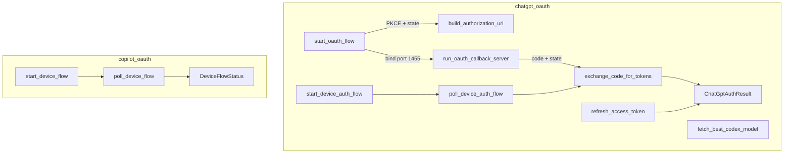

# Authentication & Security — librefang-runtime-oauth-src

# librefang-runtime-oauth

OAuth 2.0 authentication for ChatGPT (OpenAI) and GitHub Copilot. Implements browser-based and headless device authorization flows, token exchange with PKCE, refresh logic, and Codex model discovery.

## Architecture



## Module Layout

```
librefang-runtime-oauth/src/
├── lib.rs              — Re-exports chatgpt_oauth and copilot_oauth
├── chatgpt_oauth.rs    — OpenAI Codex OAuth (browser + device flow)
└── copilot_oauth.rs    — GitHub Copilot device flow (RFC 8628)
```

---

## ChatGPT OAuth (`chatgpt_oauth`)

Authenticates against OpenAI's Codex OAuth endpoints at `auth.openai.com`. Two flows are available and the caller (currently `librefang-cli`) selects between them based on environment.

### Browser Flow

For desktop environments with a browser available.

1. **`start_oauth_flow()`** — Binds a TCP listener on `127.0.0.1:1455` to reserve the port, generates a PKCE challenge pair via `generate_pkce()`, creates a random `state` parameter, and builds the full authorization URL. Returns `(auth_url, port, pkce_verifier, state)`.

2. The caller opens `auth_url` in the user's browser. OpenAI's login page handles authentication and redirects to `http://localhost:{port}/auth/callback?code=...&state=...`.

3. **`run_oauth_callback_server(port, expected_state)`** — Starts an async HTTP server on the given port. For each connection, `handle_oauth_callback` parses the query string, validates the `state` parameter against `expected_state` (CSRF protection), and sends the authorization code through a oneshot channel. Serves a success or error HTML page back to the browser. Times out after 5 minutes (`AUTH_TIMEOUT_SECS`).

4. **`exchange_code_for_tokens(code, code_verifier, port)`** — POSTs to `https://auth.openai.com/oauth/token` with the authorization code, PKCE verifier, and the browser redirect URI. Returns a `ChatGptAuthResult`.

### Device Auth Flow

For headless environments (SSH, containers) where no browser is available on the host.

1. **`start_device_auth_flow()`** — POSTs to `https://auth.openai.com/api/accounts/deviceauth/usercode` with the client ID. Returns a `DeviceAuthPrompt` containing the `device_auth_id`, `user_code`, and recommended poll interval. If the server returns HTTP 404, returns `DeviceAuthFlowError::BrowserFallback` indicating device auth isn't enabled for the account — the caller should fall back to the browser flow.

2. The user visits `https://auth.openai.com/codex/device` (exported as `DEVICE_AUTH_URL`) and enters the `user_code`.

3. **`poll_device_auth(prompt)`** — Polls `https://auth.openai.com/api/accounts/deviceauth/token` every `interval_secs` (minimum 1 second, default 5). HTTP 403 and 404 are treated as "still pending." On HTTP 200, the response contains an `authorization_code` and `code_verifier`, which are passed to `exchange_code_for_tokens_with_redirect_uri` with `DEVICE_AUTH_REDIRECT_URI`. Times out after 15 minutes (`DEVICE_AUTH_TIMEOUT_SECS`).

### Token Refresh

**`refresh_access_token(refresh_token)`** — POSTs to the token endpoint with `grant_type=refresh_token`. Returns a new `ChatGptAuthResult`. Called from the ChatGPT driver when the current access token expires.

### Model Discovery

**`fetch_best_codex_model(access_token)`** — Calls `GET {CHATGPT_BASE_URL}/codex/models?client_version={VERSION}` with the bearer token. The response contains a `models` array with `slug` and `priority` fields. Returns the highest-priority model slug. Falls back to `"gpt-5.1-codex-mini"` on any failure.

### Key Types

| Type | Description |
|------|-------------|
| `ChatGptAuthResult` | Holds `access_token` and optional `refresh_token` (both `Zeroizing<String>`) and `expires_in: Option<u64>` |
| `DeviceAuthPrompt` | `device_auth_id`, `user_code`, `interval_secs` — must be displayed to the user |
| `DeviceAuthFlowError` | `BrowserFallback` (graceful degradation) or `Fatal` (unrecoverable) |
| `PkceChallenge` | `verifier` (86-char base64url) and `challenge` (SHA-256 of verifier, base64url) |

### Constants

| Constant | Value |
|----------|-------|
| `CHATGPT_BASE_URL` | `https://chatgpt.com/backend-api` |
| `CLIENT_ID` | `app_EMoamEEZ73f0CkXaXp7hrann` |
| `SCOPE` | `openid profile email offline_access api.connectors.read api.connectors.invoke` |
| `CALLBACK_BIND` | `127.0.0.1:1455` |
| `DEVICE_AUTH_URL` | `https://auth.openai.com/codex/device` |
| `DEVICE_AUTH_REDIRECT_URI` | `https://auth.openai.com/deviceauth/callback` |

---

## Copilot OAuth (`copilot_oauth`)

Implements GitHub's OAuth 2.0 Device Authorization Grant (RFC 8628) for obtaining a GitHub personal access token for Copilot.

### Device Flow

1. **`start_device_flow()`** — POSTs to `https://github.com/login/device/code` with `client_id=Iv1.b507a08c87ecfe98` (VSCode Copilot extension's public client ID) and `scope=read:user`. Returns a `DeviceCodeResponse` with `device_code`, `user_code`, `verification_uri`, `expires_in`, and `interval`.

2. The user visits `verification_uri` and enters `user_code`.

3. **`poll_device_flow(device_code)`** — POSTs to `https://github.com/login/oauth/access_token` with the device code. Returns a `DeviceFlowStatus`:

| Variant | Meaning |
|---------|---------|
| `Pending` | User hasn't completed authorization yet |
| `Complete { access_token }` | Success — contains the token as `Zeroizing<String>` |
| `SlowDown { new_interval }` | Server requests longer poll interval |
| `Expired` | Device code expired, must restart |
| `AccessDenied` | User denied the authorization |
| `Error(String)` | Unexpected error |

GitHub returns HTTP 200 with an `error` field during pending states, so error handling checks the JSON body rather than HTTP status codes.

### Key Types

| Type | Description |
|------|-------------|
| `DeviceCodeResponse` | Parsed response from device code initiation — all fields required |
| `DeviceFlowStatus` | Enum representing the current state of the polling cycle |

---

## Security Considerations

- **PKCE (S256)**: The browser flow uses Proof Key for Code Exchange with SHA-256 to prevent authorization code interception attacks.
- **State parameter**: A random 16-byte hex string protects against CSRF during the browser callback.
- **Zeroizing**: Both `access_token` and `refresh_token` are wrapped in `Zeroizing<String>` from the `zeroize` crate, ensuring memory is cleared when dropped.
- **CSRF validation**: `run_oauth_callback_server` validates the `state` parameter matches the one generated at flow start. Mismatched state returns HTTP 400.
- **Timeout enforcement**: Browser flow times out after 5 minutes; device auth flow after 15 minutes.

## Integration Points

This module is consumed by:

| Consumer | What it calls |
|----------|---------------|
| `librefang-cli` (`authenticate_chatgpt`) | `start_oauth_flow`, `run_oauth_callback_server`, `exchange_code_for_tokens`, `start_device_auth_flow`, `poll_device_auth_flow`, `fetch_best_codex_model` |
| `src/drivers/chatgpt.rs` (`refresh_token`) | `refresh_access_token` |
| `src/routes/providers.rs` | `start_device_flow`, `poll_device_flow` |

HTTP requests go through `librefang_http::proxied_client()` and `librefang_http::proxied_client_builder()`, which respect system proxy configuration.