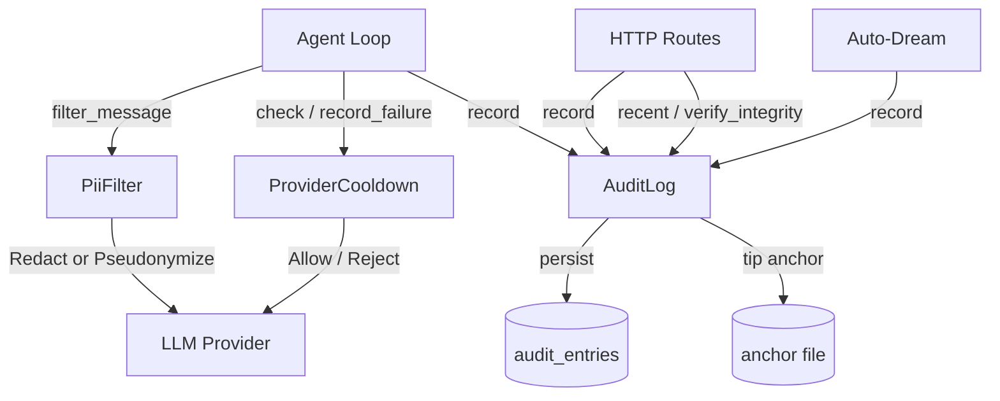
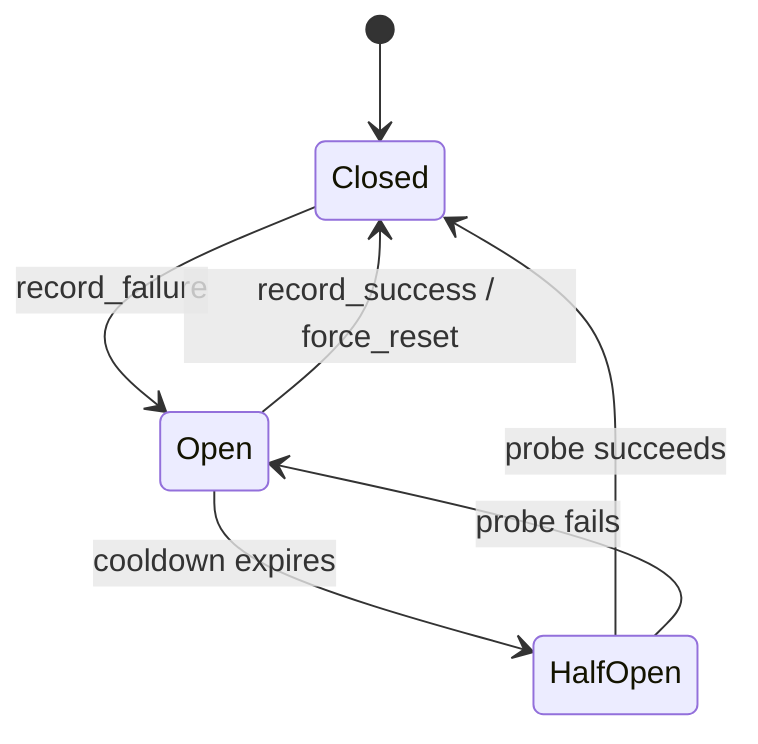

# Authentication & Security — librefang-runtime-src

# Authentication & Security — `librefang-runtime`

This module provides three security primitives used throughout the agent runtime: a tamper-evident audit trail, a PII filter for LLM-bound messages, and a provider circuit breaker with auth profile rotation.

---

## Architecture Overview



---

## 1. Audit Trail (`audit.rs`)

### Purpose

Every security-sensitive action in the runtime — tool invocations, shell execution, agent lifecycle events, config changes, memory access — is appended to an append-only log. Each entry's SHA-256 hash chains back to the previous entry, making any tampering detectable.

### Data Model

**`AuditAction`** — categorises the event:

| Variant | Typical use |
|---|---|
| `ToolInvoke` | Agent calls a tool |
| `ShellExec` | Shell command execution |
| `AgentSpawn` / `AgentKill` | Agent lifecycle |
| `MemoryAccess` | Reading/writing agent memory |
| `FileAccess` / `NetworkAccess` | Sandbox boundary events |
| `AuthAttempt` | Authentication successes/failures |
| `WireConnect` | Wire protocol connections |
| `ConfigChange` | Runtime config modifications |
| `DreamConsolidation` | Auto-dream lifecycle phases |
| `CapabilityCheck` | Permission checks |

**`AuditEntry`** — a single linked-list node:

```
seq  timestamp  agent_id  action  detail  outcome  prev_hash  hash
```

- `seq` — monotonically increasing, 0-indexed.
- `prev_hash` — SHA-256 of the previous entry (64 zero-characters for genesis).
- `hash` — SHA-256 of this entry's fields concatenated with `prev_hash`.

### `AuditLog` Construction

| Constructor | Persistence | Anchor | Use case |
|---|---|---|---|
| `new()` | In-memory only | No | Tests, ephemeral runs |
| `with_db(conn)` | SQLite `audit_entries` table (schema V8) | No | Standard deployment |
| `with_db_anchored(conn, path)` | SQLite + external tip file | Yes | Hardened deployment |

On construction, `with_db` and `with_db_anchored` load all existing rows, rebuild the chain in memory, and run `verify_integrity()`. A boot-time failure is logged loudly but does **not** prevent startup — the failure surfaces via the `/api/audit/verify` endpoint instead.

### Recording Events

```rust
audit_log.record(
    "agent-1",                       // agent_id
    AuditAction::ShellExec,          // action
    "rm -rf /",                      // detail
    "denied",                        // outcome
);
```

`record()` appends the entry to both the in-memory chain and SQLite (if configured), then atomically updates the anchor file. The function returns the new entry's hash.

### Integrity Verification

`verify_integrity()` walks the entire chain and recomputes every hash. It checks:

1. **Link consistency** — each entry's `prev_hash` equals the previous entry's `hash`.
2. **Content integrity** — recomputing `compute_entry_hash` for every entry matches the stored `hash`.
3. **Anchor agreement** (if configured) — the anchor file's `seq:hash` pair matches the in-DB tip.

### Threat Model — The Anchor File

The Merkle chain alone is self-consistent: an attacker with write access to `audit_entries` can delete all rows, fabricate a new history, and recompute every hash from genesis. `verify_integrity()` would return `Ok` because there is nothing to compare the tip against.

The anchor file closes this gap by storing the latest `<seq> <hex-hash>\n` outside SQLite, written atomically via `write_anchor` (temp file + rename). On boot, `with_db_anchored` compares the anchor against the DB tip and logs a loud `MISMATCH` if they diverge. Subsequent `verify_integrity()` calls return `Err` until the two agree.

For stronger guarantees, place the anchor on a path the daemon can write to but unprivileged code cannot (e.g., a chmod-0400 file, a read-only mount, or piped to `logger`).

### Retention

`prune(retention_days)` removes entries older than the given threshold from both SQLite and the in-memory list. Pass `0` for unlimited retention (no-op).

### Callers

The audit log is wired into routes and subsystems across the codebase:

- **Config routes** — `config_set`, `config_reload`, `shutdown`
- **System routes** — `create_backup`, `restore_backup`
- **Skills routes** — `add_mcp_server`, `update_mcp_server`, `delete_mcp_server`
- **Auto-dream** — `run_dream`, `finalize_failure`, `finalize_abort`, `set_agent_enabled`
- **Agent routes** — `agent_metrics`, `agent_logs`
- **API surface** — `audit_recent` returns `recent(n)` entries; `audit_verify` calls `verify_integrity()`.

---

## 2. PII Filter (`pii_filter.rs`)

### Purpose

Before user messages and sender context reach an LLM provider, the PII filter strips or replaces personally identifiable information according to the configured `PrivacyMode`.

### Built-in Detection Patterns

| Label | Detects |
|---|---|
| `email` | Standard email addresses |
| `phone` | E.164, US formatted, international with spaces/dashes |
| `credit_card` | Visa (4), Mastercard (51–55), Amex (34/37), Discover (6011/65) |
| `ssn` | US Social Security Numbers (with or without dashes) |

Custom patterns are passed to `PiiFilter::new(custom_patterns)` and compiled at construction time. Invalid regex patterns are logged and skipped.

### Privacy Modes

| Mode | Behaviour |
|---|---|
| `Off` | No filtering — text passes through unchanged |
| `Redact` | Every match is replaced with `[REDACTED]` |
| `Pseudonymize` | Every unique match gets a stable label like `[Email-A]`, `[Phone-B]` |

### Pseudonym Stability

The pseudonym map (`HashMap<String, String>`) ensures the same PII value always maps to the same label within a session. Counters increment per category: the first email becomes `[Email-A]`, the second `[Email-B]`, and so on through `[Email-Z]`, `[Email-AA]`, etc.

### Filtering Sender Context

`filter_sender_context` applies the same mode to `SenderContext` fields:

| Field | `Redact` | `Pseudonymize` |
|---|---|---|
| `user_id` | `[REDACTED]` | `[User_id-A]` |
| `display_name` | `[REDACTED]` | `[User-A]` |
| `account_id` | `[REDACTED]` | `[Account-A]` |
| `channel` | preserved | preserved |
| `is_group`, `was_mentioned`, `thread_id` | preserved | preserved |

### Integration Point

The agent loop calls `filter_message` via `push_filtered_user_message` before dispatching to the LLM, ensuring no raw PII leaves the runtime.

---

## 3. Provider Circuit Breaker (`auth_cooldown.rs`)

### Purpose

When an LLM provider starts failing, the circuit breaker prevents request storms by applying exponential backoff per provider. Billing errors (HTTP 402) receive significantly longer cooldowns. A half-open probing mechanism allows automatic recovery detection.

### Circuit States



- **Closed** — healthy; all requests flow.
- **Open** — failing; requests are rejected with a `retry_after_secs` hint.
- **HalfOpen** — cooldown expired; a single probe request is allowed through to test recovery.

### Cooldown Calculation

General errors use `base_cooldown_secs × backoff_multiplier^exponent`, where `exponent = min(error_count - 1, max_exponent)`. The result is capped at `max_cooldown_secs`.

Billing errors use the same formula with separate parameters (`billing_base_cooldown_secs`, `billing_multiplier`, `billing_max_cooldown_secs`) that default to much higher values (5 hours base, 24 hours max).

### Default Configuration

| Parameter | General | Billing |
|---|---|---|
| Base cooldown | 60s | 18 000s (5h) |
| Max cooldown | 3 600s (1h) | 86 400s (24h) |
| Multiplier | 5.0× | 2.0× |
| Max exponent | 3 | 10 |

### API

| Method | Description |
|---|---|
| `check(provider)` | Returns `Allow`, `AllowProbe`, or `Reject { reason, retry_after_secs }` |
| `record_success(provider)` | Resets error count, closes the circuit |
| `record_failure(provider, is_billing)` | Increments error count, opens the circuit |
| `record_probe_result(provider, success)` | Closes circuit on success; extends cooldown on failure |
| `get_state(provider)` | Returns `Closed`, `Open`, or `HalfOpen` |
| `snapshot()` | Returns all provider states for API/dashboard |
| `force_reset(provider)` | Admin action — removes all state for a provider |
| `clear_expired()` | Removes entries with expired cooldowns and zero errors |

### Probing

When `probe_enabled` is true (default), `check()` may return `AllowProbe` instead of `Reject` if the `probe_interval_secs` has elapsed since the last probe. This sends one request through to test whether the provider has recovered, without unblocking all traffic.

### Auth Profile Rotation

Providers can be configured with multiple `AuthProfile` entries, each with a `priority` and `api_key_env`:

| Method | Description |
|---|---|
| `select_profile(provider, profiles)` | Returns the highest-priority profile not currently in cooldown |
| `advance_profile(provider, failed_profile, is_billing)` | Marks a specific profile as failed, triggering its own cooldown |

Profile state is tracked under composite keys (`{provider}::{profile_name}`), so failing one API key automatically falls back to the next priority.

### Integration Points

The agent loop calls:
- `check_retry_cooldown` → `check()` to decide whether to attempt a request.
- `record_retry_failure` → `record_failure()` when a provider returns an error.
- `record_retry_success` → `record_success()` when a provider responds normally.

### Failure Window

Errors older than `failure_window_secs` (default 24 hours) are forgotten — the `total_errors_in_window` counter resets. This prevents a provider from being permanently penalised for transient issues.

---

## Thread Safety

All three components are designed for concurrent use:

| Component | Mechanism |
|---|---|
| `AuditLog` | `Mutex<Vec<AuditEntry>>`, `Mutex<String>` for tip, `Arc<Mutex<Connection>>` for DB |
| `PiiFilter` | `Mutex<HashMap>` for pseudonym map and counters (interior mutability) |
| `ProviderCooldown` | `DashMap<String, ProviderState>` for lock-free concurrent access |

Poisoned mutexes are recovered with `unwrap_or_else(|e| e.into_inner())` — the runtime favours availability over halting on a panicked thread.