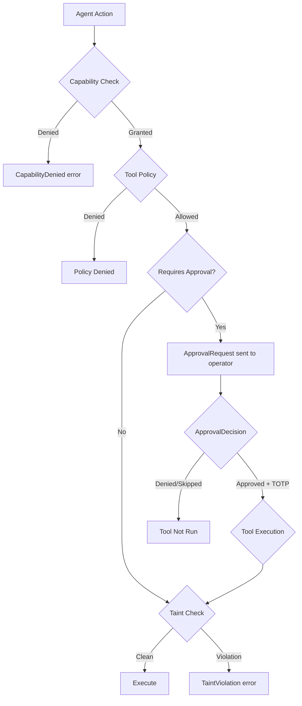

# Authentication & Security — librefang-types-src

# Authentication & Security — `librefang-types`

This crate defines the shared type layer for LibreFang's multi-layered security model. It ships no runtime logic — only data structures, validation rules, and pattern-matching helpers that the kernel, runtime, and external consumers rely on for consistent enforcement.

The security model is built on three independent pillars:

1. **Capability-based access control** — immutable grants assigned at agent creation
2. **Human-in-the-loop approval gates** — interactive confirmation for dangerous tools
3. **Information-flow taint tracking** — runtime data provenance to prevent injection and exfiltration

A fourth subsystem — **tool policy** — provides deny-wins glob-pattern filtering layered on top of capabilities.



---

## Capability System — `capability.rs`

Agents operate under a whitelist of explicit permissions. No action is permitted unless a matching capability has been granted. Capabilities are immutable after agent creation and enforced at the kernel and WASM host-function level.

### `Capability` enum

Tagged-serde enum (`#[serde(tag = "type", content = "value")]`) covering all permissionable domains:

| Variant | Domain | Content |
|---|---|---|
| `FileRead` / `FileWrite` | Filesystem | Glob pattern for paths |
| `NetConnect` | Outbound network | Host pattern (`"api.openai.com:443"`) |
| `NetListen` | Inbound network | Port number |
| `ToolInvoke` / `ToolAll` | Tool execution | Tool ID glob, or wildcard |
| `LlmQuery` / `LlmMaxTokens` | LLM access | Model pattern, or token budget |
| `AgentSpawn` / `AgentMessage` / `AgentKill` | Inter-agent | Agent name pattern |
| `MemoryRead` / `MemoryWrite` | Memory scopes | Scope pattern |
| `ShellExec` | Shell commands | Command pattern |
| `EnvRead` | Environment | Variable name pattern |
| `OfpDiscover` / `OfpConnect` / `OfpAdvertise` | Wire protocol (OFP) | Peer pattern or boolean |
| `EconSpend` / `EconEarn` / `EconTransfer` | Economic | USD amount or agent pattern |

### Pattern matching: `glob_matches`

Shared glob engine used across the crate (approval tool names, channel rules, TOTP tool lists):

- `"*"` — matches everything
- `"prefix*"` — prefix match
- `"*suffix"` — suffix match
- `"prefix*suffix"` — both ends must match, value must be at least `prefix.len() + suffix.len()`
- Exact string — literal match

Only a single `*` wildcard is supported per pattern.

### `capability_matches`

Determines whether a granted capability satisfies a required one:

- Different variants never match (e.g., `FileRead` cannot satisfy `FileWrite`)
- `ToolAll` satisfies any `ToolInvoke`
- Pattern-bearing variants use `glob_matches` on their content
- Numeric variants use comparison: `LlmMaxTokens(granted) >= required`, `EconSpend(granted) >= required`, `NetListen` requires exact port equality

### `validate_capability_inheritance`

Prevents privilege escalation during sub-agent spawning. Called from `librefang-runtime::tool_runner::spawn_agent_checked`. Every capability requested by the child must be covered by at least one parent capability. If any child capability lacks a matching parent grant, the function returns an error and the spawn is denied.

### `CapabilityCheck` and error propagation

`CapabilityCheck::require()` converts a denied check into `LibreFangError::CapabilityDenied(reason)`, used by the WASM host in `librefang-runtime-wasm::host_functions::check_capability`.

---

## Approval Gate — `approval.rs`

When an agent attempts a tool listed in the approval policy, the kernel creates an `ApprovalRequest`, pauses the agent, and notifies a human operator. The operator responds with an `ApprovalResponse` carrying an `ApprovalDecision`.

### Core types

**`ApprovalRequest`** — created by the kernel, sent to operators:
- `id` (`Uuid`) — unique request identifier
- `agent_id`, `tool_name`, `description`, `action_summary` — context for the operator
- `risk_level` (`RiskLevel`) — `Low` / `Medium` / `High` / `Critical`, with `emoji()` for dashboard display
- `timeout_secs` — auto-deny deadline (clamped to 10–300 seconds)
- `sender_id`, `channel` — provenance of the triggering request
- `route_to` — per-request notification override
- `escalation_count` — tracks re-notification cycles (max 3)

**`ApprovalResponse`** — operator's decision:
- `request_id`, `decision`, `decided_at`, `decided_by`

**`ApprovalDecision`** — the actual verdict:
- `Approved`, `Denied`, `TimedOut`, `Skipped` — serialize as plain strings for backward compatibility
- `ModifyAndRetry { feedback }` — serializes as `{"type": "modify_and_retry", "feedback": "..."}`, allowing the operator to request modification with guidance

Helper methods: `is_approved()`, `is_terminal()` (returns `false` for `ModifyAndRetry`), `as_str()`.

### `ApprovalPolicy`

Central configuration for the approval subsystem. Deserializes with `#[serde(default)]` so empty JSON objects produce safe defaults.

Key fields:

| Field | Default | Purpose |
|---|---|---|
| `require_approval` | `["shell_exec", "file_write", "file_delete", "apply_patch", "skill_evolve_*"]` | Tools that require human approval |
| `timeout_secs` | `60` | Seconds before auto-deny (10–300) |
| `auto_approve` | `false` | Shorthand: if `true`, `apply_shorthands()` clears the require list |
| `auto_approve_autonomous` | `false` | Auto-approve in autonomous mode |
| `trusted_senders` | `[]` | User IDs that bypass approval (max 100) |
| `channel_rules` | `[]` | Per-channel tool allow/deny lists |
| `timeout_fallback` | `Deny` | Behavior on timeout: `Deny`, `Skip`, or `Escalate { extra_timeout_secs }` |
| `routing` | `[]` | Route specific tool patterns to notification targets |
| `second_factor` | `None` | TOTP enforcement scope |
| `totp_issuer` | `"LibreFang"` | Authenticator app label |
| `totp_grace_period_secs` | `300` | Skip re-verification within this window |
| `totp_tools` | `[]` | Glob patterns for tools requiring TOTP (empty = all approved tools) |

The `require_approval` field accepts either a string list or a boolean shorthand via `deserialize_require_approval`:
- `true` → expands to the default mutation set
- `false` → empty list (no approval required)

### `SecondFactor` enum

Controls where TOTP verification is enforced:

- `None` — no second factor (default)
- `Totp` — approvals only
- `Login` — dashboard login only
- `Both` — approvals + login

Query methods: `requires_login_totp()`, `requires_approval_totp()`. The policy method `tool_requires_totp(tool_name)` checks whether a specific tool triggers TOTP based on `second_factor` and the `totp_tools` glob list.

### `ChannelToolRule`

Per-channel tool authorization with deny-wins semantics:

```
ChannelToolRule {
    channel: "telegram",
    allowed_tools: ["file_read", "file_*"],
    denied_tools: ["shell_exec"],
}
```

`check_tool(tool_name)` returns `Some(true)` (allowed), `Some(false)` (denied), or `None` (no opinion). Deny always wins over allow. Patterns support wildcards via `glob_matches`.

The policy method `check_channel_tool(channel, tool_name)` finds the first matching rule and delegates to `check_tool`.

### `TimeoutFallback`

- `Deny` — reject the request (default)
- `Skip` — skip the tool, agent continues
- `Escalate { extra_timeout_secs }` — extend timeout and re-notify (default escalation: 120 seconds)

### Notification and audit types

- `NotificationTarget` — channel type + recipient + optional thread ID
- `AgentNotificationRule` — per-agent glob pattern for notification routing
- `NotificationConfig` — approval channels, alert channels, agent rules
- `ApprovalRoutingRule` — tool pattern → notification targets
- `ApprovalAuditEntry` — persistent audit log for every decision, including `second_factor_used`

### Validation

Both `ApprovalRequest::validate()` and `ApprovalPolicy::validate()` check field lengths, character constraints, timeout bounds, and tool name patterns. All tool name validation uses the internal `validate_tool_name` helper which allows alphanumeric characters, underscores, and at most one `*` wildcard.

---

## Taint Tracking — `taint.rs`

A lattice-based information-flow control system that prevents tainted data from reaching sensitive sinks without explicit declassification. Guards against prompt injection, data exfiltration, and confused-deputy attacks.

### `TaintLabel` — provenance tags

| Label | Meaning |
|---|---|
| `ExternalNetwork` | Data from an outbound HTTP/response |
| `UserInput` | Direct user-supplied input |
| `Pii` | Personally identifiable information |
| `Secret` | API keys, tokens, passwords |
| `UntrustedAgent` | Output from a sandboxed/untrusted agent |

### `TaintedValue`

A string annotated with a `HashSet<TaintLabel>` and a human-readable `source` description.

Key operations:
- `clean(value, source)` — creates an untainted value
- `merge_taint(other)` — unions labels from another value (used during concatenation)
- `check_sink(sink)` — returns `Err(TaintViolation)` if any label is blocked
- `declassify(label)` — explicitly removes a label (security decision by the caller)
- `is_tainted()` — whether any labels remain

### `TaintSink` — blocked label sets

Predefined sinks matching the kernel's enforcement points:

| Sink | Blocked labels | Threat mitigated |
|---|---|---|
| `shell_exec()` | `ExternalNetwork`, `UntrustedAgent`, `UserInput` | Shell injection |
| `net_fetch()` | `Secret`, `Pii` | Data exfiltration |
| `agent_message()` | `Secret` | Credential leakage between agents |
| `mcp_tool_call()` | `Secret`, `Pii` | Credential/PII leakage to external MCP servers |

### `check_outbound_text_violation` — heuristic secret/PII scanner

A best-effort pattern detector invoked by the runtime before sending tool arguments to external sinks (MCP calls, channel sends, network fetches). This is not a full information-flow tracker — it catches the common "LLM stuffs an API key into a tool call" pattern.

**Secret detection** — three independent checks, any one triggers:

1. **`Authorization:` header literal** — unambiguous
2. **Key-value shapes** — matches `key=value`, `key:value`, `"key":`, `'key':` after whitespace normalization. Checked against a denylist of secret key names (`api_key`, `token`, `password`, `authorization`, etc.)
3. **Opaque token heuristic** — long (≥32 chars) alphanumeric strings that mix letters and digits but are not pure hex (to exclude git SHAs, SHA-256 digests, UUIDs). Also flags well-known credential prefixes: `sk-`, `ghp_`, `github_pat_`, `xoxp-`, `xoxb-`, `AKIA`, `AIza`. Excludes strings containing date components (`YYYY-MM-DD`) and file paths.

**PII detection** — regex-based checks for email addresses, phone numbers, credit card numbers (Visa/MC/Amex/Discover test BINs), and SSNs. Skipped for "tokenish mixed" strings (long alphanumerics without `@` or whitespace) and Unix/Slack-style numeric timestamps (`1747123456.789000`).

On detection, the payload is wrapped in a `TaintedValue` and run through `check_sink` to produce a consistent `TaintViolation` error message.

**Known limitations** (documented in code and SECURITY.md): copy-pasted obfuscation (base64, homoglyphs, zero-width character splits) bypasses this filter. It is a safety net, not a guarantee.

### Integration with runtime

The call graph shows where these types are consumed:

- `librefang-runtime::tool_runner::check_taint_shell_exec` → `TaintSink::shell_exec()` + `check_sink()`
- `librefang-runtime::tool_runner::check_taint_net_fetch` → `TaintSink::net_fetch()` + `check_sink()`
- `librefang-runtime::tool_runner::tool_agent_send` / `tool_channel_send` → `TaintSink::agent_message()`
- `librefang-runtime-mcp::scan_mcp_arguments_for_taint` → `TaintSink::mcp_tool_call()` + `check_outbound_text_violation()`

---

## Tool Policy — `tool_policy.rs`

Provides the data types for deny-wins, glob-pattern tool access control. The actual resolution logic lives in `librefang-runtime::tool_policy` to avoid circular dependencies.

### Types

**`PolicyEffect`** — `Allow` or `Deny` (serializes as lowercase strings).

**`ToolPolicyRule`** — a pattern + effect pair:
```rust
ToolPolicyRule {
    pattern: "shell_*",
    effect: PolicyEffect::Deny,
}
```

**`ToolGroup`** — named collection of patterns for reusable rule authoring:
```rust
ToolGroup {
    name: "web_tools",
    tools: vec!["web_fetch", "web_search", "http_*"],
}
```

**`ToolPolicy`** — complete configuration:
- `agent_rules` — highest priority, checked first
- `global_rules` — checked after agent rules
- `groups` — named tool pattern collections
- `subagent_max_depth` — maximum nesting depth (default: 10)
- `subagent_max_concurrent` — maximum concurrent sub-agents (default: 5)

Resolution order: agent rules → global rules. In each layer, the first matching rule wins. If no rule matches, the default is allow. Deny wins over allow when both match at the same priority level.