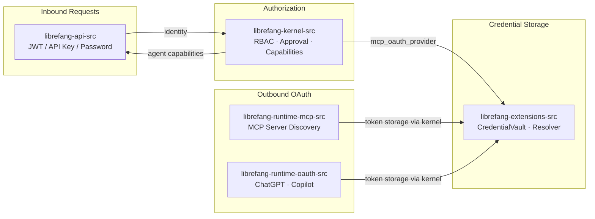

# Authentication & Security

# Authentication & Security

This module group provides the complete identity, access control, and credential management layer for LibreFang. It spans five sub-modules that together handle every authentication scenario: end-user login, agent authorization, encrypted secret storage, and OAuth flows for external providers.

## Sub-module Responsibilities

| Sub-module | Role |
|---|---|
| [librefang-api-src](librefang-api-src.md) | Inbound authentication gateway — validates Bearer JWTs, API keys, session tokens, and dashboard passwords (Argon2id). Manages webhook subscriptions with SSRF mitigations and HMAC delivery signing. |
| [librefang-kernel-src](librefang-kernel-src.md) | Runtime authorization — RBAC (`auth`), human-in-the-loop approval gating (`approval`), per-agent capability grants (`capabilities`), QR-code device pairing (`pairing`), and MCP OAuth token management (`mcp_oauth_provider`). |
| [librefang-extensions-src](librefang-extensions-src.md) | Credential storage and resolution — encrypted `CredentialVault` (AES-256-GCM with `Zeroizing<String>` in-memory secrets), and a `CredentialResolver` chain that falls back through vault → `.env` → environment variable → interactive prompt. |
| [librefang-runtime-mcp-src](librefang-runtime-mcp-src.md) | OAuth 2.0 discovery for MCP servers — RFC 8414 metadata resolution, PKCE, WWW-Authenticate header parsing, and SSRF-hardened endpoint validation. |
| [librefang-runtime-oauth-src](librefang-runtime-oauth-src.md) | OAuth 2.0 for ChatGPT and GitHub Copilot — browser-based and device-code flows, token exchange with PKCE, refresh logic, and Codex model discovery. |

## How They Connect

### Key Cross-Module Workflows

**User login → authorized action.** A request hits [librefang-api-src](librefang-api-src.md) which validates the credential (JWT via OIDC, Argon2id password hash, or session token derived through `derive_dashboard_session_token`). The verified identity is passed to [librefang-kernel-src](librefang-kernel-src.md)'s RBAC layer to determine role-based permissions, and optionally through the `approval` manager if the action is flagged as dangerous.

**MCP server authentication.** [librefang-runtime-mcp-src](librefang-runtime-mcp-src.md) discovers OAuth metadata from MCP endpoints (SSRF-hardened), then delegates token storage and refresh to [librefang-kernel-src](librefang-kernel-src.md)'s `mcp_oauth_provider`, which persists tokens in [librefang-extensions-src](librefang-extensions-src.md)'s `CredentialVault`.

**LLM provider OAuth.** [librefang-runtime-oauth-src](librefang-runtime-oauth-src.md) handles browser-based and device-code flows for ChatGPT and GitHub Copilot. Acquired tokens follow the same path through the kernel's OAuth provider into the encrypted vault.

**Webhook delivery.** [librefang-api-src](librefang-api-src.md) validates webhook target URLs against private IP ranges (`is_private_ip`, `canonical_ip`) to prevent SSRF, then signs deliveries with HMAC for receipt verification.