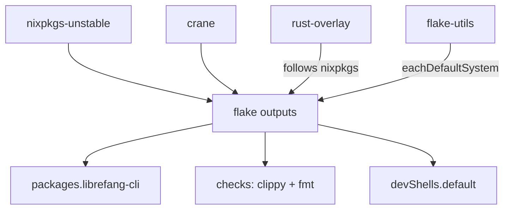

# Build System — flake.nix

# Build System — `flake.nix`

## Overview

The LibreFang project uses a Nix flake to define a reproducible, cross-platform build pipeline for its Rust workspace. The flake leverages [crane](https://github.com/ipetkov/crane) for incremental Cargo builds with aggressive caching, and [rust-overlay](https://github.com/oxalica/rust-overlay) to pin a consistent Rust toolchain across all developer machines and CI environments.

## Dependency Graph



## Inputs

| Input | Purpose |
|---|---|
| `nixpkgs` | Package set (tracks `nixpkgs-unstable`) |
| `crane` | Cargo-aware Nix build library — handles dependency caching, clippy, formatting checks |
| `flake-utils` | Provides `eachDefaultSystem` to iterate outputs over all supported platforms |
| `rust-overlay` | Supplies `rust-bin` for selecting a specific Rust toolchain; follows `nixpkgs` to avoid mismatched libc versions |

## Build Pipeline

The flake produces outputs per-system via `flake-utils.lib.eachDefaultSystem`. Within each system, the build proceeds through these stages:

### 1. Toolchain Selection

```
rustToolchain = pkgs.rust-bin.stable.latest.default.override {
  extensions = [ "rust-src" "rust-analyzer" "clippy" ];
};
```

Pins the latest stable Rust compiler and adds `rust-src` (for IDE completion), `rust-analyzer`, and `clippy`. This toolchain is passed to crane via `overrideToolchain`.

### 2. Source Filtering

```
src = craneLib.cleanCargoSource ./.;
```

`cleanCargoSource` strips non-Rust files (documentation assets, non-Cargo config, etc.) from the source tree. This ensures that edits to files like `README.md` or this documentation don't invalidate the build cache.

### 3. Dependency Caching Layer

```
cargoArtifacts = craneLib.buildDepsOnly commonArgs;
```

This is the critical performance optimization. `buildDepsOnly` compiles **only** the workspace's third-party dependencies and stores the resulting build artifacts. Because `src` filtering removes irrelevant files, these artifacts are cached and reused as long as `Cargo.lock` and dependency declarations don't change — even when application code changes frequently.

### 4. Application Build

```
librefang = craneLib.buildPackage (commonArgs // {
  inherit cargoArtifacts;
  cargoExtraArgs = "--package librefang-cli";
  doCheck = false;
});
```

Builds the `librefang-cli` crate using the pre-cached dependencies. Tests are disabled (`doCheck = false`) because the test suite requires network access and runtime infrastructure that isn't available in the Nix sandbox.

## Native Dependencies

**Build-time** (`nativeBuildInputs`):
- `pkg-config` — for locating system libraries
- `rustToolchain` — the pinned Rust compiler

**Run-time / link-time** (`buildInputs`):
- `openssl` — TLS/SSL support (likely for HTTP client functionality)

**Darwin-specific** (conditionally included):
- `apple-sdk` — macOS system headers
- `libiconv` — character encoding conversion (common requirement on macOS for Rust builds)

## Outputs

### `packages.default` / `packages.librefang-cli`

The compiled `librefang-cli` binary. These are the same derivation exposed under two attribute names for convenience.

### `apps.default`

Wraps the CLI binary as a Nix app, allowing `nix run .` to execute `librefang-cli` directly.

### `checks`

| Check | What it does |
|---|---|
| `librefang` | Builds the CLI package (verifies compilation succeeds) |
| `librefang-clippy` | Runs `cargo clippy --workspace --all-targets` with `-D warnings` — all warnings are treated as errors |
| `librefang-fmt` | Runs `cargo fmt --check` — fails if any file is not formatted |

Run all checks with:

```bash
nix flake check
```

### `devShells.default`

A development environment that includes everything needed to work on LibreFang:

**Rust tooling** (via crane devShell and the checks attribute):
- The pinned Rust toolchain with `rust-src`, `rust-analyzer`, and `clippy`

**Additional CLI tools**:
- `cargo-watch` — auto-recompile on file changes
- `cargo-edit` — `cargo add`/`rm` with version management
- `cargo-expand` — macro expansion for debugging
- `just` — task runner (likely used for project workflows)
- `gh` — GitHub CLI
- `git`, `nodejs`, `python3` — general development utilities

The shell inherits build inputs from the `librefang` derivation via `inputsFrom`, ensuring the same `openssl`, `pkg-config`, and platform libraries are available during development.

Enter the shell with:

```bash
nix develop
```

## Common Workflows

### Building the CLI

```bash
nix build .            # result appears in ./result/bin/librefang-cli
nix build .#librefang-cli   # explicit attribute
```

### Running Without Installing

```bash
nix run . -- <args>
```

### Entering the Development Environment

```bash
nix develop
# Or with automatic environment loading via direnv:
echo "use flake" > .envrc && direnv allow
```

### Running CI Checks Locally

```bash
nix flake check        # runs build + clippy + fmt check
```

## Design Decisions

- **`strictDeps = true`**: Ensures the build environment is hermetic — only explicitly listed dependencies are available. This prevents builds from silently depending on system packages.
- **`doCheck = false`**: The Nix sandbox blocks network access, making integration tests impossible. Tests should be run outside Nix (e.g., via `cargo test` in the dev shell or a CI runner with network access).
- **`buildDepsOnly` before `buildPackage`**: This two-stage build is the single most impactful caching strategy. Application code changes (the common case during development) never recompile dependencies.
- **`cleanCargoSource` filtering**: Prevents cache invalidation from non-code changes. Only changes to `Cargo.toml`, `Cargo.lock`, and `.rs` files trigger rebuilds.