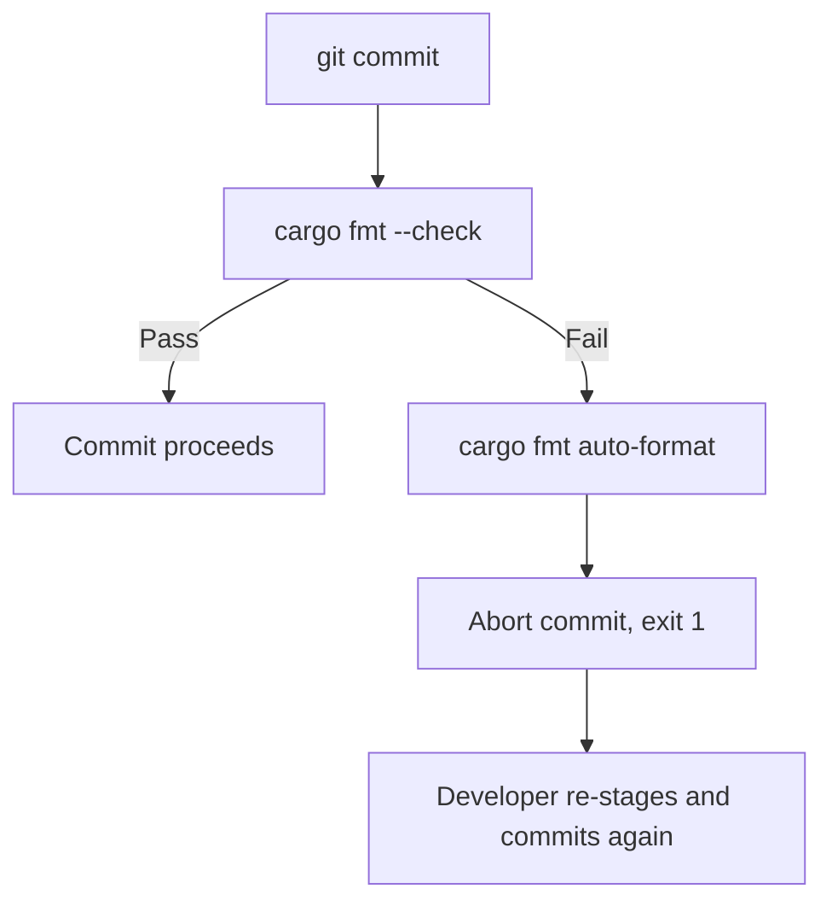

# Build System — hooks

# Build System — Git Hooks

## Purpose

This module provides Git hook scripts that enforce code quality checks before changes are committed. Currently, it contains a single `pre-commit` hook that ensures all Rust code conforms to the project's formatting standards.

## Installation

Configure Git to use the project's hooks directory:

```sh
git config core.hooksPath scripts/hooks
```

This setting is repository-local, so it won't affect your global Git configuration. Every developer working on the project should run this command after cloning.

## Pre-Commit Hook

**File:** `scripts/hooks/pre-commit`

### What It Does

The hook runs `cargo fmt --check` to verify that all staged Rust files are already formatted. It follows a two-phase approach:

1. **Check phase** — Runs `cargo fmt --check` silently (stderr suppressed via `2>/dev/null`). If formatting is correct, the hook exits successfully and the commit proceeds.

2. **Auto-format phase** — If the check fails, the hook runs `cargo fmt` to fix the formatting automatically, prints a message, and exits with code `1` to abort the commit. This forces the developer to review the changes, re-stage the formatted files, and commit again.

### Why It Aborts Instead of Committing

The hook intentionally rejects the commit after auto-formatting rather than silently committing the reformatted code. This ensures the developer reviews what `cargo fmt` changed and explicitly stages those changes, preventing unexpected diffs from entering the repository.

### Execution Flow



### Requirements

- **Rust toolchain** with `cargo fmt` available in `PATH`.
- The `rustfmt` component must be installed (`rustup component add rustfmt`).

### Bypass

To skip the hook in exceptional situations (e.g., WIP commits), use:

```sh
git commit --no-verify
```

Use this sparingly — CI should still catch formatting issues.