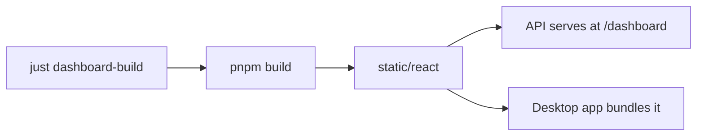

# Build System — justfile

# Build System — justfile

The `justfile` is the central command hub for LibreFang development. It wraps Cargo and custom xtask commands behind a consistent, human-readable interface using [`just`](https://github.com/casey/just), a modern alternative to Make.

## Overview

Rather than requiring developers to remember complex `cargo` invocations or locate custom scripts, the justfile provides named recipes for every common development task. It serves as both documentation ("what can I do?") and automation ("run it").

The justfile coordinates across multiple build targets:

- **Rust workspace**: Core libraries and CLI
- **Web assets**: React dashboard served by the API
- **Desktop app**: Tauri-based application
- **SDKs**: npm, PyPI, and crates.io publishing

## Quick Reference

```bash
just                    # List all available recipes
just build              # Build all workspace libraries
just test               # Run all tests
just lint               # Run clippy with strict warnings
just fmt                # Format code
just ci                 # Run local CI (build + test + lint)
```

## Prerequisites

Before using the justfile, install the required tools:

```bash
# Required
cargo install just

# For desktop development
cargo install tauri-cli

# For dashboard development
pnpm install
```

The justfile sets Windows shell to `cmd /c` for cross-platform compatibility.

## Core Development Commands

### Build and Test

| Recipe | Description |
|--------|-------------|
| `just build` | Compile all workspace libraries in debug mode |
| `just test` | Run all workspace tests |
| `just check` | Type-check without compiling (faster iteration) |
| `just clean` | Remove build artifacts |

### Code Quality

| Recipe | Description |
|--------|-------------|
| `just fmt` | Format all Rust code with `cargo fmt` |
| `just fmt-check` | Verify formatting without modifying files |
| `just lint` | Run clippy with `-D warnings` (fails on any warning) |
| `just check` | Type-check the workspace |

### Documentation

| Recipe | Description |
|--------|-------------|
| `just doc` | Build and open workspace documentation in browser |
| `just api-docs` | Generate API documentation from OpenAPI spec |
| `just check-links` | Validate links in documentation |

## Web Development

The web stack consists of a React dashboard served statically by the API. The dashboard must be built before any command that needs it.

### Dashboard Commands

| Recipe | Description |
|--------|-------------|
| `just dashboard-build` | Build React dashboard assets to `crates/librefang-api/static/react` |
| `just dash` | Start dashboard in development mode with hot reload |
| `just build-web` | Build all frontend targets (dashboard, web, docs) |



### Development Workflow

```bash
# Terminal 1: Start API
cargo run -p librefang-api

# Terminal 2: Start dashboard with hot reload
just dash
```

The dashboard dev server proxies API requests to `localhost:4545`.

## Desktop Application (Tauri)

Builds a native desktop application that bundles the dashboard.

| Recipe | Description |
|--------|-------------|
| `just desktop-build` | Build production desktop executable |
| `just desktop-dev` | Run desktop app in development mode |

### Dependency Chain

```
desktop-build / desktop-dev
    └── dashboard-build
            └── pnpm build
```

The desktop recipes automatically build dashboard assets first because the Tauri app embeds them.

## Installation

### CLI Installation

Install the release build of the CLI to `~/.librefang/bin`:

```bash
# Unix/macOS
just install

# Windows
just install
```

The `install` recipe on Unix uses the `release-local` Cargo profile and copies the binary to the user-local bin directory.

### Full Installation

Includes CLI binary plus a static copy of the dashboard:

```bash
just install-full
```

This installs:
- Binary to `~/.librefang/bin/librefang`
- Dashboard to `~/.librefang/dashboard`
- Version file to `~/.librefang/dashboard/.version`

## Extended Tasks (xtask)

Most recipes delegate to `cargo xtask`, which runs custom tasks defined in a dedicated xtask crate. This pattern allows complex build logic in Rust while remaining accessible via simple commands.

### Release Management

| Recipe | Description |
|--------|-------------|
| `just release` | Create and publish a release |
| `just changelog` | Generate CHANGELOG from merged PRs |
| `just sync-versions` | Synchronize crate versions across workspace |
| `just dist` | Build release binaries for multiple platforms |
| `just docker` | Build and push Docker image |

### SDK Publishing

| Recipe | Description |
|--------|-------------|
| `just publish-sdks` | Publish all SDKs to npm, PyPI, and crates.io |
| `just publish-npm-binaries` | Publish CLI binaries to npm |
| `just publish-pypi-binaries` | Publish CLI wheels to PyPI |

### Development Helpers

| Recipe | Description |
|--------|-------------|
| `just setup` | Set up local development environment |
| `just doctor` | Diagnose development environment issues |
| `just db` | Database management (info, backup, reset) |
| `just integration-test` | Run live integration tests |
| `just coverage` | Generate test coverage report |
| `just bench` | Run criterion benchmarks |
| `just codegen` | Run code generation (OpenAPI spec, etc.) |

### Maintenance

| Recipe | Description |
|--------|-------------|
| `just deps` | Audit dependencies for vulnerabilities |
| `just license-check` | Check dependency licenses |
| `just update-deps` | Update Rust and web dependencies |
| `just clean-all` | Clean all build artifacts and caches |
| `just validate-config` | Validate config.toml |
| `just loc` | Code statistics (lines, dependency graph) |

## Development Workflows

### Local CI Simulation

```bash
just ci
```

This runs the same checks as the CI pipeline:
- Build all targets
- Run all tests
- Run clippy with strict warnings
- Web linting

### Pre-commit Checklist

```bash
just pre-commit
```

Runs formatting, linting, and tests before committing:

```
cargo fmt → cargo clippy → cargo test
```

### Migration Workflow

```bash
just migrate <framework>
```

Import agents from other agent frameworks into LibreFang.

## Architecture

The justfile follows a layered architecture:

```
┌─────────────────────────────────────┐
│           justfile                  │  ← User interface
├─────────────────────────────────────┤
│         cargo xtask                 │  ← Custom build tasks
├───────────┬───────────┬────────────┤
│  cargo    │  pnpm     │  tauri     │  ← Build tools
├───────────┴───────────┴────────────┤
│   Rust workspace   │  Web assets  │  ← Build targets
└─────────────────────┴──────────────┘
```

### Key Design Decisions

1. **Dashboard-first dependencies**: Commands that need web assets always build them first, ensuring consistency across targets.

2. **Platform-specific recipes**: The `[unix]` and `[windows]` attributes handle path and shell differences without complex conditionals in recipes.

3. **Pass-through arguments**: Recipes like `build-web *ARGS` accept arbitrary arguments, forwarding them to the underlying command for flexibility.

4. **Composite tasks via xtask**: Complex operations live in the xtask crate rather than cluttering the justfile, keeping it readable.

## Common Tasks

### Full Development Setup

```bash
just setup              # Install all dependencies
just build              # Verify build works
just pre-commit         # Run pre-commit checks
```

### Release Process

```bash
just sync-versions      # Ensure versions are consistent
just changelog          # Generate changelog
just release            # Create release
just publish-sdks       # Publish SDKs
just docker             # Build and push image
```

### Investigating Issues

```bash
just doctor             # Check environment setup
just lint               # Run linter to catch issues
just coverage           # Check test coverage
just check-links        # Validate documentation links
```