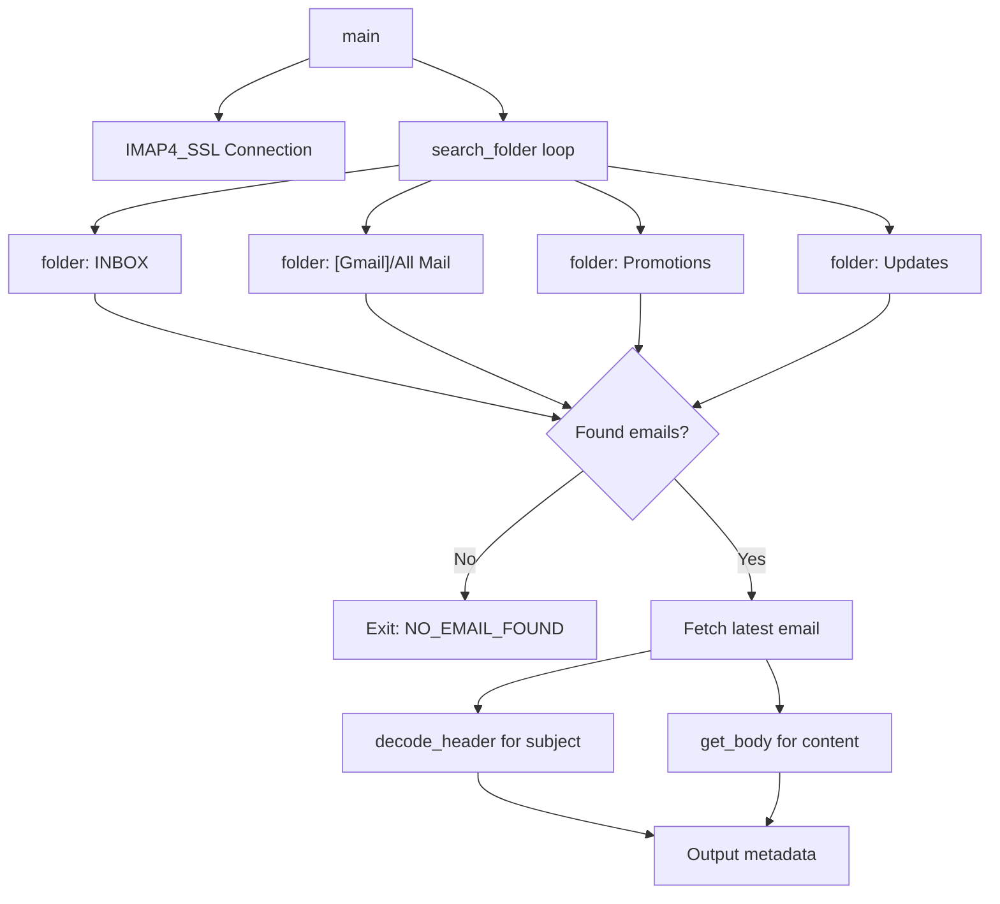

# Build System — scripts

# Build System — Email Reader (`scripts/read_email.py`)

Retrieves the most recent email from a specified sender via IMAP, searching across multiple email folders with graceful fallback handling for different mailbox types.

## Overview

This script connects to an IMAP mail server, searches for emails from a given sender across standard folders, and outputs the latest matching email's metadata and body. It handles encoding edge cases, prefers plain text over HTML content, and works with both Gmail and standard IMAP servers.

**Primary use case:** Automated build or CI systems that receive notifications via email and need programmatic access to message content.

## Environment Configuration

The script requires no command-line configuration beyond an optional sender argument. All authentication uses environment variables:

| Variable | Required | Default | Description |
|----------|----------|---------|-------------|
| `EMAIL_USERNAME` | Yes | — | IMAP login username |
| `EMAIL_PASSWORD` | Yes | — | IMAP login password |
| `IMAP_SERVER` | No | `imap.gmail.com` | IMAP server hostname |
| `IMAP_PORT` | No | `993` | IMAP server port |

Example usage:

```bash
export EMAIL_USERNAME="build-bot@example.com"
export EMAIL_PASSWORD="app-specific-password"
export IMAP_SERVER="imap.gmail.com"

python scripts/read_email.py "noreply@github.com"
```

## Architecture



## Key Components

### `decode_str(s, enc=None)`

Decodes a byte string to a Unicode string with safe fallback handling.

- Accepts both `bytes` and `str` inputs
- Defaults to UTF-8 when no encoding specified
- Silently replaces invalid characters rather than raising exceptions

### `get_body(msg)`

Extracts human-readable text content from an email message.

**Content preference order:**
1. Plain text (`text/plain`) parts without attachments
2. HTML content (`text/html`) — stripped of tags if no plain text found

The function walks through multipart messages recursively and returns the first viable content option.

### `search_folder(mail, folder, sender)`

Searches a single IMAP folder for messages matching the sender filter.

**Returns:** List of message IDs (oldest first, so `[-1]` gives the latest)

**Error handling:** Silently skips folders that fail to select or search, printing a warning. This prevents a single inaccessible folder from aborting the entire operation.

### `main()`

Orchestrates the email retrieval workflow:

1. Parses command-line arguments and environment variables
2. Establishes SSL-secured IMAP connection
3. Iterates through folder candidates until emails are found
4. Fetches the most recent matching email
5. Decodes subject header and extracts body content
6. Outputs structured results to stdout

## Folder Search Strategy

The script attempts folders in this order:

```
INBOX → "[Gmail]/All Mail" → "[Gmail]/Promotions" → "[Gmail]/Updates" → Promotions → Updates
```

**Gmail behavior:** Gmail uses bracketed folder names like `[Gmail]/All Mail`. The script includes quoted versions for compatibility. If Gmail throws errors on bracketed names (due to server configuration), the unbracketed `Promotions` and `Updates` entries catch the search.

**Non-Gmail servers:** Only `INBOX`, `Promotions`, and `Updates` are practical. Gmail-specific paths fail gracefully with warnings.

## Output Format

When emails are found, output is written to stdout in this format:

```
SUBJECT: <decoded subject line>
FROM: <sender address>
DATE: <date header>
---BODY---
<email body content, up to 4000 characters>
```

Exit codes:

| Code | Meaning |
|------|---------|
| `0` | Success (email found or `NO_EMAIL_FOUND` message printed) |
| `1` | Configuration error (missing credentials) or connection failure |

## Error Handling

| Error Condition | Behavior |
|-----------------|----------|
| Missing `EMAIL_USERNAME` | Error message to stderr, exit 1 |
| Missing `EMAIL_PASSWORD` | Error message to stderr, exit 1 |
| Invalid `IMAP_PORT` | Error message to stderr, exit 1 |
| IMAP connection failure | Error message to stderr, exit 1 |
| Folder search failure | Warning to stderr, continue to next folder |
| Message fetch failure | Error message to stderr, logout, exit 1 |
| No emails found | `NO_EMAIL_FOUND` message to stdout, exit 0 |

## Encoding Handling

Subject lines commonly use RFC 2047 encoded-word syntax (e.g., `=?UTF-8?B?...?=`). The `decode_header` function from the standard library handles this, returning a tuple of `(decoded_bytes, charset)`. The script then decodes the bytes using the reported charset with UTF-8 fallback.

Body content uses `errors='ignore'` for payload decoding, preventing malformed messages from crashing the script.

## Integration Notes

- **No outgoing calls** to other project modules — this is a standalone utility script
- **Exit codes** support shell scripting: check `$?` after invocation
- **Output parsing:** Downstream scripts can grep for `SUBJECT:`, `FROM:`, etc. to extract fields programmatically
- **Body truncation:** Bodies over 4000 characters are cut off to prevent unbounded output in CI environments