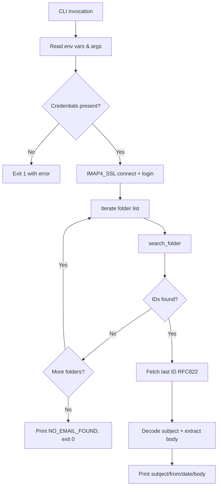

# Build System — scripts

# Build System — `scripts/read_email.py`

A standalone command-line utility that connects to an IMAP mailbox, searches across multiple folders for emails from a specified sender, and prints the latest matching email's headers and body to stdout. Designed for use in automated build/release pipelines that need to verify email notifications.

## Execution Flow



## Usage

```bash
# Required environment variables
export EMAIL_USERNAME="user@example.com"
export EMAIL_PASSWORD="app-specific-password"

# Optional overrides
export IMAP_SERVER="imap.gmail.com"   # default shown
export IMAP_PORT="993"                 # default shown

# Read latest email from a specific sender
python scripts/read_email.py "noreply@github.com"

# Read latest email across all senders
python scripts/read_email.py
```

### Positional Arguments

| Argument | Required | Description |
|----------|----------|-------------|
| `sender` | No | Email address to filter by. When omitted, matches all senders. |

### Exit Codes

| Code | Meaning |
|------|---------|
| `0` | Success (email found and printed, or no email found) |
| `1` | Fatal error (missing credentials, IMAP login failure, fetch failure) |

## Environment Variables

| Variable | Required | Default | Description |
|----------|----------|---------|-------------|
| `EMAIL_USERNAME` | Yes | — | IMAP login username |
| `EMAIL_PASSWORD` | Yes | — | IMAP login password or app-specific password |
| `IMAP_SERVER` | No | `imap.gmail.com` | IMAP server hostname |
| `IMAP_PORT` | No | `993` | IMAP server port (must be an integer) |

## Output Format

The script writes structured, line-delimited output to stdout, making it straightforward to parse in shell pipelines:

```
Found 3 email(s) in INBOX
SUBJECT: Your build succeeded
FROM: CI <ci@example.com>
DATE: Mon, 12 May 2025 10:30:00 -0400
---BODY---
Plain text content of the email...
```

When no matching email exists:

```
NO_EMAIL_FOUND (searched: INBOX, All Mail, Promotions, Updates)
```

The body is truncated to 4000 characters. Diagnostic warnings and errors go to stderr, so stdout remains clean for programmatic consumption.

## Internal Functions

### `decode_str(s, enc=None)`

Decodes a byte string or returns a plain string as-is. Used primarily for decoding email headers that may be encoded in various character sets.

- **Parameters**: `s` — bytes or str, `enc` — encoding name (defaults to `"utf-8"`)
- **Returns**: `str`, never `None` (empty string fallback)

### `get_body(msg)`

Extracts the text content from an `email.message.Message` object with a two-pass strategy:

1. **First pass**: Looks for a `text/plain` part that is not an attachment.
2. **Second pass** (fallback): Looks for a `text/html` part, strips all HTML tags via regex, and collapses whitespace.

For non-multipart messages, decodes the single payload directly.

- **Parameters**: `msg` — an `email.message.Message` instance
- **Returns**: `str` — the extracted body text, or `""` if nothing could be extracted

### `search_folder(mail, folder, sender)`

Selects a single IMAP folder in readonly mode and searches for messages matching the given sender. If `sender` is an empty string, matches all messages.

- **Parameters**:
  - `mail` — an authenticated `imaplib.IMAP4_SSL` instance
  - `folder` — IMAP folder name (e.g., `"INBOX"`, `'"[Gmail]/All Mail"'`)
  - `sender` — email address string, or `""` for all
- **Returns**: `list[bytes]` — message IDs, empty list on failure
- **Error handling**: Catches all exceptions, prints a warning to stderr, and returns `[]` so the caller can continue to the next folder.

## Folder Search Strategy

Folders are searched in a fixed priority order. The script stops at the first folder containing matching emails:

1. `INBOX`
2. `[Gmail]/All Mail`
3. `[Gmail]/Promotions`
4. `[Gmail]/Updates`
5. `Promotions`
6. `Updates`

Gmail-specific folder names (entries 2–4) will fail gracefully on non-Gmail servers — `search_folder` catches the exception and returns an empty list, allowing the generic folder names (entries 5–6) to be tried next.

The script always fetches the **last** ID from the found set (`found_ids[-1]`), which corresponds to the most recent email in that folder matching the sender.

## Integration Notes

- **Standalone module**: This script has no imports from the rest of the codebase and no external dependencies beyond the Python standard library. It can be invoked independently.
- **Pipeline usage**: Suitable for CI/CD steps that need to validate email delivery. Pair with `grep` or `jq` to assert on subject or body content.
- **Gmail app passwords**: When using Gmail, the account must have 2-factor authentication enabled and an app-specific password generated. Standard account passwords will be rejected.
- **IMAP must be enabled**: The target mailbox must have IMAP access enabled in its settings.