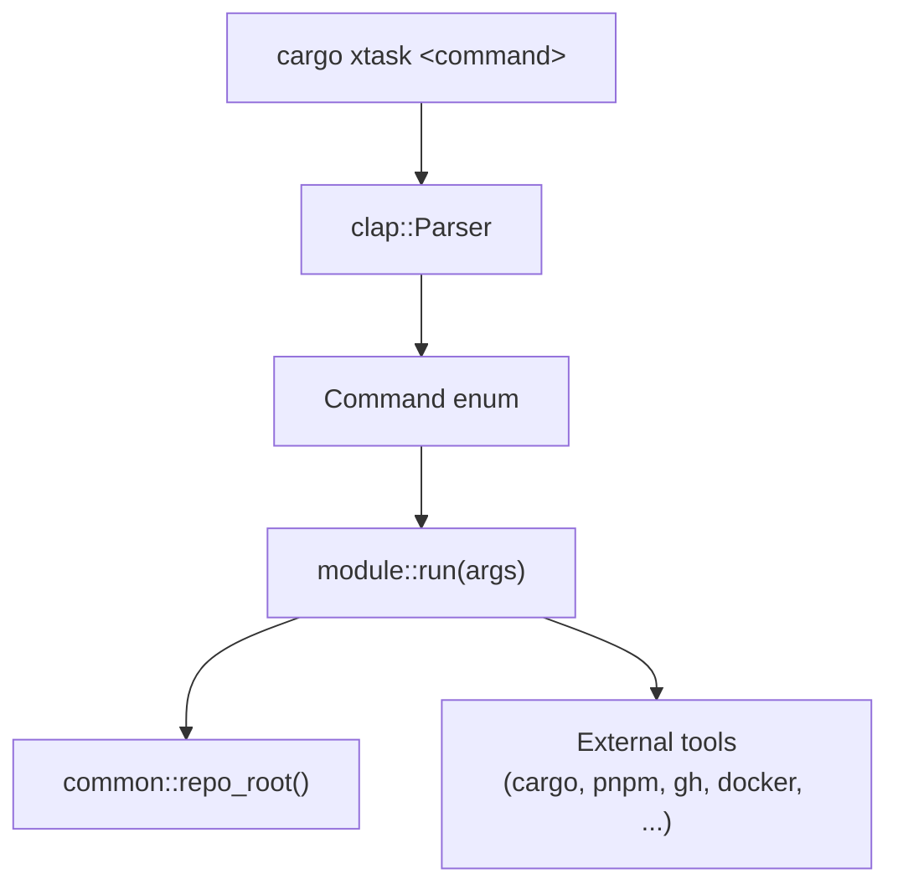

# Build System — src

# Build System — `xtask`

Workspace automation for LibreFang. Every development workflow—building, testing, releasing, publishing—is driven through `cargo xtask <command>`.

## Architecture

The xtask follows a flat module-per-task convention. Each module exports two things: a clap `Parser` struct for arguments, and a `pub fn run(args) -> Result<(), Box<dyn std::error::Error>>` entry point. `main.rs` wires them together as subcommands.



The `common` module provides a single function—`repo_root()`—that walks upward from the current directory until it finds a `Cargo.toml` containing `[workspace]`. Every task uses this to resolve paths.

## Command Reference

### Build & Release

| Command | Purpose |
|---|---|
| `build-web` | Build frontend assets (dashboard, web, docs) via pnpm |
| `dist` | Cross-compile release binaries for multiple platforms |
| `docker` | Build and optionally push a Docker image |
| `release` | Full release flow: changelog → sync versions → commit → tag → PR |
| `sync-versions` | Propagate the workspace version across Cargo.toml, SDKs, Tauri config, etc. |

### Testing & Quality

| Command | Purpose |
|---|---|
| `ci` | Run the full CI suite locally: build, test, clippy, web lint |
| `integration-test` | Spin up the daemon and exercise HTTP endpoints against it |
| `coverage` | Generate test coverage via `cargo llvm-cov` (HTML or lcov) |
| `bench` | Run criterion benchmarks with optional baseline comparison |
| `fmt` | Check or fix formatting for Rust (rustfmt) and web (prettier) |
| `pre-commit` | One-shot check: fmt + clippy + test |
| `check-links` | Validate links in Markdown docs (lychee or built-in fallback) |

### Development

| Command | Purpose |
|---|---|
| `dev` | Start the daemon with hot-reload, dashboard dev server, and interactive hotkeys |
| `setup` | Bootstrap a local development environment |
| `doctor` | Diagnose missing tools, stale ports, config issues, API key status |
| `db` | Inspect, back up, or reset the local SQLite database |
| `clean-all` | Remove all build artifacts (Rust + frontend) with size reporting |

### Documentation & Metadata

| Command | Purpose |
|---|---|
| `api-docs` | Generate a standalone Swagger UI page from the OpenAPI spec |
| `changelog` | Produce a classified `CHANGELOG.md` entry from merged GitHub PRs |
| `contributors` | Generate contributors SVG and star-history SVG via the GitHub API |
| `loc` | Lines-of-code statistics and workspace dependency graph |
| `codegen` | Regenerate derived files (OpenAPI spec) |

### Publishing

| Command | Purpose |
|---|---|
| `publish-sdks` | Publish JS, Python, and Rust SDKs to their respective registries |
| `publish-npm-binaries` | Build and publish platform-specific CLI binaries to npm |
| `publish-pypi-binaries` | Build and publish platform-specific wheels to PyPI |

### Dependency Management

| Command | Purpose |
|---|---|
| `deps` | Audit for vulnerabilities (`cargo audit`, `pnpm audit`) and check for updates |
| `update-deps` | Update Rust and web dependencies |
| `license-check` | Verify dependency licenses against a deny list |

### Other

| Command | Purpose |
|---|---|
| `migrate` | Migrate agent configurations from OpenClaw or OpenFang |
| `validate-config` | Validate a `config.toml` file |

## Adding a New Task

1. Create `src/my_task.rs` with an `Args` struct and a `run` function:

```rust
use crate::common::repo_root;
use clap::Parser;

#[derive(Parser, Debug)]
pub struct MyTaskArgs {
    #[arg(long)]
    pub flag: bool,
}

pub fn run(args: MyTaskArgs) -> Result<(), Box<dyn std::error::Error>> {
    let root = repo_root();
    // ...
    Ok(())
}
```

2. Add `mod my_task;` to `main.rs`.

3. Add a variant to the `Command` enum with the `run` dispatch in the `match` block.

## Key Patterns

### Error Handling

All tasks return `Result<(), Box<dyn std::error::Error>>`. On failure, `main` prints the error to stderr and exits with code 1. Tasks that run multiple sub-steps (like `ci`, `deps`) count failures and report a summary at the end.

### External Tool Detection

Several tasks check for external tools before use. Some auto-install missing tools (`coverage` installs `cargo-llvm-cov`, `dev` installs `cargo-watch`, `deps` installs `cargo-audit` and `cargo-outdated`). The helper `has_command` or inline `Command::new(...).arg("--version")` checks are used throughout.

### Conditional Execution

Tasks like `build-web`, `ci`, and `fmt` detect the presence of `package.json` or tool availability to skip irrelevant steps rather than failing. This keeps the commands portable across different developer environments.

### Workspace Version

Several tasks (`dist`, `docker`, `release`, `sync_versions`) read the version from the workspace `Cargo.toml` using `toml_edit`:

```rust
fn read_workspace_version(root: &Path) -> String {
    let content = fs::read_to_string(root.join("Cargo.toml")).unwrap_or_default();
    let doc = content.parse::<toml_edit::DocumentMut>().ok();
    doc.and_then(|d| {
        d["workspace"]["package"]["version"].as_str().map(String::from)
    }).unwrap_or_else(|| "unknown".into())
}
```

### Cross-Platform Builds

`dist` supports five default targets (Linux x86_64/ARM64, macOS x86_64/ARM64, Windows x86_64) and can use `cross` for cross-compilation. Archives are `.tar.gz` on Unix and `.zip` on Windows.

## Notable Task Details

### `dev` — Interactive Development Environment

The most complex task. It:

1. Kills stale processes on relevant ports (4545, 5173–5178) and removes stale `daemon.json`
2. Builds `librefang-cli` and runs `librefang init --quick` if no config exists
3. Starts the dashboard dev server (`pnpm dev`) in the background
4. Launches `cargo watch` scoped to `crates/` (excluding the dashboard's own directory) for rebuild-and-restart cycles
5. Spawns background threads for:
   - **Auto-pull**: fetches and rebases `origin/main` every 30 seconds
   - **Hotkey listener**: reads single keypresses (`r` rebase, `o` open dashboard, `l` logs, `s` status, `c` clear, `?` help)

### `integration-test` — Live Endpoint Testing

Starts the daemon as a subprocess, polls `/api/health` until responsive, then exercises endpoints (`/api/agents`, `/api/budget`, `/api/network/status`) and optionally an LLM round-trip. Uses `curl` subprocess calls for HTTP requests and cleans up the daemon on exit.

### `changelog` — PR Classification

Fetches PR data via `gh api`, classifies titles by conventional-commit prefix (`feat` → Added, `fix` → Fixed, etc.), and inserts the result into `CHANGELOG.md` at the correct position. Replaces an existing section for the same version if present.

### `contributors` — SVG Generation

Downloads contributor avatars from GitHub, encodes them as base64 data URIs (to avoid CSP issues in rendered SVGs), and produces a grid layout. The star-history chart queries `stargazers` with the `star+json` accept header for timestamps and renders a polyline chart.