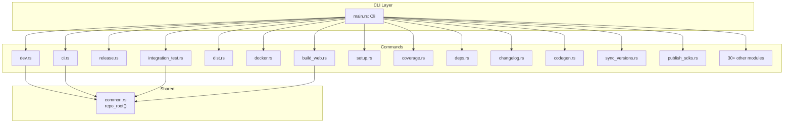

# Build System — src

# Build System — `xtask`

The `xtask` crate provides build automation and developer tooling for the LibreFang workspace using the `cargo xtask` pattern. Rather than relying on external build tools or Makefiles, LibreFang defines all workspace automation tasks as Rust modules that run via `cargo xtask <command>`.

This approach offers several advantages: tasks are written in the same language as the project, they have full access to the workspace's type system, and they work identically across all platforms that Rust supports.

## Module Structure

```
xtask/
├── src/
│   ├── main.rs          # CLI entry point, command dispatch
│   ├── common.rs       # Shared utilities (repo_root)
│   ├── api_docs.rs     # OpenAPI → Swagger UI
│   ├── bench.rs        # Criterion benchmark runner
│   ├── build_web.rs    # pnpm frontend builds
│   ├── changelog.rs    # PR → changelog generator
│   ├── check_links.rs  # Link validation (lychee)
│   ├── ci.rs           # Local CI simulation
│   ├── clean_all.rs    # Build artifact cleanup
│   ├── codegen.rs      # OpenAPI spec generation
│   ├── contributors.rs # GitHub → SVG generators
│   ├── coverage.rs     # llvm-cov integration
│   ├── db.rs           # SQLite management
│   ├── deps.rs         # Security audits
│   ├── dev.rs          # Hot-reload dev environment
│   ├── dist.rs         # Cross-platform release builds
│   ├── docker.rs       # Container image builds
│   ├── doctor.rs       # Environment diagnostics
│   ├── fmt.rs          # Formatting checks (rustfmt, prettier)
│   ├── integration_test.rs  # Live API tests
│   ├── license_check.rs    # License compliance
│   ├── loc.rs          # Lines-of-code statistics
│   ├── migrate.rs      # Agent migration
│   ├── pre_commit.rs   # Pre-commit hook
│   ├── publish_npm_binaries.rs
│   ├── publish_pypi_binaries.rs
│   ├── publish_sdks.rs
│   ├── release.rs      # Full release pipeline
│   ├── setup.rs        # Initial environment setup
│   ├── sync_versions.rs # Multi-package version sync
│   └── update_deps.rs  # Dependency updates
└── Cargo.toml
```

## CLI Interface

All tasks are exposed as subcommands of `cargo xtask`. The top-level `Cli` struct uses `clap` to parse the command line, dispatching each `Command` variant to its corresponding module's `run` function:

```rust
enum Command {
    Release(release::ReleaseArgs),
    BuildWeb(build_web::BuildWebArgs),
    Ci(ci::CiArgs),
    // ... 30+ additional commands
}
```

Each submodule defines its own `Args` struct (deriving `Parser` and `Debug`) and exports a `run(Args) -> Result<(), Box<dyn Error>>` function. The main loop handles errors uniformly:

```rust
if let Err(e) = result {
    eprintln!("Error: {e}");
    std::process::exit(1);
}
```

## Key Components

### `common::repo_root`

Every task needs to resolve the workspace root. Rather than assuming `std::env::current_dir()`, `repo_root()` walks upward until it finds a `Cargo.toml` containing `[workspace]`. This makes the tasks work correctly regardless of the current working directory:

```rust
pub fn repo_root() -> PathBuf {
    let mut dir = std::env::current_dir().expect("cannot get cwd");
    loop {
        let cargo_toml = dir.join("Cargo.toml");
        if cargo_toml.exists() {
            let content = std::fs::read_to_string(&cargo_toml).unwrap_or_default();
            if content.contains("[workspace]") {
                return dir;
            }
        }
        if !dir.pop() {
            panic!("could not find workspace root");
        }
    }
}
```

All modules import and use this via `use crate::common::repo_root;`.

### Development Environment (`dev.rs`)

The `dev` command orchestrates a full local development setup:

1. **Kill stale processes** on ports 4545 (daemon) and 5173-5178 (dashboard)
2. **Build** `librefang-cli` in debug mode
3. **Auto-init** if no `config.toml` exists
4. **Start dashboard** dev server in background with hot reload
5. **Start daemon** on port 4545
6. **Enter watch loop** via `cargo-watch` on `crates/`

Two background threads provide developer convenience:

- **Auto-pull**: Every 30 seconds, fetches `origin/main` and rebases if new commits exist
- **Hotkey listener**: Raw terminal input provides shortcuts (`r`=rebase, `o`=open dashboard, `l`=logs, `s`=status, `c`=clear, `?`=help)

The watch loop rebuilds `librefang-cli` on every change to `crates/`, then kills and restarts the daemon with a carefully constructed shell script that handles the stop-start sequence atomically.

### Release Pipeline (`release.rs`)

The `release` command executes the full release workflow: generate changelog → sync versions → commit → tag → create GitHub PR. It computes the next version using Calendar Versioning (`YYYY.M.D.N` format) and validates the working tree is clean before proceeding.

### Web Builds (`build_web.rs`)

Builds React frontend assets by running `pnpm install --frozen-lockfile && pnpm run build` for each of three directories:

- `crates/librefang-api/dashboard` — React dashboard
- `web/` — main web frontend
- `docs/` — documentation site

Selective builds are possible via `--dashboard`, `--web`, and `--docs` flags.

### Integration Testing (`integration_test.rs`)

Starts a fresh daemon, waits for the health endpoint, and runs HTTP requests against it:

```
GET /api/health
GET /api/agents
GET /api/budget
GET /api/network/status
POST /api/agents/{id}/message  (if --skip-llm not set)
```

Verifies budget updates after LLM calls when an API key is provided.

### Changelog Generation (`changelog.rs`)

Parses git log between the latest stable tag and `HEAD`, extracts PR numbers from commit messages (via `#\d+` regex), fetches PR titles and authors via `gh pr view --json`, classifies by conventional commit prefix, and writes a formatted section to `CHANGELOG.md`.

### Contributors & Star History (`contributors.rs`)

Two SVG generators that fetch GitHub data via the `gh` CLI:

- **Contributors SVG**: Fetches the contributor list, downloads avatars via `curl`, embeds them as base64 data URIs (required because GitHub's CSP blocks external image loads in SVGs), and arranges them in a grid with links to profiles
- **Star History SVG**: Fetches stargazer timestamps, builds a cumulative daily series, and renders a dark-themed line chart with area fill

### Version Synchronization (`sync_versions.rs`)

Keeps version strings consistent across:

- `Cargo.toml` (workspace version)
- `sdks/rust/Cargo.toml`
- `sdks/js/package.json`
- `sdks/python/setup.py`
- Tauri configuration

Uses `toml_edit` for in-place modification of TOML files.

### Cross-Platform Distribution (`dist.rs`)

Builds release binaries for all supported targets using `cargo build --release --target <triple>`. Default targets:

```
x86_64-unknown-linux-gnu
aarch64-unknown-linux-gnu
x86_64-apple-darwin
aarch64-apple-darwin
x86_64-pc-windows-msvc
```

Uses `cross` for cross-compilation when `--cross` is set. Archives each build as `.tar.gz` (Unix) or `.zip` (Windows).

## Architecture



## External Tool Dependencies

The xtask system manages several external tools, installing them on demand when not found:

| Tool | Purpose | Auto-install |
|------|---------|--------------|
| `cargo-watch` | File watching in `dev` | Yes |
| `cargo-llvm-cov` | Coverage reports | Yes |
| `cargo-audit` | Security advisories | Yes |
| `cargo-outdated` | Update checking | Yes |
| `lychee` | Link checking | No (basic fallback available) |
| `cross` | Cross-compilation | No |
| `cargo-deny` | License checking | No (metadata fallback) |
| `gh` | GitHub API access | No |
| `pnpm` | Web builds | No |

## Common Patterns

### Error Handling

All `run()` functions return `Result<(), Box<dyn std::error::Error>>`. The main function exits with code 1 on any error, printing the error message to stderr.

### Path Resolution

Every task begins by calling `repo_root()` to get an absolute path to the workspace root. All file operations are relative to this root, ensuring consistent behavior regardless of where `cargo xtask` is invoked from.

### Command Execution

Shell commands are executed via `std::process::Command`. Tasks check `status.success()` and return errors on failure rather than panicking.

### File Discovery

Tasks search for files in multiple candidate locations (e.g., `find_openapi_spec` checks `openapi.json`, `crates/librefang-api/openapi.json`, and `docs/openapi.json`) and use the first one that exists.