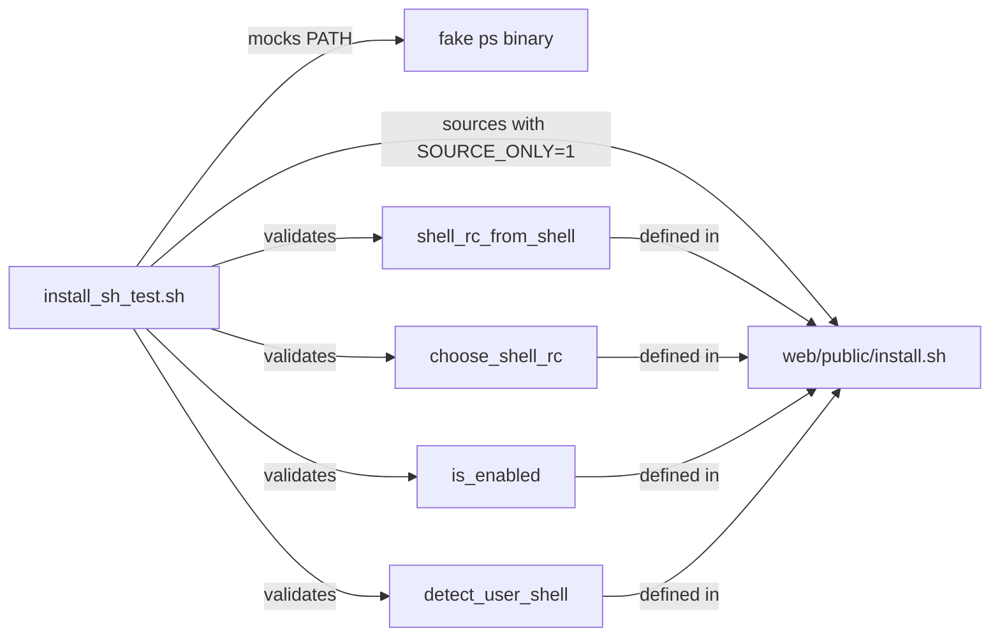

# Build System — tests

# Build System — `install.sh` Tests

## Overview

`scripts/tests/install_sh_test.sh` is a POSIX-compliant shell test harness that validates logic in `web/public/install.sh` — the curl-pipeable installer script. It exercises four exported functions from the installer in complete isolation by sourcing the installer with `LIBREFANG_INSTALLER_SOURCE_ONLY=1` (which loads functions but skips execution) and pointing `$HOME` at a temporary directory.

## When to Run

Execute from the repository root:

```sh
sh scripts/tests/install_sh_test.sh
```

No external test framework is required. The script uses only POSIX `sh` builtins and standard utilities (`mktemp`, `ps`).

## Test Isolation Strategy

The script creates a throwaway home directory and rebinds `$HOME` before sourcing the installer:

```sh
TMP_HOME=$(mktemp -d)
HOME="$TMP_HOME" LIBREFANG_INSTALLER_SOURCE_ONLY=1 . "$INSTALLER_PATH"
```

This ensures:
- No real user config files are read or mutated.
- The installer's top-level code is suppressed (`LIBREFANG_INSTALLER_SOURCE_ONLY`), leaving only function definitions available for testing.
- Temporary files are rooted under `$TMP_HOME`.

## Test Suites

### 1. `shell_rc_from_shell` — Shell-to-RC-Path Mapping

Verifies that the function returns the correct config file path for each supported shell:

| Input | Expected path |
|---|---|
| `zsh` | `$HOME/.zshrc` |
| `/bin/bash` | `$HOME/.bashrc` |
| `fish` | `$HOME/.config/fish/config.fish` |

### 2. `choose_shell_rc` — Fallback Priority

Tests the fallback order when no explicit shell is specified. The function should prefer `.bashrc`, fall back to `.zshrc`, and finally to the fish config:

1. All three files exist → selects `.bashrc`
2. `.bashrc` removed → selects `.zshrc`
3. `.zshrc` also removed → selects `config.fish`

The test creates all three files upfront, then removes them one at a time to validate each step.

### 3. `is_enabled` — Auto-Start Flag Parsing

Validates that the function correctly classifies truthy and falsy string values used for the `LIBREFANG_AUTO_START` environment variable.

**Accepted (truthy):** `1`, `true`, `TRUE`, `yes`, `YES`, `on`, `ON`

**Rejected (falsy):** `0`, `false`, `FALSE`, `no`, `NO`, `off`, `OFF`, `""` (empty string)

### 4. `detect_user_shell` — Parent Shell Detection Under `curl|sh`

This is the most complex test. It validates a regression scenario where the installer runs as `curl … | sh`, meaning the immediate parent process is `sh`, not the user's actual shell. The function must walk up the process tree to find the real shell.

**Mock setup:** A fake `ps` binary is written to a temporary directory and prepended to `$PATH`. The mock uses a state file to simulate two `ps -o comm=` calls:

| Call | Returns | Simulates |
|---|---|---|
| 1st `comm` query | `sh` | The curl\|sh parent process |
| `ppid` query | `222` | The parent PID of `sh` |
| 2nd `comm` query | `zsh` | The user's actual shell |

The test runs the detection in a subprocess with the mocked `$PATH`:

```sh
DETECTED=$(HOME="$TMP_HOME" PATH="$FAKE_BIN:$PATH" SHELL=/bin/bash \
  FAKE_PS_STATE="$FAKE_PS_STATE" INSTALLER_PATH="$INSTALLER_PATH" \
  LIBREFANG_INSTALLER_SOURCE_ONLY=1 \
  sh -c '. "$INSTALLER_PATH"; detect_user_shell')
```

Asserts that the result is `zsh` — proving the function walked past the intermediate `sh` process.

## Relationship to the Codebase



The test file depends on exactly one production file: `web/public/install.sh`. It does not call any external services, network endpoints, or other test utilities. This makes it suitable for running in CI without side effects.

## Adding New Tests

Follow the existing pattern:

1. Use the `fail` / `pass` helpers for assertions and reporting.
2. Keep all file operations inside `$TMP_HOME` — do not touch the real `$HOME`.
3. For functions that shell out to external commands, mock them via a temp directory prepended to `$PATH`, as demonstrated in the `detect_user_shell` test.
4. Exit immediately on failure (`set -e` is active, and `fail` calls `exit 1`).