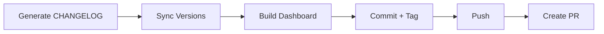
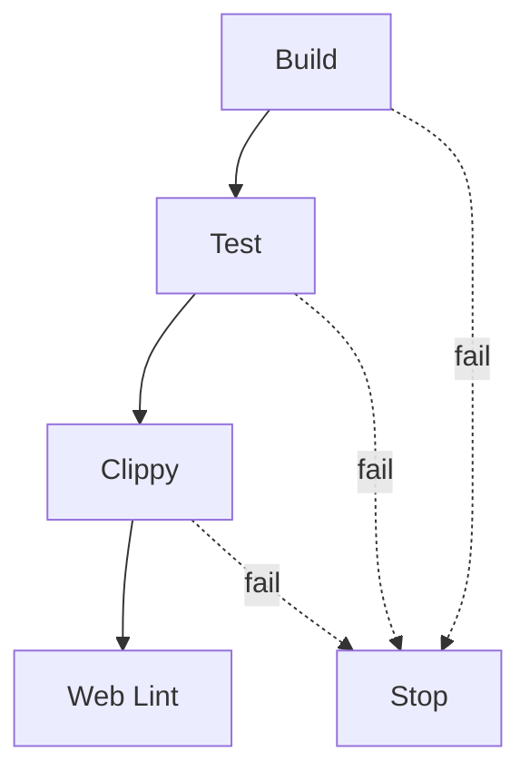

# Build System — xtask

# xtask — LibreFang Build Automation

Cross-platform build automation for the LibreFang workspace. This crate replaces scattered shell scripts and manual workflows with a single, consistent Rust CLI built with [clap](https://clap.rs/).

## Purpose

LibreFang is a multi-component project spanning:

- **Core Rust crates** (workspace with multiple packages)
- **JavaScript/TypeScript frontends** (dashboard, web app, docs)
- **SDKs** (JavaScript, Python, Rust)
- **Desktop integration** (Tauri configuration)
- **Deployment artifacts** (Docker, distribution binaries)

Managing builds, releases, and development workflows across these components manually is error-prone. The `xtask` crate centralizes all build automation in one place:

- **Consistent interface** — one tool for all operations
- **Fail-fast CI** — runs the same checks locally that CI runs remotely
- **Version synchronization** — keeps CalVer in sync across all manifests
- **Safe defaults** — interactive prompts with `--no-confirm` for CI
- **Comprehensive coverage** — from development to deployment

## Architecture

The crate follows the standard Rust `xtask` pattern: a separate Cargo package that provides build-time utilities invoked via `cargo xtask <command>`.

```
xtask/
├── Cargo.toml          # Dependencies and package metadata
├── README.md           # Command reference and usage examples
└── src/
    └── main.rs         # All commands and logic (embedded in crate)
```

### Command Organization

Commands fall into several categories:

| Category | Commands |
|----------|----------|
| **Release** | `release`, `changelog`, `sync-versions`, `publish-sdks` |
| **Build** | `build-web`, `dist`, `docker`, `codegen` |
| **Quality** | `ci`, `fmt`, `clippy`, `license-check`, `check-links` |
| **Testing** | `integration-test`, `coverage`, `bench` |
| **Maintenance** | `deps`, `update-deps`, `clean-all`, `setup` |
| **Development** | `dev`, `doctor`, `db`, `validate-config`, `api-docs` |
| **Migration** | `migrate` |

### Key Dependencies

```toml
clap = { version = "4", features = ["derive", "env"] }  # CLI argument parsing
serde = { version = "1", features = ["derive"] }        # Serialization
toml_edit = "0.25"                                       # TOML manipulation
regex = "1"                                              # Pattern matching
chrono = "0.4"                                           # Date/time handling
base64 = { workspace = true }                           # Encoding
librefang-migrate = { path = "../crates/librefang-migrate" }  # Migration logic
```

## Core Commands

### Release Flow (`release`)

The `release` command orchestrates the complete release process:

```bash
cargo xtask release --version 2026.3.2214
```

**Process flow:**

1. Generate CHANGELOG from merged PRs since last tag
2. Sync version strings across all manifests
3. Build the dashboard
4. Commit changes
5. Create git tag
6. Push to remote
7. Create GitHub PR with release notes



**Prerequisites:**

- Clean working tree (no uncommitted changes)
- On `main` branch
- `gh` CLI authenticated for PR creation

**Options:**

| Flag | Description |
|------|-------------|
| `--version` | Explicit version (CalVer format: `YYYY.M.D.N`) |
| `--no-confirm` | Skip interactive prompts (for CI) |
| `--no-push` | Skip push and PR creation |
| `--no-article` | Skip Dev.to article generation |

### Version Synchronization (`sync-versions`)

Ensures consistent version strings across all package manifests:

```bash
cargo xtask sync-versions 2026.3.2214
```

**Files updated:**

| File | Format Notes |
|------|--------------|
| `Cargo.toml` (workspace) | Standard Cargo version |
| `sdk/javascript/package.json` | npm semver |
| `sdk/python/setup.py` | PEP 440 (hyphens to dots: `1.0.0-beta1` → `1.0.0b1`) |
| `sdk/rust/Cargo.toml` | Standard Cargo version |
| `sdk/rust/README.md` | Badge/version display |
| `packages/whatsapp-gateway/package.json` | npm semver |
| `crates/librefang-desktop/tauri.conf.json` | MSI-compatible encoding |

### Changelog Generation (`changelog`)

Creates a CHANGELOG.md entry from GitHub PRs:

```bash
cargo xtask changelog 2026.3.22 v2026.3.2114
```

**PR Classification by Commit Prefix:**

| Prefix | Section |
|--------|---------|
| `feat:` | Added |
| `fix:` | Fixed |
| `refactor:` | Changed |
| `perf:` | Performance |
| `docs:` | Documentation |
| `chore:`, `ci:`, `build:`, `test:` | Maintenance |

Requires the `gh` CLI for GitHub API access.

## Development Workflows

### Local CI (`ci`)

Run the same quality checks locally that CI runs:

```bash
cargo xtask ci --release
```

**Execution order (fail-fast):**

1. `cargo build --workspace --lib`
2. `cargo test --workspace`
3. `cargo clippy --workspace --all-targets -- -D warnings`
4. `pnpm run lint` in `web/` (if exists)



**Options:**

| Flag | Description |
|------|-------------|
| `--no-test` | Skip unit tests |
| `--no-web` | Skip web lint |
| `--release` | Use release profile |

### Development Server (`dev`)

Start the daemon and dashboard together:

```bash
cargo xtask dev --port 5000 --release
```

This builds the project, starts the LibreFang daemon, and launches the React dashboard. All processes are terminated together on Ctrl+C.

### Environment Diagnostics (`doctor`)

Verify your development environment is correctly configured:

```bash
cargo xtask doctor --port 5000
```

**Checks performed:**

- Rust toolchain availability
- Required binaries (`cargo`, `rustup`, `pnpm`, `gh`, `docker`, `just`)
- Port availability
- Daemon health and responsiveness
- Configuration file validity
- API key presence (if configured)
- Workspace state (clean worktree, correct branch)

### Pre-Commit Checks (`pre-commit`)

Run before committing to catch issues early:

```bash
cargo xtask pre-commit --fix
```

**Steps:**

1. Format check (Rust fmt + Prettier)
2. Clippy linting
3. Unit tests (can skip with `--no-test`)

## Build Commands

### Web Frontend Builds (`build-web`)

Build one or more frontend targets:

```bash
cargo xtask build-web --dashboard --web --docs
```

**Targets:**

| Target | Directory | Framework |
|--------|-----------|-----------|
| `dashboard` | `crates/librefang-api/dashboard/` | React + Vite |
| `web` | `web/` | React + Vite |
| `docs` | `docs/` | Next.js |

Each target is skipped if it doesn't contain a `package.json`.

### Distribution Binaries (`dist`)

Cross-compile release binaries:

```bash
cargo xtask dist --cross --output release-artifacts
```

**Default targets:**

| Platform | Architectures |
|----------|---------------|
| Linux | x86_64, aarch64 |
| macOS | x86_64, aarch64 |
| Windows | x86_64 |

**Output format:**

- Linux/macOS: `.tar.gz`
- Windows: `.zip`

Uses [`cross`](https://github.com/cross-rs/cross) for cross-compilation when `--cross` is specified.

### Docker Image (`docker`)

Build and push the container image:

```bash
cargo xtask docker --push --latest --tag 2026.3.2214
```

**Image details:**

- Registry: `ghcr.io/librefang/librefang`
- Dockerfile: `deploy/Dockerfile`
- Multi-platform support with `--platform`

## SDK Publishing (`publish-sdks`)

Publish SDKs to their respective registries:

```bash
cargo xtask publish-sdks --dry-run
cargo xtask publish-sdks --js --python --rust
```

**SDKs:**

| SDK | Registry | Tool |
|-----|----------|------|
| JavaScript | npm | `npm` |
| Python | PyPI | `twine` |
| Rust | crates.io | `cargo` |

## Database Management (`db`)

Inspect and manage LibreFang databases:

```bash
cargo xtask db --info
cargo xtask db --backup ./backup
cargo xtask db --reset --data-dir ~/.librefang
```

**Operations:**

- `info` — Display database paths and sizes
- `backup` — Copy database files to backup directory
- `reset` — Delete all databases (requires daemon to be stopped)

## Integration Testing (`integration-test`)

Run live API integration tests:

```bash
cargo xtask integration-test --api-key $GROQ_API_KEY
```

**Test sequence:**

1. Start the daemon on specified port
2. `GET /api/health` — Health check
3. `GET /api/agents` — List agents
4. `GET /api/budget` — Check budget
5. `GET /api/network/status` — Network status
6. `POST /api/agents/{id}/message` — Send message (requires LLM)
7. Verify budget decreased after LLM call

**Defaults:**

- Binary: `target/release/librefang`
- Port: derived from config

## Code Quality

### Dependency Auditing (`deps`)

Check for security vulnerabilities and outdated packages:

```bash
cargo xtask deps --audit --outdated --web
```

**Tools used:**

| Check | Tool | Auto-install |
|-------|------|--------------|
| Rust audit | `cargo-audit` | Yes |
| Rust outdated | `cargo-outdated` | Yes |
| Web audit | `pnpm audit` | No |

### Test Coverage (`coverage`)

Generate coverage reports:

```bash
cargo xtask coverage --open --output ./cov-report
```

Requires `cargo-llvm-cov`, which is auto-installed if missing.

### License Compliance (`license-check`)

Verify dependencies use acceptable licenses:

```bash
cargo xtask license-check --deny "GPL-3.0,AGPL-3.0"
```

Uses `cargo-deny` if installed, falls back to `cargo metadata`.

### Link Checking (`check-links`)

Validate documentation links:

```bash
cargo xtask check-links --path docs --exclude "example.com"
```

Uses `lychee` if installed, otherwise falls back to a basic relative-link checker.

## Configuration Validation (`validate-config`)

Verify `~/.librefang/config.toml`:

```bash
cargo xtask validate-config --config ./my-config.toml --show
```

Validates:

- TOML syntax
- Known fields present
- Values within expected ranges

## Migration (`migrate`)

Import agents from other frameworks:

```bash
cargo xtask migrate --source openfang --source-dir ./import --dry-run
```

**Supported sources:**

- `openclaw`
- `openfang`

Uses the `librefang-migrate` crate internally for conversion logic.

## Common Workflows

### Full Release (Manual)

```bash
# 1. Ensure clean state
cargo xtask doctor
git status  # should be clean

# 2. Run CI locally
cargo xtask ci --release

# 3. Run integration tests
cargo xtask integration-test --skip-llm

# 4. Perform release
cargo xtask release --version 2026.3.2214 --no-confirm
```

### New Contributor Setup

```bash
# Install all dependencies
cargo xtask setup

# Verify environment
cargo xtask doctor

# Start development
cargo xtask dev
```

### Debugging a Release Issue

```bash
# Check changelog generation
cargo xtask changelog 2026.3.22 v2026.3.2114

# Check version sync
cargo xtask sync-versions --dry-run 2026.3.2214

# Verify config
cargo xtask validate-config

# Check license compliance
cargo xtask license-check
```

## Extension Points

### Adding a New Command

To add a command to xtask:

1. Define a new `#[derive(Subcommand)]` variant in the enum
2. Implement a handler function with `#[tokio::main]` if async
3. Add documentation in this README following the existing format
4. Update the command reference table

### Custom Targets for `dist`

Edit the target list in the `dist` command implementation to add new platforms or architectures.

### Migration Source Plugins

Add new source support in `librefang-migrate` crate and reference it from the `migrate` command.