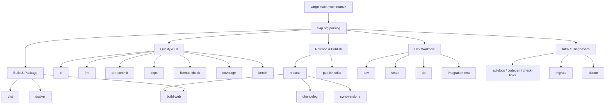

# Build System — xtask

# xtask — Build Automation

## Overview

`xtask` is the build automation layer for the LibreFang workspace. It follows the [cargo xtask pattern](https://github.com/matklad/cargo-xtask) — a convention where a `Cargo.toml` at the workspace root aliases `cargo xtask` to run a custom Rust binary instead of scattering shell scripts across the repository.

Every workflow that a contributor or CI pipeline needs — building, testing, releasing, publishing, cross-compiling — is exposed as a subcommand through a single CLI entry point powered by `clap`.

### Why xtask Instead of Scripts

Shell scripts work until they don't. `xtask` solves real problems that emerged in this workspace:

- **Portability.** Commands like `release`, `sync-versions`, and `changelog` need to run on Linux, macOS, and Windows without maintaining three script variants.
- **Type safety.** Argument parsing, version validation, and file manipulation are handled by Rust and `serde` rather than fragile string manipulation in bash.
- **Workspace awareness.** Commands operate on workspace metadata directly through `toml_edit` and `serde_json`, keeping version sync and cross-compilation accurate.
- **Composability.** Commands can invoke each other (e.g., `release` orchestrates `changelog`, `sync-versions`, and `build-web`) without subprocess soup.

## Architecture

`xtask` is structured as a flat command dispatch. `clap` with the `derive` feature parses the subcommand name and flags, then each command runs as an independent function. There is no persistent state between commands — each invocation starts fresh.



### Dependency Map

| Crate Dependency | Purpose |
|---|---|
| `clap` (derive + env) | Subcommand parsing and flag definitions |
| `serde` + `serde_json` | Parsing and writing JSON configs, OpenAPI specs, API responses |
| `toml_edit` | Modifying `Cargo.toml` and `tauri.conf.json` while preserving formatting and comments |
| `regex` | Changelog parsing, version string manipulation, link checking |
| `chrono` | CalVer date components, changelog timestamps |
| `base64` | Encoding for Docker auth, MSI-compatible version fields |
| `librefang-migrate` | Framework migration logic for importing agents from OpenClaw/OpenFang |

`librefang-migrate` is the only workspace crate that `xtask` depends on directly. The rest of the interaction with the workspace happens through subprocess calls (`cargo`, `pnpm`, `gh`, `npm`, `twine`) and file I/O against workspace paths.

## Command Reference

Commands are organized by workflow. Each command is invoked as `cargo xtask <name>` with the flags documented below.

### Release & Publishing

#### `release` — Full Release Flow

Orchestrates the complete release pipeline: changelog generation, version synchronization, frontend builds, git commit/tag, and PR creation.

```bash
cargo xtask release --version 2026.3.2214        # explicit version
cargo xtask release --version 2026.3.2214-beta1  # pre-release
cargo xtask release --no-confirm                  # non-interactive (CI)
cargo xtask release --no-push                     # local only, skip push + PR
cargo xtask release --no-article                  # skip Dev.to article
```

**Preconditions:** Must be on `main` branch with a clean worktree. Requires `gh` CLI for PR creation.

This is the single entry point that composes `changelog`, `sync-versions`, and `build-web` into one atomic workflow.

#### `changelog <version> [since-tag]`

Generates a `CHANGELOG.md` entry from merged PRs since the last tag. PRs are classified by conventional commit prefix (`feat:`, `fix:`, `refactor:`, `perf:`, `docs:`, `chore:`/`ci:`/`build:`/`test:`). Requires `gh` CLI.

#### `sync-versions [version]`

Writes the CalVer version string across every package in the workspace:

| File | Notes |
|---|---|
| `Cargo.toml` (workspace root) | `[workspace.package] version` |
| `sdk/javascript/package.json` | Direct write |
| `sdk/python/setup.py` | PEP 440 conversion (`-beta1` → `b1`) |
| `sdk/rust/Cargo.toml` + `sdk/rust/README.md` | Both updated |
| `packages/whatsapp-gateway/package.json` | Direct write |
| `crates/librefang-desktop/tauri.conf.json` | MSI-compatible base64 encoding for version field |

When called with no argument, reads the current version from the workspace `Cargo.toml` and ensures all other files match. When called with an argument, bumps everything to the new version.

#### `publish-sdks`

Publishes SDKs to their registries. Flags: `--js` (npm), `--python` (PyPI via `twine`), `--rust` (crates.io). Use `--dry-run` to validate without publishing.

### Build & Distribution

#### `build-web`

Builds frontend targets via `pnpm`. Skips any directory missing a `package.json`.

| Flag | Target Directory |
|---|---|
| `--dashboard` | `crates/librefang-api/dashboard/` (React) |
| `--web` | `web/` (Vite + React) |
| `--docs` | `docs/` (Next.js) |
| *(no flag)* | All of the above |

#### `dist`

Cross-compiles release binaries for multiple targets. Default targets: Linux (x86\_64, aarch64), macOS (x86\_64, aarch64), Windows (x86\_64). Produces `.tar.gz` for Linux/macOS, `.zip` for Windows.

Use `--cross` to invoke `cross` instead of `cargo` for cross-compilation. Use `--output` to specify the artifact directory.

#### `docker`

Builds the Docker image from `deploy/Dockerfile` and tags it as `ghcr.io/librefang/librefang:<version>`. Supports `--push`, `--latest`, `--tag`, and `--platform` flags.

### CI & Quality

#### `ci`

Runs the full local CI suite in order, fail-fast:

1. `cargo build --workspace --lib`
2. `cargo test --workspace` (unless `--no-test`)
3. `cargo clippy --workspace --all-targets -- -D warnings`
4. `pnpm run lint` in `web/` (unless `--no-web`)

Use `--release` to build with the release profile. Use `--no-test --no-web` for the fastest check (build + clippy only).

#### `fmt`

Unified formatting check across Rust (`cargo fmt --check`) and frontend (`pnpm prettier --check`). Flags: `--fix` to auto-fix, `--no-web` for Rust only, `--no-rust` for web only.

#### `pre-commit`

Runs `fmt` + `clippy` + `test` as a pre-commit hook. Flags: `--no-test` (faster), `--no-clippy`, `--fix`.

#### `coverage`

Generates test coverage via `cargo-llvm-cov`. Auto-installs the tool if missing. Flags: `--open` (open HTML report), `--lcov` (CI-friendly format), `--output <dir>`.

#### `bench`

Runs criterion benchmarks. Flags: `--name <bench>` (specific benchmark), `--save-baseline <name>`, `--baseline <name>` (compare), `--open` (HTML report).

#### `deps`

Dependency audit using `cargo-audit`, `cargo-outdated`, and `pnpm audit`. Auto-installs missing tools. Flags: `--audit`, `--outdated`, `--web` to run subsets.

#### `license-check`

License compliance check using `cargo-deny` (falls back to `cargo metadata`). Flags: `--rust`, `--web`, `--deny "GPL-3.0,AGPL-3.0"` for custom denied licenses.

### Development Workflow

#### `dev`

Starts the daemon and dashboard dev server together. Builds the daemon binary first, then runs both processes. Press Ctrl+C to stop. Flags: `--no-dashboard`, `--release`, `--port`.

#### `setup`

First-time environment setup for new contributors. Checks for required tools (cargo, rustup, pnpm, gh, docker, just), installs git hooks, fetches dependencies, runs `pnpm install`, and creates a default config. Flags: `--no-web`, `--no-fetch`.

#### `integration-test`

Starts the daemon, hits API endpoints (`/api/health`, `/api/agents`, `/api/budget`, `/api/network/status`), optionally tests LLM via `POST /api/agents/{id}/message`, verifies budget updated, then cleans up.

Requires a pre-built binary at `target/release/librefang` (override with `--binary`). Flags: `--skip-llm`, `--api-key`, `--port`.

#### `db`

Database management: `--info` (show database info), `--backup <dir>` (copy db files), `--reset` (delete databases; daemon must be stopped). Use `--data-dir` for a custom data directory.

#### `doctor`

Deep environment diagnostics. Checks toolchain, port availability, daemon health, config validity, API keys, and workspace state. Use `--port` for a custom port.

### Code Generation & Documentation

#### `codegen`

Runs code generators. Currently supports `--openapi` to regenerate `openapi.json` from utoipa annotations by running the spec test.

#### `api-docs`

Generates a standalone Swagger UI HTML page from `openapi.json`. Flags: `--open` (open in browser), `--refresh` (regenerate spec first), `--output <dir>`.

#### `check-links`

Checks for broken links in documentation. Uses [lychee](https://github.com/lycheeverse/lychee) if installed, falls back to a built-in relative-link checker. Flags: `--basic`, `--path <dir>`, `--exclude <pattern>`.

#### `validate-config`

Validates `~/.librefang/config.toml` syntax and known fields. Flags: `--config <path>` (custom path), `--show` (print parsed config).

### Utility

#### `loc`

Lines of code statistics. Flags: `--crates` (per-crate breakdown), `--web` (include frontend), `--deps` (show crate dependency graph).

#### `update-deps`

Batch updates Rust (`cargo update`) and web (`pnpm update`) dependencies. Flags: `--rust`, `--web`, `--dry-run`, `--test` (run tests after updating).

#### `clean-all`

Deep clean of all build artifacts. Flags: `--rust` (`target/` + `dist/`), `--web` (`node_modules/` + `.next/` + `dist/`), `--dry-run` (preview).

#### `migrate`

Imports agents from other frameworks (OpenClaw, OpenFang) into LibreFang using the `librefang-migrate` crate. Flags: `--source <name>`, `--source-dir <path>`, `--target-dir <path>`, `--dry-run`.

## External Tool Dependencies

Several commands shell out to external tools. Here is the full inventory:

| Tool | Used By | Required For |
|---|---|---|
| `cargo` | `ci`, `dist`, `coverage`, `bench`, `pre-commit`, `dev` | All Rust workflows |
| `pnpm` | `build-web`, `ci`, `setup`, `dev` | Frontend workflows |
| `gh` | `release`, `changelog` | Release automation |
| `npm` | `publish-sdks --js` | JS SDK publishing |
| `twine` | `publish-sdks --python` | Python SDK publishing |
| `docker` | `docker` | Container builds |
| `cross` | `dist --cross` | Cross-compilation |
| `cargo-llvm-cov` | `coverage` | Test coverage (auto-installed) |
| `cargo-audit` | `deps --audit` | Security audit (auto-installed) |
| `cargo-outdated` | `deps --outdated` | Dependency freshness (auto-installed) |
| `cargo-deny` | `license-check` | License compliance (optional, graceful fallback) |
| `lychee` | `check-links` | Link checking (optional, graceful fallback) |

Commands that require an external tool check for its presence before running and produce a clear error message if it is missing. Tools marked "auto-installed" are installed automatically via `cargo install` when absent.

## Adding a New Command

To add a new subcommand:

1. **Define the CLI struct.** Add a `clap` `Args` struct and a variant to the top-level `Cli` enum in the main entry point.

2. **Implement the command function.** Create a new module (or add to an existing one) with a `pub fn run(opts: &YourArgs) -> Result<()>`. Keep the function self-contained — read workspace state from files and environment, invoke tools via `std::process::Command`, and write results.

3. **Dispatch from main.** Match on the new CLI variant and call the command function.

4. **Follow the conventions:**
   - Use `--dry-run` for any command with side effects.
   - Use `--no-<step>` flags to allow skipping phases.
   - Return a non-zero exit code on failure via `anyhow` error propagation.
   - Print what the command is doing (tool name, target, file path) so output is self-documenting.

## Conventions

- **CalVer versioning.** All version strings follow `YYYY.M.DDMM` (e.g., `2026.3.2214`). Pre-release suffixes use the format `-beta1`, `-rc1`, etc. The `sync-versions` command handles format conversion for Python (PEP 440) and MSI.
- **Fail-fast.** Commands that run multiple steps (e.g., `ci`, `release`) stop at the first failure.
- **Idempotency.** Commands like `sync-versions` with no version argument are safe to run repeatedly — they converge all files to the workspace version without making changes if already correct.
- **Workspace-relative paths.** All file operations are relative to the workspace root, located by walking up from `CARGO_MANIFEST_DIR` to find the root `Cargo.toml`.