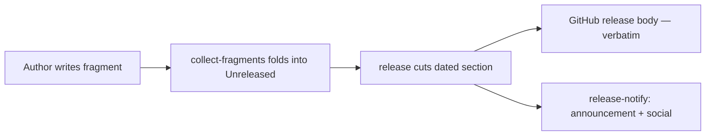

# changelog.d

# `changelog.d` — Changelog Fragment System

## Purpose

`changelog.d` is a conflict-free changelog authoring system. Instead of every PR appending a bullet to the single `## [Unreleased]` section of `CHANGELOG.md` — where every PR conflicts with every other — each PR drops a small markdown file into this directory. Two PRs never touch the same fragment file, so the conflict class is eliminated entirely.

Fragments are folded into `CHANGELOG.md` by `cargo xtask collect-fragments` (which the release flow runs automatically before cutting a dated release section). Editing `## [Unreleased]` directly still works and remains fully supported; a fragment is simply a deferred bullet.

## Directory Structure

Each subdirectory maps directly to a `### ` heading under `## [Unreleased]`:

| Directory | Renders as |
| --- | --- |
| `added/` | `### Added` |
| `fixed/` | `### Fixed` |
| `changed/` | `### Changed` |
| `security/` | `### Security` |
| `documentation/` | `### Documentation` |

A fragment placed in any other directory is **rejected** by `scripts/check-changelog-attribution.py`. Assembly has no heading to render it under, so it would be silently dropped.

## Fragment Format

**One file = one bullet.** The file holds the bullet body **without** the leading `- ` prefix. Lines wrap at sentence boundaries (no hard column limit), with continuation lines indented two spaces. The entry must end with `(#PR) (@your-github-login)`.

File naming is free-form, but lead with the PR or issue number so fragments sort usefully — bullets are assembled in filename order within each section.

### Example

`changelog.d/fixed/6623-wire-max-content-chars.md`:

```markdown
Honour `max_content_chars` on the streaming path, which read the compiled-in
default and ignored the per-agent override entirely. The value was resolved once
at kernel boot and captured into the driver, so an `agent.toml` edit took effect
only after a restart. It is now resolved per turn from the manifest, falling back
to the kernel config and then the compiled default (#6623) (@houko)
```

After `cargo xtask collect-fragments`, this lands under `### Fixed` in `## [Unreleased]` as:

```markdown
- Honour `max_content_chars` on the streaming path, which read the compiled-in
  default and ignored the per-agent override entirely. The value was resolved once
  at kernel boot and captured into the driver, so an `agent.toml` edit took effect
  only after a restart. It is now resolved per turn from the manifest, falling back
  to the kernel config and then the compiled default (#6623) (@houko)
```

## Lifecycle of a Fragment



1. **Authoring** — PR adds a fragment file to the appropriate section directory.
2. **Folding** — `cargo xtask collect-fragments` consumes all fragment files, appends their bullets to the matching `### ` subsection of `## [Unreleased]` in `CHANGELOG.md`, and deletes the consumed files.
3. **Release** — `cargo xtask release` moves the entire `## [Unreleased]` body into a new `## [VERSION]` section, leaving `## [Unreleased]` empty for the next cycle. Subsections and ordering are preserved.
4. **Publishing** — `.github/workflows/release.yml` extracts that dated section and uses it as the GitHub release notes. `.github/workflows/release-notify.yml` reuses the same slice for the Discord announcement and social posts.

## Generated Lines vs. Curated Fragments

Every merged PR in the release range automatically gets a generated entry:

```
- <PR title> (#N) (@author)
```

When a fragment bullet's trailing `(#N)` group matches a PR number, that PR's generated line is **suppressed** — the curated fragment replaces it. This is why fragments should explain *why* a change matters rather than restating the PR title (the title is already covered for free).

Key rules for PR-reference matching:

- Only the **last** `(#N)` group on the bullet's **last non-empty line** is counted.
- A mid-bullet cross-reference to some other PR is never mistaken for the bullet's own PR.
- Use `(#1234, #1235)` when one entry covers two PRs.
- Without a `(#N)` reference, the PR keeps its generated line, so it appears twice in the release body. `cargo xtask release` prints a warning naming the unreferenced bullet, but this does not block anyone else.

## Enforced Rules

The `pre-commit` hook and the `CHANGELOG Attribution` CI job both run `scripts/check-changelog-attribution.py`:

```bash
# Check only what this commit stages
python3 scripts/check-changelog-attribution.py --staged

# Check everything pending across all fragments
python3 scripts/check-changelog-attribution.py --all-unreleased
```

Rules enforced:

| Rule | Consequence of violation |
| --- | --- |
| Bullet carries `(@github-login)` attribution | Rejected (issue #3400) |
| Fragment in one of the five section directories | Rejected |
| Attribution on any line of the bullet, but not past a blank line | Rejected (blank line ends the bullet) |

Not enforced but strongly recommended: end the bullet with its PR reference `(#1234)` so the generated line is suppressed.

## Implementation Notes

- **`.gitkeep` files** in each section directory keep the empty dirs tracked. Leave them alone.
- **Prose wrapping**: break only at sentence boundaries. There is no column limit.
- **Sort order**: bullets are assembled in filename order within each section, so numeric-prefixed filenames produce chronological output.
- **No external code calls**: this module is purely a data directory. The tooling that reads it lives in `cargo xtask` commands and `scripts/`.