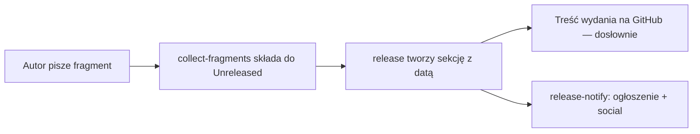

# changelog.d

# `changelog.d` — System fragmentów changeloga

## Cel

`changelog.d` to wolny od konfliktów system tworzenia changeloga. Zamiast każdego PR-a dopisywać punkt do pojedynczej sekcji `## [Unreleased]` w pliku `CHANGELOG.md` — gdzie każdy PR konfliktuje z każdym innym — każdy PR umieszcza mały plik markdown w tym katalogu. Dwa PR-y nigdy nie modyfikują tego samego pliku fragmentu, więc klasa konfliktów jest całkowicie wyeliminowana.

Fragmenty są składane do `CHANGELOG.md` przez `cargo xtask collect-fragments` (który proces wydawniczy uruchamia automatycznie przed utworzeniem sekcji z datą wydania). Bezpośrednia edycja `## [Unreleased]` nadal działa i jest w pełni obsługiwana; fragment jest po prostu odroczonym punktem.

## Struktura katalogu

Każdy podkatalog odpowiada bezpośrednio nagłówkowi `### ` w sekcji `## [Unreleased]`:

| Katalog | Renderuje się jako |
| --- | --- |
| `added/` | `### Added` |
| `fixed/` | `### Fixed` |
| `changed/` | `### Changed` |
| `security/` | `### Security` |
| `documentation/` | `### Documentation` |

Fragment umieszczony w dowolnym innym katalogu jest **odrzucany** przez `scripts/check-changelog-attribution.py`. Składanie nie ma pod jakim nagłówkiem go renderować, więc zostałby po cichu pominięty.

## Format fragmentu

**Jeden plik = jeden punkt.** Plik zawiera treść punktu **bez** prefiksu `- `. Wiersze zawijają się na granicach zdań (bez sztywnego limitu kolumn), z wierszami kontynuacji wciętymi dwiema spacjami. Wpis musi kończyć się ciągiem `(#PR) (@twoj-github-login)`.

Nazewnictwo plików jest dowolne, ale zaczyna się od numeru PR-a lub zgłoszenia, aby fragmenty sortowały się użytecznie — punkty są składane w kolejności nazw plików w ramach każdej sekcji.

### Przykład

`changelog.d/fixed/6623-wire-max-content-chars.md`:

```markdown
Szanuj `max_content_chars` na ścieżce strumieniowania, która czytała wkompilowaną
domyślną wartość i całkowicie ignorowała nadpisanie dla poszczególnych agentów.
Wartość była rozwiązywana raz przy uruchomieniu jądra i przechwytywana do sterownika,
więc edycja `agent.toml` miała skutek dopiero po ponownym uruchomieniu.
Teraz jest rozwiązywana przy każdej turze z manifestu, z powrotem do konfiguracji jądra,
a następnie do wartości domyślnej wkompilowanej (#6623) (@houko)
```

Po `cargo xtask collect-fragments` to trafia do sekcji `### Fixed` w `## [Unreleased]` jako:

```markdown
- Szanuj `max_content_chars` na ścieżce strumieniowania, która czytała wkompilowaną
  domyślną wartość i całkowicie ignorowała nadpisanie dla poszczególnych agentów.
  Wartość była rozwiązywana raz przy uruchomieniu jądra i przechwytywana do sterownika,
  więc edycja `agent.toml` miała skutek dopiero po ponownym uruchomieniu.
  Teraz jest rozwiązywana przy każdej turze z manifestu, z powrotem do konfiguracji jądra,
  a następnie do wartości domyślnej wkompilowanej (#6623) (@houko)
```

## Cykl życia fragmentu



1. **Tworzenie** — PR dodaje plik fragmentu do odpowiedniego katalogu sekcji.
2. **Składanie** — `cargo xtask collect-fragments` przetwarza wszystkie pliki fragmentów, dopisuje ich punkty do pasującej podsekcji `### ` w `## [Unreleased]` w `CHANGELOG.md` i usuwa przetworzone pliki.
3. **Wydanie** — `cargo xtask release` przenosi całą treść `## [Unreleased]` do nowej sekcji `## [WERSJA]`, pozostawiając `## [Unreleased]` pusty dla następnego cyklu. Podsekcje i kolejność są zachowane.
4. **Publikacja** — `.github/workflows/release.yml` wyciąga tę sekcję z datą i używa jej jako notek wydania na GitHubie. `.github/workflows/release-notify.yml` ponownie wykorzystuje tę samą część dla ogłoszenia na Discordzie i postów w social mediach.

## Wygenerowane wpisy vs. Kuratorowane fragmenty

Każdy scalony PR w zakresie wydania automatycznie otrzymuje wygenerowany wpis:

```
- <Tytuł PR-a> (#N) (@autor)
```

Gdy końcowy `(#N)` punktu fragmentu odpowiada numerowi PR-a, wygenerowany wiersz tego PR-a jest **pomijany** — skuratorowany fragment go zastępuje. Dlatego fragmenty powinny wyjaśniać *dlaczego* zmiana ma znaczenie, a nie powtarzać tytuł PR-a (tytuł jest już objęty automatycznie).

Kluczowe reguły dopasowywania odwołań do PR-ów:

- Tylko **ostatnia** grupa `(#N)` na **ostatnim niepustym wierszu** punktu jest brana pod uwagę.
- Środkowe odwołanie do innego PR-a wewnątrz punktu nigdy nie zostaje omyłkowo uznane za PR-a własnego punktu.
- Użyj `(#1234, #1235)`, gdy jeden wpis obejmuje dwa PR-y.
- Bez odwołania `(#N)` PR zachowuje swój wygenerowany wiersz, więc pojawia się dwa razy w treści wydania. `cargo xtask release` wyświetla ostrzeżenie z nazwą niepowiązanego punktu, ale to nie blokuje innych.

## Wymuszane reguły

Hook `pre-commit` oraz zadanie CI `CHANGELOG Attribution` uruchamiają `scripts/check-changelog-attribution.py`:

```bash
# Sprawdzanie tylko tego, co ten commit rejestruje
python3 scripts/check-changelog-attribution.py --staged

# Sprawdzanie wszystkiego oczekującego we wszystkich fragmentach
python3 scripts/check-changelog-attribution.py --all-unreleased
```

Wymuszane reguły:

| Reguła | Konsekwencja naruszenia |
| --- | --- |
| Punkt zawiera atrybucję `(@github-login)` | Odrzucony (issue #3400) |
| Fragment w jednym z pięciu katalogów sekcji | Odrzucony |
| Atrybucja na dowolnym wierszu punktu, ale nie za pustym wierszem | Odrzucony (pusty wiersz kończy punkt) |

Niewymuszane, ale mocno zalecane: zakończ punkt odwołaniem do PR-a `(#1234)`, aby wygenerowany wiersz został pominięty.

## Uwagi implementacyjne

- **Pliki `.gitkeep`** w każdym katalogu sekcji utrzymują puste katalogi w śledzeniu. Zostaw je w spokoju.
- **Zawijanie tekstu**: zawijaj tylko na granicach zdań. Nie ma limitu kolumn.
- **Kolejność sortowania**: punkty są składane w kolejności nazw plików w ramach każdej sekcji, więc pliki z prefiksem liczbowym dają wynik chronologiczny.
- **Brak wywołań zewnętrznego kodu**: ten moduł jest wyłącznie katalogiem danych. Narzędzia, które go czytają, znajdują się w poleceniach `cargo xtask` oraz w `scripts/`.
