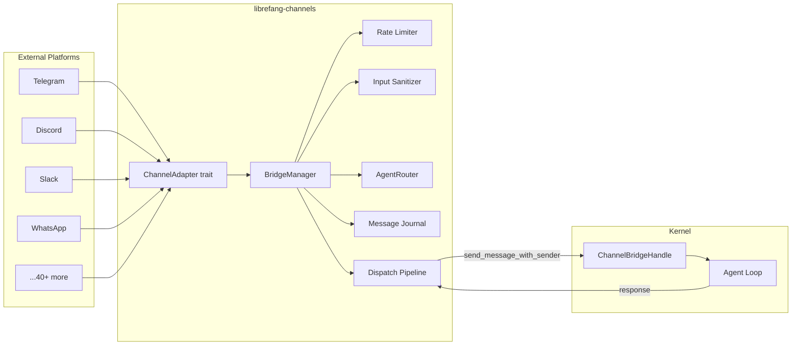

# Channel Adapters

# Channel Adapters (`librefang-channels`)

## Purpose

The channel adapters module is the messaging bridge layer for the LibreFang Agent OS. It translates messages from 40+ external platforms (Telegram, Discord, Slack, WhatsApp, Teams, Matrix, IRC, email, and many more) into a unified `ChannelMessage` format and dispatches them to agents through the kernel. Responses flow back through the same adapter, formatted for the target platform.

Channels are compiled only when needed — each is gated behind a `channel-xxx` Cargo feature flag.

## Architecture



## Feature Flags

Every channel adapter is opt-in. Two meta-features control broad enablement:

- **`default`** — enables popular channels (Telegram, Discord, Slack, etc.)
- **`all-channels`** — enables all 40+ adapters

Individual flags follow the pattern `channel-<name>`:

```
channel-telegram    channel-discord     channel-slack
channel-whatsapp    channel-signal      channel-matrix
channel-teams       channel-email       channel-mattermost
channel-irc         channel-xmpp        channel-wechat
channel-wechat      channel-reddit      channel-mastodon
channel-bluesky     channel-line        channel-zulip
# ... and many more
```

Core infrastructure (`bridge`, `router`, `types`, `formatter`, `sanitizer`, `rate_limiter`, `message_journal`, `sidecar`) is always compiled.

## Core Components

### `ChannelBridgeHandle` (trait)

Defined in `bridge.rs` and implemented by `librefang-api` on the kernel. This trait breaks the circular dependency — the channels crate cannot depend on the kernel directly, so it defines the interface the kernel must satisfy.

Key methods:

| Method | Purpose |
|---|---|
| `send_message` | Send text to an agent, get text response |
| `send_message_with_sender` | Send with `SenderContext` (channel identity, group info) |
| `send_message_with_blocks` | Send multimodal content (text + images) |
| `send_message_streaming_with_sender` | Stream text deltas for progressive display |
| `send_message_ephemeral` | `/btw` — no session history loaded or saved |
| `find_agent_by_name` | Resolve agent name to `AgentId` |
| `list_agents` | List running agents as `(id, name)` pairs |
| `spawn_agent_by_name` | Create an agent from a manifest |
| `authorize_channel_user` | RBAC check — returns `Err(reason)` if denied |
| `channel_overrides` | Per-channel configuration overrides |
| `classify_reply_intent` | LLM-based "should we reply?" for group messages |
| `check_auto_reply` | Auto-reply engine hook |
| `record_delivery` | Track delivery success/failure |
| `resolve_approval_text` | Approve/reject with optional TOTP |
| `subscribe_events` | Broadcast receiver for kernel events (approvals, etc.) |
| `send_channel_push` | Proactive outbound message from REST API |

Most methods have default implementations that return "not available" responses, so the kernel only needs to implement the methods it supports.

### `BridgeManager`

Owns all running channel adapters and orchestrates message dispatch. Created via:

```rust
let mut manager = BridgeManager::new(kernel_handle, router);
// Optional: configure sanitizer, journal
manager = manager.with_journal(journal);
```

Key methods:

- **`start_adapter(adapter)`** — subscribes to the adapter's message stream and spawns a dispatch loop. If the adapter provides webhook routes via `create_webhook_routes()`, those are collected for mounting on the shared API server instead of running a standalone HTTP server per adapter.
- **`start_approval_listener(adapters)`** — subscribes to kernel `ApprovalRequested` events and forwards approval notifications to all adapters.
- **`push_message(channel, recipient, text, thread_id)`** — entry point for the REST API push endpoint (`POST /api/agents/:id/push`).
- **`take_webhook_router()`** — returns a merged `axum::Router` of all adapter webhook routes, nested under `/{adapter_name}`. Mount under `/channels` without auth middleware (adapters handle their own signature verification).
- **`stop()`** — signals shutdown, stops adapters, awaits tasks.
- **`recover_pending()`** — reclaims messages that were in-flight during a crash.

### `ChannelAdapter` (trait, in `types.rs`)

The interface each platform adapter implements. Every adapter must provide:

- **`name()`** / **`channel_type()`** — identifiers
- **`start()`** — start the platform connection, return a message stream
- **`stop()`** — shut down connections
- **`send(user, content)`** — deliver a response to a user
- **`send_in_thread(user, content, thread_id)`** — reply within a specific thread/topic
- **`send_typing(user)`** / **`send_reaction(user, msg_id, reaction)`** — UX indicators
- **`supports_streaming()`** / **`send_streaming(user, rx, thread_id)`** — progressive token output
- **`create_webhook_routes()`** — optional; return `(axum::Router, message_stream)` to share the main API server's HTTP port
- **`typing_events()`** — optional channel of `TypingEvent` for debounce control
- **`suppress_error_responses()`** — if `true`, agent errors are logged but not sent to the user

### `ChannelMessage` and `ChannelContent`

The unified message envelope. Every adapter converts its platform-specific payload into:

```rust
ChannelMessage {
    channel: ChannelType,       // Telegram, Discord, Slack, Custom("..."), etc.
    sender: ChannelUser,        // platform_id, display_name, is_bot, librefang_user
    content: ChannelContent,    // Text, Command, Image, File, Voice, Video, ...
    is_group: bool,
    thread_id: Option<String>,
    metadata: HashMap<String, Value>,  // adapter-specific: was_mentioned, guild_id, ...
    platform_message_id: String,
    timestamp: DateTime<Utc>,
}
```

`ChannelContent` variants cover the full range of media types: `Text`, `Command`, `Image`, `File`, `FileData`, `Voice`, `Video`, `Audio`, `Animation`, `Sticker`, `Location`, `MediaGroup`, `Poll`, `PollAnswer`, `Interactive`, `ButtonCallback`, `EditInteractive`, `DeleteMessage`.

### `AgentRouter`

Maps `(channel_type, platform_user_id)` pairs to `AgentId`. Supports:

- Per-channel defaults
- Per-user bindings (via `/agent <name>` command)
- Account/guild-aware routing via `BindingContext`
- Thread-based routing (metadata key `thread_route_agent`)
- Broadcast routing (one user → multiple agents, parallel or sequential)
- Fallback chain: thread route → binding context → user default → channel default → "assistant" → first available agent

When no agent is found and a fallback is auto-selected, the router stores it as the user's default for future messages.

### `SenderContext`

Propagation struct that carries channel identity to the agent's system prompt:

```rust
SenderContext {
    channel: String,           // "telegram", "discord", ...
    user_id: String,           // resolved sender identity (metadata or platform_id)
    chat_id: Option<String>,   // platform_id
    display_name: String,
    is_group: bool,
    was_mentioned: bool,
    thread_id: Option<String>,
    account_id: Option<String>,
    auto_route: AutoRouteStrategy,
    group_participants: Vec<ParticipantRef>,  // for addressee guard
}
```

Built by `build_sender_context()` from the incoming message and channel overrides.

## Message Processing Pipeline

Every incoming `ChannelMessage` passes through this dispatch flow in `dispatch_message()`:

1. **Input sanitization** — `InputSanitizer` checks text, image captions, voice captions, and video captions for prompt injection patterns. Three outcomes: `Clean` (pass), `Warned` (log + pass), `Blocked` (reject with generic message).

2. **Channel overrides** — fetched via `channel_overrides()`. Controls output format, threading, DM/group policy, rate limits, debounce timing, command allowlists.

3. **Group policy gate** — `should_process_group_message()` applies one of four policies:
   - `Ignore` — drop all group messages
   - `CommandsOnly` — process only slash commands
   - `MentionOnly` — require mention, command, or trigger pattern match
   - `All` — process everything (optionally filtered by `reply_precheck` LLM call)

4. **Rate limiting** — per-channel global limit and per-user limit, both configurable via overrides.

5. **Command handling** — slash commands (`/agent`, `/status`, `/models`, `/help`, `/approve`, etc.) are intercepted and dispatched to `handle_command()`. Blocked commands fall through to the agent as plain text. `/agents` and `/models` produce interactive inline keyboards when the adapter supports them.

6. **Media processing** — images are downloaded, magic-byte-detected (JPEG/PNG/GIF/WebP), and sent as `ContentBlock::Image` for vision-capable models. Other media types are converted to descriptive text.

7. **Button callback handling** — `ButtonCallback` messages with `prov:`, `model:`, or `back:providers` actions are handled as interactive menu navigation (model selection flow) without touching the agent.

8. **Broadcast routing** — if the user has broadcast targets, the message is fanned out to all target agents (parallel or sequential per `BroadcastStrategy`).

9. **Agent resolution** — `resolve_or_fallback()` tries thread route → binding context → user default → channel default → fallback agent.

10. **RBAC** — `authorize_channel_user()` gates access before the agent is called.

11. **Auto-reply** — `check_auto_reply()` can intercept and respond without an agent call.

12. **Journal recording** — if a `MessageJournal` is configured, the message is recorded as `Processing` before dispatch.

13. **Typing indicator + lifecycle reactions** — the adapter sends a typing indicator and emoji reactions: ⏳ Queued → 🤔 Thinking → 📡 Streaming → ✅ Done / ❌ Error.

14. **Agent dispatch** — either streaming (`send_message_streaming_with_sender`) or standard (`send_message_with_sender`). On streaming failure, falls back to the buffered text via `send_response()`. On "Agent not found" errors, attempts re-resolution by name.

15. **Delivery tracking** — `record_delivery()` logs success or failure for each dispatch.

## Message Debouncing

When `message_debounce_ms` is set in channel overrides, the `MessageDebouncer` buffers rapid messages from the same sender:

- Each unique sender (`channel:platform_id`) gets a buffer
- After the first message arrives, a timer starts (`debounce_ms`)
- New messages extend the buffer and reset the timer
- Typing events from the adapter pause the timer (user is still composing)
- A hard maximum (`debounce_max_ms`, default 30s) forces a flush regardless
- Buffer size limit (`debounce_max_buffer`, default 64) also forces a flush
- On flush, messages are merged: same-type commands concatenate args; mixed types concatenate as text; images are collected as `ContentBlock`s

This prevents a burst of messages from creating multiple competing agent sessions.

## Group Message Gating

The addressee guard prevents false triggers in group chats where the bot's name appears mid-sentence but isn't being addressed:

- **Positional vocative detection** (`is_vocative_trigger`) — a trigger pattern only matches at the start of a turn or after a sentence boundary (`[.!?]`), and is rejected if another capitalized vocative precedes it
- **Cross-participant detection** (`is_addressed_to_other_participant`) — if the turn opens with a vocative matching a group roster member who isn't the bot, the message is skipped
- Enabled via environment variable `LIBREFANG_GROUP_ADDRESSEE_GUARD=on` (shipped default-off for observation)

## Streaming Support

Adapters that implement `supports_streaming() -> true` and `send_streaming()` receive an `mpsc::Receiver<String>` of incremental text deltas. The bridge:

1. Calls `send_message_streaming_with_sender()` on the kernel handle
2. Tees the delta stream: forwards to the adapter while buffering a copy
3. If the adapter's `send_streaming()` fails, falls back to sending the buffered text via the standard `send()` path

Adapters without streaming support use the standard request-response path.

## Crash Recovery

When a `MessageJournal` is attached via `with_journal()`:

- Every dispatched message is recorded as `Processing` before the agent call
- On success, status is updated to `Completed`
- On failure, status is updated to `Failed` with the error
- On restart, `recover_pending()` returns entries that were interrupted
- `compact_journal()` flushes and compacts the journal on shutdown

## Interactive Model Selection Flow

The `/models` command triggers a multi-step interactive flow:

1. `/models` → inline keyboard listing providers
2. `prov:<id>` callback → inline keyboard listing that provider's models + "Back" button
3. `model:<id>` callback → confirmation message "✅ Active model: <name>"
4. `back:providers` → back to provider list

All of this is handled within the bridge layer without agent involvement.

## Adding a New Channel Adapter

1. Create a new module file (e.g. `src/myservice.rs`)
2. Implement `ChannelAdapter` for your adapter struct
3. Gate it with `#[cfg(feature = "channel-myservice")]` in `src/lib.rs`
4. Add the feature flag to `Cargo.toml`
5. Prefer `create_webhook_routes()` over `start()` to share the API server's HTTP port
6. Convert platform payloads into `ChannelMessage` with the correct `ChannelType`
7. Populate `metadata` with platform-specific fields (e.g. `was_mentioned`, `guild_id`, `account_id`)

Key integration points:

- For **mention detection**, set `metadata["was_mentioned"] = true`
- For **group participant rosters**, set `metadata["group_participants"]` as a JSON array of `{display_name, ...}` objects
- For **thread routing**, set `metadata["thread_route_agent"]` to an agent name
- For **RBAC identity**, set `metadata["sender_user_id"]` to the user's canonical ID (falls back to `platform_id`)
- For **multi-account** channels, set `metadata["account_id"]`