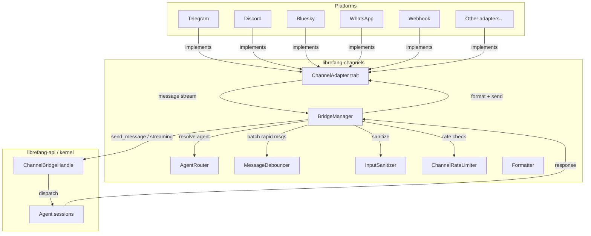

# Channel Adapters

# Channel Adapters

## Overview

The `librefang-channels` crate provides the bridge between external messaging platforms (Telegram, Discord, Bluesky, WhatsApp, Slack, etc.) and the LibreFang agent kernel. Every platform-specific adapter implements the `ChannelAdapter` trait, and the `BridgeManager` orchestrates adapter lifecycles, message dispatch, policy enforcement, and agent routing.

## Architecture



## Core Abstractions

### `ChannelAdapter` trait

Defined in `types.rs`, this is the interface every platform adapter must implement:

| Method | Purpose |
|--------|---------|
| `name()` | Returns the adapter identifier string (e.g., `"telegram"`, `"bluesky"`) |
| `channel_type()` | Returns the `ChannelType` variant for this adapter |
| `start()` | Starts the adapter, returns a `Stream<Item = ChannelMessage>` of inbound messages |
| `send()` | Sends a message to a user |
| `send_in_thread()` | Sends within a specific thread/topic (optional) |
| `send_reaction()` | Adds a lifecycle reaction emoji (optional) |
| `send_typing()` | Shows a typing indicator (optional) |
| `stop()` | Gracefully shuts down the adapter |
| `create_webhook_routes()` | Returns axum routes for webhook-based adapters (optional) |
| `typing_events()` | Returns typing indicator events for debounce control (optional) |
| `suppress_error_responses()` | Whether to suppress error messages to users |

### `ChannelMessage`

The unified message envelope that flows through the bridge. Key fields:

- **`channel`** — `ChannelType` enum (Telegram, Discord, Slack, Custom, etc.)
- **`sender`** — `ChannelUser` with `platform_id`, `display_name`, and optional `librefang_user`
- **`content`** — `ChannelContent` enum: `Text`, `Command`, `Image`, `Voice`, `Video`, `FileData`, `Interactive`, `ButtonCallback`, and more
- **`metadata`** — `HashMap<String, serde_json::Value>` carrying platform-specific data (URIs, thread IDs, guild IDs, account IDs)
- **`is_group`** — Whether the message came from a group context
- **`thread_id`** — Optional thread/topic identifier for reply threading

### `ChannelBridgeHandle` trait

Defined in `bridge.rs` to break the circular dependency between `librefang-channels` and `librefang-kernel`. Implemented in `librefang-api` on the actual kernel. This trait exposes all kernel operations that adapters and the bridge need:

**Core messaging:**
- `send_message`, `send_message_with_sender`, `send_message_with_blocks_and_sender` — send text or multimodal content to an agent
- `send_message_streaming_with_sender_status` — streaming variant returning `(Receiver<String>, oneshot::Receiver<Result<(), String>>)`

**Agent management:**
- `find_agent_by_name`, `list_agents`, `spawn_agent_by_name`
- `reset_session`, `reboot_session`, `compact_session`
- `set_model`, `stop_run`, `session_usage`

**Policy & routing:**
- `channel_overrides`, `agent_channel_overrides` — per-channel and per-agent configuration overrides
- `authorize_channel_user` — RBAC check
- `classify_reply_intent` — lightweight LLM classification for group message relevance

**Automation:**
- `list_workflows_text`, `run_workflow_text`
- `list_triggers_text`, `create_trigger_text`, `delete_trigger_text`
- `list_schedules_text`, `manage_schedule_text`
- `list_approvals_text`, `resolve_approval_text`

**Infrastructure:**
- `subscribe_events` — broadcast receiver for kernel events (e.g., `ApprovalRequested`)
- `send_channel_push` — proactive outbound messages
- `channels_download_dir`, `channels_download_max_bytes` — file download configuration

Default implementations are provided for every method so that new kernel implementations can incrementally override only what they need.

## Message Flow

### Inbound (Platform → Agent)

1. **Adapter receives** a platform event (WebSocket message, webhook POST, polling response)
2. **Adapter parses** it into a `ChannelMessage` and yields it via the stream returned by `start()`
3. **BridgeManager** consumes the stream in a `tokio::select!` loop, optionally debouncing rapid messages
4. **Input sanitization** runs — `InputSanitizer` checks for prompt injection patterns. Results: `Clean`, `Warned` (logged, passed through), or `Blocked` (rejected with a generic error message)
5. **Agent resolution** via `AgentRouter`: thread routing → binding context (account_id, guild_id, peer_id) → user default → channel default → "assistant" fallback → first available agent
6. **Policy checks**: DM policy (`Respond`/`AllowedOnly`/`Ignore`), group policy (`All`/`MentionOnly`/`CommandsOnly`/`Ignore`), rate limiting, command filtering
7. **Dispatch** to agent via `ChannelBridgeHandle`, with optional streaming and lifecycle reactions
8. **Response** formatted via `formatter::format_for_channel` and sent back through the adapter

### Outbound (Agent → Platform)

Responses take one of two paths:

- **Non-streaming**: `send_message()` returns the full text, which is formatted and sent via `adapter.send()`
- **Streaming**: `send_message_streaming_with_sender_status()` returns incremental text chunks; adapters that support progressive display consume the receiver

Both paths go through `send_response()`, which applies `OutputFormat` formatting and optional thread targeting.

### ReplyEnvelope

The `ReplyEnvelope` struct separates responses into two channels:

```rust
pub struct ReplyEnvelope {
    pub public: Option<String>,       // Message for the source chat
    pub owner_notice: Option<String>, // Private notice to the operator's DM
}
```

This supports the `notify_owner` LLM tool — agents can send private operator notifications alongside (or instead of) public replies. Adapters that don't support owner-side delivery ignore `owner_notice`.

## BridgeManager

The `BridgeManager` is the top-level orchestrator:

```rust
let mut bridge = BridgeManager::new(kernel_handle, agent_router);
bridge.start_adapter(telegram_adapter).await?;
bridge.start_adapter(discord_adapter).await?;
bridge.start_approval_listener(all_adapters).await;

// Mount webhook routes on the API server
let webhook_router = bridge.take_webhook_router();

// On shutdown
bridge.stop().await;
```

### Key responsibilities:

- **Adapter lifecycle** — starts streams, collects webhook routes, stops adapters cleanly
- **Concurrent dispatch** — each message spawns its own task so slow LLM calls don't block subsequent messages. A semaphore (default: 32 concurrent) prevents unbounded memory growth under burst traffic
- **Debouncing** — when `message_debounce_ms > 0`, rapid messages from the same sender are batched. Typing events reset the debounce timer. A hard maximum (`debounce_max_ms`) ensures messages flush even if the user keeps typing
- **Journal integration** — optional `MessageJournal` for crash recovery of in-flight messages

## Message Debouncing

When enabled via channel overrides, the `MessageDebouncer` batches rapid-fire messages from the same sender key (`{channel}:{platform_id}`):

- **First message** starts a debounce timer and a hard-max timer
- **Subsequent messages** extend the debounce window (up to the hard max)
- **Typing events** — `is_typing = true` cancels the timer (user is still composing); `is_typing = false` restarts it
- **Flush triggers**: debounce timer expires, hard-max timer expires, buffer reaches `max_buffer` size, or stream ends
- **Merged output**: multiple `Text` messages are joined with newlines; multiple `Command` messages with the same name have their args concatenated; mixed types fall back to text join

This is critical for voice/media messages that arrive as separate platform events but should be processed as a single turn.

## Policies and Filtering

### Group Policy (`GroupPolicy`)

| Variant | Behavior |
|---------|----------|
| `All` | Process all group messages (subject to `reply_precheck` LLM filter if enabled) |
| `MentionOnly` | Only when bot is directly mentioned, @-ed, or text matches `group_trigger_patterns` regex |
| `CommandsOnly` | Only slash commands |
| `Ignore` | Drop all group messages |

**Addressee guard** (OB-04/OB-05): When `LIBREFANG_GROUP_ADDRESSEE_GUARD=on`, the system uses positional vocative detection to avoid false triggers. A message like "Caterina, chiedi al Signore..." won't trigger the bot even if "Signore" is a trigger pattern, because the vocative is addressed to "Caterina" (another participant), not the bot.

### DM Policy (`DmPolicy`)

| Variant | Behavior |
|---------|----------|
| `Respond` | Process DMs normally |
| `AllowedOnly` | Process only if RBAC `authorize_channel_user` passes |
| `Ignore` | Drop all DMs |

### Rate Limiting

Two levels via `ChannelOverrides`:

- `rate_limit_per_minute` — global per-channel limit (all users combined)
- `rate_limit_per_user` — per-user limit

Both use `ChannelRateLimiter` with sliding-window counting. Exceeded limits produce an immediate response to the user.

### Command Filtering

Three-tier precedence in `ChannelOverrides`:

1. `disable_commands = true` — block all commands
2. `allowed_commands` — whitelist (only these commands pass)
3. `blocked_commands` — blacklist

Blocked commands are reconstructed as raw text and forwarded to the agent as normal input, so the agent can still respond contextually.

## Agent Routing

The `AgentRouter` resolves inbound messages to agent IDs through a multi-layer strategy:

1. **Thread routing** — if the adapter tagged the message with `thread_route_agent` metadata, resolve by that agent name
2. **Binding context** — match on `channel + account_id + guild_id + peer_id`
3. **User default** — previously auto-set default for this sender
4. **Channel default** — configured default agent for this channel
5. **Fallback** — agent named `"assistant"`, then first available agent

When a cached agent ID becomes stale (agent was restarted), `try_reresolution` detects "Agent not found" errors and re-resolves by name, then retries once.

### Auto-Routing

Per-channel `AutoRouteStrategy` (in `ChannelOverrides`) configures automatic agent selection based on sender identity. The router tracks TTLs, confidence thresholds, sticky bonuses, and divergence counts to manage agent stickiness vs. switching.

## Adapter Implementation Guide

Using `BlueskyAdapter` as the reference pattern:

### Structure

```rust
pub struct BlueskyAdapter {
    identifier: String,
    app_password: Zeroizing<String>,    // Zeroized on drop
    service_url: String,
    client: reqwest::Client,
    account_id: Option<String>,
    shutdown_tx: Arc<watch::Sender<bool>>,
    shutdown_rx: watch::Receiver<bool>,
    session: Arc<RwLock<Option<BlueskySession>>>,
}
```

### Authentication

- `create_session()` — calls `com.atproto.server.createSession`, stores `(access_jwt, refresh_jwt, did, created_at)`
- `get_token()` — returns a valid access JWT, creating or refreshing the session as needed (sessions last ~2 hours, refresh at 90 minutes minus a 5-minute buffer)
- App passwords are wrapped in `Zeroizing<String>` for secure memory handling

### Inbound (Polling Pattern)

Adapters that use polling (vs. webhooks) run a `tokio::spawn` loop inside `start()`:

```
loop {
    tokio::select! {
        _ = shutdown_rx.changed() => break,
        _ = tokio::time::sleep(interval) => {}
    }
    // Fetch notifications → parse → send to mpsc channel
}
```

The returned stream is `Box::pin(ReceiverStream::new(rx))`.

### Outbound

`api_create_post()` handles chunking via `split_message(text, MAX_MESSAGE_LEN)` — messages exceeding platform limits are automatically split into multiple posts.

### Message Parsing

`parse_bluesky_notification()` demonstrates the pattern:

1. Filter by notification reason (`mention`, `reply`)
2. Skip own messages (by DID comparison)
3. Extract text and detect command syntax (leading `/`)
4. Build `ChannelContent::Command` or `ChannelContent::Text`
5. Populate `metadata` with platform-specific fields (uri, cid, handle, reply_ref)

### Webhook-Based Adapters

Instead of `start()`, webhook adapters implement `create_webhook_routes()`:

```rust
async fn create_webhook_routes(&self)
    -> Option<(axum::Router, Pin<Box<dyn Stream<Item = ChannelMessage> + Send>>)>
```

The returned axum `Router` is mounted at `/channels/{adapter_name}/webhook` on the main API server. This avoids running a separate HTTP server per adapter.

## Output Formatting

`formatter::format_for_channel()` transforms agent responses based on `OutputFormat` (Markdown, HTML, plain text). The default format varies by channel — for example, Telegram supports Markdown, while Bluesky uses plain text.

### Agent Name Prefixing

When `prefix_agent_name` is set to `Bracket` or `BoldBracket` in overrides, responses are prefixed with the agent's display name:

- `Bracket`: `[agent-name] response text`
- `BoldBracket`: `**[agent-name]** response text`

This is idempotent — if the response already starts with the prefix, it's not doubled. For streaming responses, the prefix is sent as the first delta chunk.

## Configuration

Channel behavior is configured through `ChannelOverrides` (from `librefang-types::config`), which can be set at two levels:

1. **Channel-level** — via `channel_overrides()` on the bridge handle
2. **Agent-level** — via `agent_channel_overrides()`, sourced from `[channel_overrides]` in `agent.toml`

Agent-level overrides take priority when both exist.

Key override fields: `dm_policy`, `group_policy`, `output_format`, `threading`, `prefix_agent_name`, `rate_limit_per_minute`, `rate_limit_per_user`, `message_debounce_ms`, `reply_precheck`, `disable_commands`, `allowed_commands`, `blocked_commands`, `group_trigger_patterns`, `auto_route`.

## Crash Recovery

When a `MessageJournal` is attached via `BridgeManager::with_journal()`, in-flight messages are journaled before dispatch. On restart, `recover_pending()` returns interrupted entries for re-processing, and `compact_journal()` cleans up the journal on shutdown.