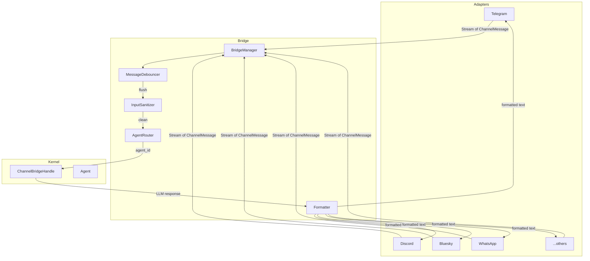

# Channel Adapters

# Channel Adapters (`librefang-channels`)

## Overview

The Channel Adapters module provides the messaging layer between external chat platforms and the LibreFang agent kernel. It defines a uniform `ChannelAdapter` trait that each platform implements, and a `BridgeManager` that owns running adapters, normalizes inbound messages, enforces policies, and dispatches to agents.

Every supported platform—Telegram, Discord, Slack, WhatsApp, Signal, Matrix, Bluesky, Teams, Email, IRC, XMPP, and others—implements the same `ChannelAdapter` interface. The bridge is agnostic to the transport; it receives a `Stream<Item = ChannelMessage>` from each adapter and routes messages to agents through the kernel handle.

## Architecture



## Core Types

All adapters communicate through a shared vocabulary defined in `types.rs`:

### `ChannelMessage`

The universal inbound envelope. Every platform adapter parses its native format into this structure:

- **`channel`** — `ChannelType` identifying the platform (e.g., `ChannelType::Telegram`, `ChannelType::Custom("bluesky")`)
- **`platform_message_id`** — platform-native ID for lifecycle reactions and reply threading
- **`sender`** — `ChannelUser` with `platform_id`, `display_name`, and optional `librefang_user`
- **`content`** — `ChannelContent` (see below)
- **`is_group`** — whether the message came from a group context
- **`thread_id`** — optional thread/topic ID for platforms that support it
- **`metadata`** — `HashMap<String, serde_json::Value>` carrying platform-specific data (mention status, reply references, guild IDs, account IDs, etc.)

### `ChannelContent`

An enum covering all inbound content types:

| Variant | Usage |
|---------|-------|
| `Text(String)` | Plain text messages |
| `Command { name, args }` | Slash commands (e.g., `/status check`) |
| `Image { url, caption, mime_type }` | Photo with optional caption |
| `File { url, filename }` | File attachments |
| `Voice { url, duration_seconds, caption }` | Voice messages |
| `Video { url, caption, duration_seconds }` | Video messages |
| `Location { lat, lon }` | Geolocation |
| `Interactive { text, buttons }` | Inline keyboard / card actions |
| `ButtonCallback { action, data }` | Callback from interactive buttons |
| `Audio`, `Animation`, `Sticker`, `MediaGroup`, `Poll`, `PollAnswer` | Platform-specific media types |
| `FileData { filename, data }` | In-memory file bytes |
| `DeleteMessage { message_id }` | Message deletion requests |
| `EditInteractive { text, buttons, message_id }` | Edit existing interactive messages |

### `ChannelType`

```rust
pub enum ChannelType {
    Telegram, Discord, Slack, WhatsApp, Signal, Matrix,
    Email, Teams, Mattermost, WeChat, WebChat, CLI,
    Custom(String),
}
```

The `Custom` variant allows adapters like Bluesky to register without a dedicated enum variant.

### `SenderContext`

Propagated to the kernel so agents know who is talking and from where:

```rust
pub struct SenderContext {
    pub channel: String,
    pub user_id: String,
    pub chat_id: Option<String>,
    pub display_name: String,
    pub is_group: bool,
    pub was_mentioned: bool,
    pub thread_id: Option<String>,
    pub account_id: Option<String>,
    pub auto_route: AutoRouteStrategy,
    pub group_participants: Vec<ParticipantRef>,
    pub bot_username: Option<String>,
    pub sender_username: Option<String>,
    pub group_members: Vec<GroupMember>,
    pub use_canonical_session: bool,
    pub is_internal_cron: bool,
    // ...auto-route tuning fields
}
```

## The `ChannelAdapter` Trait

Every platform adapter implements this async trait:

```rust
#[async_trait]
pub trait ChannelAdapter: Send + Sync {
    fn name(&self) -> &str;
    fn channel_type(&self) -> ChannelType;

    /// Subscribe to inbound messages. Returns a stream that the
    /// BridgeManager polls continuously.
    async fn start(&self) -> Result<Pin<Box<dyn Stream<Item = ChannelMessage> + Send>>, ...>;

    /// Send a reply to a user.
    async fn send(&self, user: &ChannelUser, content: ChannelContent) -> Result<(), ...>;

    /// Optional: send a typing indicator.
    async fn send_typing(&self, user: &ChannelUser) -> Result<(), ...> { Ok(()) }

    /// Optional: send within a specific thread/topic.
    async fn send_in_thread(&self, user: &ChannelUser, content: ChannelContent, thread_id: &str) -> Result<(), ...> {
        self.send(user, content).await
    }

    /// Optional: react to a message (lifecycle emoji).
    async fn send_reaction(&self, ...) -> Result<(), ...> { Ok(()) }

    /// Optional: provide webhook routes for mounting on the shared API server.
    async fn create_webhook_routes(&self) -> Option<(axum::Router, Pin<Box<dyn Stream<...>>>)> { None }

    /// Optional: subscribe to typing events (for debouncing).
    fn typing_events(&self) -> Option<mpsc::Receiver<TypingEvent>> { None }

    /// Graceful shutdown.
    async fn stop(&self) -> Result<(), ...>;

    /// Whether to suppress error responses to users.
    fn suppress_error_responses(&self) -> bool { false }
}
```

Adapters have two integration modes:

1. **Webhook mode** — The adapter provides `create_webhook_routes()` returning an `axum::Router` and a message stream. The bridge mounts these under `/channels/{name}/webhook` on the main API server. The external platform pushes events via HTTP.

2. **Polling/WebSocket mode** — The adapter manages its own connection internally and `start()` returns a stream directly. Used by Bluesky (polling), IRC (TCP), XMPP (XMPP stream), etc.

## The `ChannelBridgeHandle` Trait

Defined in `bridge.rs` to break the circular dependency between `librefang-channels` and `librefang-kernel`. The kernel implements this trait; adapters call through it.

Key methods:

| Method | Purpose |
|--------|---------|
| `send_message(agent_id, message)` | Core send to agent, returns text response |
| `send_message_with_sender(agent_id, message, sender)` | Send with identity context |
| `send_message_streaming_with_sender_status(...)` | Streaming deltas + terminal status |
| `find_agent_by_name(name)` | Agent lookup |
| `list_agents()` | All running agents |
| `spawn_agent_by_name(name)` | Dynamic agent creation |
| `channel_overrides(channel_type, account_id)` | Per-channel configuration |
| `agent_channel_overrides(agent_id)` | Per-agent channel overrides |
| `authorize_channel_user(channel, platform_id, action)` | RBAC check |
| `classify_reply_intent(text, sender_name, ...)` | LLM-based group reply gating |
| `subscribe_events()` | Kernel event bus (approvals, etc.) |
| `record_delivery(agent_id, channel, recipient, success, ...)` | Delivery tracking |
| `reset_session`, `reboot_session`, `compact_session` | Session management |
| `list_workflows_text`, `manage_schedule_text`, `resolve_approval_text` | Automation commands |
| `roster_upsert(channel, chat_id, user_id, display_name, username)` | Persist group members |

## `BridgeManager`

Owns all running adapters and dispatches inbound messages to agents.

### Construction

```rust
let mut bridge = BridgeManager::new(kernel_handle, router);

// With explicit sanitizer config:
let bridge = BridgeManager::with_sanitizer(handle, router, &sanitize_config);

// With message journal for crash recovery:
let bridge = BridgeManager::new(handle, router).with_journal(journal);
```

### Starting an Adapter

```rust
bridge.start_adapter(Arc::new(adapter)).await?;
```

This method:

1. Checks for webhook routes; if present, collects them for later mounting. Otherwise calls `adapter.start()`.
2. Reads `channel_overrides` for debounce configuration.
3. Spawns a dispatch loop that:
   - Reads from the adapter's message stream
   - Acquires a semaphore permit (cap: 32 concurrent dispatches) to bound memory under burst traffic
   - Calls `dispatch_message` or `flush_debounced` depending on debounce settings
   - Handles graceful shutdown via a `watch` channel

### Webhook Routes

After starting all adapters, the bridge collects webhook routes:

```rust
let router = bridge.take_webhook_router();
// Mount on the API server under /channels
```

Each adapter's routes are nested under `/{adapter_name}`. The adapter handles its own signature verification.

### Shutdown

```rust
bridge.stop().await;
```

Signals all dispatch loops, stops each adapter (releasing connections/ports), and joins all tasks.

## Message Dispatch Pipeline

### `dispatch_message`

The main dispatch function for non-debounced messages:

1. **Extract channel config** — `channel_type_str()` maps `ChannelType` to a config key, then `channel_overrides()` loads `ChannelOverrides`.
2. **DM/Group policy check** — For group messages, `should_process_group_message()` enforces the configured `GroupPolicy`:
   - `Ignore` — drop all group messages
   - `CommandsOnly` — only process slash commands
   - `MentionOnly` — process only when the bot is mentioned, the message is a command, or a regex trigger pattern matches
   - `All` — process everything
3. **Input sanitization** — `InputSanitizer::check()` screens for prompt injection. Results: `Clean`, `Warned` (log but allow), `Blocked` (reject and notify user).
4. **Rate limiting** — `ChannelRateLimiter` checks per-user and per-channel limits.
5. **Agent resolution** — `resolve_or_fallback()` attempts:
   - Thread route agent (from `metadata["thread_route_agent"]`)
   - Router resolution via `resolve_with_context()` using binding context (channel, account_id, peer_id, guild_id, roles)
   - Fallback: agent named "assistant", then first available agent
6. **Agent communication** — Sends via `send_message_streaming_with_sender_status()` for adapters that support streaming, or `send_message_with_sender()` otherwise.
7. **Response formatting** — `formatter::format_for_channel()` converts markdown to the channel's output format (Markdown, HTML, plain text).
8. **Agent name prefixing** — `maybe_prefix_response()` optionally prepends `[agent_name]` or `**[agent_name]**` based on `PrefixStyle` config.
9. **Lifecycle reactions** — For adapters that support it, emoji reactions track agent phases (Thinking → Done/Error).
10. **Delivery tracking** — `record_delivery()` logs success/failure for monitoring.

### Group Message Gating

The `should_process_group_message()` function implements sophisticated group filtering:

**Vocative Addressee Guard (OB-04/OB-05):** Enabled via `LIBREFANG_GROUP_ADDRESSEE_GUARD=on`. When active:

- `is_addressed_to_other_participant()` detects leading vocatives like `"Caterina, chiedi..."` and checks the group participant roster. If the vocative names another participant, the message is skipped.
- `is_vocative_trigger()` performs positional matching on trigger patterns — a pattern must appear at the start of the turn or after a sentence boundary, and no other vocative may precede it.

This prevents false triggers like `"Caterina, chiedi al Signore..."` when "Signore" is a trigger pattern but the turn is addressed to Caterina.

**Regex Trigger Patterns:** Configured via `group_trigger_patterns` in channel overrides. Patterns are compiled into a `RegexSet` and cached globally.

### Command Handling

Slash commands are parsed from `ChannelContent::Command { name, args }` or text starting with `/`. The `is_command_allowed()` function enforces:

- `disable_commands = true` → block all commands
- `allowed_commands` whitelist → only listed commands pass
- `blocked_commands` blacklist → listed commands are blocked

Blocked commands are optionally forwarded to the agent as literal text (so the agent can handle them conversationally).

### Error Recovery

When an agent send fails with "Agent not found", the bridge attempts re-resolution:

1. Checks if the failed agent was the channel default.
2. Re-resolves by name via `find_agent_by_name()`.
3. Updates the router cache via `update_channel_default()`.
4. Retries the send once.

## Message Debouncing

The `MessageDebouncer` coalesces rapid messages from the same sender (configured via `message_debounce_ms` in channel overrides). This is essential for platforms where users send multiple short messages in quick succession.

### How It Works

- Messages are buffered per sender key (`{channel}:{platform_id}`).
- A debounce timer resets on each new message.
- A max timer (`message_debounce_max_ms`, default 30s) forces a flush regardless.
- Buffer size limit (`message_debounce_max_buffer`, default 64) triggers immediate flush.
- Typing events can trigger early flush (stop-typing → short delay then flush).

### Message Merging

When multiple messages are buffered:

- All commands with the same name are merged by concatenating arguments.
- All text messages are joined with newlines.
- Mixed content types are converted to text and joined.
- Image blocks from all messages are collected and passed to the agent as multimodal content.

### Backpressure

The flush channel is bounded at 1024 entries (`FLUSH_CHANNEL_CAP`). If the dispatcher stalls (rate-limited adapter, paused agent), new flush messages are dropped and logged rather than growing unbounded (fixes #3580).

## `ReplyEnvelope`

Outbound responses use a two-channel envelope:

```rust
pub struct ReplyEnvelope {
    pub public: Option<String>,       // Reply to the source chat
    pub owner_notice: Option<String>, // Private notice to operator DM
}
```

This supports the `notify_owner` LLM tool — an agent can send a public response and a private operator notification in the same turn. Adapters that don't support owner-side delivery ignore `owner_notice`.

## Bluesky Adapter

A concrete reference implementation of the `ChannelAdapter` trait for the AT Protocol (Bluesky).

### Authentication

Uses app passwords (not main account passwords) to create sessions via `com.atproto.server.createSession`. Sessions consist of:

- `accessJwt` — bearer token for authenticated requests (~2 hour lifetime)
- `refreshJwt` — token for session renewal
- `did` — decentralized identifier for the authenticated account

The `get_token()` method handles the full lifecycle:

1. Check cached session validity (refresh 5 minutes before expiry).
2. Attempt `refresh_session()` via `com.atproto.server.refreshSession`.
3. On refresh failure, fall back to `create_session()`.

The `app_password` field is wrapped in `Zeroizing<String>` for secure memory handling.

### Inbound Messages

Polls `app.bsky.notification.listNotifications` every 5 seconds. The `parse_bluesky_notification()` function:

- Filters for `reason == "mention"` or `reason == "reply"` notifications.
- Skips self-notifications (own DID check).
- Parses text content or slash commands.
- Extracts reply references for threading.
- Tracks `indexedAt` for incremental polling (only new notifications).
- Calls `updateSeen` after processing to mark notifications as read.

### Outbound Posts

Posts via `com.atproto.repo.createRecord` with the `app.bsky.feed.post` lexicon. Messages exceeding 300 grapheme clusters are automatically split using `split_message()`.

### Configuration

```rust
let adapter = BlueskyAdapter::new("alice.bsky.social".to_string(), "app-password".to_string())
    .with_account_id(Some("account-1".to_string()));

// Custom PDS:
let adapter = BlueskyAdapter::with_service_url(
    "alice.example.com".to_string(),
    "password".to_string(),
    "https://pds.example.com".to_string(),
);
```

## Agent Router

The `AgentRouter` (in `router.rs`) maps inbound messages to agent IDs using a priority-based binding system:

1. **Per-user bindings** — Set when a user explicitly chooses an agent via `/agent`.
2. **Context-based bindings** — Match on channel, account_id, guild_id, and roles via `BindingContext`.
3. **Channel defaults** — Default agent for a channel.
4. **Fallback** — Agent named "assistant", then first available.

Bindings can be dynamically added/removed at runtime. The router resolves stale agent IDs by re-resolving by name.

## Lifecycle Reactions

For adapters that support `send_reaction()`, the bridge posts emoji reactions to track agent processing phases:

| Phase | Default Emoji |
|-------|--------------|
| `Thinking` | 🧠 |
| `Done` | ✅ |
| `Error` | ❌ |

Reactions are best-effort — failures are logged at debug level and never block the response.

## Message Journal

Optional crash recovery via `MessageJournal`. When configured:

- Inbound messages are journaled before dispatch.
- On restart, `recover_pending()` returns messages that were in-flight during a crash.
- `compact_journal()` cleans up on shutdown.

## Adding a New Adapter

1. Create `src/my_platform.rs` implementing `ChannelAdapter`.
2. Parse native events into `ChannelMessage` in `start()`.
3. Implement `send()` to deliver outbound `ChannelContent`.
4. For webhook platforms, implement `create_webhook_routes()`.
5. Register the adapter in the bridge startup code.

Minimal adapter skeleton:

```rust
pub struct MyAdapter { /* ... */ }

#[async_trait]
impl ChannelAdapter for MyAdapter {
    fn name(&self) -> &str { "my_platform" }
    fn channel_type(&self) -> ChannelType { ChannelType::Custom("my_platform".into()) }

    async fn start(&self) -> Result<Pin<Box<dyn Stream<Item = ChannelMessage> + Send>>, ...> {
        let (tx, rx) = mpsc::channel(256);
        // Spawn polling/websocket task that sends to tx
        Ok(Box::pin(ReceiverStream::new(rx)))
    }

    async fn send(&self, user: &ChannelUser, content: ChannelContent) -> Result<(), ...> {
        // POST to platform API
    }

    async fn stop(&self) -> Result<(), ...> { Ok(()) }
}
```