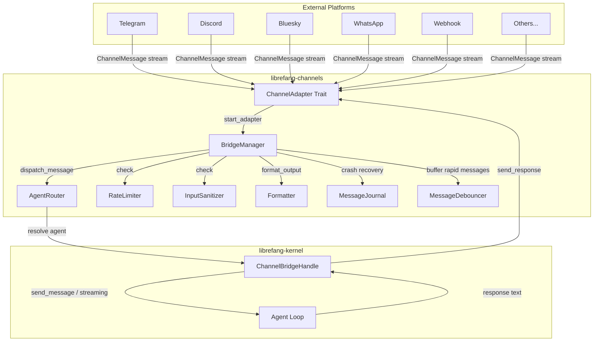

# Channel Adapters

# Channel Adapters Module

The `librefang-channels` crate provides the messaging infrastructure that connects external chat platforms (Telegram, Discord, Slack, Bluesky, WhatsApp, and many more) to LibreFang's agent kernel. Every platform is abstracted behind a uniform `ChannelAdapter` trait, while the `BridgeManager` orchestrates message routing, sanitization, rate limiting, and lifecycle management.

## Architecture



## Core Types

### `ChannelMessage`

The universal inbound message envelope. Every adapter produces these regardless of platform:

```rust
pub struct ChannelMessage {
    pub channel: ChannelType,
    pub platform_message_id: String,
    pub sender: ChannelUser,
    pub content: ChannelContent,
    pub target_agent: Option<String>,
    pub timestamp: DateTime<Utc>,
    pub is_group: bool,
    pub thread_id: Option<String>,
    pub metadata: HashMap<String, serde_json::Value>,
}
```

The `metadata` map carries platform-specific data (URIs, guild IDs, reply references, `account_id` for multi-bot routing, etc.) without polluting the typed fields.

### `ChannelContent`

An enum representing all supported inbound content types:

| Variant | Description |
|---|---|
| `Text(String)` | Plain text message |
| `Command { name, args }` | Slash command (e.g. `/status check`) |
| `Image { url, caption, mime_type }` | Photo with optional caption |
| `Voice { url, duration_seconds, caption }` | Voice message |
| `Video { url, caption, duration_seconds, mime_type }` | Video clip |
| `File { url, filename }` | File attachment |
| `Interactive { text, buttons }` | Message with inline buttons |
| `ButtonCallback { action, data }` | Callback from a button press |
| `Location { lat, lon }` | Geolocation |
| `MediaGroup { items }` | Album of media |
| `Poll { question, options }` | Poll creation |
| ... | Additional variants for stickers, animations, audio, edits, etc. |

### `ChannelType`

Identifies the platform. Uses an enum for well-known platforms and `Custom(String)` for anything else:

```rust
pub enum ChannelType {
    Telegram, Discord, Slack, WhatsApp, Signal, Matrix,
    Email, Teams, Mattermost, WeChat, WebChat, CLI,
    Custom(String),
}
```

### `SenderContext`

Carries full sender identity context to the kernel so agents know who is talking and from which channel:

```rust
pub struct SenderContext {
    pub channel: String,
    pub user_id: String,
    pub chat_id: Option<String>,
    pub display_name: String,
    pub is_group: bool,
    pub was_mentioned: bool,
    pub thread_id: Option<String>,
    pub account_id: Option<String>,
    pub auto_route: AutoRouteStrategy,
    pub group_participants: Vec<ParticipantRef>,
    // ...
}
```

Built from an incoming `ChannelMessage` by `build_sender_context()` in the bridge, incorporating per-channel overrides for auto-routing parameters.

## The `ChannelAdapter` Trait

Every platform adapter implements this async trait:

```rust
#[async_trait]
pub trait ChannelAdapter: Send + Sync {
    fn name(&self) -> &str;
    fn channel_type(&self) -> ChannelType;

    async fn start(&self) -> Result<Pin<Box<dyn Stream<Item = ChannelMessage> + Send>>, Error>;
    async fn send(&self, user: &ChannelUser, content: ChannelContent) -> Result<(), Error>;
    async fn send_typing(&self, user: &ChannelUser) -> Result<(), Error>;
    async fn stop(&self) -> Result<(), Error>;

    // Optional methods with default implementations:
    async fn send_in_thread(&self, user: &ChannelUser, content: ChannelContent, thread_id: &str) -> Result<(), Error>;
    async fn send_reaction(&self, user: &ChannelUser, message_id: &str, reaction: &LifecycleReaction) -> Result<(), Error>;
    fn suppress_error_responses(&self) -> bool { false }
    fn typing_events(&self) -> Option<mpsc::Receiver<TypingEvent>> { None }
    async fn create_webhook_routes(&self) -> Option<(axum::Router, MessageStream)>;
}
```

**Key methods:**

- **`start()`** — Returns a `Stream<Item = ChannelMessage>`. Polling adapters (Bluesky, WeChat) produce items on a timer; webhook adapters (Telegram, Slack) produce items when HTTP requests arrive.
- **`send()`** — Delivers a response back to the user. The adapter handles platform-specific formatting and API calls.
- **`create_webhook_routes()`** — Optionally returns an `axum::Router` to be mounted on the shared API server. This avoids each adapter running its own HTTP server. The bridge calls this first and falls back to `start()` only when no webhook routes are provided.

## Bridge System

### `ChannelBridgeHandle` (Trait)

Defined in `librefang-channels` but implemented in `librefang-api` on the real kernel. This inversion avoids circular dependencies — the channels crate never imports the kernel. The trait exposes over 40 methods covering:

| Category | Methods |
|---|---|
| **Core messaging** | `send_message`, `send_message_with_sender`, `send_message_with_blocks_and_sender`, `send_message_streaming_with_sender_status` |
| **Agent management** | `find_agent_by_name`, `list_agents`, `spawn_agent_by_name` |
| **Session control** | `reset_session`, `reboot_session`, `compact_session`, `set_model`, `stop_run` |
| **Authorization** | `authorize_channel_user` |
| **Channel config** | `channel_overrides` |
| **Reply intent** | `classify_reply_intent` |
| **Automation** | `list_workflows_text`, `run_workflow_text`, `list_triggers_text`, `create_trigger_text`, `list_schedules_text`, `manage_schedule_text` |
| **Approvals** | `list_approvals_text`, `resolve_approval_text`, `subscribe_events` |
| **Delivery tracking** | `record_delivery` |
| **Proactive push** | `send_channel_push` |

Most methods have sensible default implementations so the trait can be implemented incrementally.

### `BridgeManager`

Owns all running adapters and dispatches inbound messages to agents. Created via:

```rust
let manager = BridgeManager::new(kernel_handle, router)
    .with_sanitizer(kernel_handle, router, &sanitize_config)
    .with_journal(journal);
```

**Lifecycle:**

1. **`start_adapter(adapter)`** — Subscribes to the adapter's message stream. Each inbound message spawns a concurrent task (bounded by a semaphore of 32) so slow LLM calls don't block subsequent messages.
2. **`take_webhook_router()`** — After all adapters are started, call this to collect webhook routes and mount them under `/channels/{name}/webhook` on the API server.
3. **`push_message()`** — Entry point for the REST API push endpoint to send outbound messages proactively.
4. **`stop()`** — Signals shutdown to all dispatch loops, stops each adapter, and awaits all tasks.

### Message Dispatch Flow

When a `ChannelMessage` arrives from an adapter stream:

```
1. Input Sanitization
   ├── Check for prompt injection patterns
   ├── Warn mode: log + allow
   └── Block mode: send rejection + return

2. Fetch Channel Overrides
   └── output_format, threading, dm_policy, group_policy, rate limits, debounce config

3. DM/Group Policy Check
   ├── DM: apply dm_policy (Ignore / AllowedOnly / Respond)
   └── Group: apply group_policy (Ignore / CommandsOnly / MentionOnly / All)
       ├── Check was_mentioned flag
       ├── Check regex trigger patterns (with vocative guard)
       └── Optional: LLM reply-intent precheck

4. Rate Limiting
   ├── Global per-channel limit
   └── Per-user limit

5. Command Handling (if ChannelContent::Command)
   ├── Check is_command_allowed against channel overrides
   ├── Special UI commands (/agents, /models) → interactive keyboards
   ├── Bot commands (/help, /agent, /reset, etc.)
   └── Blocked commands → fall through to agent as text

6. Multimodal Handling
   ├── Image → download + base64 encode → ContentBlock::Image
   └── Voice/Video/File → text description fallback

7. Agent Resolution
   ├── Thread-route agent (from metadata)
   ├── BindingContext routing (account_id, guild_id, peer_id)
   ├── User default
   └── Fallback: "assistant" → first available agent

8. Send to Agent
   ├── Lifecycle reaction (👍 → 🧠 → ✅/❌)
   ├── Streaming send (when adapter supports it)
   ├── Send with blocks (for images) or plain text
   └── Stale agent re-resolution on "Agent not found"

9. Response Delivery
   ├── Format output for channel (Markdown → HTML/Plain)
   ├── Send in thread (if threading enabled)
   └── Record delivery result
```

### Message Debouncing

When `message_debounce_ms` is configured in channel overrides, the `MessageDebouncer` buffers rapid-fire messages from the same sender:

- Each unique `(channel_type, sender_platform_id)` key gets its own buffer
- Messages accumulate until either the debounce timer fires, the max timer fires, or the buffer reaches `max_buffer` entries
- `typing_events` from the adapter extend the debounce window (user is still composing)
- On flush, buffered messages are merged: same-type commands concatenate args, text messages join with newlines, image blocks are collected

This is essential for platforms like WhatsApp where voice, image, and text messages arrive as separate events within seconds of each other.

## Bluesky Adapter (Example)

The `BlueskyAdapter` demonstrates a polling-based adapter pattern. Key characteristics:

**Authentication:** Uses AT Protocol app passwords (not account passwords). The app password is stored in a `Zeroizing<String>` that securely wipes memory on drop.

**Session management:**
- `create_session()` — `com.atproto.server.createSession` with identifier + app password
- `refresh_session()` — `com.atproto.server.refreshSession` using the refresh JWT; falls back to full `create_session()` on failure
- `get_token()` — Returns a valid access JWT, automatically refreshing when within 5 minutes of the 2-hour session expiry
- Sessions are cached in an `Arc<RwLock<Option<BlueskySession>>>`

**Inbound polling:**
- Polls `app.bsky.notification.listNotifications` every 5 seconds
- Only processes `mention` and `reply` reasons (skips likes, follows, reposts)
- Tracks `indexedAt` to avoid reprocessing
- Calls `app.bsky.notification.updateSeen` to mark notifications as read
- Exponential backoff on errors (up to 60 seconds)

**Outbound posting:**
- Uses `com.atproto.repo.createRecord` with `app.bsky.feed.post` record type
- Messages exceeding 300 grapheme clusters are split via `split_message()`
- Supports reply threading via the `reply_ref` metadata field

**Builder pattern:**
```rust
let adapter = BlueskyAdapter::new("alice.bsky.social".into(), "app-pwd".into())
    .with_account_id(Some("bot-1".into()));
```

## Agent Router

The `AgentRouter` resolves which agent should handle a given message, using a layered strategy:

1. **Thread binding** — If the message carries `thread_route_agent` metadata, resolve that named agent directly
2. **Binding context** — Match on `(channel, account_id, guild_id, peer_id)` tuples
3. **User default** — Previously set via explicit `/agent` command or auto-route
4. **Channel default** — Configured default agent for the channel
5. **Fallback** — Try "assistant", then first available agent; auto-set as user default

On "Agent not found" errors, `try_reresolution()` attempts to re-resolve the channel default agent by name, handling cases where agents were recycled or restarted with new IDs.

## Security Layers

### Input Sanitization

The `InputSanitizer` checks inbound text for prompt injection patterns before any command parsing or agent dispatch:

```rust
match sanitizer.check(text) {
    SanitizeResult::Clean => { /* proceed */ }
    SanitizeResult::Warned(reason) => { /* log, proceed */ }
    SanitizeResult::Blocked(reason) => { /* reject, do not forward to agent */ }
}
```

Checks run on text, image captions, voice captions, and video captions. Configuration comes from `SanitizeConfig` (mode: off/warn/block, pattern lists).

### Rate Limiting

`ChannelRateLimiter` enforces two layers from `ChannelOverrides`:
- `rate_limit_per_minute` — Global limit across all users on the channel
- `rate_limit_per_user` — Per-user limit, keyed by `sender_user_id` (falls back to `platform_id`)

### Group Message Gating

Group messages go through additional filtering to prevent the bot from responding to conversations it shouldn't:

- **`GroupPolicy::Ignore`** — Drop all group messages
- **`GroupPolicy::CommandsOnly`** — Only process slash commands
- **`GroupPolicy::MentionOnly`** — Only respond when directly mentioned, or when a regex trigger pattern matches, or when the message is a command
- **`GroupPolicy::All`** — Process everything (optionally with `reply_precheck` for LLM-based intent classification)

**Vocative addressee guard** (`LIBREFANG_GROUP_ADDRESSEE_GUARD=on`): When enabled, the system detects leading vocative forms ("Caterina, chiedi...") and abstains from responding when the turn is addressed to another participant. This prevents false triggers from substring pattern matches mid-sentence.

### Credential Security

Adapters handle API tokens and passwords carefully:
- `Zeroizing<String>` wraps secrets (Bluesky app passwords, Webex tokens, Twist tokens) — memory is overwritten on drop
- HTTP clients are created via `crate::http_client::new_client()` which applies consistent TLS and timeout settings
- Webhook adapters validate signatures (HMAC-SHA256) on incoming requests

## Group Trigger Patterns

Group trigger patterns are compiled into a `RegexSet` and cached globally via `OnceLock<DashMap>` for efficient reuse. The cache key is the patterns joined by a Unicode separator, so identical pattern sets share the compiled object.

When the addressee guard is active, a two-stage check runs:
1. `RegexSet::is_match()` — Substring match against trigger patterns
2. `is_vocative_trigger()` — Positional check ensuring the pattern appears at a vocative position (start of turn or after punctuation boundary), and no other vocative precedes it

## Command Policy

Channels can restrict which commands are available:

```
Precedence: disable_commands > allowed_commands > blocked_commands
```

- `disable_commands: true` — All commands blocked, forwarded to agent as text
- `allowed_commands: ["/agent", "/help"]` — Only these commands are dispatched
- `blocked_commands: ["/spawn"]` — Everything except these
- Config entries match with or without leading `/` (`"agent"` and `"/agent"` are equivalent)

Blocked commands are reconstructed as their raw text (`"/agent admin"`) and forwarded to the agent so the user's intent isn't lost.

## Crash Recovery

When configured with a `MessageJournal`, the bridge logs messages before dispatch and marks them complete after successful delivery:

```rust
let manager = BridgeManager::new(handle, router).with_journal(journal);
let pending = manager.recover_pending().await; // After restart
manager.compact_journal().await;                // On clean shutdown
```

The journal enables at-least-once processing: after a crash, `recover_pending()` returns messages that were in-flight, and the caller re-dispatches them.

## Adding a New Adapter

1. **Create a new file** in `librefang-channels/src/` (e.g. `foo.rs`)
2. **Implement `ChannelAdapter`** with at minimum `name()`, `channel_type()`, `start()`, `send()`, and `stop()`
3. **For webhook-based adapters**, implement `create_webhook_routes()` returning an `axum::Router` and a message stream — this lets the bridge mount your routes on the shared API server
4. **Register the module** in `librefang-channels/src/lib.rs`
5. **Add routing** in `librefang-api/src/channel_bridge.rs` to instantiate your adapter from config

Adapter conventions:
- Use `Zeroizing<String>` for all API tokens and secrets
- Call `split_message(text, MAX_LEN)` when platforms have character limits
- Populate `metadata` with platform-specific fields (URIs, thread refs, account IDs)
- Mark `is_group: true` for group/channel messages so the bridge applies group policies
- Set `thread_id` when the platform supports topic threading (Telegram forums, Slack threads)