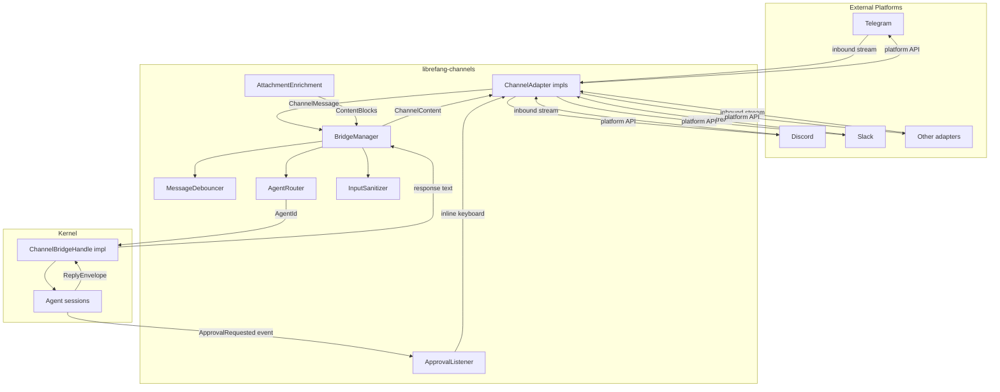
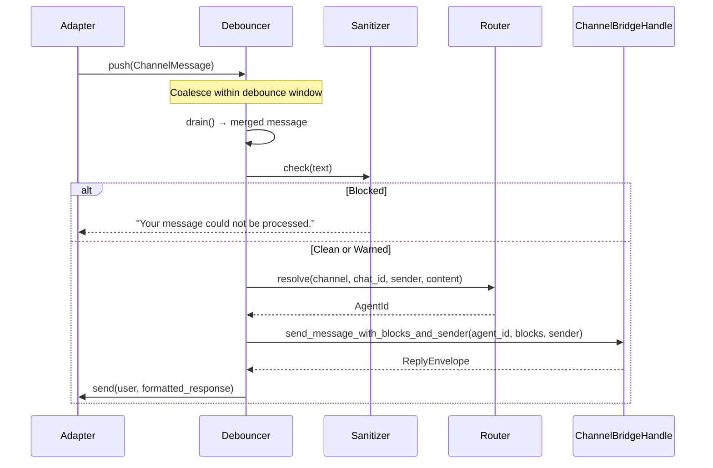
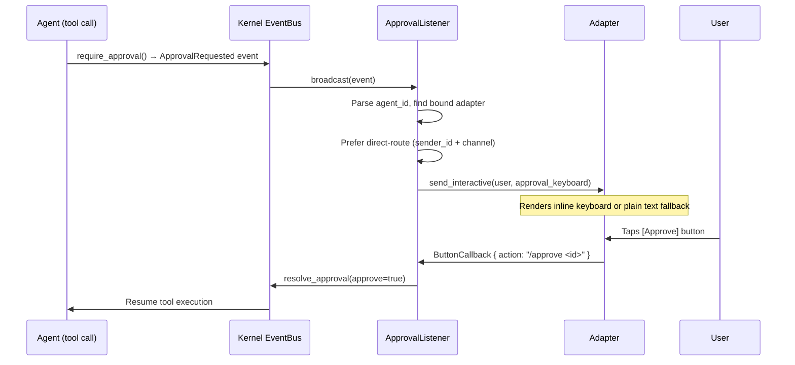

# Channel Bridge & Messaging

# Channel Bridge & Messaging

## Overview

The Channel Bridge & Messaging module (`librefang-channels`) is the layer between external chat platforms (Telegram, Discord, Slack, etc.) and the LibreFang agent kernel. It normalizes inbound messages from heterogeneous channel adapters, routes them to the correct agent, dispatches responses back through the originating adapter, and enriches file attachments so the LLM receives usable content regardless of upload path.

## Architecture



## Key Components

### `ChannelBridgeHandle` Trait

Defined in `bridge.rs`, implemented by the kernel (in `librefang-api`). This trait is the anti-dependency-inversion seam: `librefang-channels` cannot depend on the kernel directly, so it defines the interface it needs and the kernel satisfies it.

The trait exposes operations in several groups:

| Group | Methods | Purpose |
|-------|---------|---------|
| **Messaging** | `send_message`, `send_message_with_blocks`, `send_message_with_sender`, `send_message_with_blocks_and_sender`, `send_message_streaming*` | Send text or multimodal content to an agent, optionally streaming deltas back |
| **Session management** | `reset_session`, `reboot_session`, `compact_session`, `reset_channel_session`, `reboot_channel_session`, `compact_channel_session` | Clear or compact agent context. Channel-scoped variants (`_channel_session`) operate only on the session tied to `(channel, chat_id)` without affecting sibling surfaces (#4868) |
| **Agent lifecycle** | `find_agent_by_name`, `list_agents`, `spawn_agent_by_name`, `set_model`, `stop_run` | CRUD operations on running agents |
| **Automation** | `list_workflows_text`, `run_workflow_text`, `list_triggers_text`, `create_trigger_text`, `delete_trigger_text`, `list_schedules_text`, `manage_schedule_text` | Text-formatted views of workflows, triggers, and cron jobs |
| **Approvals** | `list_approvals_text`, `resolve_approval_text`, `subscribe_events` | Approval request listing, resolution (with optional TOTP), and event bus subscription |
| **Media** | `transcribe_inbound_audio`, `describe_inbound_image` | Honor `[media]` kernel config to transcribe audio or describe images on inbound attachments |
| **Config** | `channel_overrides`, `agent_channel_overrides`, `agent_channel_allowlist`, `channels_download_dir`, `channels_download_max_bytes` | Per-channel and per-agent configuration accessors |

Most methods have sensible defaults (return "not available" text, fail-open, or no-op). Production implementations override what they need; test mocks inherit the defaults.

### `BridgeManager`

The central orchestrator. Owns all running channel adapters and manages their lifecycle.

**Construction:**
```rust
// Basic
let bm = BridgeManager::new(kernel_handle, router);

// With custom sanitizer config
let bm = BridgeManager::with_sanitizer(kernel_handle, router, &sanitize_config);

// With message journal for crash recovery
let bm = bm.with_journal(journal);
```

**Key operations:**

- **`start_adapter(adapter)`** — Subscribes to the adapter's message stream and spawns dispatch tasks. Each inbound message is dispatched as a concurrent tokio task so slow LLM calls don't block subsequent messages. A semaphore (default 32 concurrent tasks) prevents unbounded memory growth under burst traffic. On startup, stale download files (>24h) are swept from the upload directory.

- **`start_approval_listener()`** — Subscribes to the kernel event bus and forwards `ApprovalRequested` events as inline keyboards (or plain text fallback) to the appropriate adapter recipients. Routes directly back to the originating chat when the event carries `sender_id` + `channel`.

- **`stop()` / `abort()`** — Graceful shutdown signals all dispatch loops, awaits task completion, and stops each adapter. `abort()` is the `&self` hard-stop variant for hot-reload scenarios where `Arc::try_unwrap` fails due to outstanding strong references (#5142).

- **`push_message(channel_type, recipient, message, thread_id)`** — Proactive outbound messages from the REST API push endpoint.

- **`take_webhook_router()`** — Collects webhook routes from all adapters into a single Axum router for mounting under `/channels` on the main API server.

- **`track_task(handle)`** — External spawners must register here so their tasks don't leak across hot-reloads.

### `ReplyEnvelope`

Two-channel reply structure returned by the bridge:

```rust
pub struct ReplyEnvelope {
    pub public: Option<String>,       // Sent to source chat (DM or group)
    pub owner_notice: Option<String>, // Private message to operator's DM only
}
```

- `from_public(s)` — Public-only reply.
- `silent()` — No public reply, no owner notice.
- `public_or_empty()` — Legacy compatibility for adapters not yet routing `owner_notice`.

Adapters that don't support owner-side delivery should ignore `owner_notice` and forward only `public`.

### `MessageDebouncer`

When `message_debounce_ms > 0` in channel overrides, rapid messages from the same sender are coalesced into a single dispatch. This prevents the LLM from seeing fragmented multi-part messages as separate turns.

**Configuration via `ChannelOverrides`:**
- `message_debounce_ms` — Initial delay before flushing (default: 0 = disabled)
- `message_debounce_max_ms` — Hard ceiling; flush happens regardless after this (default: 30000)
- `message_debounce_max_buffer` — Message count cap; triggers immediate flush (default: 64)

**Flush triggers (five paths):**
1. Max-timer fires (hard ceiling elapsed)
2. Immediate (buffer full or max duration exceeded on push)
3. Debounce-timer (no new messages for `debounce_ms`)
4. Typing-triggered (user started typing again after a pause)
5. Typing-stop (user stopped typing, short delay then flush)

**Merge semantics:**
- Single-message buffer → passes through unchanged
- Multiple commands with the same name → args are concatenated
- Multiple text messages → joined with `\n`
- Mixed content types → all converted to text and joined
- Image blocks from any message are accumulated into a shared `Vec<ContentBlock>`

The flush channel is bounded at 1024 entries to prevent OOM when the dispatcher stalls (#3580).

### Attachment Enrichment (`attachment_enrich.rs`)

When the channel bridge downloads a non-image file, `enrich_saved_file()` produces extra LLM-visible `ContentBlock`s based on file content. This gives the LLM parity with the dashboard upload flow without requiring a separate file-reader tool call.

**Decision matrix:**

| Input | Action |
|-------|--------|
| `application/pdf` or filename/magic-bytes PDF | Extract text via `pdf_extract`, emit `[Attached PDF: name (N bytes)]\n\n<text>` |
| `text/*` or recognized text-like MIME/extension | Read as UTF-8, emit `[Attached file: name (N bytes[, truncated])]\n\n<text>` |
| Images | Empty (bridge already emits `ContentBlock::ImageFile`; double-encoding wastes tokens) |
| Other binary | Empty (caller emits path-only block) |

**PDF detection fallback chain** (`looks_like_pdf`):
1. If MIME is authoritative (not empty, not `octet-stream`, not `binary`) → trust it, skip heuristic
2. If filename ends in `.pdf` → treat as PDF
3. If file starts with `%PDF-` magic bytes → treat as PDF

This handles platforms like Telegram that upload documents as `application/octet-stream`.

**Safety guarantees:**
- PDF extraction is wrapped in `catch_unwind(AssertUnwindSafe(...))` — malformed or encrypted PDFs that panic in `pdf_extract`/`lopdf` are caught and surfaced as `[Could not extract text: PDF parser panicked]`
- Maximum extracted text length: 200,000 chars (`MAX_ENRICHED_TEXT_CHARS`), consistent with `librefang-runtime::pdf_text` and `librefang-api` limits
- Truncation markers: `[…PDF truncated at 200K chars…]` or `[…file truncated at 200K chars…]`
- Audio/voice files are intentionally not enriched — they go through `media_transcribe` out of band

**Text-like detection** (`is_text_like`):
- Matches `text/*` MIME prefix
- Matches known application MIME types (json, xml, yaml, toml, ipynb, javascript, typescript, sql, graphql)
- Falls back to extension matching against 70+ code/data/config extensions (`.rs`, `.py`, `.go`, `.sql`, `.env`, `.dockerfile`, etc.)

## Message Dispatch Flow



### Input Sanitization

Before dispatch, every text-bearing message passes through `InputSanitizer` configured by `SanitizeConfig`. Three outcomes:

- **`Clean`** — Pass through
- **`Warned(reason)`** — Log the warning but allow through (suspicious but not definitive injection)
- **`Blocked(reason)`** — Log and reply with a generic rejection message; the message never reaches the agent

Command messages are checked by reconstructing their text form so slash-command args cannot carry injection payloads.

### Agent Routing

`AgentRouter` resolves an inbound `(channel, chat_id, sender, content)` tuple to an `AgentId`:

- **Direct route** — `/chat <name>` sets a sticky binding
- **Group trigger patterns** — Regex patterns from config; matching messages route to the configured agent
- **Vocative trigger** — Positional name at start of message ("Alice, what do you think...")
- **Channel default** — The adapter's configured default agent
- **Bindings** — `AgentBinding` entries that map (channel, peer_id) to an agent

### Output Formatting

Responses are formatted per-channel before delivery. `OutputFormat` determines the rendering:

- `TelegramHtml` → Markdown converted to Telegram HTML subset
- `SlackMrkdwn` → Slack's mrkdwn dialect
- `Markdown` → Passthrough
- `PlainText` → Strip formatting

`PrefixStyle` controls whether responses are prefixed with a phase emoji (🧠 thinking, 🔧 using tool, ✅ done).

## Approval Flow



The approval listener scopes delivery carefully (#4985):

1. **Direct route** — If the event carries `sender_id` + `channel`, the keyboard goes straight back to that chat (including group chats via `chat_id`)
2. **Bound adapter** — If `channel_default` matches the requesting agent, use `notification_recipients()`
3. **Binding-derived** — If no channel default, walk `AgentBinding` peer IDs for the adapter
4. **Drop with warning** — If nothing matches, log a warning (operator misconfiguration)

`build_approval_interactive()` produces an `InteractiveMessage` with two buttons (`/approve`, `/reject`). The `suppress_button_command_ack()` function prevents duplicate confirmation text when the user clicks a button versus typing the slash command — text-only channels still get the text ack.

## Channel Overrides

`ChannelOverrides` (from `librefang_types::config`) controls per-channel behavior:

| Field | Default | Effect |
|-------|---------|--------|
| `output_format` | Per-channel default | Telegram → `TelegramHtml`, Slack → `SlackMrkdwn`, etc. |
| `prefix_style` | `PhaseEmoji` | Controls phase emoji on responses |
| `threading` | `false` | Enable thread-scoped replies |
| `group_policy` | `MentionOnly` | How the bot responds in groups |
| `dm_policy` | `Allow` | Whether DMs are accepted |
| `message_debounce_ms` | `0` | Debounce window (0 = disabled) |
| `message_debounce_max_ms` | `30000` | Hard debounce ceiling |
| `message_debounce_max_buffer` | `64` | Buffer cap before forced flush |
| `group_trigger_patterns` | `[]` | Regex patterns that trigger bot response |
| `disable_commands` | `false` | Block all slash commands |

Overrides are resolved in precedence order: adapter-carried > kernel `channel_overrides` lookup. Agent-level overrides (`agent.toml [channel_overrides]`) take priority over channel-level ones.

## Lifecycle Management

### Startup

1. `BridgeManager::new()` initializes shutdown channels, sanitizer, rate limiter
2. For each adapter: `start_adapter()` subscribes to message stream, optionally sets up debouncer, spawns dispatch loop
3. `start_approval_listener()` subscribes to kernel event bus
4. `take_webhook_router()` collects webhook routes for the main API server
5. Stale uploads (>24h) are swept from the download directory

### Shutdown

Two paths:

- **Graceful (`stop()`)** — Sends shutdown signal, stops each adapter (releases ports/connections), awaits all tracked tasks, clears abort handles
- **Hard (`abort()`)** — Callable on `&self` (shared reference). Sends shutdown signal then aborts every tracked task handle. Used during hot-reload when `Arc::try_unwrap` fails (#5142)

### Hot-Reload

`reload_channels_from_disk` swaps the old `BridgeManager` out of an `ArcSwap` and calls `abort()` on the old instance. Background tasks from external spawners must be registered via `track_task()` or they leak across reloads.

### Crash Recovery

When configured with `with_journal()`, the bridge can recover messages that were in-flight during a crash:

```rust
let pending = bm.recover_pending().await;
// Re-dispatch pending entries to agents
bm.compact_journal().await; // Flush on shutdown
```

## Group Interaction Model

Group messages follow a multi-stage trigger pipeline:

1. **Explicit mention** — `@botname` or configured aliases
2. **Group trigger patterns** — Regex matching on message text
3. **Vocative trigger** — Leading name match ("Alice, ...")
4. **Addressee guard** — If the vocative resolves to another participant, suppress reply (the message is addressed to a human, not the bot)
5. **LLM classify** — `classify_reply_intent()` as a final heuristic

Thread ownership prevents duplicate replies from multiple agents in shared group threads (#3334). The `ThreadOwnershipRegistry` tracks which agent claimed a thread and suppresses other agents from responding.

## File Handling

### Download Directory

`effective_channels_download_dir()` returns the configured directory or the legacy `<temp>/librefang_uploads` default. Use this everywhere instead of re-deriving the fallback (#4435).

### Image Downloads

`download_image_to_blocks()` fetches remote images and produces `ContentBlock::Image` (base64) or `ContentBlock::ImageFile` (local path) depending on size and format. Magic-byte detection (`detect_image_magic`) handles cases where the HTTP Content-Type is wrong.

### File Downloads

`download_file_to_blocks()` handles non-image attachments. After saving to disk, `enrich_saved_file()` adds content-aware text blocks for PDFs and text-like files.

### Audio/Video

Audio and voice attachments are downloaded but not enriched inline. They go through `transcribe_inbound_audio()` (respects `[media] audio_transcription` config). The bridge surfaces `[Transcription unavailable]` on failure without dropping the message (#4999).

### Images

`describe_inbound_image()` (respects `[media] image_description` config, default ON) generates text descriptions for vision-impaired or text-only contexts.

## Important Constants

| Constant | Value | Purpose |
|----------|-------|---------|
| `MAX_ENRICHED_TEXT_CHARS` | 200,000 | Hard cap on extracted attachment text |
| `FLUSH_CHANNEL_CAP` | 1,024 | Bounded debouncer flush channel (#3580) |
| Default semaphore | 32 | Max concurrent dispatch tasks per adapter |
| Stale upload sweep | 24 hours | Files older than this are deleted on startup |

## Group Trigger Pattern Cache

Compiled `RegexSet` patterns are cached in a `DashMap` keyed by the joined pattern string. This avoids recompiling regexes on every inbound message. Invalid patterns are logged and skipped (fail-open).

## Testing Conventions

- Test mocks implement `ChannelBridgeHandle` with default no-op/stub methods
- `record_consumer_lag` has no default impl — mocks must explicitly write an empty implementation to acknowledge the requirement
- Attachment enrichment tests use `tempfile::NamedTempFile` for on-disk fixtures
- The approval listener is tested via `build_approval_interactive()` payload assertions rather than spinning up real tokio tasks