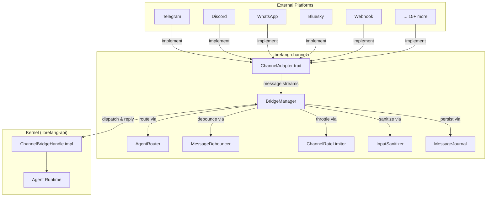

# Channel Integrations

# Channel Integrations (`librefang-channels`)

## Purpose

The Channel Integrations module connects external messaging platforms to LibreFang's agent system. It provides a uniform adapter abstraction over heterogeneous chat protocols (Telegram, Discord, Slack, WhatsApp, Bluesky, XMPP, WeChat, and more), handles message routing, debouncing, rate limiting, input sanitization, group-message gating, and lifecycle reactions — all mediated through a bridge layer that decouples channel logic from the kernel.

## Architecture



## Core Types

All adapters exchange data through shared types defined in `types.rs`:

| Type | Role |
|---|---|
| `ChannelType` | Enum of supported platforms (`Telegram`, `Discord`, `Custom(String)`, etc.) |
| `ChannelMessage` | Unified inbound envelope — sender, content, metadata, timestamps |
| `ChannelContent` | Discriminated union: `Text`, `Command`, `Image`, `Voice`, `Video`, `FileData`, `Interactive`, `ButtonCallback`, `MediaGroup`, and more |
| `ChannelUser` | Sender identity: `platform_id`, `display_name`, optional `librefang_user` |
| `SenderContext` | Full routing context sent to the kernel: channel, user/chat IDs, group flag, mention status, auto-route config, participant roster |
| `ChannelAdapter` | The trait every adapter implements (see below) |
| `InteractiveButton` | Inline button with `label`, `action`, optional `url` and `style` |
| `LifecycleReaction` | Emoji reaction tied to an `AgentPhase` (Thinking, Done, Error) |

`split_message(text, max_len)` is used by adapters whose platforms impose character limits (e.g., Bluesky's 300-grapheme cap). It splits on grapheme boundaries to avoid breaking Unicode.

## The `ChannelAdapter` Trait

Every platform adapter implements `ChannelAdapter` (from `types.rs`, uses `async_trait`):

```rust
#[async_trait]
pub trait ChannelAdapter: Send + Sync {
    fn name(&self) -> &str;
    fn channel_type(&self) -> ChannelType;
    async fn start(&self) -> Result<Pin<Box<dyn Stream<Item = ChannelMessage> + Send>>, Error>;
    async fn send(&self, user: &ChannelUser, content: ChannelContent) -> Result<(), Error>;
    async fn send_typing(&self, user: &ChannelUser) -> Result<(), Error>;
    async fn stop(&self) -> Result<(), Error>;
    // Optional defaults provided:
    // send_in_thread, send_reaction, suppress_error_responses,
    // typing_events, create_webhook_routes
}
```

**Inbound flow**: `start()` returns a `Stream<Item = ChannelMessage>`. The bridge polls this stream and dispatches each message to an agent.

**Outbound flow**: `send()` delivers a `ChannelContent` to a specific user. For platforms without threading support, `send_in_thread` falls back to `send` by default.

**Webhook adapters**: `create_webhook_routes()` optionally returns `(axum::Router, Stream)` — the router is mounted at `/channels/{name}/webhook` on the main API server, and the stream provides parsed messages.

## `BridgeManager`

The `BridgeManager` owns all running adapters and orchestrates the dispatch pipeline.

### Construction

```rust
let manager = BridgeManager::new(kernel_handle, agent_router)
    .with_sanitizer(&sanitize_config)
    .with_journal(journal);
```

### Starting an Adapter

`start_adapter()` performs these steps:

1. **Webhook route collection** — if the adapter provides routes via `create_webhook_routes()`, they're collected for later mounting; otherwise `start()` is called to initiate polling/WebSocket.
2. **Channel overrides lookup** — fetches `ChannelOverrides` from the kernel to determine debounce settings, rate limits, and group policy.
3. **Stream consumption** — spawns a tokio task that reads from the adapter's message stream in a `select!` loop alongside a shutdown signal.
4. **Dispatch** — each message is spawned as a concurrent task (bounded by a semaphore of 32 permits) so that slow LLM calls don't block subsequent messages.

### Debounce Path

When `message_debounce_ms > 0` in channel overrides, messages from the same sender are buffered and coalesced. The `MessageDebouncer`:

- Buffers messages keyed by `{channel_type}:{sender_platform_id}`.
- Flushes on: debounce timer expiry, max-wait timer (`debounce_max_ms`), buffer-full (`debounce_max_buffer`), or typing-stop events.
- Merges multiple `Text` messages by joining with newlines; merges same-name `Command` messages by concatenating args.

### Shutdown

`stop()` signals shutdown via a `watch` channel, calls `adapter.stop()` on each adapter (to release ports/connections), and joins all tasks.

## `ChannelBridgeHandle` — Kernel Interface

Defined in `bridge.rs`, implemented on the actual kernel in `librefang-api`. This trait inverts the dependency so `librefang-channels` never imports the kernel:

| Method Group | Key Methods | Purpose |
|---|---|---|
| **Core messaging** | `send_message`, `send_message_with_sender`, `send_message_with_blocks_and_sender` | Route text/blocks + sender context to an agent |
| **Streaming** | `send_message_streaming_with_sender_status` | Returns `(Receiver<String>, OneShotReceiver<Result>)` for progressive display |
| **Agent management** | `find_agent_by_name`, `list_agents`, `spawn_agent_by_name` | Lookup and create agents |
| **Session control** | `reset_session`, `reboot_session`, `compact_session`, `set_model`, `stop_run` | Per-agent lifecycle |
| **Authorization** | `authorize_channel_user` | RBAC check (default: allow all) |
| **Overrides** | `channel_overrides`, `agent_channel_overrides` | Fetch per-channel and per-agent config |
| **Group intelligence** | `classify_reply_intent` | Lightweight LLM check: should the bot reply to this group message? |
| **Automation** | `run_workflow_text`, `create_trigger_text`, `manage_schedule_text`, `resolve_approval_text` | Workflow/trigger/cron/approval operations |
| **Push** | `send_channel_push` | Proactive outbound delivery (REST API → channel) |
| **Events** | `subscribe_events` | Broadcast receiver for kernel events (approval requests, etc.) |

All methods have sensible no-op defaults so that mock/test implementations only need to override what they use.

## Message Dispatch Flow

When a `ChannelMessage` arrives from an adapter stream, `dispatch_message` executes this pipeline:

```
1. Webhook direct delivery check → (early return if deliver_only mode)
2. Input sanitization          → (block/reject if prompt injection detected)
3. Agent resolution            → (thread route → binding context → fallback)
4. Override resolution         → (agent-level overrides win over channel-level)
5. DM/Group policy check       → (ignore/commands_only/mention_only/all)
6. Rate limiting               → (global per-channel + per-user)
7. Command dispatch            → (/agents, /help, /status, etc.)
8. Agent send                  → (with sender context, streaming if supported)
9. Response formatting         → (agent prefix + output format)
10. Delivery recording         → (success/failure tracking)
```

### Agent Resolution (`resolve_or_fallback`)

1. **Thread routing** — if `metadata["thread_route_agent"]` is set, resolve that agent by name.
2. **Binding context** — `AgentRouter.resolve_with_context()` considers `account_id`, `guild_id`, user defaults.
3. **Fallback chain** — tries agent named `"assistant"`, then the first running agent, auto-setting the user default.

### Group Message Gating (`should_process_group_message`)

Controlled by `GroupPolicy` in `ChannelOverrides`:

| Policy | Behavior |
|---|---|
| `Ignore` | All group messages dropped |
| `CommandsOnly` | Only `/command` messages processed |
| `MentionOnly` | Requires explicit mention, `/command`, **or** regex trigger pattern match |
| `All` | Everything processed (optionally filtered by `reply_precheck` LLM call) |

The **addressee guard** (`LIBREFANG_GROUP_ADDRESSEE_GUARD=on`, off by default) adds positional vocative detection: if a group message opens with a vocative directed at another participant (e.g., `"Caterina, chiedi..."`), the bot stays silent even if a trigger pattern matches mid-sentence.

### Command Policy

Three layers of command access control:

1. `disable_commands: true` → all blocked
2. `allowed_commands` (whitelist) → only listed commands pass
3. `blocked_commands` (blacklist) → listed commands blocked, rest pass

Blocked commands are reconstructed as raw text (e.g., `"/agent admin"`) and forwarded to the agent as normal input instead.

### Stale Agent Re-resolution

When an agent send fails with "Agent not found" and the failed ID is the channel default, `try_reresolution` re-resolves the agent by name and retries once. This handles hot-reload scenarios where agents are respawned with new IDs.

## Input Sanitization

`InputSanitizer` (configured via `SanitizeConfig`) checks text content from `Text`, `Image.caption`, `Voice.caption`, and `Video.caption` for prompt injection patterns before any command parsing or agent dispatch:

- **Clean** → proceed
- **Warned** → log + proceed (suspicious but not definitive)
- **Blocked** → log + send generic rejection + return early

## Rate Limiting

`ChannelRateLimiter` applies two configurable limits from `ChannelOverrides`:

- `rate_limit_per_minute` — global across all users on a channel
- `rate_limit_per_user` — per-user (keyed by `sender_user_id`, which prefers `metadata["sender_user_id"]` over `platform_id` for DM scenarios)

When exceeded, a rate-limit message is sent to the user and dispatch stops.

## ReplyEnvelope

Outbound replies use a two-channel envelope:

```rust
pub struct ReplyEnvelope {
    pub public: Option<String>,        // → source chat (DM or group)
    pub owner_notice: Option<String>,  // → operator's DM only
}
```

This supports the `notify_owner` LLM tool: agents can produce both a public response and a private operator notification in a single turn. Adapters that don't support owner-side delivery ignore `owner_notice` and forward only `public`.

## Output Formatting & Agent Prefixing

`formatter::format_for_channel(text, output_format)` adapts LLM output for the target platform (Markdown, HTML, plain text).

`apply_agent_prefix(style, agent_name, text)` prepends the agent's name in the configured style:

| `PrefixStyle` | Output |
|---|---|
| `Off` | *(no prefix)* |
| `Bracket` | `[coder] response text` |
| `BoldBracket` | `**[coder]** response text` |

Idempotent — if the text already starts with the prefix, it's not doubled.

## Adapter Example: Bluesky

The Bluesky adapter (`bluesky.rs`) demonstrates the polling pattern:

- **Authentication**: `com.atproto.server.createSession` with identifier + app password. Session tokens cached in `Arc<RwLock<Option<BlueskySession>>>` with automatic refresh (refreshes at ~90 minutes; sessions last ~2 hours).
- **Inbound**: Polls `app.bsky.notification.listNotifications` every 5 seconds. Parses `mention` and `reply` reasons into `ChannelMessage` — text starting with `/` becomes `ChannelContent::Command`.
- **Outbound**: Posts via `com.atproto.repo.createRecord` with `app.bsky.feed.post` record type. Long messages are split at 300-grapheme boundaries using `split_message`.
- **Security**: App password is stored in `Zeroizing<String>` for automatic secure zeroization on drop.
- **Multi-bot**: Supports `account_id` for routing to different agents based on which Bluesky account received the message.

Key constants:
- `DEFAULT_SERVICE_URL`: `"https://bsky.social"`
- `MAX_MESSAGE_LEN`: `300` (grapheme clusters)
- `POLL_INTERVAL_SECS`: `5`

## Message Journal

When configured, `MessageJournal` provides crash recovery:

- `recover_pending()` returns journal entries that were in-flight at crash time.
- `compact_journal()` flushes and compacts on shutdown.
- Entries are recorded before agent dispatch and cleared after successful delivery.

## Webhook Router Collection

Adapters that receive messages via HTTP webhooks (e.g., WeCom, WhatsApp Business, Slack Events API) return `axum::Router` instances from `create_webhook_routes()`. `BridgeManager` collects these and nests them under `/{adapter_name}`. The combined router is extracted via `take_webhook_router()` and mounted at `/channels` on the main API server — without auth middleware, since webhook adapters handle their own signature verification.

## Adding a New Adapter

1. Create a new module (e.g., `src/matrix.rs`) implementing `ChannelAdapter`.
2. `start()` returns a `Stream<Item = ChannelMessage>` — use `mpsc::channel` + `ReceiverStream`.
3. `send()` delivers outbound content to the platform's API.
4. Optionally implement `create_webhook_routes()` for push-based platforms.
5. Register the adapter with `BridgeManager::start_adapter()` at startup.