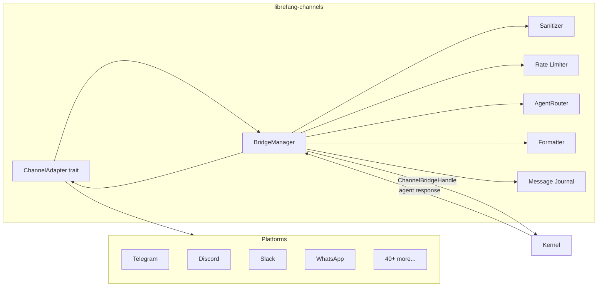

# Channel Integrations

# Channel Integrations

The `librefang-channels` crate is the messaging bridge layer for LibreFang Agent OS. It translates messages from 40+ external platforms into a unified `ChannelMessage` format and dispatches them to agents via the kernel, then delivers agent responses back through the originating channel.

## Architecture Overview



The crate has a hard dependency boundary: it **cannot** depend on `librefang-kernel` or `librefang-api` directly (to avoid circular dependencies). Instead, the kernel implements the `ChannelBridgeHandle` trait defined here, and passes it into `BridgeManager` at startup.

## Feature Flags

Channel adapters are individually gated behind Cargo feature flags prefixed with `channel-`:

```toml
# Cargo.toml — enable specific channels
[dependencies]
librefang-channels = { features = ["channel-telegram", "channel-discord"] }

# Or enable all 40+ channels at once
librefang-channels = { features = ["all-channels"] }
```

Core infrastructure (`bridge`, `types`, `router`, `sanitizer`, `rate_limiter`, `formatter`, `message_journal`) is always compiled regardless of feature selection.

## Key Types

### `ChannelMessage`

The unified inbound message envelope. Every adapter converts its platform-specific event into this structure:

```rust
pub struct ChannelMessage {
    pub channel: ChannelType,         // Telegram, Discord, Slack, etc.
    pub sender: ChannelUser,          // Platform user identity
    pub content: ChannelContent,      // Text, Image, Command, Voice, etc.
    pub is_group: bool,               // Group vs DM context
    pub thread_id: Option<String>,    // Thread/topic routing
    pub metadata: HashMap<String, Value>,  // Platform-specific extras
    pub platform_message_id: String,  // For lifecycle reactions
    pub timestamp: DateTime<Utc>,
}
```

### `ChannelContent`

An enum covering all supported inbound content types:

| Variant | Description |
|---|---|
| `Text(String)` | Plain text message |
| `Command { name, args }` | Parsed slash command (e.g. `/agent gpt4`) |
| `Image { url, caption, mime_type }` | Photo with optional caption |
| `Voice { url, duration_seconds, caption }` | Voice message |
| `Video { url, caption, duration_seconds, mime_type }` | Video clip |
| `Audio { url, caption, duration_seconds, mime_type }` | Audio file |
| `File { url, filename }` | Arbitrary file attachment |
| `FileData { filename, data, mime_type }` | In-memory file bytes |
| `Location { lat, lon }` | Shared coordinates |
| `Interactive { text, buttons }` | Outbound inline keyboard |
| `ButtonCallback { action, message_text }` | User clicked a button |
| `EditInteractive { message_id, text, buttons }` | Update an existing interactive message |
| `DeleteMessage { message_id }` | Delete a previously sent message |
| `Animation { url, caption, duration_seconds }` | GIF/animation |
| `Sticker { file_id }` | Platform sticker |
| `MediaGroup { items }` | Album of media |
| `Poll { question, options, is_anonymous }` | Poll creation |
| `PollAnswer { poll_id, option_ids }` | User voted on a poll |

### `ChannelAdapter` trait

Every channel adapter implements this async trait:

```rust
#[async_trait]
pub trait ChannelAdapter: Send + Sync {
    fn name(&self) -> &str;
    fn channel_type(&self) -> ChannelType;

    async fn start(&self) -> Result<Pin<Box<dyn Stream<Item = ChannelMessage> + Send>>>;
    async fn stop(&self) -> Result<()>;
    async fn send(&self, user: &ChannelUser, content: ChannelContent) -> Result<()>;

    // Optional methods with defaults
    async fn send_in_thread(&self, user: &ChannelUser, content: ChannelContent, thread_id: &str) -> Result<()>;
    async fn send_typing(&self, user: &ChannelUser) -> Result<()>;
    async fn send_reaction(&self, user: &ChannelUser, message_id: &str, reaction: &LifecycleReaction) -> Result<()>;
    fn supports_streaming(&self) -> bool;
    async fn send_streaming(&self, user: &ChannelUser, rx: Receiver<String>, thread_id: Option<&str>) -> Result<()>;
    async fn create_webhook_routes(&self) -> Option<(Router, Pin<Box<dyn Stream<Item = ChannelMessage> + Send>>)>;
    fn typing_events(&self) -> Option<Receiver<TypingEvent>>;
    fn suppress_error_responses(&self) -> bool;
}
```

Adapters that receive messages via webhook (Telegram, Slack, Discord, etc.) should implement `create_webhook_routes` to return an `axum::Router` and a message stream. This avoids each adapter spawning its own HTTP server — instead, `BridgeManager` collects all webhook routes and merges them into a single router mounted on the main API server at `/channels/{adapter_name}/webhook`.

### `SenderContext`

Propagated to the agent's system prompt so it knows who is messaging and from where:

```rust
pub struct SenderContext {
    pub channel: String,
    pub user_id: String,
    pub chat_id: Option<String>,
    pub display_name: String,
    pub is_group: bool,
    pub was_mentioned: bool,
    pub thread_id: Option<String>,
    pub account_id: Option<String>,
    pub auto_route: AutoRouteStrategy,
    pub group_participants: Vec<ParticipantRef>,
    pub use_canonical_session: bool,
    // ... auto-routing tuning fields
}
```

### `ChannelBridgeHandle` trait

The kernel's interface as seen by the channel layer. Defined here to break the circular dependency; implemented in `librefang-api` on the real kernel. Key methods:

| Method | Purpose |
|---|---|
| `send_message(agent_id, message)` | Basic agent call, returns text response |
| `send_message_with_sender(agent_id, message, sender)` | Agent call with identity context |
| `send_message_with_blocks(agent_id, blocks)` | Multimodal (text + images) agent call |
| `send_message_streaming_with_sender_status(...)` | Streaming with terminal status reporting |
| `find_agent_by_name(name)` | Resolve agent by manifest name |
| `list_agents()` | List running agents |
| `spawn_agent_by_name(name)` | Hot-spawn an agent |
| `reset_session(agent_id)` | Clear agent session |
| `compact_session(agent_id)` | Trigger LLM context compaction |
| `set_model(agent_id, model)` | Change an agent's model |
| `channel_overrides(channel_type, account_id)` | Get per-channel config overrides |
| `authorize_channel_user(...)` | RBAC check |
| `classify_reply_intent(text, sender, model)` | Lightweight LLM "should we reply?" check |
| `check_auto_reply(agent_id, message)` | Auto-reply evaluation |
| `subscribe_events()` | Kernel event bus subscription |
| `send_channel_push(channel_type, recipient, message, thread_id)` | Proactive outbound push |

Most methods have sensible defaults (no-ops or stubs) so the kernel implementation only needs to override what it supports.

## BridgeManager

`BridgeManager` is the central orchestrator. It:

1. Owns all running channel adapters
2. Subscribes to each adapter's message stream
3. Applies input sanitization, rate limiting, and group/DM policy checks
4. Routes messages to the correct agent via `AgentRouter`
5. Delivers agent responses back through the originating adapter
6. Manages lifecycle reactions (emoji phases: ⏳ → 🤔 → ✅/❌)
7. Optionally debounces rapid-fire messages from the same sender
8. Records message delivery outcomes for metrics

### Startup

```rust
let mut manager = BridgeManager::new(kernel_handle, router);

// Optional: enable crash-recovery journal
let manager = manager.with_journal(MessageJournal::new("journal.db")?);

// Start each configured adapter
manager.start_adapter(telegram_adapter).await?;
manager.start_adapter(discord_adapter).await?;

// Collect webhook routes for the main API server
let webhook_router = manager.take_webhook_router();
// Mount at /channels on your axum server
```

### Message Dispatch Pipeline

Every inbound message passes through this pipeline inside `dispatch_message`:

```
Inbound ChannelMessage
  │
  ├─ 1. Input Sanitization
  │     Checks for prompt injection patterns.
  │     Warn mode: log + allow. Block mode: reject + notify user.
  │
  ├─ 2. Channel Overrides
  │     Fetch per-channel config (output format, threading, policies).
  │
  ├─ 3. DM/Group Policy
  │     GroupPolicy::Ignore → drop
  │     GroupPolicy::CommandsOnly → drop non-commands
  │     GroupPolicy::MentionOnly → check mentions + trigger patterns
  │     GroupPolicy::All → allow (optionally with reply precheck)
  │
  ├─ 4. Rate Limiting
  │     Per-channel global limit + per-user limit.
  │
  ├─ 5. Command Handling
  │     Built-in slash commands (/help, /agents, /model, etc.)
  │     Blocked commands fall through to agent as text.
  │
  ├─ 6. Content Normalization
  │     Images → download + base64 for vision models
  │     Voice/Video/File → descriptive text fallback
  │     Button callbacks → command dispatch or text
  │
  ├─ 7. Agent Resolution
  │     Thread route → binding context → user default → "assistant" fallback
  │
  ├─ 8. RBAC Authorization
  │
  ├─ 9. Auto-Reply Check
  │
  ├─ 10. Journal Recording (crash recovery)
  │
  ├─ 11. Lifecycle Reactions
  │      Queued → Thinking → [Streaming] → Done/Error
  │
  └─ 12. Agent Call (streaming or buffered)
         Response formatted per channel → sent back
```

### Agent Resolution Logic

The `resolve_or_fallback` function determines which agent handles a message:

1. **Thread route** — if metadata contains `thread_route_agent`, resolve that agent by name
2. **Binding context** — `AgentRouter.resolve_with_context` checks account bindings, guild mappings, and user defaults
3. **Fallback chain** — look up agent named `"assistant"`, then first available running agent; auto-set as user default for future messages

If an agent ID becomes stale (agent was recreated), `try_reresolution` detects the "Agent not found" error, re-resolves the channel's default agent by name, and retries once.

### Message Debouncing

When a channel's overrides set `message_debounce_ms > 0`, `BridgeManager` enables a `MessageDebouncer` per sender. This coalesces rapid-fire messages (common in Telegram when users send voice + text + image in quick succession):

- First message starts a timer (`debounce_ms`)
- Subsequent messages buffer in a per-sender queue
- Typing events from the platform reset the debounce timer
- A hard maximum (`debounce_max_ms`) guarantees eventual flush
- Buffer size cap (`debounce_max_buffer`) forces early flush on volume

When flushed, multiple text messages are joined with newlines. Multiple commands with the same name have their arguments concatenated. Images are downloaded and accumulated into a single `ContentBlock` array for multimodal dispatch.

### Streaming Support

Adapters that implement `supports_streaming() -> true` receive incremental text deltas via `send_streaming`. The bridge uses `send_message_streaming_with_sender_status` which returns both a text-delta channel **and** a oneshot status receiver. This distinguishes four outcomes:

| Stream | Kernel | Result |
|--------|--------|--------|
| ✅ | ✅ | Normal success, Done reaction |
| ✅ | ❌ | Partial text delivered, Error reaction, delivery recorded as failed |
| ❌ | ✅ | Fall back to `send_response` with buffered text, Done reaction |
| ❌ | ❌ | Fall back, honor `suppress_error_responses`, Error reaction |

### Lifecycle Reactions

Adapters that support reactions (currently Telegram) display emoji indicating processing phase:

| Phase | Emoji | Meaning |
|---|---|---|
| `Queued` | ⏳ | Message received |
| `Thinking` | 🤔 | Agent is processing |
| `Streaming` | (adapter-specific) | Streaming tokens |
| `Done` | ✅ | Response delivered |
| `Error` | ❌ | Agent or delivery failed |

Each reaction removes the previous one (`remove_previous: true`).

## Group Message Gating

Group messages go through multi-layer filtering to prevent the bot from responding when it shouldn't:

### Mention-Only Mode (`GroupPolicy::MentionOnly`)

A message is processed if **any** of:
- `was_mentioned` metadata is `true`
- The message is a slash command
- The message text matches a `group_trigger_patterns` regex

### Vocative Trigger Guard (OB-04/OB-05)

Enabled via `LIBREFANG_GROUP_ADDRESSEE_GUARD=on` (shipped default-off for observation). When active, two additional checks run:

- **OB-04 (addressee guard):** If the message opens with a vocative like `"Caterina, ..."` and `Caterina` is a known group participant (but not the bot), the message is skipped — the user is talking to someone else.
- **OB-05 (positional vocative):** Even if a trigger pattern like `"Signore"` matches mid-message, it must appear at a vocative position (sentence start or after punctuation). The pattern `"Caterina, chiedi al Signore..."` is correctly rejected because "Signore" is not at a vocative position.

### Reply Precheck

When `reply_precheck` is enabled on a channel with `GroupPolicy::All`, the bridge calls `classify_reply_intent` — a lightweight LLM classification — to decide whether the bot should respond. This is skipped for mentions and commands.

## Slash Commands

Built-in commands are intercepted before reaching the agent:

| Command | Behavior |
|---|---|
| `/start`, `/help` | Usage instructions |
| `/agents` | Lists agents (interactive buttons when supported) |
| `/agent <name>` | Bind to a specific agent for your user |
| `/status` | Agent status and uptime |
| `/models` | Model selection menu (provider → model drill-down) |
| `/model <name>` | Set current agent's model |
| `/new` | Spawn a fresh agent |
| `/reboot` | Hard reset agent session |
| `/compact` | Trigger context compaction |
| `/stop` | Abort current LLM run |
| `/usage` | Token usage and cost |
| `/think` | Toggle extended thinking |
| `/btw <question>` | Ephemeral side-question (no session history) |
| `/skills`, `/hands` | List installed skills/hands |
| `/workflows`, `/triggers`, `/schedules` | Automation management |
| `/approvals`, `/approve`, `/reject` | Approval workflow |
| `/budget`, `/peers`, `/a2a` | Budget, network, A2A agent info |

Commands can be restricted per channel via `allowed_commands`, `blocked_commands`, or `disable_commands` in `ChannelOverrides`. Blocked commands are forwarded to the agent as plain text.

Interactive menus (`/agents`, `/models`) use `ChannelContent::Interactive` with `InteractiveButton` arrays. Button callbacks arrive as `ChannelContent::ButtonCallback` and are dispatched internally (provider/model drill-down) or as slash commands.

## Per-Channel Overrides

`ChannelOverrides` (fetched from the kernel via `channel_overrides()`) controls channel-specific behavior:

```rust
pub struct ChannelOverrides {
    pub dm_policy: DmPolicy,               // Ignore, AllowedOnly, Respond
    pub group_policy: GroupPolicy,          // Ignore, CommandsOnly, MentionOnly, All
    pub output_format: Option<OutputFormat>,// Markdown, Html, PlainText
    pub threading: bool,                    // Reply in threads
    pub rate_limit_per_minute: u32,         // Global channel limit
    pub rate_limit_per_user: u32,           // Per-user limit
    pub disable_commands: bool,
    pub allowed_commands: Vec<String>,
    pub blocked_commands: Vec<String>,
    pub group_trigger_patterns: Vec<String>,// Regex patterns for MentionOnly mode
    pub reply_precheck: bool,               // LLM-based reply intent classification
    pub message_debounce_ms: u64,           // Debounce window
    pub message_debounce_max_ms: u64,       // Hard debounce ceiling
    pub message_debounce_max_buffer: usize,  // Buffer size cap
    pub auto_route: AutoRouteStrategy,      // Off, FirstMatch, Confidence, Sticky
    // ... tuning parameters
}
```

## Message Journal

Optional crash-recovery journaling. When enabled, `BridgeManager` records every message before dispatch and marks it completed or failed after. On startup:

```rust
let pending = manager.recover_pending().await;
for entry in &pending {
    // Re-dispatch to the correct agent
}
```

On shutdown, `manager.compact_journal().await` flushes and compacts the journal.

## Webhook Route Collection

Adapters that receive messages via HTTP webhooks (most modern platforms) implement `create_webhook_routes()` returning an `axum::Router` + message stream. `BridgeManager` collects these routes:

```rust
let webhook_router = manager.take_webhook_router();
// Returns a merged router:
//   /telegram/webhook → Telegram adapter
//   /discord/webhook  → Discord adapter
//   /slack/webhook    → Slack adapter
```

Mount this on the main API server under `/channels`. Webhook adapters handle their own signature verification internally, so no auth middleware should be applied.

## Proactive Push Messages

External callers (REST API, cron jobs, workflows) can push outbound messages through a channel adapter without going through the agent loop:

```rust
manager.push_message("telegram", "chat_id_12345", "Hello!", None).await?;
```

This delegates to the kernel's `send_channel_push`, which looks up the adapter by name and delivers via `ChannelAdapter::send()`.

## Shutdown

```rust
manager.stop().await;
```

This signals all dispatch loops via a watch channel, stops each adapter (releasing WebSocket connections, HTTP servers, ports), and awaits all spawned tasks.

## Implementing a New Channel Adapter

1. Create `src/my_channel.rs` implementing `ChannelAdapter`
2. Add the feature gate in `src/lib.rs`:
   ```rust
   #[cfg(feature = "channel-my-channel")]
   pub mod my_channel;
   ```
3. Add the feature to `Cargo.toml` with appropriate dependencies
4. Convert platform events to `ChannelMessage` in your `start()` or `create_webhook_routes()` stream
5. Implement `send()` to deliver `ChannelContent` back to the platform
6. For webhook-based adapters, prefer `create_webhook_routes()` over a standalone HTTP server