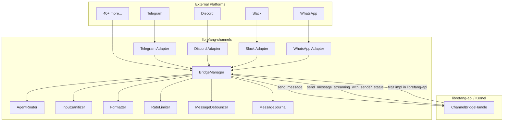

# Channel Integrations

# Channel Integrations (`librefang-channels`)

## Overview

The Channel Integrations module is the bridge layer between external messaging platforms and the LibreFang Agent OS kernel. It provides 40+ pluggable channel adapters that translate platform-specific messages (Telegram, Discord, Slack, WhatsApp, IRC, Matrix, etc.) into a unified `ChannelMessage` format, then dispatch them to the appropriate agent through the kernel.

Every adapter is gated behind a Cargo feature flag (`channel-xxx`). The `default` feature enables popular channels; use `all-channels` to compile everything.

## Architecture



## Core Types

All adapters produce and consume types defined in `types.rs`:

| Type | Purpose |
|------|---------|
| `ChannelMessage` | Unified inbound message — carries content, sender, channel type, metadata, thread context |
| `ChannelContent` | Enum of all supported content: `Text`, `Command`, `Image`, `Voice`, `Video`, `File`, `Location`, `Interactive`, `ButtonCallback`, `EditInteractive`, `Audio`, `Animation`, `Sticker`, `MediaGroup`, `Poll`, `PollAnswer`, `FileData`, `DeleteMessage` |
| `ChannelUser` | Sender identity — `platform_id`, `display_name`, optional `librefang_user` |
| `SenderContext` | Full sender context propagated to agents — channel, user ID, chat ID, group status, mention status, thread ID, account ID, auto-route config, group participants |
| `ChannelAdapter` | Trait each adapter implements — `name()`, `start()`, `send()`, `send_in_thread()`, `send_typing()`, `send_reaction()`, `send_streaming()`, `stop()`, etc. |
| `ChannelType` | Enum identifying the platform — `Telegram`, `Discord`, `Slack`, `WhatsApp`, `Signal`, `Matrix`, `Email`, `Teams`, `Mattermost`, `WeChat`, `WebChat`, `CLI`, `Custom(String)` |
| `InteractiveButton` | Button for inline keyboards — `label`, `action`, optional `style`/`url` |
| `LifecycleReaction` | Emoji reaction for processing phases — `emoji`, `phase`, `remove_previous` |

## ChannelBridgeHandle

Defined in `bridge.rs`, this trait represents kernel operations that channel adapters need. It is defined in `librefang-channels` to avoid circular dependencies — the actual implementation lives in `librefang-api` on top of the kernel.

Key methods, grouped by function:

**Messaging**
- `send_message` / `send_message_with_sender` — basic agent send
- `send_message_with_blocks` / `send_message_with_blocks_and_sender` — multimodal (text + images)
- `send_message_streaming` / `send_message_streaming_with_sender` — streaming text deltas
- `send_message_streaming_with_sender_status` — streaming + terminal success/error status via oneshot
- `send_message_ephemeral` — `/btw` side-question (no session persistence)

**Agent Management**
- `find_agent_by_name` — resolve agent name to ID
- `list_agents` — running agents as `(id, name)` pairs
- `spawn_agent_by_name` — create agent from manifest
- `reset_session` / `reboot_session` / `compact_session` — session lifecycle
- `set_model` — switch an agent's LLM
- `stop_run` — cancel in-progress LLM call
- `set_thinking` — toggle extended thinking mode

**Channel Configuration**
- `channel_overrides` — per-channel config overrides (format, threading, policies, rate limits)
- `authorize_channel_user` — RBAC check

**Introspection**
- `list_models_text` / `list_providers_text` / `list_skills_text` / `list_hands_text`
- `list_providers_interactive` / `list_models_by_provider` — structured data for interactive menus
- `uptime_info` / `session_usage` / `budget_text` / `peers_text` / `a2a_agents_text`

**Automation**
- `list_workflows_text` / `run_workflow_text`
- `list_triggers_text` / `create_trigger_text` / `delete_trigger_text`
- `list_schedules_text` / `manage_schedule_text`
- `list_approvals_text` / `resolve_approval_text`
- `subscribe_events` — broadcast receiver for kernel events (e.g. `ApprovalRequested`)

**Delivery & Routing**
- `classify_reply_intent` — lightweight LLM check: should the bot reply to this group message?
- `check_auto_reply` — auto-reply engine hook
- `record_delivery` — track delivery success/failure for metrics
- `send_channel_push` — proactive outbound message (REST API push endpoint)

All methods have sensible defaults so the kernel can incrementally implement features.

## BridgeManager

`BridgeManager` is the central orchestrator. It owns all running adapters and manages the full dispatch pipeline.

### Construction

```rust
// Basic
let mgr = BridgeManager::new(kernel_handle, router);

// With custom sanitizer config
let mgr = BridgeManager::with_sanitizer(kernel_handle, router, &sanitize_config);

// With crash-recovery journal
let mgr = BridgeManager::new(kernel_handle, router).with_journal(journal);
```

### Starting an Adapter

`start_adapter()` subscribes to the adapter's message stream and spawns a dispatch loop. Each incoming message gets its own concurrent task so slow LLM calls (10–30s) don't block subsequent messages. A semaphore (capacity 32) caps concurrent dispatches to prevent unbounded memory under burst traffic.

If an adapter provides webhook routes via `create_webhook_routes()`, those are collected for mounting on the shared API server under `/channels/{name}/webhook`. Otherwise the adapter falls back to managing its own HTTP server.

### Message Debouncing

When `message_debounce_ms` is configured in channel overrides, rapid messages from the same sender are merged before dispatch. This is critical for platforms where users send text, then photos, then more text in quick succession.

The debouncer has three flush triggers:
1. **Timeout** — `debounce_ms` after the last message (with timer reset on each new message)
2. **Hard deadline** — `debounce_max_ms` after the first message
3. **Buffer full** — `debounce_max_buffer` messages accumulated

Typing events extend or shorten the debounce window: if the user is still typing, the timer resets; if they stop, the flush fires after a short delay.

When merged, same-type messages concatenate their text; command messages with the same name merge their arguments; mixed types fall back to text concatenation.

### Shutdown

`stop()` signals all dispatch loops via a watch channel, then calls `adapter.stop()` on each adapter to release connections, then awaits all spawned tasks.

### Webhook Routes

`take_webhook_router()` drains collected webhook routes and merges them into a single `axum::Router`, nested under `/{adapter_name}`. The caller should mount this under `/channels` on the main API server without auth middleware — adapters handle their own signature verification.

## Message Dispatch Pipeline

When a `ChannelMessage` arrives, `dispatch_message()` (or the debounced variant) runs it through a multi-stage pipeline:

### 1. Input Sanitization

`InputSanitizer` checks text, image captions, voice/video captions for prompt injection patterns. Three outcomes:
- **Clean** — pass through
- **Warned** — log a warning but allow (suspicious but not conclusive)
- **Blocked** — reject the message and send a generic response

### 2. Channel Override Loading

`channel_overrides()` fetches per-channel configuration including output format, threading, DM/group policies, rate limits, trigger patterns, auto-route settings, and command allowlists/blocklists.

### 3. DM/Group Policy Enforcement

For **group messages**, `should_process_group_message()` applies the configured `GroupPolicy`:

| Policy | Behavior |
|--------|----------|
| `Ignore` | Drop all group messages |
| `CommandsOnly` | Only process messages that look like commands |
| `MentionOnly` | Only process when the bot is mentioned, the message matches a trigger pattern, or it's a command |
| `All` | Process everything (optionally with `reply_precheck` LLM classification) |

The **addressee guard** (enabled via `LIBREFANG_GROUP_ADDRESSEE_GUARD=on`) uses positional vocative detection to avoid false triggers. For example, in "Caterina, chiedi al Signore..." with trigger pattern "Signore", the guard recognizes the turn is addressed to Caterina (leading vocative) and suppresses the match.

For **DMs**, `DmPolicy` controls access: `Ignore`, `AllowedOnly` (RBAC), or `Respond`.

### 4. Rate Limiting

Two levels via `ChannelRateLimiter`:
- **Global** — `rate_limit_per_minute` across all users on the channel
- **Per-user** — `rate_limit_per_user` per sender identity

### 5. Command Handling

Messages matching `ChannelContent::Command` or starting with `/` are dispatched to `handle_command()`. Available commands include `start`, `help`, `agents`, `agent`, `status`, `models`, `providers`, `new`, `reboot`, `compact`, `model`, `stop`, `usage`, `think`, `skills`, `hands`, `btw`, `workflows`, `triggers`, `schedules`, `approvals`, `approve`, `reject`, `budget`, `peers`, `a2a`.

Commands `/agents` and `/models` produce interactive inline keyboards when adapters support them.

Commands blocked by channel policy (`disable_commands`, `allowed_commands`, `blocked_commands`) fall through as plain text to the agent.

### 6. Agent Resolution

`resolve_or_fallback()` determines the target agent:
1. **Thread routing** — if `thread_route_agent` is set in metadata, resolve by name
2. **Context routing** — `AgentRouter.resolve_with_context()` considers channel, account ID, peer ID, guild ID
3. **Fallback** — try an agent named "assistant", then the first running agent

On stale agent IDs ("Agent not found" errors), the dispatcher re-resolves the channel default by name and retries once.

### 7. Streaming vs. Non-Streaming Dispatch

If the adapter supports streaming (`supports_streaming()`), the dispatcher calls `send_message_streaming_with_sender_status()` which returns:
- `mpsc::Receiver<String>` — incremental text deltas piped to the adapter
- `oneshot::Receiver<Result<(), String>>` — terminal success/error from the kernel

The text is buffered while streaming. If the stream transport fails, the buffered text is re-sent via `send_response()` as fallback. The kernel status determines the final lifecycle reaction (Done vs. Error) and delivery tracking.

### 8. Response Formatting

`formatter::format_for_channel()` adapts the agent's output to the channel's expected format (Markdown, HTML, plain text) based on `OutputFormat` from channel overrides.

### 9. Lifecycle Reactions

Adapters that support reactions display emoji indicators of processing state:
- ⏳ Queued → 🤔 Thinking → 📡 Streaming → ✅ Done / ❌ Error

### 10. Delivery Tracking

`record_delivery()` logs success/failure per agent, channel, and recipient — used for metrics and workflow delivery targeting (including Telegram forum-topic thread context).

### 11. Message Journal

When configured, every dispatched message is journaled before processing. On crash recovery, `recover_pending()` returns in-flight entries for re-dispatch. `compact_journal()` flushes on shutdown.

## Agent Router

`AgentRouter` manages the mapping from channel users to agents:

- **Per-user defaults** — `set_user_default()` / `resolve()` — each user gets their preferred agent
- **Channel defaults** — `channel_default()` / `update_channel_default()` — fallback for users without a preference
- **Context binding** — `resolve_with_context()` considers `BindingContext` (channel, account_id, peer_id, guild_id, roles)
- **Broadcast routing** — `has_broadcast()` / `resolve_broadcast()` — one user to multiple agents with parallel or sequential strategy

## Broadcast Routing

When a sender has broadcast targets configured, their message is dispatched to all target agents simultaneously. The `BroadcastStrategy` controls execution:

| Strategy | Behavior |
|----------|----------|
| `Parallel` | All agents queried concurrently; responses combined with `[agent_name]: response` |
| `Sequential` | Agents queried one at a time in order |

## Interactive Menus

The `/models` command produces a provider → model drill-down menu using `ButtonCallback` handling. The flow:
1. `/models` → list providers as inline buttons (`prov:{id}`)
2. Provider button → list that provider's models (`model:{id}`) + back button
3. Model button → set the active model via `set_model()` + confirmation

The `/agents` command lists agents as buttons that trigger `/agent {name}` callbacks.

## Channel Adapters

Each adapter implements the `ChannelAdapter` trait. Key methods:

| Method | Description |
|--------|-------------|
| `name()` | Unique adapter identifier |
| `channel_type()` | Corresponding `ChannelType` |
| `start()` | Start receiving messages, return a `Stream<Item = ChannelMessage>` |
| `create_webhook_routes()` | Optional: return `(Router, Stream)` for shared-server mounting |
| `send()` | Send a `ChannelContent` to a `ChannelUser` |
| `send_in_thread()` | Send within a specific thread/topic |
| `send_typing()` | Show typing indicator |
| `send_reaction()` | Add/remove emoji reaction |
| `send_streaming()` | Pipe streaming text deltas to the user |
| `typing_events()` | Optional stream of typing indicators from the platform |
| `stop()` | Shutdown the adapter |
| `supports_streaming()` | Whether progressive output is supported |
| `suppress_error_responses()` | Whether error messages should be hidden (e.g. public channels) |

## Feature Flags

Enable channels via Cargo features:

```toml
[dependencies.librefang-channels]
features = ["channel-telegram", "channel-discord"]
```

Or use feature groups:
- `default` — popular channels
- `all-channels` — everything

Available adapters (alphabetical): bluesky, dingtalk, discord, discourse, email, feishu, flock, gitter, google-chat, gotify, guilded, irc, keybase, line, linkedin, mastodon, matrix, mattermost, messenger, mqtt, mumble, nextcloud, nostr, ntfy, pumble, qq, reddit, revolt, rocketchat, signal, slack, teams, telegram, threema, twist, twitch, viber, voice, webex, webhook, wechat, wecom, whatsapp, xmpp, zulip.

## Infrastructure Modules

| Module | Purpose |
|--------|---------|
| `http_client` | Shared HTTP client for adapter API calls |
| `sanitizer` | Prompt injection detection with configurable strictness |
| `rate_limiter` | Token-bucket rate limiter (per-channel, per-user) |
| `formatter` | Output format adaptation (Markdown, HTML, plain text) per channel |
| `message_journal` | SQLite-backed journal for crash recovery |
| `sidecar` | Sidecar process management for adapters that need external binaries |

## Adding a New Channel Adapter

1. Create `src/my_channel.rs` implementing `ChannelAdapter`
2. Gate it with `#[cfg(feature = "channel-my-channel")]` in `src/lib.rs`
3. Add the feature to `Cargo.toml`
4. Convert platform events into `ChannelMessage` with the appropriate `ChannelContent` variant
5. Implement `send()` to deliver responses back to the platform
6. Optionally implement `create_webhook_routes()` for webhook-based platforms
7. Add `ChannelType::Custom("my_channel")` mapping in `channel_type_str()`