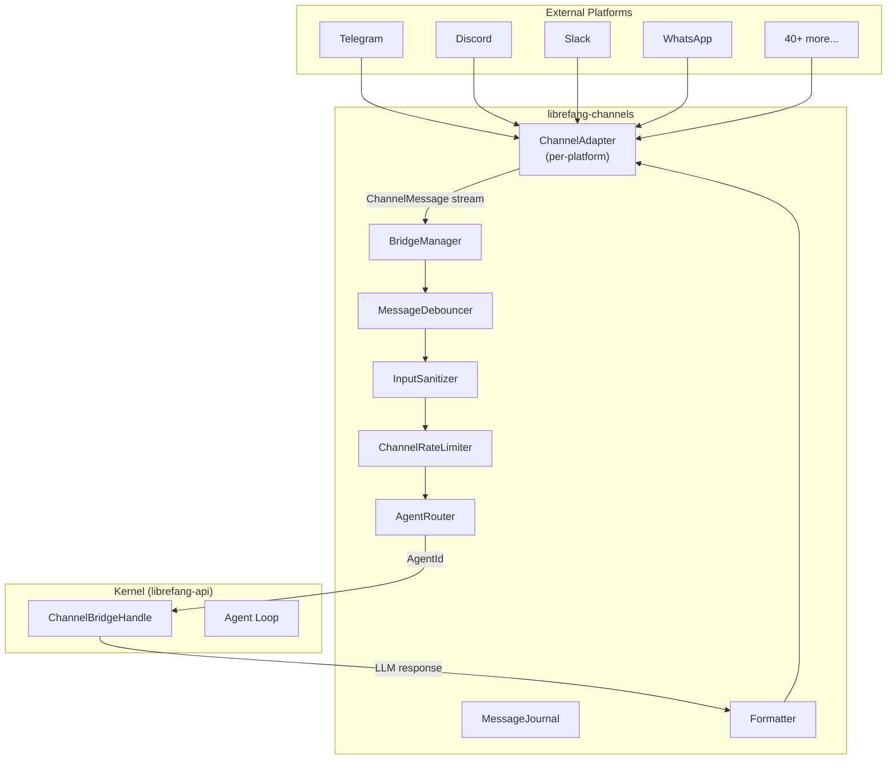

# Channel Integrations

# Channel Integrations (`librefang-channels`)

## Purpose

The Channel Integrations module is the bridge layer between external messaging platforms and the LibreFang Agent OS kernel. It provides 40+ pluggable messaging adapters that translate platform-specific events (webhooks, WebSocket frames, polling responses) into a unified `ChannelMessage` stream, then dispatch them to the appropriate agent through the kernel.

Every user-facing interaction — from a Telegram DM to a Slack channel mention to a Discord slash command — flows through this module.

## Architecture Overview



## Feature Flags

Channel adapters are gated behind Cargo feature flags. Each adapter compiles only when explicitly enabled.

| Feature flag | Adapter |
|---|---|
| `channel-telegram` | Telegram Bot API |
| `channel-discord` | Discord |
| `channel-slack` | Slack |
| `channel-whatsapp` | WhatsApp |
| `channel-signal` | Signal |
| `channel-matrix` | Matrix |
| `channel-teams` | Microsoft Teams |
| `channel-email` | Email (SMTP/IMAP) |
| `channel-mattermost` | Mattermost |
| `channel-wechat` | WeChat |
| `channel-wecom` | WeCom (Enterprise WeChat) |
| ... | (see `Cargo.toml` for the full list of 40+) |
| `all-channels` | Enables every adapter |

The `default` feature enables the most commonly used adapters. Core infrastructure modules (`bridge`, `types`, `router`, `sanitizer`, etc.) compile unconditionally.

## Core Types

### `ChannelMessage`

The unified inbound message representation. Every adapter converts its platform-specific event into this struct:

```rust
pub struct ChannelMessage {
    pub channel: ChannelType,       // Telegram, Discord, Slack, etc.
    pub sender: ChannelUser,        // Who sent it
    pub content: ChannelContent,    // What they sent
    pub is_group: bool,             // Group vs DM context
    pub thread_id: Option<String>,  // Forum topic / thread
    pub metadata: HashMap<String, serde_json::Value>,
    pub platform_message_id: String,
    pub timestamp: DateTime<Utc>,
}
```

### `ChannelContent`

A tagged enum representing every inbound payload type the system handles:

- `Text` — plain text message
- `Command { name, args }` — parsed slash command
- `Image { url, caption, mime_type }` — photo with optional caption
- `Voice`, `Video`, `Audio`, `Animation` — media with duration and caption
- `File { url, filename }` — file attachment
- `FileData { filename, data, mime_type }` — in-memory file bytes
- `Location { lat, lon }` — shared geolocation
- `Interactive { text, buttons }` — outbound-only inline keyboard
- `ButtonCallback { action, message_text }` — user clicked a button
- `EditInteractive { message_id, text, buttons }` — update an existing interactive message
- `DeleteMessage { message_id }` — remove a previously sent message
- `Sticker`, `MediaGroup`, `Poll`, `PollAnswer` — platform-specific rich types

### `ChannelUser`

Identifies a user across channels:

```rust
pub struct ChannelUser {
    pub platform_id: String,        // Platform-native user ID
    pub display_name: String,
    pub librefang_user: Option<String>, // Mapped LibreFang account
}
```

### `SenderContext`

Propagated to the agent's system prompt so the LLM knows who is talking and from where:

```rust
pub struct SenderContext {
    pub channel: String,            // "telegram", "discord", etc.
    pub user_id: String,
    pub chat_id: Option<String>,
    pub display_name: String,
    pub is_group: bool,
    pub was_mentioned: bool,
    pub thread_id: Option<String>,
    pub account_id: Option<String>,
    pub auto_route: AutoRouteStrategy,
    pub group_participants: Vec<ParticipantRef>,
    pub use_canonical_session: bool,
    pub is_internal_cron: bool,
    // ... auto-routing fields
}
```

### `ChannelAdapter` Trait

The contract every platform adapter implements:

```rust
#[async_trait]
pub trait ChannelAdapter: Send + Sync {
    fn name(&self) -> &str;
    fn channel_type(&self) -> ChannelType;
    async fn start(&self) -> Result<Pin<Box<dyn Stream<Item = ChannelMessage> + Send>>>;
    async fn send(&self, user: &ChannelUser, content: ChannelContent) -> Result<()>;
    async fn send_in_thread(&self, user: &ChannelUser, content: ChannelContent, thread_id: &str) -> Result<()>;
    async fn send_typing(&self, user: &ChannelUser) -> Result<()>;
    async fn send_reaction(&self, user: &ChannelUser, msg_id: &str, reaction: &LifecycleReaction) -> Result<()>;
    async fn stop(&self) -> Result<()>;
    fn supports_streaming(&self) -> bool { false }
    fn suppress_error_responses(&self) -> bool { false }
    fn typing_events(&self) -> Option<Receiver<TypingEvent>> { None }
    async fn create_webhook_routes(&self) -> Option<(axum::Router, Pin<Box<dyn Stream<...>>>)> { None }
}
```

Adapters can optionally provide `create_webhook_routes()` to return Axum router + message stream pairs, which the `BridgeManager` mounts on the shared API server instead of running standalone HTTP listeners.

## `ChannelBridgeHandle` — Kernel Interface

Defined in this crate to avoid circular dependencies (the channels crate cannot depend on the kernel). Implemented in `librefang-api` on the actual kernel.

Key methods:

| Method | Purpose |
|---|---|
| `send_message(agent_id, message)` | Send text to an agent, get text response |
| `send_message_with_sender(agent_id, message, sender)` | Send with identity context |
| `send_message_with_blocks(agent_id, blocks)` | Multimodal (text + images) |
| `send_message_streaming_with_sender_status(...)` | Streaming with terminal status reporting |
| `find_agent_by_name(name)` | Resolve agent name to ID |
| `list_agents()` | List running agents |
| `spawn_agent_by_name(manifest_name)` | Create a new agent instance |
| `channel_overrides(channel_type, account_id)` | Per-channel configuration overrides |
| `authorize_channel_user(...)` | RBAC access check |
| `classify_reply_intent(text, sender, model)` | Lightweight LLM "should we reply?" check |
| `record_delivery(agent_id, channel, recipient, success, error, thread_id)` | Delivery tracking for metrics |
| `check_auto_reply(agent_id, message)` | Auto-reply engine hook |
| `subscribe_events()` | Broadcast receiver for kernel events (approvals, etc.) |

The streaming variant (`send_message_streaming_with_sender_status`) is critical for adapters like Telegram that support progressive token display. It returns both a `mpsc::Receiver<String>` for text deltas **and** a `oneshot::Receiver<Result<(), String>>` for the kernel's terminal status — this lets the bridge distinguish a successful reply from a sanitized error after the stream completes.

## `BridgeManager` — Orchestrator

Owns all running adapters and manages the full message lifecycle.

### Construction

```rust
let bridge = BridgeManager::with_sanitizer(handle, router, &sanitize_config)
    .with_journal(journal);
```

- `handle` — `Arc<dyn ChannelBridgeHandle>`, the kernel connection
- `router` — `Arc<AgentRouter>`, resolves messages to agent IDs
- `sanitize_config` — prompt injection detection settings
- `journal` — optional crash-recovery journal

### Starting an Adapter

```rust
bridge.start_adapter(adapter).await?;
```

This subscribes to the adapter's `ChannelMessage` stream and spawns a dispatch loop. Each message gets its own Tokio task (concurrent dispatch) bounded by a semaphore (default: 32 concurrent dispatches) to prevent unbounded memory growth under burst traffic.

The dispatch loop also watches a shutdown signal and handles stream termination gracefully.

### Debounce Mode

When `message_debounce_ms` is set in channel overrides, the bridge enters debounce mode:

1. **`MessageDebouncer`** buffers messages per sender key (`channel:platform_id`)
2. A **soft timer** fires after `debounce_ms` of silence
3. A **hard timer** fires after `debounce_max_ms` regardless
4. A **buffer limit** forces immediate flush when `max_buffer` messages accumulate
5. **Typing events** reset the soft timer (extend debounce while the user is still typing)

On flush, buffered messages are merged:
- Multiple `Command` messages with the same name have their args concatenated
- Otherwise, all messages are joined as `Text` with newlines
- Image blocks from all messages are collected and forwarded as multimodal content

### Webhook Route Collection

Adapters that implement `create_webhook_routes()` return Axum routers that the bridge collects via `take_webhook_router()`. The caller (typically `librefang-api`) mounts the combined router under `/channels` on the main API server:

```
POST /channels/telegram/webhook
POST /channels/slack/webhook
POST /channels/discord/webhook
```

Each adapter handles its own signature verification internally — no auth middleware is applied at the mount point.

### Shutdown

```rust
bridge.stop().await;
```

Sends a shutdown signal to all dispatch loops, stops each adapter (releasing ports and connections), and awaits all spawned tasks.

## Message Dispatch Pipeline

Every inbound message passes through the following stages in `dispatch_message`:

```
1. Input Sanitization
   ├─ Clean → continue
   ├─ Warned(reason) → log + continue
   └─ Blocked(reason) → log + send rejection + return

2. Channel Overrides
   └─ Fetch per-channel config (output_format, threading, rate limits, policies)

3. DM/Group Policy
   ├─ DM: DmPolicy::Ignore → drop
   ├─ Group: GroupPolicy::Ignore → drop
   ├─ Group: GroupPolicy::CommandsOnly → drop non-commands
   └─ Group: GroupPolicy::MentionOnly → check mention/trigger patterns

4. Rate Limiting
   ├─ Per-channel global limit
   └─ Per-user limit

5. Command Handling (early return)
   ├─ Built-in commands (/start, /help, /agents, /agent, /models, /new, etc.)
   ├─ Interactive menus (provider → model selection)
   └─ Blocked commands fall through to agent as text

6. Image Processing
   └─ Download → base64 → ContentBlock::Image → dispatch_with_blocks

7. Broadcast Routing
   └─ If user has broadcast targets → fan-out to multiple agents

8. Agent Resolution
   ├─ Thread routing (thread_route_agent metadata)
   ├─ Binding context (channel, account, guild, peer)
   ├─ Fallback: "assistant" agent → first available agent
   └─ Auto-set user default for future messages

9. RBAC Check
   └─ authorize_channel_user → deny if unauthorized

10. Auto-Reply Check
    └─ check_auto_reply → return canned response if triggered

11. Journal Record (crash recovery)

12. Lifecycle Reactions
    └─ ⏳ Queued → 🤔 Thinking → ✅ Done / ❌ Error

13. Agent Dispatch
    ├─ Streaming path (if adapter supports it)
    │   ├─ Pipe deltas to adapter.send_streaming()
    │   ├─ Buffer text for fallback on stream failure
    │   └─ Check kernel terminal status
    └─ Non-streaming path
        └─ send_message_with_sender → format → send_response

14. Delivery Recording
    └─ record_delivery(success, error, thread_id)
```

## Agent Routing

The `AgentRouter` (`router.rs`) maps incoming messages to agent IDs through multiple resolution strategies:

1. **Thread routing** — If the adapter sets `thread_route_agent` in metadata, that agent name is resolved first (enables per-thread agent assignment in Telegram forums)
2. **Binding context** — Matches on channel type, account ID, peer ID, and guild ID for fine-grained routing
3. **User default** — Per-user persistent mapping (set automatically on first successful fallback)
4. **Channel default** — Per-channel fallback agent
5. **Global fallback** — Agent named `"assistant"`, then first available agent

When a cached agent ID becomes stale (agent was restarted/respawned), the bridge detects "Agent not found" errors and automatically re-resolves the channel default by name via `try_reresolution`.

### Stale Agent Re-Resolution

On `send_message` failure containing "Agent not found", the bridge checks if the failed ID was the channel default. If so, it re-resolves by name and retries once. This handles the common case where agents are re-created during hot-reload.

## Group Message Processing

Group messages have additional filtering layers controlled by `GroupPolicy`:

| Policy | Behavior |
|---|---|
| `Ignore` | Drop all group messages |
| `CommandsOnly` | Only process `/`-prefixed messages |
| `MentionOnly` | Process only when bot is mentioned or trigger pattern matches |
| `All` | Process everything (optional reply-intent precheck) |

### Vocative Trigger Detection

When `GroupPolicy::MentionOnly` is active, trigger patterns are regex-based. The system includes a **vocative trigger** guard (`is_vocative_trigger`) that ensures the pattern appears at a vocative position (start of turn or after sentence boundary) rather than mid-sentence. This prevents false triggers like:

> "Caterina, chiedi al **Signore**..."

...where "Signore" matches a trigger pattern but the turn is actually addressed to Caterina.

The guard is controlled by `LIBREFANG_GROUP_ADDRESSEE_GUARD=on` and performs two checks:
1. **Positional match** — pattern must appear at turn start or after `[.!?]` boundary
2. **No preceding vocative** — reject if another `<Capitalized>,` appears before the pattern

### Reply-Intent Precheck

When `reply_precheck` is enabled and `group_policy` is `All`, a lightweight LLM call (`classify_reply_intent`) decides whether the bot should respond to a non-mentioned, non-command group message. This prevents unnecessary agent invocations on casual conversation the bot isn't relevant to.

## Input Sanitization

The `InputSanitizer` runs prompt injection detection on incoming text before any command parsing or agent dispatch. Three outcomes:

- **`Clean`** — proceed normally
- **`Warned(reason)`** — log a warning but allow through (monitoring mode)
- **`Blocked(reason)`** — reject with a generic error message ("Your message could not be processed.")

Text is extracted from `Text`, `Image.caption`, `Voice.caption`, and `Video.caption` content types.

Configuration comes from `SanitizeConfig` passed at `BridgeManager` construction.

## Rate Limiting

`ChannelRateLimiter` enforces two limits from channel overrides:

- `rate_limit_per_minute` — global per-channel limit (keyed on `channel_type:__global__`)
- `rate_limit_per_user` — per-user limit (keyed on `channel_type:sender_user_id`)

Both use a sliding window algorithm. When exceeded, the user receives the limiter's configured rejection message.

## Output Formatting

The `Formatter` module converts agent responses to the appropriate output format for each channel:

| Channel | Default Format |
|---|---|
| Telegram | HTML |
| Discord | Markdown |
| Slack | Slack Markdown |
| Teams | Plain text |
| Others | Markdown |

Can be overridden per-channel via `ChannelOverrides.output_format`.

The `MessageTruncator` handles platform length limits with UTF-16 awareness:

- `DISCORD_MESSAGE_LIMIT` = 2000 characters
- `TELEGRAM_MESSAGE_LIMIT` = 4096 characters
- `TELEGRAM_CAPTION_LIMIT` = 1024 characters

Functions: `truncate_to_utf16_limit()`, `split_to_utf16_chunks()`, `utf16_len()`.

## Message Journal (Crash Recovery)

When enabled, the `MessageJournal` records every message before dispatch:

```rust
let bridge = BridgeManager::new(handle, router).with_journal(journal);
```

On startup, call `recover_pending()` to retrieve messages that were in-flight during a crash or unclean shutdown. The caller is responsible for re-dispatching these entries.

On clean shutdown, `compact_journal()` removes completed entries and persists the journal.

## Command System

Built-in slash commands are handled before agent dispatch:

| Command | Behavior |
|---|---|
| `/start`, `/help` | Welcome message |
| `/agents` | Interactive button menu listing running agents |
| `/agent <name>` | Switch to a specific agent |
| `/models` | Interactive provider → model selection menu |
| `/model <name>` | Set active model directly |
| `/new` | Create a new agent |
| `/status` | System uptime info |
| `/reboot` | Hard-reboot agent session |
| `/compact` | Trigger LLM session compaction |
| `/stop` | Stop current LLM run |
| `/usage` | Session token usage and cost |
| `/think` | Toggle extended thinking mode |
| `/btw <question>` | Ephemeral side-question (no session history) |
| `/workflows`, `/workflow` | Workflow management |
| `/triggers`, `/trigger` | Trigger management |
| `/schedules`, `/schedule` | Cron job management |
| `/approvals`, `/approve`, `/reject` | Approval workflow |
| `/budget` | Global budget status |
| `/peers` | OFP peer network status |
| `/a2a` | Discovered A2A agents |

Commands can be restricted per-channel via `ChannelOverrides`:
- `disable_commands: true` — block all commands
- `allowed_commands: [...]` — whitelist specific commands
- `blocked_commands: [...]` — blacklist specific commands

Blocked commands are forwarded to the agent as plain text (preserving the `/` prefix so the agent sees what the user typed).

## Streaming Support

Adapters that set `supports_streaming() -> true` receive progressive token delivery:

1. The bridge calls `send_message_streaming_with_sender_status()` on the kernel
2. Text deltas are forwarded to `adapter.send_streaming(user, delta_rx, thread_id)`
3. A buffer task copies all deltas into a `String` for fallback
4. If the stream transport fails, the buffered text is re-sent via `send_response()`
5. The kernel's terminal status (`oneshot::Receiver`) determines the final lifecycle reaction and delivery recording

This ensures users on supported platforms (like Telegram) see tokens appearing in real-time rather than waiting for the full response.

## Interactive Menus

The bridge constructs inline keyboard menus for:

- **`/agents`** — One button per running agent, action = `/agent <name>`
- **`/models`** — Provider list → model list (drill-down), with back navigation
- **Button callbacks** — `prov:<id>`, `model:<id>`, `back:providers` handled by the bridge before reaching the agent

Button callback data is truncated to fit Telegram's 64-byte `callback_data` limit.

## Channel Overrides

Per-channel configuration loaded via `ChannelBridgeHandle::channel_overrides()`:

```rust
pub struct ChannelOverrides {
    pub output_format: Option<OutputFormat>,
    pub threading: bool,
    pub dm_policy: DmPolicy,
    pub group_policy: GroupPolicy,
    pub rate_limit_per_minute: u32,
    pub rate_limit_per_user: u32,
    pub disable_commands: bool,
    pub allowed_commands: Vec<String>,
    pub blocked_commands: Vec<String>,
    pub group_trigger_patterns: Vec<String>,
    pub message_debounce_ms: u64,
    pub message_debounce_max_ms: u64,
    pub message_debounce_max_buffer: usize,
    pub reply_precheck: bool,
    pub reply_precheck_model: Option<String>,
    pub auto_route: AutoRouteStrategy,
    // ... auto-routing parameters
}
```

## Outbound Push

The bridge supports proactive outbound messaging via `push_message()`:

```rust
bridge.push_message("telegram", "@user_id", "Hello!", None).await
```

This routes through `ChannelBridgeHandle::send_channel_push()`, which looks up the adapter by channel type and delivers via `ChannelAdapter::send()`. Used by the REST API push endpoint (`POST /api/agents/:id/push`).

## Lifecycle Reactions

When supported by the adapter, the bridge sends emoji reactions to indicate processing state:

| Phase | Emoji | When |
|---|---|---|
| `Queued` | ⏳ | Message received, about to dispatch |
| `Thinking` | 🤔 | Agent processing started |
| `Streaming` | (adapter-specific) | Progressive output active |
| `Done` | ✅ | Response delivered |
| `Error` | ❌ | Agent error occurred |

Reactions are best-effort and silently ignored on failure.

## Integration Point

`librefang-api` calls into this module through:

```
start_channel_bridge_with_config()
  → BridgeManager::with_sanitizer()
  → BridgeManager::with_journal()
  → BridgeManager::start_adapter()  (for each configured channel)
  → BridgeManager::take_webhook_router()
  → BridgeManager::start_approval_listener()
```

The kernel implements `ChannelBridgeHandle` in `librefang-api/src/channel_bridge.rs`, forwarding each method to the appropriate internal subsystem (agent loop, session manager, model registry, etc.).