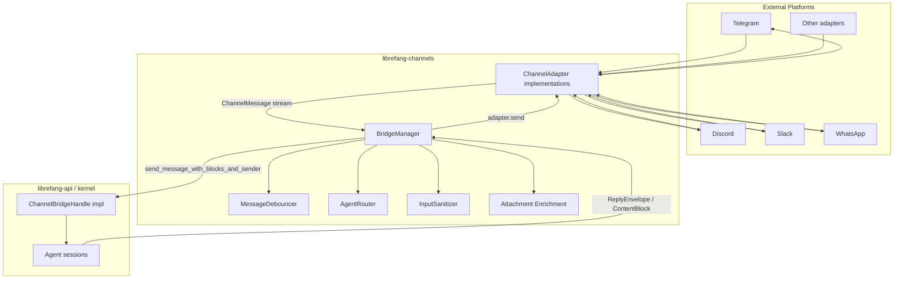

# Channel Integrations

# Channel Integrations Module

The `librefang-channels` crate is the messaging middleware that sits between external chat platforms (Telegram, Discord, Slack, WhatsApp, etc.) and the LibreFang agent kernel. It normalizes inbound messages from heterogeneous chat APIs into a unified `ChannelMessage` type, routes them to the correct agent, and delivers the agent's response back through the originating channel adapter.

## Architecture Overview



## Core Components

### `ChannelBridgeHandle` Trait

Defined in `bridge.rs`, this trait declares every kernel operation that channel adapters need. It breaks the circular dependency: `librefang-channels` defines the interface, and `librefang-api` implements it on the real kernel.

Key method groups:

| Method Group | Purpose | Key Methods |
|---|---|---|
| **Message sending** | Submit user text to an agent | `send_message`, `send_message_with_blocks`, `send_message_with_blocks_and_sender` |
| **Streaming** | Progressive token delivery for adapters that support it | `send_message_streaming`, `send_message_streaming_with_sender`, `send_message_streaming_with_sender_status` |
| **Ephemeral** | Side-questions without session history | `send_message_ephemeral` |
| **Session management** | Per-channel session reset/reboot/compact | `reset_channel_session`, `reboot_channel_session`, `compact_channel_session` |
| **Agent lifecycle** | Find, spawn, list, stop agents | `find_agent_by_name`, `spawn_agent_by_name`, `list_agents`, `stop_run` |
| **Channel config** | Per-channel and per-agent overrides | `channel_overrides`, `agent_channel_overrides`, `get_agent_group_trigger_patterns` |
| **Automation** | Workflows, triggers, schedules, approvals | `run_workflow_text`, `create_trigger_text`, `manage_schedule_text`, `resolve_approval_text` |
| **Events** | Subscribe to kernel events (approval requests) | `subscribe_events`, `record_consumer_lag` |
| **Media** | Audio transcription, file download paths | `transcribe_inbound_audio`, `effective_channels_download_dir` |
| **RBAC** | Authorization checks | `authorize_channel_user` |

Most methods have default implementations that return "not available" stubs, so test mocks only need to override the methods they exercise.

### `BridgeManager`

The central orchestrator. It owns:

- A `ChannelBridgeHandle` (the kernel connection)
- An `AgentRouter` (resolves inbound messages to agent IDs)
- An `InputSanitizer` (prompt-injection detection)
- A `ChannelRateLimiter`
- A `MessageJournal` (optional, for crash recovery)
- A `ThreadOwnershipRegistry` (prevents duplicate replies in shared group threads)
- All running adapter instances and their webhook routes

**Lifecycle:**

1. **Construction** — `BridgeManager::new(handle, router)` or `with_sanitizer(...)` for custom sanitize config.
2. **Adapter registration** — `start_adapter(adapter)` subscribes to the adapter's message stream, spawns dispatch tasks, and optionally collects webhook routes.
3. **Approval listener** — `start_approval_listener()` subscribes to kernel `ApprovalRequested` events and forwards them to notification recipients on bound adapters.
4. **Operation** — Incoming messages flow from adapter streams through the dispatcher.
5. **Shutdown** — `stop()` (graceful, `&mut self`) or `abort()` (hard, `&self`) tears down tasks.

The dual shutdown design exists because hot-reload swaps `BridgeManager` through an `ArcSwap<Option<BridgeManager>>`. The graceful `stop()` requires `&mut self`, but `Arc::try_unwrap` can fail when concurrent requests hold strong references. `abort()` works through `&self` by firing the shutdown watch signal and then calling `abort()` on every tracked `JoinHandle` via a separately maintained `AbortHandle` mirror.

### `ReplyEnvelope`

A two-channel response structure returned to adapters:

```rust
pub struct ReplyEnvelope {
    pub public: Option<String>,       // reply to the source chat
    pub owner_notice: Option<String>, // private message to operator DM
}
```

Adapters that don't support owner-side delivery ignore `owner_notice` and forward only `public`. Both fields are `Option` so silent turns (no public reply, no notice) are representable.

## Message Flow

### Inbound Dispatch

1. An adapter (e.g., Telegram) parses platform-specific events into `ChannelMessage` structs and yields them through a `Stream`.
2. `BridgeManager::start_adapter` consumes this stream in a `tokio::select!` loop.
3. Each message is dispatched as a concurrent `tokio::spawn` task (capped by a 32-permit semaphore) so slow LLM calls don't block subsequent messages.
4. Inside the dispatch task:
   - **Input sanitization** runs prompt-injection detection on text content. Blocked messages receive an opaque rejection reply; warned messages are logged but passed through.
   - **Group policy filtering** applies (`Ignore`, `CommandsOnly`, `MentionOnly`, `All`).
   - **Agent routing** resolves the target agent via `AgentRouter::resolve`.
   - **Channel overrides** are fetched for output format, threading, and command permissions.
   - The message is sent to the kernel via `send_message_with_blocks_and_sender` (or the streaming variant).
5. The agent's response is formatted according to channel output format (`Markdown`, `Html`, `Plain`) and delivered via `adapter.send()`.

### Debounced Path

When `message_debounce_ms` is configured (> 0), rapid messages from the same sender are buffered:

- **Trigger**: First message from a sender starts a debounce timer.
- **Accumulation**: Subsequent messages from the same `(channel, platform_id)` key are merged — same-type content concatenates, mixed content falls back to text rendering.
- **Flush**: Fires on debounce timer expiry, max-timer expiry (`message_debounce_max_ms`), buffer full (`message_debounce_max_buffer`), or typing-stop event.
- **Backpressure**: The flush channel is bounded at 1024 entries. When the dispatcher stalls, the `warn_flush_dropped` helper logs the dropped flush key instead of growing unbounded.

### Streaming Path

Adapters that support progressive display (e.g., Telegram) use `send_message_streaming_with_sender_status`. This returns both a text-delta `mpsc::Receiver` and a `oneshot::Receiver<Result<(), String>>` for terminal status. The adapter can display tokens as they arrive and then record delivery success/failure from the status channel.

## Attachment Enrichment

The `attachment_enrich` module extracts content from non-image file attachments so the LLM receives meaningful text instead of just a file path.

### `enrich_saved_file`

```rust
pub fn enrich_saved_file(
    saved_path: &Path,
    media_type: &str,
    filename: &str
) -> Vec<ContentBlock>
```

Routes based on media type and filename:

| Input | Output |
|---|---|
| `application/pdf` or detected PDF | `[Attached PDF: name (N bytes)]\n\n<extracted text>` |
| `text/*` or recognized code/data extension | `[Attached file: name (N bytes[, truncated])]\n\n<file text>` |
| Images, audio, video, unknown binary | Empty vec (caller emits path block alone) |

**PDF handling** includes panic isolation — `pdf_extract` can panic on malformed or encrypted documents, so extraction runs inside `catch_unwind(AssertUnwindSafe(...))`. Three failure modes produce distinct notes:

- Empty extraction → "scanned image-only PDF — OCR is not supported yet"
- Parse error → "PDF parse failed" with the error
- Panic → "PDF parser panicked (likely malformed or encrypted)"

**PDF detection** uses a three-tier heuristic when the MIME is ambiguous (`application/octet-stream`, empty, etc.):

1. Filename ends in `.pdf`
2. Magic bytes `%PDF-` at offset 0 (`has_pdf_magic_bytes`)
3. Neither → not treated as PDF

An authoritative MIME (e.g., `image/png`) always wins over filename heuristics.

**Text truncation** caps extracted content at `MAX_ENRICHED_TEXT_CHARS` (200,000 chars) with a human-readable truncation marker, mirroring the dashboard upload flow's limit.

**The `is_text_like` function** checks both MIME types (`text/*`, `application/json`, etc.) and file extensions (`.py`, `.rs`, `.yaml`, etc.) for when channels don't supply proper MIME types — browsers and chat APIs frequently upload code files as `application/octet-stream`.

Enrichment is **additive**: callers keep the existing `[File: name] saved to /path` block for tools that need raw bytes. The enriched blocks are inserted *before* the path block.

## Group Message Processing

Group messages pass through `should_process_group_message` which enforces the configured `GroupPolicy`:

- **`Ignore`** — all group messages dropped.
- **`CommandsOnly`** — only slash commands and `/`-prefixed text pass through.
- **`MentionOnly`** — messages pass when the bot was `@`-mentioned, is a command, or matches a `group_trigger_patterns` regex.
- **`All`** — everything passes.

### Vocative Trigger and Addressee Guard

The addressee guard (enabled via `LIBREFANG_GROUP_ADDRESSEE_GUARD=on`) prevents false triggers when the bot's trigger word appears mid-turn but the turn is addressed to someone else.

**Example**: In a group with Caterina and the bot (alias "Signore"), the message "Caterina, chiedi al Signore..." should **not** trigger the bot because:

1. `is_addressed_to_other_participant` detects the leading vocative "Caterina," matches a roster member who isn't the bot.
2. `is_vocative_trigger` confirms that while "Signore" appears, another capitalized vocative precedes it.

This two-layer check (OB-04/OB-05) prevents the substring-only false positive that existed before.

### Trigger Pattern Compilation

`group_trigger_patterns` are compiled into a `RegexSet` and cached in a process-wide `DashMap`. The cache key is the patterns joined by a Unicode separator, so identical pattern sets across agents share a single compilation.

## Command Handling

Slash commands are extracted from text or `ChannelContent::Command` variants and routed through `handle_command` which dispatches to the appropriate `ChannelBridgeHandle` method.

**Command gating** (`is_command_allowed`) enforces a three-level precedence:

1. `disable_commands = true` → block everything
2. `allowed_commands` non-empty → whitelist only those
3. `blocked_commands` non-empty → blacklist those
4. No config → allow everything

Blocked commands are forwarded to the agent as quoted text (`"/agent admin"`) so the agent can still interpret the intent, rather than silently dropping the message.

## Approval Notifications

`start_approval_listener` subscribes to kernel `ApprovalRequested` events and delivers them to channel adapters. The routing logic ensures approvals reach the correct operator:

1. Parse the requesting agent's UUID from the event.
2. For each adapter, determine the bound agent via `channel_default` (account-qualified key for multi-bot adapters).
3. Recipient resolution:
   - **Match**: Use the adapter's `notification_recipients()` (the operator inbox).
   - **Different agent**: Fall back to `bound_recipients_for_agent` — deliver only to chats with explicit `AgentBinding` for the requesting agent.
   - **No default agent**: Same binding-based fallback (the #5002 fix for adapters that route purely via bindings).
4. Fan out to all resolved recipients.

The account-qualified key is critical: a multi-bot adapter with `account_id = "bot_a"` must only match `telegram:bot_a`, never fall back to bare `telegram` — that would leak approvals into a different bot's chat.

## Lifecycle and Shutdown

```rust
// Graceful (requires &mut self — preferred when available)
bridge.stop().await;

// Hard (works through &self — used during hot-reload)
bridge.abort();
```

`abort()` fires the shutdown watch signal (all adapter `select!` loops break on `shutdown.changed()`), then `abort()`s every tracked task handle. The `AbortHandle` mirror is maintained behind a `std::sync::Mutex` specifically to enable this `&self` call path.

`stop()` additionally calls `adapter.stop()` on each adapter (releasing WebSocket connections, ports) and awaits all task `JoinHandle`s.

### Hot-Reload Safety

`track_task` registers externally-spawned tasks (e.g., journal retry tickers) so they don't leak across hot-reloads. Untracked tasks would race between old and new bridge instances on the same journal entries.

## Webhook Route Collection

Adapters that prefer shared-server webhook handling implement `create_webhook_routes()`, returning an `axum::Router` and a message stream. `BridgeManager` collects these via `take_webhook_router()` and nests them under `/{adapter_name}`. The caller mounts the combined router under `/channels` on the main API server.

## File Download Management

`ChannelBridgeHandle` exposes two accessors:

- `channels_download_dir()` — explicitly configured directory, or `None`.
- `effective_channels_download_dir()` — the configured value falling back to `<temp>/librefang_uploads`.

On startup, `start_adapter` sweeps files older than 24 hours from the download directory (once per process, via `std::sync::Once`).

## Key Type Conventions

- **`channel_type_str`** maps `ChannelType` enum variants to config string keys (`"telegram"`, `"discord"`, etc.). Custom channels use their string directly.
- **`SenderContext`** carries full sender identity (channel, user ID, chat ID, display name, group status, mention status, thread ID, auto-route config) from the bridge to the agent's system prompt.
- **`ContentBlock`** (from `librefang_types`) represents structured message content — `Text`, `Image`, `ImageFile`, etc. The bridge normalizes all adapter content into `ContentBlock` vectors for kernel submission.