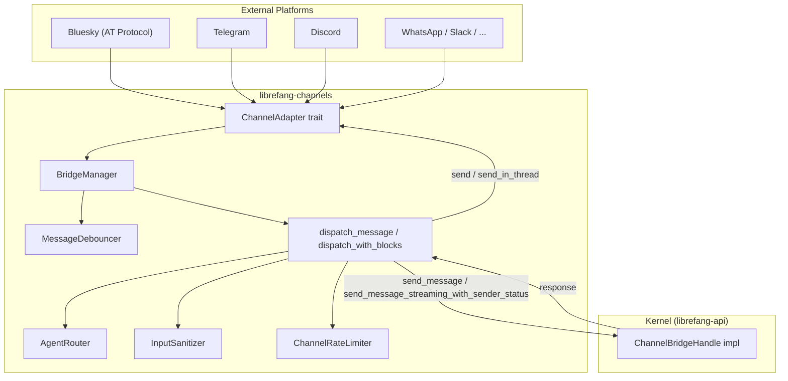

# Channel Integrations

# Channel Integrations Module

## Overview

The `librefang-channels` crate provides the messaging infrastructure that bridges external chat platforms (Telegram, Discord, Bluesky, WhatsApp, etc.) to the LibreFang agent kernel. It defines a uniform adapter interface, manages adapter lifecycles, handles inbound message processing (sanitization, rate limiting, debouncing, routing), and dispatches outbound responses with platform-appropriate formatting.

## Architecture



## Core Types

### `ChannelAdapter` Trait

Defined in `types.rs` and implemented by every platform adapter. The trait provides:

| Method | Purpose |
|---|---|
| `name()` | Returns the adapter identifier string (e.g. `"bluesky"`) |
| `channel_type()` | Returns the `ChannelType` enum variant |
| `start()` | Initiates the connection/polling loop, returns a `Stream<Item = ChannelMessage>` |
| `send()` | Sends a message to a user on the platform |
| `send_in_thread()` | Sends within a specific thread/topic (falls back to `send` by default) |
| `send_typing()` | Fires a typing indicator (no-op on platforms that don't support it) |
| `stop()` | Gracefully shuts down the adapter |
| `create_webhook_routes()` | Optional Axum routes for webhook-based platforms |
| `typing_events()` | Optional stream of typing indicator events for debouncing |

### `ChannelMessage`

The canonical inbound message envelope:

- `channel` — `ChannelType` identifying the source platform
- `platform_message_id` — Platform-specific message ID (AT URI for Bluesky, message ID for Telegram, etc.)
- `sender` — `ChannelUser` with `platform_id`, `display_name`, and optional `librefang_user`
- `content` — `ChannelContent` enum: `Text`, `Command`, `Image`, `File`, `Voice`, `Video`, `ButtonCallback`, etc.
- `is_group` — Whether the message came from a group context
- `thread_id` — Optional thread/topic identifier for forum-style channels
- `metadata` — `HashMap<String, serde_json::Value>` carrying platform-specific fields (e.g. `uri`, `cid`, `reply_ref`, `was_mentioned`, `account_id`, `guild_id`)

### `ChannelContent` Enum

Captures all inbound content types the system handles:

- **Text** — Plain text messages
- **Command** — Slash commands with `name` and `args`
- **Image / File / Voice / Video / Audio / Animation** — Media with URLs, captions, MIME types
- **Location** — Latitude/longitude
- **Interactive / ButtonCallback / EditInteractive** — Inline keyboard interactions
- **MediaGroup / Poll / PollAnswer / Sticker** — Platform-specific content

### `SenderContext`

Built from an inbound `ChannelMessage` and channel overrides. Propagated to the kernel so agents know who is talking and from where:

```rust
SenderContext {
    channel: "telegram",
    user_id: "12345",
    chat_id: Some("12345"),
    display_name: "Alice",
    is_group: false,
    was_mentioned: false,
    thread_id: None,
    account_id: None,
    auto_route: AutoRouteStrategy::Off,
    group_participants: vec![],
    use_canonical_session: false,
    is_internal_cron: false,
}
```

## BridgeManager

`BridgeManager` is the central orchestrator. It owns all running adapters and their dispatch tasks.

### Construction

```rust
let manager = BridgeManager::new(kernel_handle, agent_router)
    .with_journal(message_journal);
```

- `kernel_handle` — An `Arc<dyn ChannelBridgeHandle>` implemented by `librefang-api` on the real kernel
- `agent_router` — An `Arc<AgentRouter>` that resolves `(channel, user)` pairs to agent IDs
- Optional `.with_journal()` attaches a `MessageJournal` for crash recovery

### Starting an Adapter

```rust
manager.start_adapter(adapter).await?;
```

`start_adapter` performs:

1. **Stale file cleanup** — Sweeps upload files older than 24 hours from the download directory (runs once across all adapters)
2. **Webhook route collection** — If the adapter provides Axum routes via `create_webhook_routes()`, they're collected for later mounting under `/channels/{name}/webhook`; otherwise `start()` is called to get a polling/WebSocket stream
3. **Dispatch loop spawn** — A tokio task consuming the adapter's message stream, dispatching each message concurrently under a 32-permit semaphore

### Message Debouncing

When `message_debounce_ms > 0` in channel overrides, `BridgeManager` activates a `MessageDebouncer`. This buffers rapid-fire messages from the same sender (keyed by `{channel}:{platform_id}`) and merges them before dispatch:

- **Timed flush** — First message starts a debounce timer; the buffer flushes when it expires
- **Max timer** — A hard upper bound (`debounce_max_ms`, default 30s) forces a flush regardless
- **Buffer cap** — When `max_buffer` messages accumulate, the buffer flushes immediately
- **Typing integration** — A `stop_typing` event resets the debounce timer; ongoing typing extends the wait

On flush, multiple messages are merged: commands with the same name have their args concatenated, text messages are joined with newlines, and all image blocks are aggregated.

### Webhook Router

After all adapters are started, call `take_webhook_router()` to extract the merged Axum router and mount it on the main API server:

```rust
let webhook_router = manager.take_webhook_router();
// Mount under /channels on the API server (no auth middleware)
```

### Shutdown

```rust
manager.stop().await;
```

Signals all dispatch loops via a shared `watch` channel, then stops each adapter (releasing connections/ports), and awaits all spawned tasks.

## ChannelBridgeHandle Trait

This trait defines the kernel operations that channel adapters need. It lives in `librefang-channels` to avoid circular dependencies — the real implementation is in `librefang-api`.

Key method groups:

**Agent messaging:**
- `send_message` / `send_message_with_sender` — Synchronous send-and-wait
- `send_message_with_blocks` — Multimodal content (text + images)
- `send_message_streaming_with_sender_status` — Returns a text chunk receiver *and* a oneshot status receiver for accurate delivery tracking

**Agent management:**
- `find_agent_by_name`, `list_agents`, `spawn_agent_by_name`
- `reset_session`, `reboot_session`, `compact_session`
- `set_model`, `stop_run`, `session_usage`, `set_thinking`

**Authorization and configuration:**
- `authorize_channel_user` — RBAC check
- `channel_overrides` / `agent_channel_overrides` — Per-channel and per-agent configuration
- `classify_reply_intent` — Lightweight LLM call to decide whether to reply in group chats

**Automation:**
- `list_workflows_text`, `run_workflow_text`
- `list_triggers_text`, `create_trigger_text`, `delete_trigger_text`
- `list_schedules_text`, `manage_schedule_text`
- `list_approvals_text`, `resolve_approval_text`

**Infrastructure:**
- `subscribe_events` — Broadcast receiver for kernel events (approval requests, etc.)
- `send_channel_push` — Proactive outbound message delivery
- `channels_download_dir` / `channels_download_max_bytes` — File download configuration

## Message Dispatch Pipeline

When an inbound message arrives from any adapter, it flows through:

### 1. Webhook Direct Delivery Check

Messages tagged with `__deliver_only__` metadata bypass the entire pipeline — they're forwarded straight to the configured delivery target via `send_channel_push`.

### 2. Input Sanitization

If the sanitizer is active (not `"off"`), text content is checked for prompt injection patterns:

- `Clean` — Proceed
- `Warned(reason)` — Logged but allowed through
- `Blocked(reason)` — User receives "Your message could not be processed." and dispatch stops

### 3. Agent Resolution and Overrides

`resolve_or_fallback` attempts to find the target agent in this order:

1. `thread_route_agent` from message metadata (for thread-pinned agents)
2. `AgentRouter::resolve_with_context` using channel, account_id, peer_id, guild_id
3. Fallback: agent named `"assistant"`, then first available agent (auto-set as user default)

Agent-level overrides (from `agent.toml`) take priority over channel-level overrides.

### 4. DM/Group Policy Enforcement

**DM policy** (`dm_policy`):
- `Ignore` — Silently drop
- `AllowedOnly` — Rely on RBAC
- `Respond` — Process normally

**Group policy** (`group_policy`):
- `Ignore` — Silently drop all group messages
- `CommandsOnly` — Only process slash commands
- `MentionOnly` — Process only mentions, commands, and messages matching `group_trigger_patterns`
- `All` — Process everything (optionally filtered by `reply_precheck` LLM classification)

### 5. Rate Limiting

Two tiers (when configured):
- `rate_limit_per_minute` — Global per-channel limit
- `rate_limit_per_user` — Per-user limit

Keyed by `sender_user_id`, which prefers the `sender_user_id` metadata field over `platform_id`.

### 6. Command Handling

Slash commands are intercepted before agent dispatch. The command policy (`disable_commands`, `allowed_commands`, `blocked_commands`) determines whether a command is handled by the bridge or forwarded as plain text to the agent.

Special interactive commands:
- `/agents` — Sends an inline keyboard with one button per running agent
- `/models` — Sends a provider selection keyboard
- `/agent <name>` — Switches the user's default agent
- `/help`, `/status`, `/reset`, `/reboot`, `/compact`, `/usage`, `/models`, `/providers`, `/skills`, `/hands`, `/budget`, `/peers`, `/a2a`, `/workflows`, `/triggers`, `/schedules`, `/approve`, `/reject`, `/stop`, `/thinking`, `/model`, `/btw`

### 7. Media Processing

- **Images** — Downloaded, base64-encoded, sent as `ContentBlock::Image` for vision-capable models
- **Files** — Downloaded to disk, sent as `ContentBlock::ImageFile` or `ContentBlock::Text`
- **Voice** — Transcribed via Whisper (if configured), then dispatched as text

### 8. Agent Dispatch

Text messages call `send_message_with_sender` (or streaming variant). Structured blocks call `send_message_with_blocks_and_sender`.

### 9. Response Delivery

Outbound responses are formatted via `formatter::format_for_channel` according to the channel's `OutputFormat` (Plain, Markdown, Html), then sent via `adapter.send()` or `adapter.send_in_thread()` if threading is enabled.

Lifecycle reactions (emoji indicators for Thinking/Done/Error phases) are sent as fire-and-forget on supported adapters.

### 10. Error Recovery

On "Agent not found" errors, the bridge re-resolves the channel default agent by name and retries once. This handles cases where an agent was respawned with a new ID.

## Group Message Filtering

The addressee guard prevents the bot from responding to messages addressed to other participants in group chats.

### Vocative Detection

`leading_vocative_name(text)` detects patterns like `"Caterina, dimmi..."` — a capitalized name at the start of the turn followed by punctuation.

`is_vocative_trigger(text, pattern)` performs positional matching: the trigger pattern must appear at the start of the turn or after a sentence boundary, and no other vocative may precede it.

`is_addressed_to_other_participant(text, participants, agent_name)` checks whether the leading vocative matches a known participant who isn't the bot.

### Guard Activation

The guard is controlled by `LIBREFANG_GROUP_ADDRESSEE_GUARD=on` and is shipped default-off for an observation period. When active, two additional checks run in `MentionOnly` mode:

- **OB-04**: If the turn is vocatively addressed to another participant, skip
- **OB-05**: Substring trigger matches are rejected unless the pattern also passes positional vocative validation

## Bluesky Adapter

A concrete `ChannelAdapter` implementation for the AT Protocol (Bluesky).

### Authentication

Uses `com.atproto.server.createSession` with an identifier (handle or DID) and app password. Sessions are cached in an `RwLock<Option<BlueskySession>>` containing `access_jwt`, `refresh_jwt`, `did`, and `created_at`.

Session lifecycle:
- Sessions last ~2 hours; tokens refresh after 90 minutes (5400s - 300s buffer)
- `refresh_session` attempts `com.atproto.server.refreshSession`; falls back to `create_session` on failure
- On 401 responses during polling, the cached session is cleared and re-created

### Inbound Messages

Polls `app.bsky.notification.listNotifications` every 5 seconds. Only `mention` and `reply` reasons are processed; likes, reposts, and follows are ignored. Notifications from the bot's own DID are filtered out.

The `seenAt` cursor is tracked and updated via `app.bsky.notification.updateSeen` after each poll.

Notification parsing (`parse_bluesky_notification`) extracts:
- Author DID, handle, display name
- Post text (parsed as `Text` or `Command` if it starts with `/`)
- Reply reference metadata (for threading)
- URI and CID for platform message identification

### Outbound Messages

Posts via `com.atproto.repo.createRecord` with `app.bsky.feed.post` records. Long messages are split at 300 grapheme clusters using `split_message`. Reply references are forwarded when present in the original notification metadata.

### Multi-Bot Support

The `account_id` field is injected into message metadata, enabling the bridge to route to different agents based on which Bluesky account received the mention.

## ReplyEnvelope

The bridge returns responses as a `ReplyEnvelope`:

```rust
pub struct ReplyEnvelope {
    pub public: Option<String>,        // Reply to the source chat
    pub owner_notice: Option<String>,  // Private notice to the operator's DM
}
```

- `ReplyEnvelope::from_public(s)` — Public reply only
- `ReplyEnvelope::silent()` — No output at all
- `public_or_empty()` — Convenience for adapters that don't route owner notices separately

## Message Journal

Optional crash recovery via `MessageJournal`. When attached:

- `recover_pending()` returns journal entries that were in-flight during a crash
- `compact_journal()` flushes and compacts the journal on shutdown

## Adding a New Channel Adapter

1. Implement `ChannelAdapter` in a new module (e.g. `src/mattermost.rs`)
2. For webhook platforms, implement `create_webhook_routes()` returning `(Router, Stream)`
3. For polling platforms, implement `start()` returning a `Stream<Item = ChannelMessage>`
4. Construct the adapter and pass to `BridgeManager::start_adapter()`
5. The dispatch pipeline handles sanitization, routing, formatting, and delivery automatically