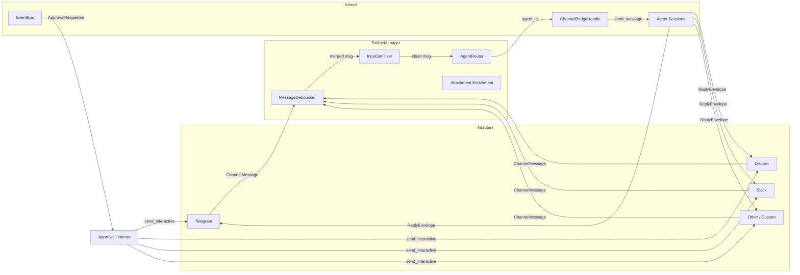

# Channel Integrations

# Channel Integrations (`librefang-channels`)

## Purpose

This crate is the bridge between external chat platforms (Telegram, Discord, Slack, etc.) and the LibreFang kernel. It normalises inbound messages from heterogeneous channel adapters into a unified `ChannelMessage` type, routes them to the correct agent, dispatches the LLM call, and delivers the response back through the originating adapter.

The module also handles:

- **Message debouncing** — rapid-fire messages from the same sender are buffered and merged into a single agent turn.
- **Input sanitization** — prompt-injection heuristics inspect inbound text before it reaches the LLM.
- **Attachment enrichment** — PDFs, code files, and other text-like attachments are extracted inline so the LLM sees their content without needing a separate file-reader tool.
- **Approval workflows** — `ApprovalRequested` kernel events are forwarded to operators as inline keyboards (or plain-text fallbacks).
- **Group message heuristics** — mention detection, vocative triggers, and reply-intent classification determine whether the bot should respond in a group.
- **Proactive push** — the REST API can push outbound messages through a configured adapter.

## Architecture


```mermaid
graph LR
    subgraph Adapters
        A[Telegram]
        B[Discord]
        C[Slack]
        D[Other / Custom]
    end

    subgraph BridgeManager
        E[MessageDebouncer]
        F[InputSanitizer]
        G[AgentRouter]
        H[Attachment Enrichment]
    end

    subgraph Kernel
        I[ChannelBridgeHandle]
        J[Agent Sessions]
        K[EventBus]
    end

    A & B & C & D -->|ChannelMessage| E
    E -->|merged msg| F
    F -->|clean msg| G
    G -->|agent_id| I
    I -->|send_message| J
    J -->|ReplyEnvelope| A & B & C & D
    K -->|ApprovalRequested| L[Approval Listener]
    L -->|send_interactive| A & B & C & D
```

## Key Components

### `ChannelBridgeHandle` trait

Defined in `bridge.rs`, implemented on the kernel in `librefang-api`. This trait is the narrow interface adapters use to interact with the kernel without creating a circular dependency — `librefang-channels` cannot depend on `librefang-kernel`.

Core methods:

| Method | Purpose |
|--------|---------|
| `send_message` | Plain-text send to an agent, returns full response string |
| `send_message_with_blocks` | Structured send with `ContentBlock` (text + images) |
| `send_message_with_sender` | Send with `SenderContext` for peer-scoped memory |
| `send_message_streaming` | Returns `mpsc::Receiver<String>` for progressive token display |
| `send_message_streaming_with_sender_status` | Streaming + oneshot status channel for delivery metrics |
| `find_agent_by_name` / `list_agents` / `spawn_agent_by_name` | Agent lifecycle |
| `channel_overrides` / `agent_channel_overrides` | Per-channel and per-agent configuration overrides |
| `transcribe_inbound_audio` | Hand-off to `MediaEngine` for voice transcription |
| `subscribe_events` | Broadcast receiver for kernel `EventBus` |
| `classify_reply_intent` | Lightweight LLM call to decide if the bot should reply in a group |

Most methods have default implementations that return stub values, so test mocks only need to override what they exercise. The single method without a default is `record_consumer_lag` — this is intentional: any production impl must forward lag drops to the kernel's `EventBus::dropped_count` metric, and a silent default would hide regressions.

### `BridgeManager`

Owns all running adapters, their dispatch tasks, and shared infrastructure (rate limiter, sanitizer, journal, thread-ownership registry).

**Lifecycle:**

1. **Construction** — `BridgeManager::new(handle, router)` or `with_sanitizer(...)` for custom sanitization config.
2. **`start_adapter(adapter)`** — subscribes to the adapter's message stream, optionally sets up debouncing, and spawns a dispatch loop.
3. **`start_approval_listener()`** — subscribes to `ApprovalRequested` events and fans out interactive keyboards to bound adapters.
4. **`stop()`** — graceful shutdown; signals the watch channel, stops adapters, and awaits all tracked tasks.
5. **`abort()`** — hard stop callable through `&self` (for hot-reload when `Arc::try_unwrap` fails). Fires the shutdown signal and aborts all tracked `JoinHandle`s.

**Task tracking:** Every spawned task is recorded via the private `track()` method, which stores both the `JoinHandle` (for the graceful `stop()` join loop) and its `AbortHandle` mirror in a `std::sync::Mutex<Vec<AbortHandle>>`. This ensures `abort()` can always terminate tasks even when only a shared `&self` reference is available.

### `ReplyEnvelope`

A two-channel reply envelope:

```rust
pub struct ReplyEnvelope {
    pub public: Option<String>,
    pub owner_notice: Option<String>,
}
```

- `public` — the message to send back to the source chat (DM or group).
- `owner_notice` — a private message for the operator's DM only (e.g. produced by the `notify_owner` LLM tool).

Adapters that don't support owner-side delivery ignore `owner_notice` and forward only `public`.

### `MessageDebouncer`

Buffers rapid-fire messages from the same sender and merges them into a single dispatch. Configured via channel overrides:

- `message_debounce_ms` — minimum wait after the last message before flushing (0 = disabled).
- `message_debounce_max_ms` — hard ceiling; the buffer always flushes after this duration regardless of activity.
- `message_debounce_max_buffer` — message count cap; flushes immediately when hit.

**Merging logic:**

- Multiple text messages → joined with `\n`.
- Multiple commands with the same name → args concatenated.
- Mixed content types → all converted to text via `content_to_text()` and joined.
- Image blocks are collected from all buffered messages into a single `Vec<ContentBlock>`.

**Flush triggers:** debounce timer, max timer, buffer-full, typing-stop event, and shutdown drain. All triggers push to a bounded channel (`FLUSH_CHANNEL_CAP = 1024`) to prevent OOM when the dispatcher stalls.

**Double-fire guard:** The max-timer and manual-flush paths can both enqueue the same key on a race. The `drain()` method removes the entry from the buffer map on first access, so the second arrival finds nothing and returns `None`.

### `AgentRouter`

Resolves inbound messages to an `AgentId`. The router considers:

1. **Channel defaults** — bare key (`telegram`) or account-qualified key (`telegram:12345`).
2. **Agent bindings** — explicit `peer_id` → `agent_id` mappings per channel.
3. **Group thread ownership** — once an agent replies in a group thread, it "owns" that thread for a configurable TTL, preventing multiple agents from responding to the same conversation.

### Attachment Enrichment (`attachment_enrich.rs`)

When the channel bridge downloads a non-image file, `enrich_saved_file()` extracts content so the LLM sees it inline rather than just a file path. The enrichment is **additive** — the original `[File: name] saved to /path` block is always preserved for tools that need raw bytes.

**Detection matrix:**

| Input | Detection | Output |
|-------|-----------|--------|
| `application/pdf` | MIME match | Extracted text with `[Attached PDF: name (N bytes)]` header |
| `.pdf` extension + ambiguous MIME | Extension fallback | Same as above |
| `%PDF-` magic bytes + ambiguous MIME | Magic-byte sniff | Same as above |
| `text/*` MIME | MIME match | Inline text with `[Attached file: name (N bytes)]` header |
| Code extensions (`.rs`, `.py`, etc.) | Extension fallback | Inline text |
| Known text MIME (`application/json`, etc.) | MIME match | Inline text |
| Image types | Skipped | Empty vec — bridge already emits `ContentBlock::ImageFile` |
| Unknown binary | Skipped | Empty vec |

**PDF handling** uses `pdf_extract` behind a `catch_unwind` boundary — the parser can panic on malformed or encrypted documents. A panic produces a `[Could not extract text: PDF parser panicked]` note instead of crashing the bridge.

**Truncation:** Both text and PDF extraction are capped at `MAX_ENRICHED_TEXT_CHARS` (200,000 chars), matching the kernel's `MAX_PDF_TEXT_CHARS` and the API's `MAX_TEXT_ATTACHMENT_CHARS`. Oversized content gets a truncation marker appended.

Audio/voice files are intentionally excluded — they go through `media_transcribe` out of band, and inlining binary noise would waste tokens.

### Approval Listener

Started via `BridgeManager::start_approval_listener()`, this task listens on the kernel's `EventBus` for `ApprovalRequested` events and delivers interactive keyboards to the appropriate recipients.

**Routing logic (in priority order):**

1. **Direct route** — if the event carries `sender_id` + `channel`, the keyboard goes straight back to the originating chat (common case: user chatting with an agent that calls a `require_approval` tool).
2. **Channel default** — if the adapter's `channel_default` points to the requesting agent, deliver to `notification_recipients()`.
3. **Binding-derived peers** — if no default but `AgentBinding`s exist for the requesting agent on this adapter, fan out to those `peer_id`s.
4. **Drop** — no matching route; a `warn!` log fires so operators know approvals are being lost.

The interactive payload is built by `build_approval_interactive()` which produces a two-button keyboard (`Approve` / `Deny`). Adapters without the `interactive` capability fall back to plain text with `/approve <id>` / `/reject <id>` instructions.

### Input Sanitization

The `InputSanitizer` checks inbound text for potential prompt-injection payloads before dispatching to the agent. Three outcomes:

- `Clean` — pass through.
- `Warned(reason)` — suspicious but allowed (logged).
- `Blocked(reason)` — message rejected; user receives a generic "could not be processed" notice.

Command arguments are reconstructed into text for checking, so slash-command args cannot carry injection payloads.

### Group Message Processing

Group messages go through several layers before the bot decides to reply:

1. **Group policy** — `GroupPolicy` determines if the bot should respond at all (e.g., `IgnoreAll`).
2. **Explicit mention** — `@botname` or configured aliases always trigger.
3. **Reply-to** — replying to a bot message triggers.
4. **Regex trigger patterns** — `group_trigger_patterns` from agent config.
5. **Vocative trigger** — leading capitalized name + punctuation (e.g., `"BotName, do X"`). Under the `LIBREFANG_GROUP_ADDRESSEE_GUARD=on` flag, the positional check also rejects patterns preceded by another vocative (the "Caterina, chiedi al Signore" case).
6. **Reply-intent classification** — `classify_reply_intent()` makes a lightweight LLM call when other heuristics are inconclusive.

## Message Flow

### Inbound (text message, no debouncing)

```
Adapter stream → dispatch_message()
  ├── InputSanitizer::check()
  ├── AgentRouter::resolve() → agent_id
  ├── ChannelBridgeHandle::channel_overrides() → formatting config
  ├── BridgeHandle::send_message_streaming_with_sender_status()
  │     └── Kernel: run agent, stream tokens back
  ├── Formatter: markdown → channel-native format
  ├── Adapter::send() → deliver to chat
  └── ThreadOwnership: claim thread (groups)
```

### Inbound (with debouncing)

```
Adapter stream → MessageDebouncer::push()
  └── Timer fires / max reached / typing-stop → flush_debounced()
        ├── drain() → merge buffered messages
        ├── Download images → ContentBlock::ImageFile
        └── dispatch_with_blocks() (same path as above, with blocks)
```

### Inbound (file attachment)

```
Adapter streams download to disk → saved_path
  ├── enrich_saved_file(saved_path, media_type, filename)
  │     ├── PDF? → extract text → ContentBlock::Text
  │     ├── Text-like? → read file → ContentBlock::Text
  │     └── Otherwise → empty vec
  ├── Insert enrichment blocks before path block
  └── dispatch_with_blocks()
```

## Adding a New Channel Adapter

1. Implement `ChannelAdapter` (defined in `types.rs`) — minimum `name()`, `channel_type()`, `start()`, `send()`.
2. Optionally override `typing_events()`, `send_interactive()`, `notification_recipients()`, `create_webhook_routes()`, `fetch_headers_for()`.
3. Add the `ChannelType` variant in `types.rs` and update `channel_type_str()` in `bridge.rs`.
4. Register the adapter via `BridgeManager::start_adapter()` during startup.

## Configuration

Channel behaviour is tuned through `ChannelOverrides` (from `agent.toml` or global config):

| Override | Default | Purpose |
|----------|---------|---------|
| `message_debounce_ms` | 0 (disabled) | Merge rapid-fire messages |
| `message_debounce_max_ms` | 30000 | Hard ceiling on debounce window |
| `message_debounce_max_buffer` | 64 | Message count before forced flush |
| `output_format` | Per-channel default | Markdown, HTML, plain text |
| `threading` | false | Enable thread-scoped replies |
| `group_trigger_patterns` | Empty | Regex patterns that trigger bot replies |
| `dm_policy` | Per-config | How DMs are handled |
| `group_policy` | Per-config | How group messages are handled |

The env var `LIBREFANG_GROUP_ADDRESSEE_GUARD=on` enables stricter vocative-trigger logic during a observation window before it becomes the default.

## Shutdown and Hot-Reload

`BridgeManager` supports two shutdown paths:

- **`stop(&mut self)`** — graceful: signals the watch channel, stops each adapter, awaits all tasks, clears abort handles.
- **`abort(&self)`** — hard: fires the signal and aborts every tracked task via `AbortHandle`. Used during hot-reload when the old `BridgeManager` is still inside an `Arc` with outstanding strong references.

External background tasks (e.g. journal retry tickers) must be registered via `track_task()` to be cleaned up on reload — otherwise they leak across reload boundaries and double-dispatch.