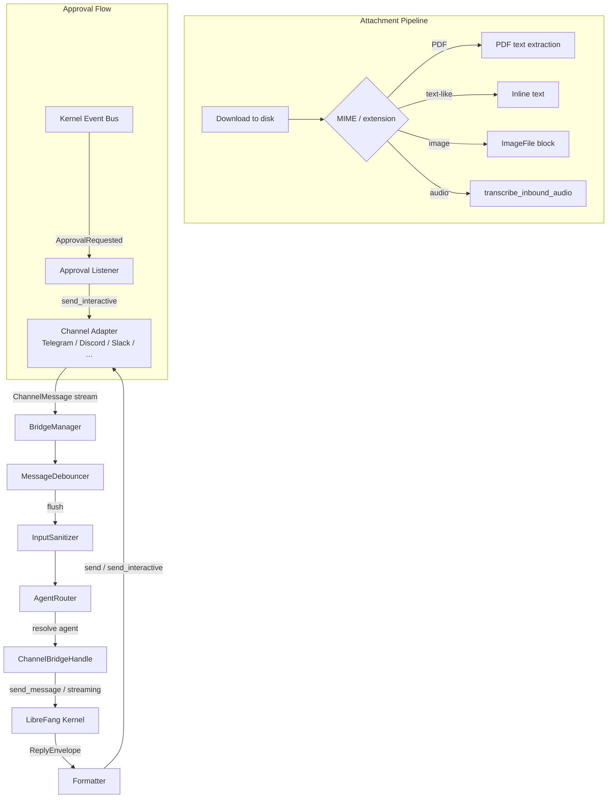
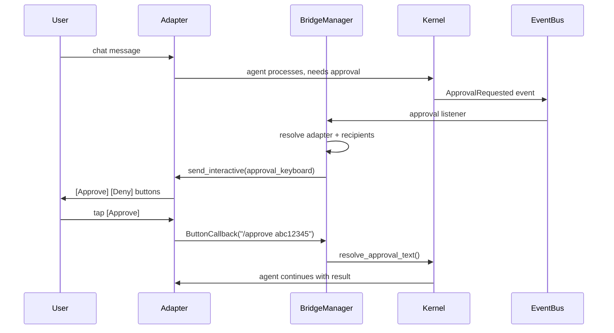

# Channel System

# Channel System (`librefang-channels`)

## Purpose

The Channel System connects external chat platforms (Telegram, Discord, Slack, WhatsApp, etc.) to the LibreFang agent kernel. It provides a unified adapter interface, message dispatch pipeline with sanitization and rate-limiting, content-aware attachment enrichment, interactive approval workflows, and crash-recoverable message journaling.

The module defines the **contract** between adapters and the kernel (`ChannelBridgeHandle`) so that `librefang-channels` has no compile-time dependency on the kernel itself — the actual implementation lives in `librefang-api`.

## Architecture



## Core Components

### `ChannelBridgeHandle` trait (`bridge.rs`)

The async trait defining all kernel operations channel adapters can invoke. Defined in this crate to avoid circular dependencies; implemented in `librefang-api` on the real kernel.

Key method groups:

| Group | Methods | Purpose |
|-------|---------|---------|
| **Messaging** | `send_message`, `send_message_with_blocks`, `send_message_with_sender`, `send_message_with_blocks_and_sender` | Send text or multimodal content to an agent |
| **Streaming** | `send_message_streaming`, `send_message_streaming_with_sender`, `send_message_streaming_with_sender_status` | Stream incremental response deltas back to the adapter |
| **Session management** | `reset_session`, `reboot_session`, `compact_session`, `reset_channel_session`, `reboot_channel_session`, `compact_channel_session` | Per-agent and per-channel session lifecycle |
| **Agent lifecycle** | `find_agent_by_name`, `list_agents`, `spawn_agent_by_name`, `set_model`, `stop_run` | Agent CRUD and configuration |
| **Automation** | `list_workflows_text`, `run_workflow_text`, `list_triggers_text`, `create_trigger_text`, `delete_trigger_text`, `list_schedules_text`, `manage_schedule_text` | Workflow, trigger, and cron operations |
| **Approvals** | `list_approvals_text`, `resolve_approval_text`, `subscribe_events` | Human-in-the-loop approval flow |
| **Media** | `transcribe_inbound_audio`, `describe_inbound_image` | Inbound attachment processing via `MediaEngine` |
| **Config** | `channel_overrides`, `agent_channel_overrides`, `agent_channel_allowlist` | Per-channel and per-agent configuration access |
| **Authorization** | `authorize_channel_user` | RBAC gate for channel actions |

All methods have safe defaults (no-ops, empty vecs, `Err("Not implemented")`) so test mocks only need to override what they exercise. The one exception is `record_consumer_lag`, which has **no default impl** — implementers must explicitly acknowledge it, preventing silent lag-drop regressions (#3630).

### `BridgeManager` (`bridge.rs`)

Owns all running channel adapters and orchestrates the dispatch pipeline.

**Construction:**
```rust
// Basic
let bm = BridgeManager::new(kernel_handle, router);

// With sanitizer config
let bm = BridgeManager::with_sanitizer(kernel_handle, router, &sanitize_config);

// With crash-recovery journal
let bm = BridgeManager::new(kernel_handle, router).with_journal(journal);
```

**Lifecycle:**

1. **`start_adapter(adapter)`** — Subscribes to the adapter's message stream. Spawns a long-running tokio task that:
   - Receives `ChannelMessage`s from the adapter
   - Passes them through the debounce/buffer pipeline (if configured)
   - Acquires a concurrency semaphore permit (cap: 32 concurrent dispatches)
   - Runs sanitization, routing, and dispatch

2. **`start_approval_listener()`** — Subscribes to kernel `ApprovalRequested` events and fans out interactive approval keyboards to the correct adapter recipients.

3. **`stop(&mut self)`** — Graceful shutdown: signals watchers, stops adapters, joins all tasks.

4. **`abort(&self)`** — Hard stop through a shared `&self` reference (#5142). Fires the shutdown signal and aborts all tracked task handles. Used when `Arc::try_unwrap` fails during hot-reload because another component still holds a strong reference.

5. **`track_task(handle)`** — Registers externally-spawned tasks (e.g., journal retry tickers) so their lifetime is tied to the bridge. Prevents task leaks across hot-reloads.

**Webhook routes:** Adapters that implement `create_webhook_routes()` provide `axum::Router` mounts collected by the bridge. Call `take_webhook_router()` after starting all adapters and mount the result under `/channels` on the main API server.

### `MessageDebouncer` (`bridge.rs`)

Coalesces rapid sequential messages from the same sender into a single dispatch. Configured per-channel via `ChannelOverrides`:

| Field | Config key | Default | Purpose |
|-------|-----------|---------|---------|
| `debounce_ms` | `message_debounce_ms` | `0` (disabled) | Delay before flushing after last message |
| `debounce_max_ms` | `message_debounce_max_ms` | `30000` | Hard upper bound regardless of continued activity |
| `max_buffer` | `message_debounce_max_buffer` | `64` | Message count cap that triggers immediate flush |

When `debounce_ms == 0`, the fast path bypasses debouncing entirely.

**Merge behavior:**
- Same-name commands merge their args: `/query foo` + `/query bar` → `/query foo bar`
- Homogeneous text messages join with `\n`
- Mixed content types fall back to text representation of all messages
- Image blocks from all messages are accumulated and passed through to `dispatch_with_blocks`

**Typing integration:** Adapters emit `TypingEvent`s. A typing-stop event resets the debounce timer. Typing-start during an active window is a no-op (the sender is still composing). If the max timer has elapsed, typing events trigger an immediate flush.

**Backpressure:** The internal flush channel is bounded at 1024 entries (#3580). When the dispatcher stalls, new flush triggers log a warning and drop the buffered message rather than growing unbounded.

### `ReplyEnvelope` (`bridge.rs`)

Two-channel reply structure returned to adapters:

```rust
pub struct ReplyEnvelope {
    pub public: Option<String>,       // Reply to source chat (DM or group)
    pub owner_notice: Option<String>, // Private message to operator's DM only
}
```

- `from_public(s)` — Public-only reply
- `silent()` — No reply at all (silent turn)
- `public_or_empty()` — Legacy compatibility for adapters that don't route `owner_notice`

### `AgentRouter` (`router.rs`)

Resolves inbound messages to agent IDs based on:

1. **Channel defaults** — `set_default(channel_key, agent_id)` for the default agent on a channel
2. **Per-user defaults** — `set_user_default(channel_key, user_id, agent_id)` for user-specific routing
3. **Agent bindings** — `load_bindings(channel_key, bindings)` for pattern-based routing (group name, regex)
4. **Direct routes** — `set_direct_route(channel_key, peer_id, agent_id)` for explicit peer-to-agent mapping

Channel keys are bare (`"telegram"`) for single-bot adapters, or account-qualified (`"telegram:bot_123"`) for multi-bot adapters.

## Message Dispatch Pipeline

Every inbound `ChannelMessage` follows this path:

```
Adapter stream
  → Debouncer (optional, per-sender buffering)
  → Semaphore acquire (concurrency cap: 32)
  → InputSanitizer.check()
  → AgentRouter.resolve()
  → Channel overrides lookup (channel + agent)
  → Build SenderContext
  → Handle command or dispatch to agent
  → Format response for channel output format
  → Send reply via adapter
  → Record delivery result
```

### Input Sanitization

`InputSanitizer` checks for prompt injection patterns. Three outcomes:

- **`Clean`** — Pass through
- **`Warned(reason)`** — Allow but log (suspicious but not conclusive)
- **`Blocked(reason)`** — Reject. The user receives `"Your message could not be processed."` and the dispatch stops.

Sanitizer config comes from `SanitizeConfig` (default: off). Text, command args, image captions, voice captions, and video captions are all checked.

### Command Handling

Slash commands are parsed from `ChannelContent::Command { name, args }` and dispatched to `handle_command()`. Key commands include:

| Command | Action |
|---------|--------|
| `/agents`, `/agent`, `/select` | List and switch agents |
| `/new` | Reset per-channel session |
| `/reboot` | Hard-reboot per-channel session |
| `/compact` | LLM-based session compaction |
| `/model`, `/models` | View or change agent model |
| `/btw` | Ephemeral side-question (no session history) |
| `/approve`, `/reject` | Resolve pending approval requests |
| `/stop` | Stop current LLM run |
| `/usage` | Token usage and cost |
| `/workflows`, `/triggers`, `/schedules` | Automation management |
| `/skills`, `/hands` | List installed capabilities |
| `/budget`, `/peers`, `/a2a` | System status |

### Group Message Processing

Group messages require special handling to avoid responding to every message:

1. **Group policy check** — `GroupPolicy` (off / mention_only / all) from channel overrides
2. **Mention detection** — Bot name, aliases, or regex trigger patterns
3. **Vocative trigger** — Leading `"BotName,"` or `"BotName:"` positional detection
4. **Reply-intent classification** — LLM-based `classify_reply_intent()` for ambiguous messages
5. **Addressee guard** — `LIBREFANG_GROUP_ADDRESSEE_GUARD=on` enables the positional vocative + addressee guard (Phase 2, default-off for observation period)

Group roster members are persisted via `roster_upsert()` so the agent's system prompt can reference participants by name.

### Thread Ownership

`ThreadOwnershipRegistry` prevents duplicate replies in shared group threads when multiple agents are bound to the same channel (#3334). Agents claim thread ownership before replying; if another agent already claimed the thread, the second agent skips its reply.

## Attachment Enrichment (`attachment_enrich.rs`)

When the bridge downloads a non-image file, `enrich_saved_file()` produces extra `ContentBlock`s so the LLM receives inline content instead of just a filesystem path.

### How It Works

```rust
pub fn enrich_saved_file(
    saved_path: &Path,
    media_type: &str,    // HTTP MIME type, already lowercased
    filename: &str,      // Sender-supplied name
) -> Vec<ContentBlock>
```

**Detection logic:**

```
Is MIME "application/pdf"?
  → Yes: extract PDF text
  → No: Is MIME ambiguous (empty / octet-stream / binary)?
    → Yes: Does filename end in ".pdf" OR does file start with "%PDF-"?
      → Yes: extract PDF text
      → No: check text-like
    → No: Is MIME text/* or a known code/data MIME?
      → Yes: inline file text
      → No: Is extension a recognized code/text extension?
        → Yes: inline file text
        → No: return empty (binary blob)
```

**Output format:**

| Type | Header | Body |
|------|--------|------|
| PDF | `[Attached PDF: name (N bytes)]` | Extracted text (truncated at 200K chars) |
| Text | `[Attached file: name (N bytes[, truncated])]` | File contents (truncated at 200K chars) |
| Image | *(empty — bridge emits `ContentBlock::ImageFile` separately)* | — |
| Audio/voice | *(empty — handled by `transcribe_inbound_audio` out-of-band)* | — |
| Binary | *(empty — caller emits path block alone)* | — |

**Enrichment is additive.** Callers keep the existing `[File: name] saved to /path` text block. The enriched blocks are inserted *before* the path block, so tools that need the raw file path (e.g., `media_transcribe`, custom file readers) still work.

### Truncation

Both PDF and text enrichment truncate at `MAX_ENRICHED_TEXT_CHARS` (200,000 characters), mirroring `librefang-runtime::pdf_text::MAX_PDF_TEXT_CHARS` and `librefang-api::routes::agents::MAX_TEXT_ATTACHMENT_CHARS`. Truncation markers:

- PDF: `[…PDF truncated at 200K chars; original document is longer…]`
- Text: `[…file truncated at 200K chars; content continues beyond this point…]`

### Panic Safety

PDF extraction (`pdf_extract` / `lopdf`) can panic on malformed or encrypted documents. The `enrich_pdf` function wraps the call in `std::panic::catch_unwind(AssertUnwindSafe(…))` and surfaces a `[Could not extract text]` note instead of crashing the bridge. This mirrors `librefang-runtime::pdf_text` behavior.

### Extension Matrix

The `is_text_like()` function recognizes 80+ extensions across languages, markup, config, and data formats. It mirrors `librefang-api::routes::agents::is_text_like_attachment` and must be kept in lock-step.

## Approval Workflow

The interactive approval system routes tool-call approval requests back to the originating chat with inline keyboards.



**Recipient resolution (priority order):**

1. **Direct route** — If the event carries `sender_id` + `channel`, the keyboard goes straight back to that chat (common case: user chatting with agent in Telegram). Uses `chat_id` for group chats, `sender_id` for DMs.
2. **Channel default** — If the adapter's `channel_default` matches the requesting agent, use `notification_recipients()` (operator inbox).
3. **Agent binding peers** — Walk `AgentBinding`-derived `peer_id`s on this adapter that route to the requesting agent (#5002 fix for adapters with no channel default).
4. **Drop with warning** — If no route is found, log a warning that approvals are being silently dropped.

**Button callback suppression:** When a user taps `[Approve]` / `[Deny]` on an inline keyboard, the text ack from `handle_command` is suppressed via `suppress_button_command_ack()` — the tap itself is visible confirmation. Typed `/approve <id>` still produces the text ack for channels without interactive capabilities (IRC, SMS).

## File Download Pipeline

1. Bridge streams attachment to `effective_channels_download_dir()` (configured or `<temp>/librefang_uploads`)
2. `channels_download_max_bytes()` cap enforced during download
3. Stale files (>24h) cleaned on adapter startup via `cleanup_old_uploads()`
4. Post-download enrichment:
   - **Images** → `download_image_to_blocks()` → `ContentBlock::ImageFile` (with optional `describe_inbound_image`)
   - **PDFs** → `enrich_saved_file()` → `ContentBlock::Text` with extracted text
   - **Text/code** → `enrich_saved_file()` → `ContentBlock::Text` with inline content
   - **Audio/voice** → `transcribe_inbound_audio()` → text transcription if enabled
   - **Other binary** → path-only `[File: name] saved to /path` block

## Message Journal

Optional crash-recovery journaling:

- **Before dispatch:** `journal.record_outbound(entry)` — writes the message + metadata to persistent storage
- **After successful delivery:** `journal.ack(entry_id)` — marks as completed
- **On startup:** `recover_pending()` — returns entries that were in-flight when the daemon crashed, for re-dispatch
- **On shutdown:** `compact_journal()` — reclaims space from completed entries

External retry tickers (e.g., in `librefang-api`) must register via `track_task()` so they don't leak across hot-reloads.

## Shutdown & Hot-Reload

The bridge supports two shutdown modes:

| Mode | Method | Reference | Behavior |
|------|--------|-----------|----------|
| Graceful | `stop(&mut self)` | Exclusive | Signals shutdown, stops adapters, joins all tasks |
| Hard | `abort(&self)` | Shared | Signals shutdown, aborts all task handles |

Hot-reload (`reload_channels_from_disk`) swaps the `BridgeManager` out of an `ArcSwap`. It first calls `abort()` on the still-shared Arc (guaranteed to work), then attempts `Arc::try_unwrap` for the cleaner `stop()` path. Under load, `try_unwrap` may fail — `abort()` ensures no task leak regardless.

All dispatch loops and adapter streams `select!` on `shutdown.changed()` so they exit promptly when signaled.