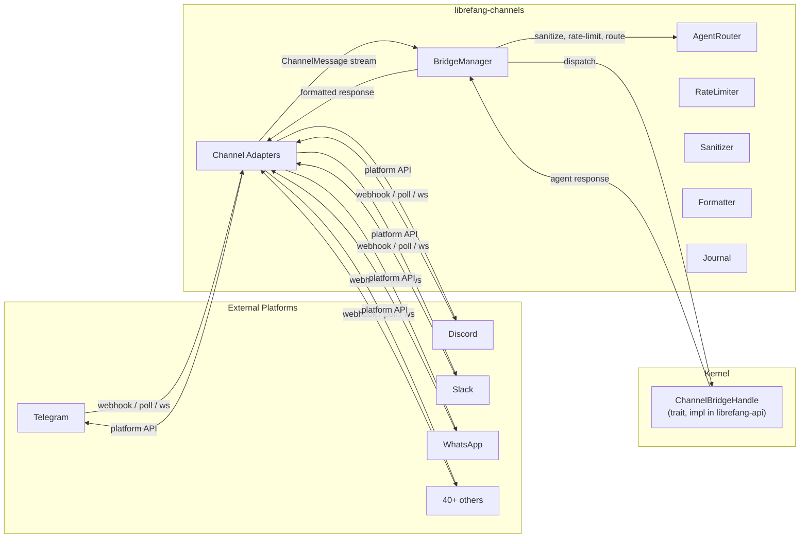

# Channels

# Channels Module (`librefang-channels`)

## Purpose

The channel bridge layer converts messages from 40+ external messaging platforms into unified `ChannelMessage` events, routes them to the appropriate agent, and delivers responses back through the originating platform. Every platform-specific detail — webhook signatures, API quirks, message formats — is absorbed by individual adapters so the rest of the system works against a single interface.

## Architecture



## Feature Flags

Channel adapters are compiled behind individual Cargo feature flags (`channel-telegram`, `channel-discord`, etc.). The `default` feature enables popular channels; `all-channels` compiles everything.

Core infrastructure (`bridge`, `router`, `types`, `formatter`, `sanitizer`, `rate_limiter`, `message_journal`, `sidecar`) is always compiled regardless of feature flags.

## Core Types

### `ChannelMessage`

The unified inbound message type. All adapters produce these. Key fields:

- `channel: ChannelType` — originating platform (enum: `Telegram`, `Discord`, `Slack`, `WhatsApp`, `Custom(String)`, etc.)
- `sender: ChannelUser` — who sent it (`platform_id`, `display_name`, optional `librefang_user`)
- `content: ChannelContent` — what they sent (see below)
- `is_group: bool` — group vs. DM context
- `metadata: HashMap<String, serde_json::Value>` — adapter-specific data (`was_mentioned`, `guild_id`, `account_id`, `thread_route_agent`, `group_participants`, `agent_name`, `sender_user_id`, `message_id`)
- `thread_id: Option<String>` — for threaded channels (Telegram forum topics, Slack threads)
- `platform_message_id: String` — used for lifecycle reactions and journal entries

### `ChannelContent`

Enum covering all inbound content types:

| Variant | Description |
|---|---|
| `Text(String)` | Plain text |
| `Command { name, args }` | Parsed slash command |
| `Image { url, caption, mime_type }` | Photo with optional caption |
| `File { url, filename }` | File attachment |
| `Voice { url, duration_seconds, caption }` | Voice message |
| `Video { url, caption, duration_seconds, .. }` | Video |
| `Audio { url, caption, duration_seconds, .. }` | Audio file |
| `Location { lat, lon }` | Geolocation |
| `Interactive { text, buttons }` | Message with inline buttons |
| `ButtonCallback { action, message_text }` | User clicked a button |
| `EditInteractive { message_id, text, buttons }` | Edit an interactive message |
| `DeleteMessage { message_id }` | Delete a previously sent message |
| `Sticker`, `Animation`, `MediaGroup`, `Poll`, `PollAnswer`, `FileData` | Additional Telegram-rich types |

### `ChannelAdapter` trait

Each adapter implements this trait. Key methods:

- **Inbound**: `start()` → returns `Pin<Box<dyn Stream<Item = ChannelMessage>>>` (or `create_webhook_routes()` returning `(Router, Stream)`)
- **Outbound**: `send(user, content)`, `send_in_thread(user, content, thread_id)`, `send_typing(user)`, `send_reaction(user, msg_id, reaction)`, `send_streaming(user, rx, thread_id)`
- **Lifecycle**: `name()`, `channel_type()`, `stop()`, `supports_streaming()`, `suppress_error_responses()`
- **Optional**: `typing_events()` → receiver of `TypingEvent` for debounce integration

### `SenderContext`

Propagated to the agent so it knows who is talking and from where. Includes channel, user ID, display name, group/mention status, thread ID, account ID, auto-route parameters, and group participant roster.

## `ChannelBridgeHandle` Trait

Defined in this crate to avoid circular dependencies (channels cannot depend on kernel). Implemented in `librefang-api`. Provides the kernel operations adapters need:

| Method | Purpose |
|---|---|
| `send_message(agent_id, text)` | Basic agent query |
| `send_message_with_sender(agent_id, text, sender)` | Query with sender identity |
| `send_message_with_blocks(agent_id, blocks)` | Multimodal (text + images) |
| `send_message_with_blocks_and_sender(...)` | Full multimodal + identity |
| `send_message_streaming(agent_id, text)` | Streaming response (delta channel) |
| `send_message_streaming_with_sender(...)` | Streaming with identity |
| `find_agent_by_name(name)` | Name → AgentId lookup |
| `list_agents()` | All running agents |
| `spawn_agent_by_name(manifest)` | Create a new agent |
| `reset_session`, `reboot_session`, `compact_session` | Session lifecycle |
| `set_model`, `stop_run`, `set_thinking` | Runtime controls |
| `session_usage`, `uptime_info` | Status queries |
| `authorize_channel_user(channel, user_id, action)` | RBAC gate |
| `channel_overrides(channel, account_id)` | Per-channel config |
| `record_delivery(...)` | Delivery tracking for cron/workflow |
| `check_auto_reply(agent_id, message)` | Auto-reply engine |
| `subscribe_events()` | Kernel event broadcast receiver |
| Workflow/trigger/schedule/approval management methods | Automation surface |
| `budget_text`, `peers_text`, `a2a_agents_text` | Network/budget introspection |
| `send_channel_push(channel, recipient, msg, thread_id)` | Proactive outbound via REST API |

Most methods have sensible defaults (no-ops, "not available" strings, or fallback to simpler methods) so the kernel implementation can incrementally add support.

## `BridgeManager`

Owns all running adapters. Created with `BridgeManager::new(handle, router)` or `BridgeManager::with_sanitizer(handle, router, config)`.

### Startup Flow

1. **`start_adapter(adapter)`** — subscribes to the adapter's message stream, spawns a dispatch loop
2. Adapters that provide `create_webhook_routes()` contribute axum routes mounted at `/channels/{name}/webhook`
3. **`take_webhook_router()`** — returns merged router for the main API server
4. **`start_approval_listener(adapters)`** — subscribes to kernel events and forwards approval notifications

Each adapter gets its own tokio task with a concurrency semaphore (32 permits) to prevent unbounded memory growth under burst traffic.

### Shutdown Flow

1. `shutdown_tx` signals all dispatch loops to drain
2. Each adapter's `stop()` is called (releases ports, connections)
3. All tasks awaited to completion
4. Journal compacted via `compact_journal()`

### Message Debouncing

When `message_debounce_ms` > 0 in channel overrides, rapid messages from the same sender are buffered and merged. Parameters:

- `message_debounce_ms` — delay after last message before flushing
- `message_debounce_max_ms` — hard deadline (default 30s)
- `message_debounce_max_buffer` — flush early if buffer fills (default 64)

Typing events from the adapter reset the debounce timer. Merged messages concatenate text; same-name commands merge their arguments.

### Proactive Push

`push_message(channel_type, recipient, message, thread_id)` sends an outbound message through a configured adapter without going through the agent loop. Used by `POST /api/agents/:id/push`.

### Crash Recovery

When a message journal is configured (`with_journal(journal)`):

1. Every message is recorded before dispatch (`JournalStatus::Processing`)
2. On success → `Completed`; on failure → `Failed` with error
3. On restart, `recover_pending()` returns interrupted entries for re-dispatch
4. `compact_journal()` prunes completed entries

## Message Dispatch Pipeline

`dispatch_message()` processes each inbound message through these stages:

```
Input Sanitization
    ↓
Channel Overrides Lookup
    ↓
DM/Group Policy Check
    ↓
Rate Limiting (global + per-user)
    ↓
Command Handling (early return for /cmd)
    ↓
Image Download → Multimodal Blocks (if applicable)
    ↓
Button Callback Routing (menu navigation)
    ↓
Text Normalization (all content types → text)
    ↓
Embedded Slash Command Detection
    ↓
Broadcast Routing (multi-agent)
    ↓
Agent Resolution (thread route → binding context → fallback)
    ↓
RBAC Authorization
    ↓
Auto-Reply Check
    ↓
Journal Recording
    ↓
Typing Indicator + Lifecycle Reactions (⏳→🤔→📝/✅/❌)
    ↓
Streaming or Non-Streaming Agent Call
    ↓
Response Formatting & Delivery
    ↓
Delivery Recording
```

### Agent Resolution (`resolve_or_fallback`)

1. **Thread routing**: if `metadata["thread_route_agent"]` is set, resolve by name
2. **Binding context routing**: uses `router.resolve_with_context()` with channel, account_id, peer_id, guild_id
3. **Fallback**: find agent named "assistant", then first available agent, auto-set as user default

### Stale Agent Re-resolution

When an agent call fails with "Agent not found", the bridge checks if the agent was the channel default. If so, it re-resolves by name, updates the router cache, and retries once. This handles agent restarts transparently.

### Streaming Path

If the adapter returns `true` from `supports_streaming()`:

1. Calls `send_message_streaming_with_sender()` to get a delta receiver
2. Tees the stream: forwards to `adapter.send_streaming()` while buffering a copy
3. If streaming fails, falls back to sending the buffered text via the non-streaming path

### Group Message Filtering (`should_process_group_message`)

Controlled by `ChannelOverrides.group_policy`:

| Policy | Behavior |
|---|---|
| `Ignore` | All group messages dropped |
| `CommandsOnly` | Only slash commands processed |
| `MentionOnly` | Requires explicit mention, command, or regex trigger match |
| `All` | Everything processed |

The **MentionOnly** policy supports regex trigger patterns (`group_trigger_patterns`) for substring matching. When the **addressee guard** is enabled (`LIBREFANG_GROUP_ADDRESSEE_GUARD=on`):

- **OB-04**: If the message opens with a vocative addressing another participant (e.g., "Caterina, chiedi..."), it's skipped even if a trigger pattern matches mid-turn
- **OB-05**: Substring matches must additionally pass positional vocative validation (`is_vocative_trigger`)

### Command Handling

Built-in commands are intercepted before reaching the agent:

- `/start`, `/help`, `/status`, `/agents`, `/agent`, `/models`, `/providers`, `/new`, `/reboot`, `/compact`, `/model`, `/stop`, `/usage`, `/think`, `/skills`, `/hands`, `/btw`
- Workflow/automation: `/workflows`, `/triggers`, `/schedules`, `/approvals`, `/approve`, `/reject`
- System: `/budget`, `/peers`, `/a2a`

Commands `/agents` and `/models` send interactive inline keyboards instead of plain text when agents/providers exist.

Command access is controlled per-channel:
- `disable_commands: true` blocks all commands
- `allowed_commands` is a whitelist (if non-empty, only listed commands work)
- `blocked_commands` is a blacklist
- Blocked commands are forwarded to the agent as plain text instead

## Supporting Modules

### `router` (`AgentRouter`)

Maps `(channel, user)` pairs to agents. Supports:

- **Direct routes**: explicit user → agent mapping
- **Channel defaults**: default agent per channel
- **User defaults**: auto-assigned on first fallback resolution
- **Binding context**: routes based on `account_id`, `guild_id`, `peer_id`
- **Broadcast**: one user → multiple agents (parallel or sequential)
- **Auto-routing**: confidence-based with TTL, sticky bonus, divergence count

### `rate_limiter` (`ChannelRateLimiter`)

Token-bucket per-channel and per-user rate limiting. Configured via `ChannelOverrides.rate_limit_per_minute` and `rate_limit_per_user`.

### `sanitizer` (`InputSanitizer`)

Prompt injection detection for inbound messages. Three modes:

- **Off**: no checking
- **Warn**: log suspicious patterns but allow through
- **Block**: reject with "Your message could not be processed"

### `formatter`

Transforms agent responses for display on each platform. Handles markdown → platform-specific formatting (e.g., Slack mrkdwn, Telegram HTML). Channel-specific default output formats via `default_output_format_for_channel()`.

### `message_journal`

SQLite-backed journal for crash recovery. Records message state transitions: `Processing` → `Completed` / `Failed`. On restart, `recover_pending()` returns interrupted entries. Periodic compaction prunes completed entries.

### `http_client`

Internal shared HTTP client with sensible defaults for adapter API calls.

## Adding a New Channel Adapter

1. Create `src/my_channel.rs` implementing `ChannelAdapter`
2. Add `#[cfg(feature = "channel-my-channel")] pub mod my_channel;` to `lib.rs`
3. Add the feature flag to `Cargo.toml` with appropriate dependencies
4. Implement `start()` or `create_webhook_routes()` to produce a `ChannelMessage` stream
5. Implement `send()` for outbound delivery
6. Register in `librefang-api`'s `start_channel_bridge_with_config()` based on config

## Configuration Entry Points

The kernel calls into this crate through:

- **`BridgeManager::new(handle, router)`** or **`with_sanitizer(handle, router, config)`** — construction
- **`start_adapter(adapter)`** — per-channel startup
- **`start_approval_listener(adapters)`** — event forwarding
- **`take_webhook_router()`** — collect webhook routes for the API server
- **`recover_pending()`** — crash recovery on boot
- **`stop()`** — graceful shutdown
- **`compact_journal()`** — journal maintenance