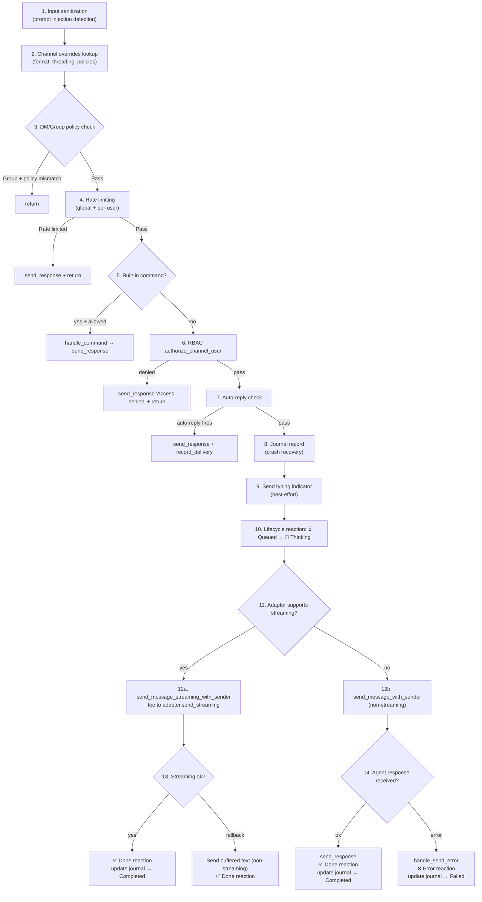

# Channels

# Channels Module (`librefang-channels`)

Provides a **Channel Bridge Layer** that connects 40+ messaging platforms to the LibreFang kernel. Each platform adapter normalises its native message format into a unified `ChannelMessage`, then the bridge dispatches those messages to the appropriate agent. Responses flow back through the same adapter to the original user.

## Overview

The module is split into two parts:

| Part | Always compiled? | Purpose |
|------|-----------------|---------|
| Core infrastructure (`bridge`, `router`, `sanitizer`, `rate_limiter`, `formatter`, `types`, `message_journal`, `sidecar`, `http_client`) | Yes | Bridge logic, routing, security, formatting, crash recovery |
| Channel adapters (40 individual modules) | No — each gated behind a `channel-xxx` Cargo feature | Platform-specific message normalisation and delivery |

```mermaid
block-beta
  columns 1

  block:Telegram
    columns 1
    tg_adapter[TelegramAdapter]
  end

  block:Discord
    columns 1
    dc_adapter[DiscordAdapter]
  end

  block:Slack
    columns 1
    sl_adapter[SlackAdapter]
  end

  block:More_Adapters
    columns 1
    more[...]
  end

  adapters["40+ Channel Adapters<br/>(feature-gated)"]
  bridge[BridgeManager<br/>dispatch, debounce, RBAC]
  router[AgentRouter<br/>routing, bindings]
  sanitizer[InputSanitizer<br/>prompt injection]
  rate_limiter[ChannelRateLimiter]
  kernel["librefang-api<br/>(ChannelBridgeHandle impl)"]

  adapters --> bridge
  bridge --> router
  bridge --> sanitizer
  bridge --> rate_limiter
  bridge --> kernel
```

## Feature Flags

All 40+ channels are gated. The crate's `Cargo.toml` defines a `default` set of popular channels and an `all-channels` metafeature:

```toml
[features]
default = ["channel-telegram", "channel-discord", "channel-slack", "channel-matrix", "channel-email"]
all-channels = ["channel-bluesky", "channel-dingtalk", "channel-discord", ...]
# ... one entry per channel
```

Enable a single channel in your `Cargo.toml`:

```toml
librefang-channels = { version = "...", features = ["channel-telegram"] }
```

## Core Types (`types.rs`)

### `ChannelMessage`

The canonical message type all adapters produce. An inbound message from any platform is normalised into this shape:

```rust
pub struct ChannelMessage {
    pub channel:        ChannelType,
    pub sender:         ChannelUser,
    pub content:        ChannelContent,
    pub is_group:       bool,
    pub thread_id:      Option<String>,
    pub timestamp:      DateTime<Utc>,
    pub metadata:       HashMap<String, serde_json::Value>,
    pub platform_message_id: String,
}
```

### `ChannelContent`

Discriminated enum covering every content type LibreFang handles:

```rust
pub enum ChannelContent {
    Text(String),
    Command { name: String, args: Vec<String> },   // slash commands
    Image { url, caption, mime_type },
    File { url, filename },
    Voice { url, caption, duration_seconds },
    Video { url, caption, duration_seconds },
    Location { lat, f64, lon: f64 },
    FileData { filename, data },
    Interactive { text, payload },
    ButtonCallback { action, message_text },
}
```

### `ChannelType`

Platform discriminator used for routing and config lookups:

```rust
pub enum ChannelType {
    Telegram, Discord, Slack, WhatsApp, Signal,
    Matrix, Email, Teams, Mattermost, WeChat,
    WebChat, CLI, Custom(String),
}
```

### `ChannelUser`

Identifies the sender on a channel:

```rust
pub struct ChannelUser {
    pub platform_id:   String,   // native user/chat ID
    pub display_name:  String,
    pub avatar_url:    Option<String>,
    pub librefang_user: Option<String>, // optional LibreFang user ID (for cross-channel identity)
}
```

### `SenderContext`

Propagates sender identity to the agent's system prompt so the agent knows who is talking and from which channel. Built by `build_sender_context()` in `bridge.rs` from the incoming `ChannelMessage` and any per-channel overrides.

```rust
pub struct SenderContext {
    pub channel:                       String,
    pub user_id:                       String,
    pub display_name:                  String,
    pub is_group:                      bool,
    pub was_mentioned:                 bool,
    pub thread_id:                     Option<String>,
    pub account_id:                    Option<String>,
    pub auto_route:                    AutoRouteStrategy,
    pub auto_route_ttl_minutes:        u32,
    pub auto_route_confidence_threshold: f32,
    pub auto_route_sticky_bonus:       i32,
    pub auto_route_divergence_count:   i32,
}
```

## `ChannelAdapter` Trait

Every channel adapter implements `ChannelAdapter`, defined in `types.rs`. The trait is `async_trait`:

```rust
#[async_trait]
pub trait ChannelAdapter: Send + Sync {
    fn name(&self) -> &str;
    fn channel_type(&self) -> ChannelType;
    fn supports_streaming(&self) -> bool { false }
    fn suppress_error_responses(&self) -> bool { false }

    // Start the adapter's receive loop and return a message stream.
    async fn start(&self) -> Result<Pin<Box<dyn Stream<Item = ChannelMessage> + Send>>, ...>;

    // Provide webhook routes and stream together. If not implemented,
    // the adapter falls back to standalone mode via start().
    async fn create_webhook_routes(&self) -> Option<(axum::Router, Pin<Box<dyn Stream<Item = ChannelMessage> + Send>>)> { None }

    async fn send(&self, user: &ChannelUser, content: ChannelContent) -> Result<(), String>;
    async fn send_in_thread(&self, user: &ChannelUser, content: ChannelContent, thread_id: &str) -> Result<(), String> { ... }
    async fn send_streaming(&self, user: &ChannelUser, text_rx: Receiver<String>, thread_id: Option<&str>) -> Result<(), String> { Err("Not supported".into()) }
    async fn send_typing(&self, user: &ChannelUser) -> Result<(), String> { Ok(()) }
    async fn send_reaction(&self, user: &ChannelUser, message_id: &str, reaction: &LifecycleReaction) -> Result<(), String> { Ok(()) }
    async fn stop(&self) -> Result<(), String> { Ok(()) }
    fn typing_events(&self) -> Option<Receiver<TypingEvent>> { None }
}
```

The two startup paths matter:

- **`start()`** — adapter manages its own connection (long-lived WebSocket, polling loop, etc.). Returns a `Stream<ChannelMessage>`. Used by adapters that cannot expose a webhook (e.g., IRC, XMPP, Matrix).
- **`create_webhook_routes()`** — adapter returns an `axum::Router` to be mounted on the shared HTTP server at `/channels/{name}/webhook`. This avoids each adapter needing its own HTTP port. Routes are collected by `BridgeManager::take_webhook_router()` and merged into the main API server.

## Bridge Manager (`bridge.rs`)

### `ChannelBridgeHandle` Trait

Defines every kernel operation an adapter may call. It lives in `librefang-channels` to avoid circular dependencies (the kernel crate cannot be a dependency here). The actual implementation lives in `librefang-api/src/channel_bridge.rs`.

Key methods:

| Category | Methods |
|----------|---------|
| Messaging | `send_message`, `send_message_with_blocks`, `send_message_with_sender`, `send_message_streaming`, `send_message_streaming_with_sender` |
| Agent lifecycle | `find_agent_by_name`, `list_agents`, `spawn_agent_by_name`, `reset_session`, `reboot_session`, `compact_session` |
| Agent control | `set_model`, `stop_run`, `set_thinking` |
| Info | `uptime_info`, `list_models_text`, `list_providers_text`, `list_skills_text`, `list_hands_text` |
| Ephemeral | `send_message_ephemeral` — `/btw` side-question, no session history |
| Security | `authorize_channel_user` — RBAC gate per channel/platform_id/action |
| Overrides | `channel_overrides` — per-channel config (format, threading, command policy, rate limits) |
| Streaming | `send_message_streaming` / `_with_sender` — text deltas piped back to adapter |
| Delivery tracking | `record_delivery` — delivery receipts for cron/workflow pushes |
| Auto-reply | `check_auto_reply` — engine decides whether to process a message |
| Automation | `list_workflows_text`, `run_workflow_text`, `list_triggers_text`, `create_trigger_text`, `delete_trigger_text`, `list_schedules_text`, `manage_schedule_text`, `list_approvals_text`, `resolve_approval_text` |
| System | `budget_text`, `peers_text`, `a2a_agents_text` |
| Events | `subscribe_events` — broadcast receiver for `ApprovalRequested` and other kernel events |

Default implementations for most methods return `"Not available."` strings. The kernel is expected to override only the methods it supports.

### `BridgeManager`

Owns all running adapters and manages the dispatch pipeline.

```rust
pub struct BridgeManager {
    handle:       Arc<dyn ChannelBridgeHandle>,
    router:       Arc<AgentRouter>,
    rate_limiter: ChannelRateLimiter,
    sanitizer:    Arc<InputSanitizer>,
    adapters:     Vec<Arc<dyn ChannelAdapter>>,
    webhook_routes: Vec<(String, axum::Router)>,
    journal:      Option<MessageJournal>,
    tasks:        Vec<tokio::task::JoinHandle<()>>,
}
```

Construction options (all chainable):

```rust
BridgeManager::new(handle, router)
    .with_sanitizer(sanitize_config)   // override default sanitizer config
    .with_journal(journal)             // enable crash recovery
```

### `start_adapter`

Attaches an adapter to the manager. This is where the message dispatch pipeline begins:

1. Call `adapter.create_webhook_routes()` if the adapter provides webhook routes; otherwise call `adapter.start()`.
2. If `message_debounce_ms > 0`, enable the **debounce path** (see below).
3. Otherwise, the **fast path**: each incoming `ChannelMessage` spawns a concurrent tokio task (limited by a semaphore of 32) that calls `dispatch_message()`.

```rust
pub async fn start_adapter(
    &mut self,
    adapter: Arc<dyn ChannelAdapter>,
) -> Result<(), Box<dyn std::error::Error + Send + Sync>>
```

### Message Debouncing

When `message_debounce_ms` is configured for a channel (via `ChannelOverrides`), the bridge buffers rapid messages from the same sender and flushes them as a single merged dispatch after the debounce interval. This prevents a burst of 10 messages in 1 second from spawning 10 separate agent calls.

```
sender_key = "{channel_type}:{platform_id}"

on message → push to SenderBuffer → reset debounce timer
on debounce timer fires → drain buffer → dispatch merged message
on max_timer fires (hard limit) → drain immediately
on typing stop → reset debounce timer (typing pauses the flush)
```

Messages of the same type (text + text) are merged by concatenating with `\n`. Multiple `/command` invocations with the same name are merged into a single command with combined args. Mixed content types always fall back to text concatenation.

### Message Dispatch Pipeline

Both `dispatch_message()` (text path) and `dispatch_with_blocks()` (multimodal path) apply this sequence:



### Image Handling (`download_image_to_blocks`)

When a `ChannelContent::Image` arrives, the bridge:

1. **Detects MIME type** using a four-tier priority: adapter hint > Content-Type header (if `image/*`) > magic byte sniffing > URL extension.
2. **Enforces size limits**: images > 5 MB are rejected with a text fallback.
3. **Downscales** images > 200 KB to max 1024×1024 px using the `image` crate's `Triangle` filter, then re-encodes as JPEG. This protects the LLM context budget when users send multiple photos.
4. **Saves to disk** (`/tmp/librefang_uploads/{uuid}.{ext}`) rather than base64-encoding into the session. The `ContentBlock::ImageFile` variant holds the path, keeping sessions lightweight.
5. Falls back to base64 inline encoding if the file write fails.

### Lifecycle Reactions

The bridge sends emoji reactions to the user's message as the agent processes it:

| Phase | Emoji |
|-------|-------|
| Queued | ⏳ |
| Thinking | 🤔 |
| Streaming | 🔄 |
| Done | ✅ |
| Error | ❌ |

These are best-effort (non-blocking). The Telegram adapter sends them as actual Telegram message reactions; others log or skip silently.

### Streaming Path

When `adapter.supports_streaming()` returns `true`, the bridge:

1. Calls `send_message_streaming_with_sender()`, receiving a `Receiver<String>` of text deltas.
2. **Tees** the stream: one copy feeds `adapter.send_streaming()` (progressive display), another accumulates into a buffer.
3. If `send_streaming()` succeeds → done.
4. If it fails → falls back to `send_response()` with the accumulated buffer text.

This ensures the user always gets a response even if the streaming channel closes mid-stream.

### Slash Commands

The bridge handles built-in slash commands directly without calling the LLM:

| Command | Description |
|---------|-------------|
| `/start`, `/help` | Welcome and help text |
| `/agents`, `/agent <name>` | List or select an agent |
| `/new`, `/reboot`, `/compact` | Session management |
| `/model [name]`, `/stop`, `/usage`, `/think` | Agent control |
| `/models`, `/providers`, `/skills`, `/hands`, `/status` | System info |
| `/btw <question>` | Ephemeral side-question |
| `/workflows`, `/workflow run <name>` | Workflow management |
| `/triggers`, `/trigger add/del` | Trigger management |
| `/schedules`, `/schedule add/del/run` | Cron management |
| `/approvals`, `/approve`, `/reject` | Approval workflow |
| `/budget`, `/peers`, `/a2a` | System monitoring |

Commands can be embedded in plain text (e.g., a user types `/agents` without a leading space). The bridge detects `text.starts_with('/')` and routes to `handle_command()`.

### Command Policy

Per-channel overrides control which commands are allowed:

```rust
// Precedence (highest first):
// 1. disable_commands = true  → all commands blocked
// 2. allowed_commands non-empty  → whitelist (only these)
// 3. blocked_commands non-empty  → blacklist (all except these)
// 4. default  → everything allowed
fn is_command_allowed(cmd: &str, overrides: Option<&ChannelOverrides>) -> bool
```

Config entries accept either `"agent"` or `"/agent"` (leading slash is stripped for matching).

### Group Policies

When a message arrives in a group context, `should_process_group_message()` applies the configured `GroupPolicy`:

| Policy | Behaviour |
|--------|-----------|
| `Ignore` | Silently drop |
| `CommandsOnly` | Process only if `ChannelContent::Command` or text starting with `/` |
| `MentionOnly` | Process only if `was_mentioned`, a command, or matches a regex trigger pattern |
| `All` | Always process |

Regex trigger patterns are compiled once into a `RegexSet` and cached in a `DashMap` keyed by the pattern set. Pattern compilation errors are logged but do not crash the bridge.

### RBAC

Before forwarding any message to an agent, `dispatch_message()` calls `handle.authorize_channel_user(ct_str, sender_id, "chat")`. The default implementation allows everything. The kernel can override this to enforce per-channel, per-user permission checks.

### Crash Recovery (`message_journal`)

When a `MessageJournal` is attached, every inbound message is written to the journal **before** dispatch with status `Processing`. On success the status is updated to `Completed`; on failure to `Failed`. On startup, `recover_pending()` returns all `Processing` entries so the caller can re-dispatch them. The journal is compacted on graceful shutdown.

### Approval Event Listener

`start_approval_listener()` subscribes to kernel events and listens for `ApprovalRequested`. When one arrives, it logs a notification for each adapter. Concrete delivery (sending an inline-keyboard message to the specific user) is noted as a follow-up feature requiring per-adapter user tracking.

### Push API

`push_message()` is the bridge-level entry point for the REST API's `POST /api/agents/:id/push`. It validates inputs, then delegates to `handle.send_channel_push()`, which looks up the adapter by type and calls `ChannelAdapter::send()`. This allows external callers to trigger outbound messages without going through the agent loop.

## Agent Router (`router.rs`)

The router resolves incoming messages to a target `AgentId` using:

1. **Thread routing** — the adapter can tag a message with `metadata["thread_route_agent"]` to route it to a specific agent based on the conversation thread.
2. **Binding context** — `resolve_with_context()` uses `account_id`, `guild_id`, `peer_id`, and `channel` to find a per-binding agent mapping.
3. **User default** — `resolve()` checks if the user has a cached default agent.
4. **Channel default** — fallback to the channel-wide default agent.
5. **Sticky re-resolution** — if the cached channel default returns "Agent not found", the bridge re-resolves by name and retries once.

Broadcast routing sends a single message to multiple agents in parallel or sequentially based on the configured `BroadcastStrategy`.

## Input Sanitizer (`sanitizer.rs`)

Detects prompt injection attacks in inbound text. Returns:

- `Clean` — pass through
- `Warned(reason)` — pass through but log
- `Blocked(reason)` — return an error message to the user and abort dispatch

Configured via `SanitizeConfig` in `librefang-types`.

## Rate Limiter (`rate_limiter.rs`)

Sliding-window rate limiter keyed on `{channel}:{sender_id}` and `{channel}:__global__`. Checks are per-override config (`rate_limit_per_minute`, `rate_limit_per_user`). Returns an error message string on limit breach.

## Formatter (`formatter.rs`)

Transforms agent response text for channel-specific conventions (markdown stripping, code block formatting, character limits). `default_output_format_for_channel()` returns a sensible default per channel type.

## Sidecar (`sidecar.rs`)

Provides a pre-configured `reqwest::Client` with sensible timeouts and proxy support for all channel adapters. The HTTP client is shared across the bridge for image downloads and webhook calls.

## Adding a New Channel Adapter

1. Create `crates/librefang-channels/src/{name}.rs` implementing `ChannelAdapter`.
2. Add the module declaration in `lib.rs` with `#[cfg(feature = "channel-{name}")]` and a public re-export if needed.
3. Add `channel-{name}` to `Cargo.toml` under the appropriate feature group.
4. Implement `ChannelAdapter::start()` or `create_webhook_routes()` to produce a `Stream<Item = ChannelMessage>`.
5. Implement `send()` (required) and any optional methods (`send_streaming`, `send_reaction`, etc.) your platform supports.
6. Call `dispatch_message()` from the adapter's test suite to verify integration.

The adapter owns only platform-specific logic (API calls, WebSocket handling, signature verification). All routing, RBAC, rate limiting, sanitization, and agent dispatch are handled by `BridgeManager`.