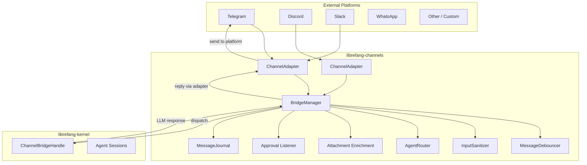

# Channels

# Channels Module

## Purpose

The `librefang-channels` crate is the bridge between external messaging platforms (Telegram, Discord, Slack, WhatsApp, Signal, Matrix, email, Teams, Mattermost, WeChat, web chat, CLI, and custom channels) and the LibreFang agent kernel. It normalizes inbound messages from heterogeneous chat APIs into a uniform `ChannelMessage` type, resolves which agent should handle each message, dispatches to the kernel for LLM processing, and delivers responses back through the originating adapter.

The module also handles content-aware attachment enrichment (PDF text extraction, source code inlining), message debouncing, prompt-injection sanitization, interactive approval workflows with inline keyboards, crash-recovery journaling, and per-channel configuration overrides.

## Architecture


```mermaid
graph TD
    subgraph "External Platforms"
        TG[Telegram]
        DC[Discord]
        SL[Slack]
        WA[WhatsApp]
        OTH[Other / Custom]
    end

    subgraph "librefang-channels"
        A1[ChannelAdapter] --> BMI[BridgeManager]
        A2[ChannelAdapter] --> BMI
        BMI --> MD[MessageDebouncer]
        BMI --> IS[InputSanitizer]
        BMI --> AR[AgentRouter]
        BMI --> AE[Attachment Enrichment]
        BMI --> AL[Approval Listener]
        BMI --> JNL[MessageJournal]
    end

    subgraph "librefang-kernel"
        CBH[ChannelBridgeHandle]
        K[Agent Sessions]
    end

    TG --> A1
    DC --> A2
    SL --> A1
    BMI -->|dispatch| CBH
    CBH -->|LLM response| BMI
    BMI -->|reply via adapter| A1
    A1 -->|send to platform| TG
```

## Key Components

### `BridgeManager`

The central orchestrator. Owns all running `ChannelAdapter` instances and their associated tokio tasks. Created by the API layer via `start_channel_bridge_with_config`.

**Lifecycle:**
- Constructed with `BridgeManager::new(handle, router)` or `with_sanitizer(...)` for explicit sanitization config
- Adapters registered one-by-one via `start_adapter(adapter)`, which subscribes to the adapter's message stream and spawns a dispatch task per message
- Optional message journal attached via `.with_journal(journal)` for crash recovery
- `start_approval_listener()` subscribes to kernel `ApprovalRequested` events and fans out interactive notifications to bound adapters
- Graceful shutdown via `stop()` (requires `&mut self`, awaits all tasks) or `abort()` (callable through shared `&self`, fires shutdown signal + aborts all task handles — used during hot-reload when `Arc::try_unwrap` fails)

**Concurrency control:** A semaphore (default 32 permits) caps concurrent dispatch tasks to prevent unbounded memory growth under burst traffic. Per-agent session serialization is handled by the kernel's `agent_msg_locks`, not the bridge.

### `ChannelBridgeHandle` Trait

Defines the kernel operations adapters need — implemented on the real kernel in `librefang-api`, mocked in tests. This trait lives in `librefang-channels` to avoid circular dependencies (channels cannot depend on the kernel crate).

Key methods:

| Method | Purpose |
|--------|---------|
| `send_message` | Basic text-in/text-out to an agent |
| `send_message_with_blocks` | Structured `ContentBlock` input (text + images) |
| `send_message_with_sender` | Includes `SenderContext` for peer-scoped memory |
| `send_message_streaming` | Returns `mpsc::Receiver<String>` for progressive token display |
| `send_message_streaming_with_sender_status` | Streaming + terminal status via oneshot channel; distinguishes success from sanitized errors |
| `send_message_ephemeral` | Side-question (`/btw`) without session persistence |
| `reset_channel_session` / `reboot_channel_session` / `compact_channel_session` | Per-channel session management scoped to `(channel, chat_id)` — does not touch sibling sessions on other channels |
| `transcribe_inbound_audio` | Hands downloaded audio to the kernel's `MediaEngine`; honors `[media] audio_transcription` config |
| `describe_inbound_image` | Hands downloaded images to the kernel's `MediaEngine`; honors `[media] image_description` config |
| `channel_overrides` / `agent_channel_overrides` | Per-channel and per-agent configuration overrides |
| `subscribe_events` / `record_consumer_lag` | Event bus subscription for approval notifications, with backpressure tracking |
| `classify_reply_intent` | LLM-based classification for whether the bot should respond in a group |
| `authorize_channel_user` | RBAC check for channel actions |

Most methods have default implementations that return stub values or "not available" strings so that adapters only need to implement the subset they use.

### `ChannelAdapter` Trait

Defined in `types.rs`. Implemented by each platform adapter (Telegram sidecar, Discord gateway, Slack socket-mode, etc.). Core interface:

- `start()` / `stop()` — lifecycle
- `name()` — identifier used in logging and webhook routes
- `channel_type()` — returns a `ChannelType` variant
- `send(recipient, content)` — deliver an outbound message
- `send_interactive(recipient, message)` — deliver an `InteractiveMessage` with inline buttons; falls back to prepending button labels to the text body for adapters without the `interactive` capability
- `create_webhook_routes()` — returns `(axum::Router, Stream)` for mounting on the shared API server instead of running a standalone HTTP listener
- `typing_events()` — optional receiver for typing indicators (used by the debouncer)
- `notification_recipients()` — static list of operator inboxes for approval broadcasts
- `fetch_headers_for(url)` — extra HTTP headers for downloading attachments

### `ReplyEnvelope`

Two-channel reply structure returned by dispatch:

```rust
pub struct ReplyEnvelope {
    pub public: Option<String>,       // Reply to the source chat
    pub owner_notice: Option<String>, // Private message to operator's DM
}
```

Adapters that don't support owner-side delivery ignore `owner_notice`. Both fields are `Option` so silent turns (no public reply, no owner notice) are representable without sentinel values.

### Message Debouncing

When `message_debounce_ms` is configured (via channel overrides), rapid-fire messages from the same sender are coalesced:

- `MessageDebouncer` groups pending messages by sender key (`channel_type:platform_id`)
- Flush triggers: debounce timer, max timer (`debounce_max_ms`), buffer full (`max_buffer`), typing stop, immediate (elapsed ≥ max)
- Merged output: same-type messages concatenate their text; multiple commands with the same name merge their args; mixed types fall back to text representation
- The flush channel is bounded at 1024 entries to bound RSS when the dispatcher stalls (issue #3580)
- Double-fire protection (issue #3742): `drain()` removes the buffer entry, so a stale timer key finds nothing

### Attachment Enrichment (`attachment_enrich.rs`)

After the bridge streams a download to disk, `enrich_saved_file()` inspects the content type and produces extra `ContentBlock::Text` blocks so the LLM sees file content without needing a file-reader tool.

**Detection matrix:**

| Signal | Action |
|--------|--------|
| `application/pdf` MIME | PDF text extraction via `pdf_extract` |
| `.pdf` extension with ambiguous MIME (`application/octet-stream`, etc.) | PDF text extraction |
| `%PDF-` magic bytes with ambiguous MIME | PDF text extraction |
| `text/*` MIME or recognized code/data extension | Inline as text |
| `image/*` MIME | Empty (bridge already emits `ContentBlock::ImageFile`) |
| Unknown binary | Empty (caller emits path-only block) |

**Key constraints:**
- Extracted text is capped at `MAX_ENRICHED_TEXT_CHARS` (200,000 chars) with truncation markers
- PDF extraction is wrapped in `catch_unwind` because `pdf_extract`/`lopdf` can panic on malformed or encrypted documents
- Audio/voice files are intentionally not enriched — they go through `media_transcribe` out of band
- Enrichment is **additive**: the existing `[File: name] saved to /path` block is preserved for tools that need raw bytes

### Approval Workflow

When an agent tool call requires approval, the kernel emits an `ApprovalRequested` event. The bridge's `start_approval_listener()` subscribes and delivers interactive notifications:

1. Parse the requesting agent's UUID from the event — malformed UUIDs are dropped with an `error!` log (issue #4875)
2. For each adapter, resolve delivery recipients:
   - **Direct route**: if the event carries `sender_id` + `channel`, deliver straight back to the originating chat (preferring `chat_id` for groups over `sender_id` for DMs)
   - **Bound adapter**: if the adapter's `channel_default` matches the requesting agent, use its static `notification_recipients()` list
   - **Binding-derived**: if no `channel_default` but an `AgentBinding` on this adapter routes to the requesting agent, fan out to those bound `peer_id`s
   - Adapters with neither are skipped with a `warn!` log
3. Build an `InteractiveMessage` with Approve/Deny buttons via `build_approval_interactive()` — adapters with the `interactive` capability render real keyboards; others fall back to plain text with `/approve <id>` instructions

The inline-button ack text is suppressed for `ButtonCallback`-originated approve/reject actions (`suppress_button_command_ack`) because the tap itself conveys the action — the extra text line was a UX wart between the user's tap and the agent's natural-language follow-up.

### Agent Router (`router.rs`)

`AgentRouter` maps `(channel_type, peer_id)` pairs to `AgentId`s using:

- **Channel defaults**: `channel_type` → default agent for all messages on that channel
- **Agent bindings**: `(channel_type, peer_id)` → specific agent, overrides the default for that chat
- **Account-scoped keys**: multi-bot adapters use `<channel_type>:<account_id>` to disambiguate

Resolution precedence: qualified binding > bare binding > channel default > agent name lookup.

### Input Sanitization

`InputSanitizer` checks inbound text for prompt-injection patterns. Three outcomes:
- **Clean** — message proceeds normally
- **Warned** — suspicious but allowed through (logged)
- **Blocked** — message dropped, user receives "Your message could not be processed"

Command arguments are reconstructed into text form before checking so slash-command args cannot carry injection payloads undetected.

### Group Message Processing

Group messages go through additional gating before dispatch:

- **Group policy** (`GroupPolicy`): `ignore`, `mention_only`, `all`
- **Mention detection**: the bot's name, aliases, or a regex trigger pattern
- **Positional vocative trigger**: "@name" at the start of a message
- **LLM classification**: `classify_reply_intent()` for ambiguous cases
- **Thread ownership**: `ThreadOwnershipRegistry` prevents multi-agent duplicate replies in shared group threads (issue #3334)

### Message Journal

Optional write-ahead journal for crash recovery. Before dispatch, the message is recorded as pending; after successful delivery, it's marked complete. On restart, `recover_pending()` returns in-flight messages for re-dispatch.

### Sidecar Protocol

Adapters that run as separate processes (Telegram, Slack, Feishu) communicate over stdin/stdout using a line-delimited JSON protocol defined in `sidecar.rs`. The bridge spawns the sidecar subprocess and reads `SidecarEvent` lines, including streaming deltas (`SidecarStreamDeltaParams`) for progressive display.

## Supported Channel Types

Defined in `ChannelType` enum:

| Variant | String Key |
|---------|-----------|
| `Telegram` | `telegram` |
| `Discord` | `discord` |
| `Slack` | `slack` |
| `WhatsApp` | `whatsapp` |
| `Signal` | `signal` |
| `Matrix` | `matrix` |
| `Email` | `email` |
| `Teams` | `teams` |
| `Mattermost` | `mattermost` |
| `WeChat` | `wechat` |
| `WebChat` | `webchat` |
| `CLI` | `cli` |
| `Custom(String)` | arbitrary string |

## Message Dispatch Pipeline


```mermaid
graph LR
    A[Adapter stream] --> B{Debounce enabled?}
    B -->|No| D[Spawn dispatch task]
    B -->|Yes| C[MessageDebouncer.push]
    C -->|Flush trigger| D
    D --> E[Acquire semaphore permit]
    E --> F[InputSanitizer.check]
    F -->|Blocked| G[Send block notice to user]
    F -->|Clean/Warned| H[Resolve agent via router]
    H --> I{Has image/file?}
    I -->|Yes| J[Download + enrich attachments]
    I -->|No| K[dispatch_message]
    J --> L[dispatch_with_blocks]
    K --> M[Kernel: send_message_streaming...]
    L --> M
    M --> N[Stream response back]
    N --> O[Format output per channel]
    O --> P[adapter.send reply]
```

## Channel Overrides

`ChannelOverrides` (from `librefang_types::config`) control per-channel behavior. Sources, in precedence order:

1. **Agent manifest overrides** (`agent_channel_overrides`) — `[channel_overrides]` in `agent.toml`
2. **Channel config overrides** (`channel_overrides`) — per channel type in the kernel config
3. **Adapter-carried overrides** — sidecar `[[sidecar_channels]]` blocks (issue #5841)

Key override fields:

| Field | Default | Purpose |
|-------|---------|---------|
| `output_format` | Platform-specific | `Markdown`, `Html`, `Plain` |
| `message_debounce_ms` | 0 (disabled) | Coalescing window |
| `message_debounce_max_ms` | 30000 | Hard ceiling on debounce |
| `message_debounce_max_buffer` | 64 | Max messages before forced flush |
| `threading` | false | Enable thread/topic replies |
| `dm_policy` | — | DM handling |
| `group_policy` | — | Group message gating |
| `command_policy` | — | Allowed/blocked slash commands |

## Lifecycle Reactions

Outbound messages carry `LifecycleReaction` markers that adapters translate into platform-specific behavior (e.g., Telegram "typing" indicators, reaction emojis). Phase emojis (`default_phase_emoji`) signal agent processing stages to the user.

## File Download Configuration

Two `ChannelBridgeHandle` accessors control attachment downloads:

- `channels_download_dir()` — explicit configured directory, or `None`
- `effective_channels_download_dir()` — configured value falling back to `<temp>/librefang_uploads`
- `channels_download_max_bytes()` — optional size cap

On startup, stale files (>24h) are swept from the download directory via `cleanup_old_uploads`, guarded by `std::sync::Once` to avoid redundant sweeps across multiple adapter registrations.

## Shutdown and Hot-Reload

The bridge supports two shutdown paths:

- **Graceful** (`stop(&mut self)`): sends shutdown signal, stops all adapters (releasing ports/connections), awaits all tracked tasks, clears abort handles. Used during normal daemon shutdown.
- **Hard** (`abort(&self)`): callable through a shared `Arc<BridgeManager>` reference. Fires the shutdown watch signal and aborts all tracked task handles. Used during hot-reload when `Arc::try_unwrap` fails because an inbound request still holds the Arc — without this, old bridge tasks would leak indefinitely.

External spawners (e.g., journal retry tickers from `librefang-api`) must register via `track_task()` or their tasks leak across hot-reloads as both old and new instances race on the same resources.