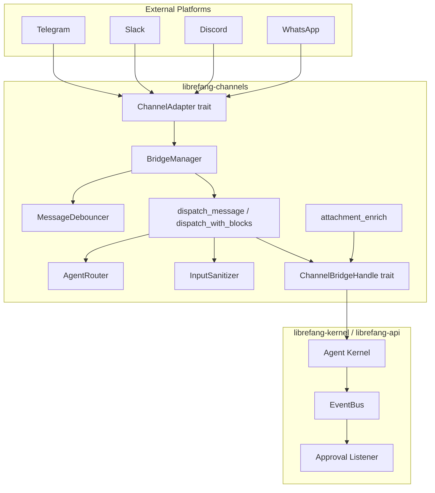

# Channels

# Channels Module

The `librefang-channels` crate is the bridge between external chat platforms (Telegram, Slack, Discord, WhatsApp, etc.) and the LibreFang agent kernel. It manages adapter lifecycles, routes inbound messages to the correct agent, enriches attachments with extracted content, handles debouncing and rate limiting, and delivers proactive notifications (approvals, scheduled messages) back to users.

## Architecture Overview


```mermaid
graph TD
    subgraph "External Platforms"
        TG[Telegram]
        SL[Slack]
        DC[Discord]
        WA[WhatsApp]
    end

    subgraph "librefang-channels"
        ADP[ChannelAdapter trait] --> BR[BridgeManager]
        BR --> DB[MessageDebouncer]
        BR --> DS[dispatch_message / dispatch_with_blocks]
        DS --> RT[AgentRouter]
        DS --> SN[InputSanitizer]
        DS --> FH[ChannelBridgeHandle trait]
        AE[attachment_enrich] --> FH
    end

    subgraph "librefang-kernel / librefang-api"
        FH --> K[Agent Kernel]
        K --> EV[EventBus]
        EV --> AL[Approval Listener]
    end

    TG --> ADP
    SL --> ADP
    DC --> ADP
    WA --> ADP
```

Messages flow inbound: platform → adapter → `BridgeManager` → router/sanitizer → kernel. Outbound responses and proactive notifications (approvals, cron, push) flow the opposite direction through `ChannelAdapter::send` and `send_interactive`.

---

## Core Types

### `ChannelMessage` and `ChannelContent`

Every inbound event from a platform is normalized into a `ChannelMessage` containing:

- `sender: ChannelUser` — platform identity (`platform_id`, `display_name`), optionally linked to a LibreFang user
- `content: ChannelContent` — the payload, which can be `Text`, `Command`, `Image`, `File`, `Voice`, `Video`, `Location`, `FileData`, `Interactive`, `ButtonCallback`, `Audio`, `Animation`, `Sticker`, `MediaGroup`, `Poll`, `PollAnswer`, `DeleteMessage`, or `EditInteractive`
- `channel: ChannelType` — the originating platform enum
- `thread_id: Option<String>` — for forum/topic contexts
- `metadata: HashMap<String, serde_json::Value>` — extensible key-value bag (used for `account_id`, `sender_user_id`, etc.)

### `ChannelUser`

Identifies a user on a specific platform:

```rust
pub struct ChannelUser {
    pub platform_id: String,      // Platform-specific user/chat ID
    pub display_name: String,     // Human-readable name
    pub librefang_user: Option<...>, // Linked LibreFang user, if resolved
}
```

### `SenderContext`

Propagated to the agent's system prompt so the LLM knows who is talking and from which channel. Constructed during dispatch from the `ChannelMessage` metadata.

### `ReplyEnvelope`

Two-channel reply structure returned by the bridge:

- `public: Option<String>` — the reply visible to the chat (DM or group)
- `owner_notice: Option<String>` — a private message for the operator's DM only (e.g., produced by the `notify_owner` LLM tool)

Adapters that don't support owner-side delivery should forward only `public`. Use `ReplyEnvelope::silent()` for no-reply turns and `ReplyEnvelope::from_public(s)` for public-only replies.

---

## `ChannelBridgeHandle` Trait

Defined in `bridge.rs`, implemented by `librefang-api` on the real kernel. This trait is the kernel operations interface that channel adapters can call without creating a circular dependency on `librefang-kernel`.

Key method groups:

| Group | Methods | Purpose |
|-------|---------|---------|
| **Message sending** | `send_message`, `send_message_with_blocks`, `send_message_with_sender`, `send_message_streaming*` | Send to agent, optionally with multimodal blocks, sender context, or streaming |
| **Session management** | `reset_session`, `reboot_session`, `compact_session`, `reset_channel_session`, `reboot_channel_session`, `compact_channel_session` | Session lifecycle; per-channel variants operate only on the channel-scoped session (#4868) |
| **Agent management** | `find_agent_by_name`, `list_agents`, `spawn_agent_by_name`, `stop_run`, `set_model` | Agent CRUD and runtime control |
| **Channel overrides** | `channel_overrides`, `agent_channel_overrides`, `agent_channel_allowlist` | Per-channel/per-agent configuration |
| **Automation** | `list_workflows_text`, `run_workflow_text`, `list_triggers_text`, `create_trigger_text`, `manage_schedule_text` | Workflow, trigger, and cron management |
| **Approvals** | `list_approvals_text`, `resolve_approval_text`, `subscribe_events` | Approval lifecycle and event subscription |
| **Media** | `transcribe_inbound_audio`, `describe_inbound_image` | Audio transcription and image description via `MediaEngine` |
| **Authorization** | `authorize_channel_user` | RBAC check for channel actions |

Most methods have sensible defaults (no-op, empty vec, or error strings) so test mocks only need to implement the methods under test.

---

## `BridgeManager`

Owns all running channel adapters and coordinates message dispatch.

### Construction

```rust
let bm = BridgeManager::new(kernel_handle, router)
    .with_sanitizer(&sanitize_config)
    .with_journal(journal);
```

### Starting an Adapter

`start_adapter(adapter)` subscribes to the adapter's message stream and spawns a dispatch task per message. A semaphore (default: 32 concurrent tasks) prevents unbounded memory growth under burst traffic.

When the adapter provides webhook routes via `create_webhook_routes()`, those are collected for mounting on the main API server instead of running a standalone HTTP server per adapter. Call `take_webhook_router()` after starting all adapters to get the merged `axum::Router`.

### Shutdown

- **Graceful**: `stop(&mut self)` — signals shutdown, stops adapters, awaits all tasks
- **Hard**: `abort(&self)` — callable through a shared `&self` (important for `ArcSwap` hot-reload scenarios where `Arc::try_unwrap` may fail). Fires the shutdown signal and aborts all tracked tasks. Prefer `stop()` when `&mut self` is available.

### Task Tracking

`track_task(handle)` registers externally-spawned tasks (e.g., journal retry tickers) so their lifetime is tied to the bridge. Tasks not tracked leak across hot-reloads.

---

## Message Debouncing

`MessageDebouncer` coalesces rapid-fire messages from the same sender (configured via `message_debounce_ms`, `message_debounce_max_ms`, `message_debounce_max_buffer` in channel overrides). When debouncing is enabled:

1. Messages are buffered per-sender key (`{channel}:{platform_id}`)
2. A debounce timer fires after `debounce_ms` of silence
3. A hard max timer fires at `debounce_max_ms` regardless of activity
4. Buffer overflow at `max_buffer` triggers immediate flush
5. Typing events (`on_typing`) can trigger early flush or reset the debounce timer

The flush channel is bounded to 1024 entries (#3580) to prevent OOM when the dispatcher stalls.

Messages in the same debounce window are merged: same-type messages concatenate their text; multiple commands with the same name merge their args; mixed types fall back to text concatenation.

---

## Attachment Enrichment

The `attachment_enrich` module ensures the LLM sees file content regardless of upload path. Historically, channel downloads only produced a `[File: name] saved to /path` text block, forcing the LLM to use a file-reader tool that fails on binary formats.

### `enrich_saved_file(saved_path, media_type, filename) → Vec<ContentBlock>`

Called after the bridge streams a download to disk. Returns zero or more `Text` blocks inserted *before* the existing path block.

Detection logic:

1. **PDF**: Matched by `application/pdf` MIME, `.pdf` extension (when MIME is ambiguous), or `%PDF-` magic bytes. Text extracted via `pdf_extract` with panic isolation (malformed/encrypted PDFs won't crash the bridge). Empty extraction (image-only PDF) surfaces a note explaining OCR is not supported.
2. **Text-like**: Matched by `text/*` MIME, known application MIME types (`json`, `yaml`, `xml`, `javascript`, etc.), or file extension fallback (60+ extensions covering code, config, data, and markup files). Content is inlined as UTF-8 with lossy decoding.
3. **Everything else** (including images): Returns empty vec. Images already get `ContentBlock::ImageFile` from the bridge; double-encoding would waste tokens.

Content is truncated at `MAX_ENRICHED_TEXT_CHARS` (200,000 characters), matching the caps in `pdf_text` and the API attachment handler.

Audio/voice files are intentionally excluded — they go through `media_transcribe` out of band, and binary noise would waste tokens.

---

## Agent Router

`AgentRouter` resolves which agent should handle a message using a priority chain:

1. **Direct route** — explicit `(channel, chat_id) → agent_id` mapping set via `set_direct_route`
2. **User default** — per-user default agent for a channel, set via `set_user_default_for_channel`
3. **Channel default** — fallback agent for the entire channel, set via `set_channel_default`
4. **No match** — returns `None`, message is typically answered with a "no agent configured" notice

Multi-bot adapters (multiple Telegram bots on the same channel type) use account-qualified keys like `telegram:<bot_id>` for isolation.

### `AgentBinding`

Bindings map specific peer IDs (group chats, DMs) to agents, with optional trigger patterns. The router's `bound_recipients_for_agent` method reverses this mapping to find which peer IDs route to a given agent — used by the approval listener for delivery.

---

## Input Sanitization

`InputSanitizer` checks inbound text for potential prompt injection payloads. Three outcomes:

- **Clean**: message proceeds normally
- **Warned**: suspicious but allowed through (logged)
- **Blocked**: message dropped, user receives a generic "could not be processed" notice

Sanitization is applied to text content, command args, image/voice/video captions — anywhere user-controlled text reaches the LLM.

---

## Rate Limiting

`ChannelRateLimiter` provides per-key sliding-window rate limiting. Keys are typically per-sender. Stale buckets are evicted by a periodic sweeper. When a rate limit is exceeded, the user receives a polite backoff message.

---

## Approval Workflow

When an agent's tool call requires approval (e.g., file writes marked as risky):

1. The kernel emits an `ApprovalRequested` event on the `EventBus`
2. `BridgeManager::start_approval_listener` subscribes to these events
3. The listener routes the approval to the correct adapter and recipient:
   - **Direct route**: If the event carries `sender_id` + `channel` (the common case for tool calls triggered during active chats), the approval goes straight back to that chat
   - **Bound agent route**: Falls back to adapters whose `channel_default` or `AgentBinding` peer IDs target the requesting agent
   - **No route**: Warning logged — operator has no signal that approvals are being dropped
4. The notification is an `InteractiveMessage` with Approve/Deny buttons
5. Adapters with `interactive` capability render inline keyboards; others fall back to text with `/approve <id>` instructions
6. When a user taps a button, it arrives as `ChannelContent::ButtonCallback` with the `/approve` or `/reject` action, which the bridge routes to the existing command handler
7. Button-triggered approve/reject responses are suppressed from the public reply (the tap itself conveys the action) via `suppress_button_command_ack`

### `build_approval_interactive`

Constructs the `InteractiveMessage` payload with a two-button keyboard. Factored out for unit testing — the payload text includes the tool name, risk level, description, and slash-command instructions (including TOTP code format).

---

## Group Message Processing

Group messages require special handling to avoid the bot responding to every message:

- **Mention/alias detection**: Bot responds when directly mentioned or called by configured aliases
- **Reply-to detection**: Bot responds when someone replies to a message the bot sent
- **Regex trigger patterns**: Configured via `group_trigger_patterns` in channel overrides, compiled into a `RegexSet` and cached
- **LLM classification**: `classify_reply_intent` uses a lightweight LLM call to determine if the bot should respond (fail-open: defaults to `true`)
- **Addressee guard**: A positional vocative trigger system (`@botname, do X`) gated behind `LIBREFANG_GROUP_ADDRESSEE_GUARD=on` for gradual rollout

Group history is maintained in a `GroupHistoryBuffer` singleton with 24-hour retention, installed globally so it survives hot-reloads.

---

## Message Journal

Optional crash recovery via `MessageJournal`. Messages are recorded before dispatch and marked complete after. On restart, `recover_pending()` returns in-flight messages for re-processing. Entries have retry budgets and deferred scheduling for transient failures.

---

## Output Formatting

The `formatter` module converts agent responses for channel display:

- **Markdown to plain**: Strips markdown formatting for channels that don't support it
- **Output format**: Controlled by `ChannelOverrides.output_format` (Plain, Markdown, Html) with per-channel defaults
- **Prefix style**: Agent name prefixing controlled by `ChannelOverrides.prefix_style`
- **Message truncation**: `message_truncator` splits long messages into UTF-16-aware chunks for platforms with character limits

---

## Sidecar Protocol

Some adapters run as external sidecar processes communicating over a JSON protocol. The `sidecar` module handles:

- Process lifecycle (spawn, health checks, supervised restart)
- Inbound/outbound message serialization
- QR code events, channel status updates
- Username folding (sidecar username → sender username metadata)

---

## Thread Ownership

`ThreadOwnershipRegistry` prevents duplicate replies when multiple agents are bound to the same group thread. An agent claims a thread before responding; other agents skip the message. Claims are per-process and don't persist across restarts.

---

## HTTP Client

Shared HTTP utilities for downloading attachments and webhook verification:

- `fetch_url_bytes` / `fetch_url_bytes_unchecked` — bounded download with content-length and body-size caps
- HMAC verification for webhook signatures
- TLS configuration

---

## File Download Lifecycle

1. Bridge receives file/voice/image URL from adapter
2. `download_image_to_blocks` or equivalent downloads to the configured directory (`channels_download_dir` or `<temp>/librefang_uploads`)
3. File size capped by `channels_download_max_bytes`
4. `enrich_saved_file` extracts text content for PDFs and text-like files
5. Audio files transcribed via `transcribe_inbound_audio` (respects `[media].audio_transcription` config)
6. Images described via `describe_inbound_image` (respects `[media].image_description` config)
7. On startup, a one-time cleanup sweep removes files older than 24 hours from the download directory