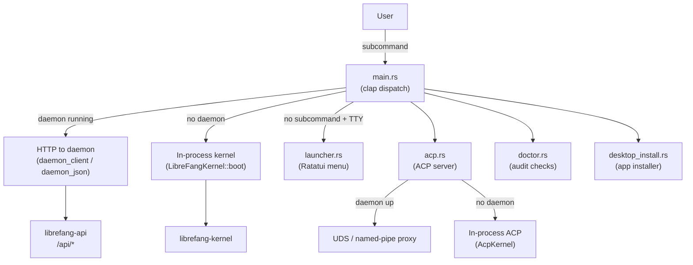

# CLI & Desktop — librefang-cli-src

# LibreFang CLI (`librefang-cli`)

The command-line interface for the LibreFang Agent OS. A single binary that serves as the primary user entry point, supporting both daemon-connected operation (HTTP) and single-shot in-process kernel execution.

## Architecture Overview



## Two Execution Modes

Every CLI command runs in one of two modes, chosen automatically at startup:

**Daemon-connected** — When a background daemon is running (started via `librefang start`), the CLI is a thin HTTP client. Commands like `agent list`, `chat`, `status`, and `config set` become REST calls to the daemon's API server. This mode is selected when `find_daemon()` locates a running daemon (probes the expected port and validates `/api/health`).

**In-process** — When no daemon is detected, the CLI boots a `LibreFangKernel` inside its own process, runs the command against it, then exits. This is the single-shot path used by CI pipelines and quick one-off commands. State is not persisted between invocations in this mode.

The distinction matters for features like tool-approval caching: an `allow_always` decision remembered during an in-process run is not visible to the daemon's kernel, and vice-versa. Mode selection is logged to stderr so users can diagnose "forgotten approvals."

## Command Structure

The CLI uses `clap::Parser` with nested subcommands. The top-level commands fall into several categories:

| Category | Commands | Backend |
|---|---|---|
| Lifecycle | `init`, `start`, `stop`, `restart`, `update`, `uninstall` | Mixed |
| Agents | `agent new/list/chat/kill/set/spawn`, `agents`, `kill`, `spawn` | Daemon or in-process |
| Chat | `chat` | Daemon or in-process |
| Configuration | `config show/edit/get/set/set-key/delete-key/test-key` | Daemon or in-process |
| Diagnostics | `doctor`, `status` | Local + daemon |
| Integrations | `mcp add/remove/list/catalog`, `channel setup/list/reload/rm` | Daemon required |
| Desktop | (automatic via launcher) | Local filesystem |
| ACP | `acp` | In-process or daemon proxy |

Several top-level commands (`agents`, `kill`, `spawn`) are convenience aliases for their `agent` subcommand equivalents.

## Key Modules

### `main.rs` — Entry Point and Command Dispatch

The binary root. Responsibilities:

- **Argument parsing** via `clap`. The `Cli` struct declares all global flags (`--config`) and subcommands.
- **Mode detection**: `find_daemon()` probes for a running daemon before dispatching commands.
- **Command routing**: each subcommand maps to a `cmd_*` function. Commands requiring a daemon call `require_daemon()` or `daemon_client()`/`daemon_json()` to obtain an authenticated HTTP client.
- **In-process kernel boot**: commands that work without a daemon call `LibreFangKernel::boot()` directly.
- **Ctrl+C handling**: platform-specific handler via `install_ctrlc_handler()`. On Windows, uses `SetConsoleCtrlHandler` to interrupt blocking reads; on Unix, the default SIGINT handler suffices.
- **`.env` loading**: calls `load_dotenv()` early in startup to populate environment variables from `~/.librefang/.env`.

Key helper functions used across commands:
- `daemon_client()` — builds an authenticated HTTP client by reading the API key via `read_api_key()`.
- `daemon_json()` — like `daemon_client()` but returns parsed JSON directly.
- `require_daemon()` — exits with an error if no daemon is reachable.
- `ensure_initialized()` — checks that `~/.librefang/` exists and has a config before proceeding.
- `find_daemon()` — probes the expected port and validates the daemon is healthy.
- `load_update_channel_from_config()` — reads the `update_channel` setting for the self-update flow.

### `acp.rs` — Agent Client Protocol Server

Provides the `librefang acp` subcommand, which serves the Agent Client Protocol over stdio so editors (Zed, VS Code, JetBrains) can embed LibreFang as a native agent.

Two modes, selected automatically:

1. **Daemon-attached proxy** — If the daemon is running and has an ACP listener:
   - Unix: connects to `~/.librefang/acp.sock` (UDS) via `run_uds_proxy()`
   - Windows: connects to `\\.\pipe\librefang-acp` (named pipe) via `run_pipe_proxy()`
   - The CLI becomes a bidirectional stdin↔socket↔stdout pipe. Multiple editors share the daemon's long-running kernel, so agent state, history, and approval decisions are consistent across tabs.

2. **In-process kernel** — Boots a fresh `LibreFangKernel`, creates a `KernelAdapter`, resolves the requested agent (defaults to `"assistant"`), and runs `librefang_acp::run()` on a Tokio runtime until stdin EOF.

The daemon-attached path checks for stale sockets: `locate_acp_socket()` verifies both that the daemon is reachable AND the socket file exists, falling back to in-process mode if the daemon crashed and left a stale socket behind.

### `desktop_install.rs` — Desktop App Lifecycle

Handles discovery, download, and installation of the LibreFang Desktop app. Used by the interactive launcher when a user selects "Desktop App" but no desktop binary is installed.

**Discovery** (`find_desktop_binary()`): searches in order:
1. Sibling of the current CLI executable
2. PATH lookup (`which_lookup()`)
3. Platform-specific install locations:
   - macOS: `/Applications/LibreFang.app/Contents/MacOS/LibreFang`
   - Windows: `%LOCALAPPDATA%\LibreFang\LibreFang.exe`
   - Linux: `~/.local/bin/librefang-desktop` or `~/Applications/LibreFang.AppImage`

**Installation** (`download_and_install()`):
1. Queries the GitHub Releases API for the latest release
2. Selects the platform-appropriate asset (`.dmg`, `-setup.exe`, or `.AppImage`)
3. Downloads to a temp directory
4. Delegates to platform-specific installers:
   - macOS: `install_macos_dmg()` — mounts the DMG, copies `.app` to `/Applications`, clears quarantine
   - Windows: `install_windows()` — runs the NSIS installer silently (`/S`)
   - Linux: `install_linux_appimage()` — copies to `~/.local/bin/`, sets `chmod 755`

**Launch** (`launch()`): on macOS, detects `.app` bundles and uses `open -a`; elsewhere, spawns the binary detached.

Platform-specific code is gated with `#[cfg(target_os)]`. The inner install functions have dependency-injected variants (e.g., `install_linux_appimage_to()`) for testing against temp directories.

### `doctor.rs` — Diagnostic Audit Framework

A trait-based registry of health checks for `librefang doctor`. Designed to replace the legacy inline check chain in `cmd_doctor` incrementally.

**Adding a new check:**
1. Create a unit struct implementing `AuditCheck`
2. Add it to `registered_checks()`

Each check receives an `AuditContext` (currently just `librefang_home: PathBuf`) and returns an `AuditResult` with a stable name, severity (`Pass`/`Info`/`Warn`/`Error`), summary, and optional hint.

**Registered checks:**

| Check | Severity | What it validates |
|---|---|---|
| `VaultKeyCheck` | Info/Error | `LIBREFANG_VAULT_KEY` must be valid base64 decoding to exactly 32 bytes. Catches the common mistake of using 32 ASCII characters (which decodes to 24 bytes). |
| `ApiListenAddrCheck` | Info/Warn/Error/Pass | `config.toml`'s `api_listen` must parse as `SocketAddr`. Warns on privileged ports (<1024) and port 0 (ephemeral, undiscoverable). |
| `ConfigTomlSchemaCheck` | Warn/Error/Pass | `config.toml` must exist and parse as valid TOML. |

The `VaultKeyCheck` intentionally does NOT trim the env var value, matching production behavior in `librefang-extensions/src/vault.rs` — a trailing newline must fail here just as it would in real vault unlock.

### `launcher.rs` — Interactive Launcher Menu

A Ratatui-based one-shot menu shown when `librefang` is run with no subcommand in a TTY. Adapts its layout for first-time vs returning users.

**Two menu variants:**
- `MENU_FIRST_RUN` — "Get started" is the first entry, includes provider/API key setup and migration hints
- `MENU_RETURNING` — "Chat with an agent" is first, setup relegated to "Settings" at position 5

**State detection on launch:**
- `is_first_run()` — checks for `config.toml` in `$LIBREFANG_HOME`/`~/.librefang/`
- `detect_provider()` — scans for provider API key env vars (`ANTHROPIC_API_KEY`, `OPENAI_API_KEY`, etc.)
- `has_openclaw()` / `has_openfang()` — checks for `~/.openclaw`/`~/.openfang` to offer migration
- Background thread probes daemon status and agent count

**Navigation:** ↑/↓/j/k, number keys 1–9 for direct selection, Enter to confirm, `q`/Esc to quit. The help screen (`LauncherChoice::ShowHelp`) renders the full `--help` output in a scrollable view with PgUp/PgDn and g/G for top/bottom.

Content is constrained to 80 columns max with a left margin, centering vertically in the upper third of the terminal.

### `log_filter.rs` — Reloadable Tracing Filter

A per-layer `EnvFilter` that can be hot-reloaded at runtime. Used by the daemon's tracing stack so the OTel exporter sees the full span tree while stderr stays terse.

The implementation wraps `EnvFilter` in an `ArcSwap` behind a process-global `OnceLock`. After swapping the inner filter, `tracing_core::callsite::rebuild_interest_cache()` is called to invalidate the per-callsite `Interest` cache — without this, callsites resolved to `Always`/`Never` under the old filter would never re-query the new one.

**Baseline directives:** `install_with_baseline()` stores per-target overrides (e.g., `librefang_kernel=warn`) that survive reloads. When `reload_log_level("debug")` is called from the dashboard, the new filter is built from both the user's directive and the stored baseline. This prevents a "give me debug" toggle from flooding the operator with kernel/runtime noise that boot had specifically masked.

The `CliLogLevelReloader` struct adapts this for the kernel's `LogLevelReloader` trait.

### `http_client.rs` — HTTP Client Factory

Creates a `reqwest::blocking::Client` with bundled CA roots from `librefang_runtime::http_client::tls_config()`. Every CLI command that makes HTTP requests (daemon communication, GitHub API for updates/downloads) uses this client.

### `i18n.rs` — Internationalization

Thread-local Fluent-based i18n with two supported languages: `en` (default) and `zh-CN`. FTL resource files are embedded at compile time via `include_str!`.

Usage:
- `init("en")` or `init("zh-CN")` — sets up the thread-local `FluentBundle`
- `t("key")` — returns the translated string for the current language
- `t_args("key", &[("name", "value")])` — interpolation

Falls back to English if the requested language is unsupported. Missing keys render as `[key]`.

### `bundled_agents.rs` — Registry Sync

Thin wrapper around `librefang_runtime::registry_sync::sync_registry()`. Syncs agent content from the registry to the local `~/.librefang/` home directory. Exists for backwards compatibility with CLI callers.

## Daemon Communication

Commands that require a running daemon follow this flow:

1. `find_daemon()` reads `~/.librefang/daemon.json` (written by `librefang start`) to get the bind address
2. Probes the port with a TCP connect + `/api/health` request
3. `daemon_client()` builds a `reqwest::blocking::Client` with the API key from `read_api_key()`
4. HTTP requests hit the daemon's REST API (`/api/agents`, `/api/config`, etc.)

The daemon info file also stores a PID for process-existence checks. `find_daemon()` validates both the file and the live process before reporting success.

## Startup Sequence

```
main()
├── install_ctrlc_handler()
├── load_dotenv()                          // ~/.librefang/.env → env vars
├── Cli::parse()                           // clap argument parsing
├── match command:
│   ├── None + TTY  → launcher::run()      // interactive menu
│   ├── None + pipe → show help
│   ├── Some(cmd)   → cmd_*(cmd)           // dispatch to handler
│   └── ...
└── exit with command's exit code
```

## Platform Considerations

- **Memory allocator**: On non-MSVC targets, uses `tikv-jemallocator` as the global allocator
- **Recursion limit**: Set to 256 to accommodate the deeply-nested async future chain in the in-process agent loop
- **ACP transport**: Unix uses UDS (`acp.sock`), Windows uses named pipes (`\\.\pipe\librefang-acp`)
- **Desktop install**: macOS uses DMG + `hdiutil`, Windows uses NSIS silent install, Linux uses AppImage copy + `chmod`
- **Ctrl+C**: Windows uses `SetConsoleCtrlHandler` for reliable interrupt; Unix relies on default SIGINT