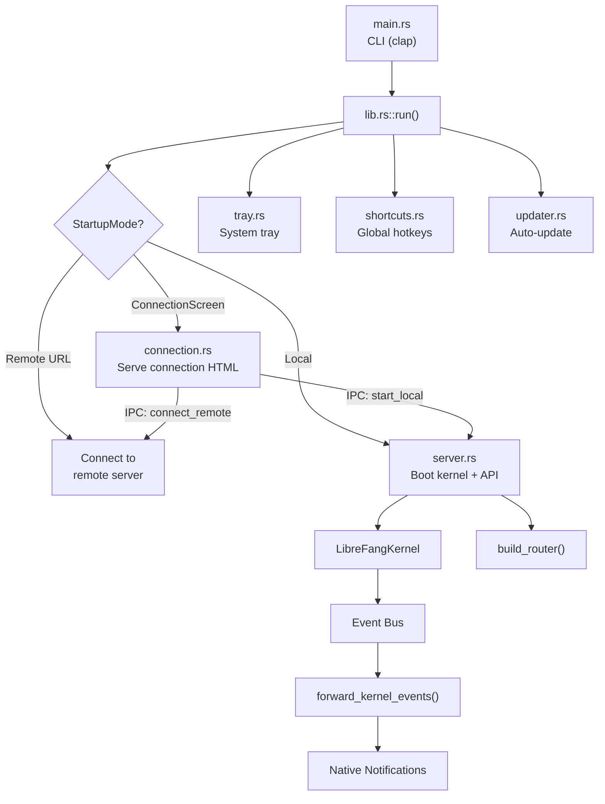

# CLI & Desktop — librefang-desktop-src

# LibreFang Desktop (`librefang-desktop`)

Native desktop and mobile client for the LibreFang Agent OS, built on Tauri 2.0. The app can either boot an embedded kernel + API server locally or connect to a remote LibreFang instance, then renders the web dashboard in a native WebView window.

## Architecture Overview

## Startup Flow

The application resolves its startup mode through a priority chain:

1. **CLI `--server-url <URL>`** — connect directly to a remote server
2. **CLI `--local`** — boot a local server, skip connection screen (desktop only)
3. **`LIBREFANG_SERVER_URL` environment variable** — remote URL
4. **Saved preference** in `~/.librefang/desktop.toml` — replay last choice
5. **Connection screen** — user picks remote URL or starts local server

On mobile (`#[cfg(mobile)]`), the entry point is `mobile_main()`, which calls `run(None, false)` since CLI arguments don't apply when the OS launches the bundled binary.

### `main.rs` — CLI Entry Point

Parses two optional arguments before handing off to `lib::run()`:

| Flag | Type | Purpose |
|------|------|---------|
| `--server-url <URL>` | `Option<String>` | Skip connection screen, connect to remote |
| `--local` | `bool` | Skip connection screen, start embedded server |

`.env` loading happens at the synchronous `main()` boundary via `librefang_extensions::dotenv::load_dotenv()` because `std::env::set_var` is undefined behavior once other threads exist.

## Managed State

Tauri managed state is registered once during `run()` with interior-mutable wrappers. All later updates go through the `RwLock`/`Mutex` — `manage()` is never called a second time.

| State Type | Inner Type | Purpose |
|------------|------------|---------|
| `PortState` | `RwLock<Option<u16>>` | Embedded server port; `None` in remote mode |
| `KernelState` | `RwLock<Option<KernelInner>>` | Kernel handle + `Instant` for uptime; `None` in remote mode |
| `ServerUrlState` | `RwLock<String>` | URL the WebView navigates to |
| `RemoteMode` | `RwLock<bool>` | `true` when connected to a remote server |
| `ServerHandleHolder` | `Mutex<Option<ServerHandle>>` | Desktop-only. Holds the server handle for shutdown. Not present on mobile. |

`KernelInner` holds an `Arc<LibreFangKernel>` and the `Instant` the server started, enabling uptime reporting.

## Platform Conditionals

The codebase uses extensive `#[cfg]` gates to split desktop and mobile code paths:

- **Desktop-only modules**: `server`, `shortcuts`, `tray` (additionally gated behind `linux-tray` feature on Linux due to GTK3 advisories), `updater`
- **Desktop-only IPC commands**: `start_local`, `get_autostart`, `set_autostart`, `check_for_updates`, `install_update`
- **Mobile-only IPC commands**: `store_credentials`, `get_credentials`, `clear_credentials` (OS keyring access)
- **Desktop-only plugins**: single-instance, autostart, shell, updater, global shortcuts
- **Desktop window behavior**: close-to-tray (hides instead of quitting); mobile uses the conf-declared window

The `generate_handler!` macro doesn't support `cfg` attributes internally, so two separate handler lists are compiled — one for desktop, one for mobile.

## Module Reference

### `commands.rs` — Tauri IPC Handlers

Exposes kernel operations to the WebView frontend. Commands access managed state via `tauri::State<'_>`.

**Status queries:**
- `get_port` → `Result<u16, String>` — embedded server port
- `get_status` → `Result<serde_json::Value, String>` — JSON with `status`, `port`, `agents`, `uptime_secs`
- `get_agent_count` → `Result<usize, String>` — registered agent count

**Import workflows:**
- `import_agent_toml` — Opens a native file picker for `.toml` files, parses as `AgentManifest`, copies to `~/.librefang/workspaces/agents/{name}/agent.toml`, then calls `kernel.spawn_agent()`
- `import_skill_file` — Opens a picker for `.md`, `.toml`, `.py`, `.js`, `.wasm` files, copies to `~/.librefang/skills/`, calls `kernel.reload_skills()`

**Auto-start (desktop only):**
- `get_autostart` / `set_autostart(enabled)` — reads/writes OS login item via `tauri-plugin-autostart`

**Updates (desktop only):**
- `check_for_updates` → `Result<UpdateInfo, String>` — probes the update endpoint
- `install_update` — downloads, installs, and restarts. Does not return `Ok` on success.

**Credentials (mobile only):**
- `store_credentials(base_url, api_key)` — JSON-encodes into OS keyring entry `librefang-mobile / daemon-credentials`
- `get_credentials` → `Result<Option<serde_json::Value>, String>` — returns `null` if no entry
- `clear_credentials` — deletes keyring entry, tolerates `NoEntry`

**Utilities:**
- `open_config_dir` — opens `~/.librefang/` in OS file manager
- `open_logs_dir` — opens `~/.librefang/logs/`
- `uninstall_app` — platform-specific uninstall (see below)

#### Uninstall Behavior by Platform

| Platform | Behavior |
|----------|----------|
| **Windows** | Queries `HKCU\Software\Microsoft\Windows\CurrentVersion\Uninstall` for NSIS `UninstallString`, spawns it, exits |
| **macOS** | Locates enclosing `.app` bundle from executable path, moves to Trash via `osascript` + Finder |
| **Linux/AppImage** | Deletes the AppImage file directly (respects `$APPIMAGE` env var) |
| **Linux/system pkg** | Returns error with distro-specific hint (`apt remove`, `dnf remove`, `pacman -R`) |
| **Mobile** | Returns error directing user to platform app store |

### `connection.rs` — Connection Screen & Mode Switching

Renders a self-contained HTML/CSS/JS connection page served through a custom `lfconnect://` URI scheme protocol (avoids the `about:blank` + `document.write` approach that breaks on WebKitGTK 2.50).

**Key functions:**

- `load_saved_preference()` — reads `~/.librefang/desktop.toml`, returns `ConnectionPreference { mode, server_url }`
- `save_preference(pref)` — writes to `desktop.toml`
- `connection_html()` — returns the full HTML string. On mobile (`#[cfg(mobile)]`), the "Start Local Server" button and divider are stripped at compile time using sentinel-based string replacement with `debug_assert` verification
- `navigation_target(daemon_url)` — computes the WebView target URL. On mobile release builds, returns `tauri://localhost/index.html#api=<encoded url>` for the bundled dashboard; otherwise returns the daemon URL directly

**IPC commands:**

- `test_connection(url)` — HTTP GET to `{url}/api/health`, 10s timeout, validates via `validate_server_url` first
- `connect_remote(url, remember)` — validates URL, health-checks, saves preference, updates all managed state (clears `PortState` and `KernelState` since those are local-only), navigates WebView
- `start_local(remember)` — desktop-only. Calls `server::start_server()` via `spawn_blocking`, populates all managed state, stores `ServerHandle`, starts event forwarding, navigates to `http://127.0.0.1:{port}`

### `server.rs` — Embedded Server Lifecycle

Desktop-only. Boots the kernel on the calling thread (synchronous), binds a `TcpListener` to `127.0.0.1:0` to claim a port before any window is created, then runs the axum server on a dedicated thread with its own multi-threaded tokio runtime.

**`start_server()` flow:**
1. `LibreFangKernel::boot(None)` — boots kernel with default config
2. `TcpListener::bind("127.0.0.1:0")` — claims a random free port
3. Spawns a named thread `librefang-server`
4. Inside the thread: creates a tokio runtime, runs `kernel.start_background_agents()`, spawns approval sweep task, then calls `run_embedded_server()`
5. `run_embedded_server()` — builds the axum router via `build_router()`, spawns dashboard sync, converts the std listener to tokio, serves with graceful shutdown via a `watch` channel

**`ServerHandle`:**
- Holds `port`, `kernel` (Arc), `shutdown_tx` (watch sender), `server_thread` (JoinHandle), and a `shutdown_initiated` AtomicBool to prevent double shutdown
- `shutdown()` — sends `true` on the watch channel, joins the server thread, calls `kernel.shutdown()`
- `Drop` impl — best-effort: sends shutdown signal but does not block on thread join

### `tray.rs` — System Tray

Desktop-only. On Linux, additionally gated behind the `linux-tray` Cargo feature due to Tauri's transitive dependency on a deprecated GTK3 stack (RUSTSEC-2024-0411..0420, 0429).

**Menu items:**

| Item | Type | Action |
|------|------|--------|
| Show Window | Action | Shows, unminimizes, focuses the main window |
| Open in Browser | Action | Opens `ServerUrlState` value in default browser |
| Change Server... | Action | Shuts down local server if running, clears state, navigates to connection screen via `document.write` |
| Agents: N running | Info (disabled) | Display-only agent count from registry |
| Status: Running/Remote | Info (disabled) | Display-only status with uptime or remote URL |
| Launch at Login | Checkbox | Toggles `tauri-plugin-autostart` |
| Check for Updates... | Action | Checks, notifies, installs if available |
| Open Config Directory | Action | Opens `~/.librefang/` in file manager |
| Quit LibreFang | Action | Calls `app.exit(0)` |

Left-click on the tray icon itself shows/focuses the window.

**`change_server` flow:** Takes the `ServerHandle` from the `Mutex`, spawns a thread to call `shutdown()` (avoids blocking the tray event handler), clears `PortState` and `KernelState`, then rewrites the WebView content to the connection screen HTML.

### `shortcuts.rs` — Global Keyboard Shortcuts

Desktop-only. Registers three system-wide hotkeys via `tauri-plugin-global-shortcut`:

| Shortcut | Action |
|----------|--------|
| `Ctrl+Shift+O` | Show/focus window |
| `Ctrl+Shift+N` | Show/focus + emit `navigate` event with `"agents"` |
| `Ctrl+Shift+C` | Show/focus + emit `navigate` event with `"chat"` |

The frontend listens for the `navigate` event to route accordingly. Registration failure is non-fatal — the app logs a warning and continues without shortcuts.

### `updater.rs` — Auto-Update

Desktop-only. Wraps `tauri-plugin-updater`.

**`UpdateInfo`** — serialized result with `available: bool`, `version: Option<String>`, `body: Option<String>`.

**Startup check (`spawn_startup_check`):**
1. Waits 10 seconds after app launch
2. Probes the update manifest endpoint with a HEAD request via `manifest_reachable()` — skips the plugin call entirely when the manifest 404s (happens when the release pipeline ships bundles without a `latest.json`)
3. If an update is found: shows a native notification, waits 3 seconds, then calls `download_and_install_update()`

**`download_and_install_update()**: Calls `app_handle.restart()` on success, which terminates the process — the `Ok(())` return is never reached.

## Security: URL Validation

`validate_server_url()` enforces a critical security rule: **plaintext HTTP is only allowed for loopback addresses**. This prevents MITM-injected IPC abuse when the WebView is pointed at a remote host (issue #3673).

The validation:
- Rejects URLs not starting with `http://` or `https://`
- Allows `https://` for any host
- For `http://`: parses the authority, rejects URLs containing `@` (userinfo bypass), extracts the host (handles IPv6 brackets and port suffixes), then checks if the host is `localhost`, a parseable loopback IP, or rejects
- Case-insensitive scheme matching

Test coverage includes loopback variants (`127.x.x.x`, `[::1]`, `localhost`), remote hosts, userinfo injection (`http://[::1]@evil.com/`), and malformed URLs.

## Event Forwarding

`forward_kernel_events()` subscribes to all kernel events via `event_bus_ref().subscribe_all()` and routes critical events to native OS notifications:

| Event | Notification Title |
|-------|--------------------|
| `LifecycleEvent::Crashed { agent_id, error }` | "Agent Crashed" |
| `SystemEvent::KernelStopping` | "Kernel Stopping" |
| `SystemEvent::QuotaEnforced { agent_id, spent, limit }` | "Quota Enforced" |

Uses `recv_event_skipping_lag()` so consumer-side drops are counted in the event bus's `dropped_count()` and surfaced as `error!` logs rather than silently swallowed.

Event forwarding is started both from `run()` (for direct local-boot mode) and from `start_local` (for connection-screen-initiated local boot).

## Window Lifecycle

On desktop, closing the window hides it to the system tray instead of quitting (`on_window_event` intercepts `CloseRequested` and calls `api.prevent_close()`). The app only truly exits when the user selects "Quit LibreFang" from the tray menu or the process is terminated.

On mobile, the window is declared in `taurie.{ios,android}.conf.json` with URL `lfconnect://localhost/`. Programmatic window creation in `setup()` does not work for the first mobile window — Tauri wires the root view controller / main activity to the conf-declared window.