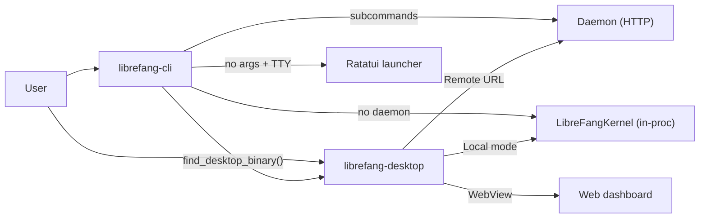

# CLI & Desktop

# CLI & Desktop

User-facing entry points for the LibreFang Agent OS — a terminal-first CLI binary and a native desktop/mobile application built on Tauri 2.0. Both clients share the same operational modes: connect to a running daemon over HTTP, or boot an in-process `LibreFangKernel` directly.

## Sub-modules

| Sub-module | Runtime | UI |
|---|---|---|
| [LibreFang CLI (`librefang-cli`)](librefang-cli-src.md) | Native binary | Terminal (clap subcommands + Ratatui TUI launcher) |
| [LibreFang Desktop (`librefang-desktop`)](librefang-desktop-src.md) | Tauri 2.0 WebView | Native window with system tray |

## How they fit together

The CLI is the primary interface. When run without a subcommand on an interactive TTY, it opens a Ratatui menu (`launcher.rs`) that can detect providers, run the init wizard, or hand off to the desktop app via `find_desktop_binary()`. Subcommands either hit the daemon HTTP API (`daemon_client` / `daemon_json`) or execute in-process through `LibreFangKernel::boot()`.

The desktop app wraps the same kernel + API stack in a Tauri window. On startup it presents a connection screen, then either boots a local server (`server.rs` → `build_router()`) or connects to a remote instance. A system tray (`tray.rs`) keeps it running in the background.

## Key cross-cutting workflows

- **First run / init** — The CLI's `cmd_init_quick` detects the best provider, the TUI init wizard walks through configuration, and `.env` secrets are persisted via `librefang-extensions/dotenv`. The desktop app can then consume the same config.
- **Desktop install** — `desktop_install.rs` in the CLI locates or downloads the platform-appropriate desktop binary, bridging terminal users to the GUI experience.
- **Diagnostics** — `cmd_doctor` validates vault keys, config structure, and daemon reachability before handing off to `daemon_client` for deeper checks.
- **Daemon lifecycle** — `cmd_start`, `cmd_stop`, `render_status_once`, and `find_daemon_with_probe` manage the daemon process. Both clients share the same probe/connect logic.