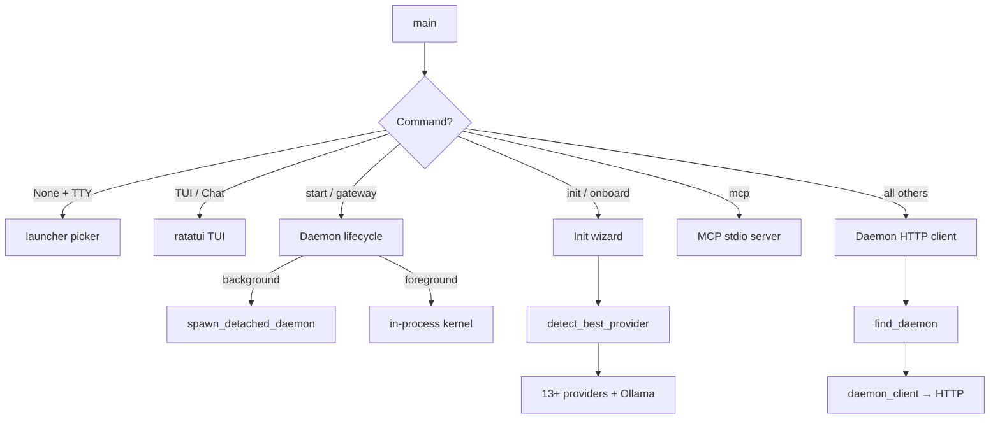
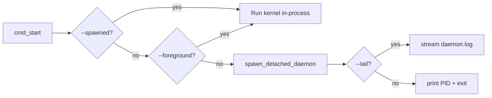

# CLI & Terminal UI

# CLI & Terminal UI Module

## Overview

`librefang-cli` is the command-line interface for LibreFang Agent OS. It provides ~60 subcommands organized into a tree of domain groups (agents, skills, channels, models, etc.) and two full-screen interactive interfaces: a ratatui TUI dashboard and a multi-step init wizard.

The CLI operates in one of two modes depending on whether a daemon is already running:

- **Daemon mode** — the CLI acts as a thin HTTP client, forwarding requests to `librefang start` over localhost. This is the normal runtime path.
- **Single-shot mode** — when no daemon is available, the CLI boots an in-process `LibreFangKernel`, executes the command, and exits. Used by `start --foreground` and certain internal flows.

## Architecture

## Entry Point & Dispatch

`main()` in `src/main.rs` performs this bootstrap sequence:

1. **TLS initialization** — installs the `aws_lc_rs` crypto provider for rustls (must happen before any async/TLS).
2. **Environment loading** — `dotenv::load_dotenv()` reads `~/.librefang/.env` into the process environment. Then `load_vault()` decrypts `vault.enc` via the system keyring.
3. **i18n** — reads the `language` key from `config.toml` and initializes the translation catalog (`i18n::init`).
4. **Argument parsing** — `Cli::parse()` via clap. The full command tree is defined as nested `enum` variants under `Commands`.
5. **Tracing setup** — TUI/chat modes route logs to `~/.librefang/tui.log` (stderr would corrupt ratatui's raw-mode output). All other commands trace to stderr and a `daemon.log` file.
6. **Ctrl+C handler** — skipped for TUI modes (ratatui needs to restore the terminal). On Windows, a custom `SetConsoleCtrlHandler` force-exits on interrupt because the default handler doesn't reliably break `read_line`.

The match on `cli.command` dispatches to individual `cmd_*` functions. When `None` and stdout is a TTY, the interactive launcher picker is shown.

## Command Tree

The clap `Commands` enum defines the top-level subcommands. Groups with subcommands are marked with `[*]` in the help text:

| Top-level command | Subcommand group | Purpose |
|---|---|---|
| `init` | — | Create `~/.librefang/` and default config |
| `start` / `stop` / `restart` | — | Daemon lifecycle |
| `chat` | — | Quick interactive chat with default agent |
| `tui` | — | Full-screen terminal dashboard |
| `spawn` | — | Agent spawn alias (template or manifest) |
| `agent` | `new`, `spawn`, `list`, `chat`, `kill`, `set` | Agent management |
| `skill` | `install`, `list`, `remove`, `search`, `test`, `publish`, `create`, `evolve` | Skill lifecycle |
| `channel` | `list`, `setup`, `test`, `enable`, `disable` | Messaging integrations |
| `hand` | `list`, `active`, `activate`, `deactivate`, `info`, `check-deps`, `install-deps`, `pause`, `resume`, `settings`, `set`, `reload`, `chat` | Autonomous execution modules |
| `models` | `list`, `aliases`, `providers`, `set` | LLM model browser |
| `config` | `show`, `edit`, `get`, `set`, `unset`, `set-key`, `delete-key`, `test-key` | Configuration management |
| `mcp` | `list`, `catalog`, `add`, `remove` (or bare stdio server) | Model Context Protocol |
| `vault` | `init`, `set`, `list`, `remove` | Encrypted credential storage |
| `workflow` | `list`, `create`, `run` | Multi-step agent chains |
| `trigger` | `list`, `create`, `delete` | Event-driven agent invocation |
| `cron` | `list`, `create`, `delete`, `enable`, `disable` | Scheduled jobs |
| `gateway` | `start`, `stop`, `restart`, `status` | Low-level daemon control |
| `approvals` | `list`, `approve`, `reject` | Human-in-the-loop review |
| `security` | `status`, `audit`, `verify` | Audit trail and integrity |
| `memory` | `list`, `get`, `set`, `delete` | Agent KV store |
| `devices` | `list`, `pair`, `remove` | Device pairing |
| `webhooks` | `list`, `create`, `delete`, `test` | HTTP callback triggers |
| `service` | `install`, `uninstall`, `status` | Boot-time auto-start |

Utility commands: `status`, `health`, `doctor`, `dashboard`, `logs`, `sessions`, `message`, `update`, `migrate`, `auth`, `completion`, `new`, `qr`, `hash-password`, `system`, `reset`, `uninstall`.

Many top-level commands are convenience aliases (`agents` → `agent list`, `kill` → `agent kill`, `spawn` → `agent spawn` with template resolution).

## Daemon Communication

### Discovery

`find_daemon()` reads `~/.librefang/daemon.json` via `read_daemon_info()` to get the listen address, then probes `http://{addr}/api/health` with a 2-second timeout. The address normalization replaces `0.0.0.0` with `127.0.0.1` to avoid macOS DNS hangs.

### HTTP Client

`daemon_client()` builds a `reqwest::blocking::Client` with:
- 120-second timeout
- `Authorization: Bearer {api_key}` header when `api_key` is set in config
- TLS via rustls (not native-tls)

All daemon calls go through `daemon_json()` which provides unified error handling — mapping connection refused, timeout, and server errors to localized error messages with suggested fixes via `ui::error_with_fix`.

### Authentication

The `api_key` field in `config.toml` gates daemon access. `read_api_key()` loads it, and `daemon_client_with_api_key()` injects it as a Bearer token. When empty, no auth header is sent.

## Initialization Flows

`cmd_init` has three paths:

### Quick mode (`--quick` or non-TTY)
1. Create `~/.librefang/` and `data/` subdirectory
2. Run `sync_registry` to download provider/integration/assistant definitions
3. Initialize vault (`vault.enc`) and git repo
4. Call `detect_best_provider()` to find an API key
5. Write `config.toml` from the `INIT_DEFAULT_CONFIG_TEMPLATE` with detected provider/model
6. Print next steps

### Interactive wizard (TTY, no existing config)
Delegates to `tui::screens::init_wizard::run()` — a ratatui multi-screen flow:
1. Welcome screen
2. Provider selection
3. API key entry
4. Default model selection
5. Launch choice (desktop app, dashboard, or chat)

On completion, the wizard may auto-start the daemon and launch the user's chosen interface.

### Upgrade mode (`--upgrade` or existing config detected)
1. Backup `config.toml` with timestamp (`config.toml.bak.YYYYMMDD-HHMMSS`)
2. Force-sync registry (TTL=0)
3. Merge new default fields into the existing config without overwriting user values — `find_missing_toplevel_keys` appends only missing top-level keys, preserving comments and formatting by inserting scalars before the first `[table]` header and tables at the end
4. Warn about legacy `require_approval` configurations missing `file_write`/`file_delete`
5. Detect legacy `~/.openclaw` installations

### Provider Detection

`detect_best_provider()` probes in order:
1. **Cloud providers** — `librefang_runtime::drivers::detect_available_provider()` checks 13+ env vars (OpenAI, Anthropic, Gemini, Groq, DeepSeek, OpenRouter, Mistral, Together, Fireworks, xAI, Perplexity, Cohere, Azure OpenAI, plus `GOOGLE_API_KEY`)
2. **Local Ollama** — TCP connect to `127.0.0.1:11434` with 500ms timeout
3. **Interactive guide** — launches a TUI screen to pick a free provider and enter a key
4. **Fallback** — defaults to Groq with printed hints

## Daemon Lifecycle

### `cmd_start`

Background daemon spawning (`spawn_detached_daemon`):
- Re-executes the current binary with `start --spawned`
- Redirects stdout/stderr to `daemon.log`
- On Unix: calls `setsid()` via `pre_exec` to detach from the controlling terminal
- On Windows: uses `DETACHED_PROCESS | CREATE_NEW_PROCESS_GROUP | CREATE_NO_WINDOW` creation flags
- Writes `daemon.json` with PID and listen address for later discovery

### `cmd_stop`

Sends `POST /api/shutdown` to the daemon. If the daemon is unresponsive, falls back to `force_kill_pid()` using the PID from `daemon.json`.

## Terminal UI (TUI)

The `tui` module provides full-screen ratatui interfaces:

- **Dashboard** (`tui::run`) — multi-tab interface with agent list, logs, status
- **Init wizard** (`tui::screens::init_wizard`) — 5-step onboarding
- **Free provider guide** (`tui::screens::free_provider_guide`) — helps pick a free LLM provider
- **Chat** — used by `cmd_quick_chat` and `cmd_agent_chat`

### Event architecture

The TUI uses a dedicated event thread (`spawn_event_thread`) that polls the daemon API and sends results back to the main thread via a channel. Key events trigger tab-specific refresh functions like `refresh_agents` → `load_daemon_agents` and `refresh_dashboard` → `spawn_fetch_dashboard`.

## MCP Server

`mcp::run_mcp_server` implements the Model Context Protocol over stdio, allowing MCP-compatible clients (Claude Code, Cursor) to communicate with LibreFang:

1. Reads JSON-RPC messages from stdin line by line
2. Dispatches via `handle_message` to create a backend (`create_backend`) that wraps the kernel
3. Writes JSON-RPC responses to stdout via `write_message`

The MCP subcommands (`list`, `catalog`, `add`, `remove`) manage `[[mcp_servers]]` entries in `config.toml` and support hot-reload when the daemon is running.

## Supporting Modules

| Module | Purpose |
|---|---|
| `ui` | Colored output helpers: `banner`, `success`, `error`, `hint`, `kv`, `section`, `next_steps`, `error_with_fix`, `check_ok` |
| `progress` | Terminal progress bars with OSC 52 support |
| `table` | Pretty-printed table formatter used across CLI output |
| `templates` | Agent template discovery (`load_all_templates`, `discover_template_dirs`) |
| `i18n` | Translation catalog loaded from config; keyed by message ID with `t()` and `t_args()` |
| `http_client` | Shared `reqwest::Client` builder with TLS configuration |
| `desktop_install` | Locate/download/launch the Tauri desktop app |
| `launcher` | Initial picker shown when `librefang` is run with no arguments on a TTY |

## Platform Considerations

### Ctrl+C Handling

- **Windows**: Custom `SetConsoleCtrlHandler` because the default handler doesn't interrupt blocking `read_line`. First press prints "Interrupted" and exits cleanly; second press hard-exits with code 130.
- **Unix**: The default SIGINT handler already interrupts `read_line`; no custom handler needed.

### File Permissions

On Unix, `restrict_file_permissions` sets `0600` and `restrict_dir_permissions` sets `0700` on sensitive files (config, vault, backups, daemon log directory). These are no-ops on non-Unix platforms.

### Path Conventions

- Home directory: `LIBREFANG_HOME` env var overrides `~/.librefang/`
- Config: `~/.librefang/config.toml`
- Secrets: `~/.librefang/.env` and `~/.librefang/vault.enc`
- Daemon info: `~/.librefang/daemon.json`
- Logs: `~/.librefang/logs/daemon.log` (customizable via `log_dir` in config)
- TUI logs: `~/.librefang/tui.log`