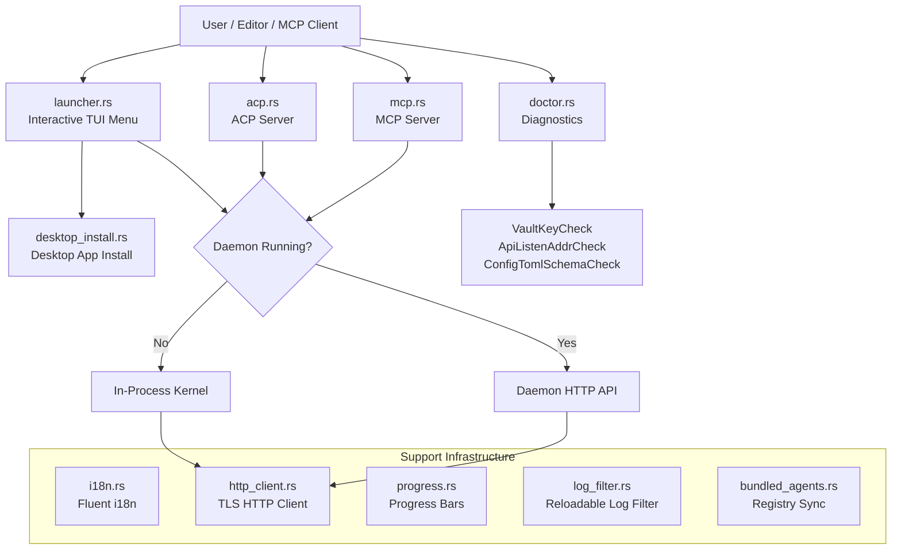

# CLI & Terminal UI

# CLI & Terminal UI Module

The `librefang-cli` crate implements the command-line interface, terminal UI launcher, and several stdio-based protocol servers that allow external tools (editors, MCP clients) to interact with LibreFang. It bridges user-facing interaction to the kernel and daemon backends.

## Architecture Overview



## Key Components

### `acp.rs` — Agent Client Protocol Server

Runs the ACP server over stdio so editors (Zed, VS Code, JetBrains) can embed LibreFang as a native agent.

**Two operating modes:**

| Mode | When | Behavior |
|------|------|----------|
| **Daemon-attached** | Daemon running with ACP listener | Thin bidirectional pipe: stdin ↔ UDS (Unix) or named pipe (Windows). Shares kernel state across multiple concurrent editor tabs. |
| **In-process** | No daemon detected | Boots a fresh `LibreFangKernel` in the current process and serves ACP on stdio until stdin EOF. |

Entry point: `run_acp_server(config, agent)`

The mode-selection logic matters because **approval caches are not shared** between modes. An `allow_always` decision from an in-process session does not carry over when the daemon is running. The selected mode is logged to stderr for exactly this reason.

Platform details:
- **Unix**: Checks `~/.librefang/acp.sock` via `locate_acp_socket()`, which verifies both daemon reachability and socket file existence (stale sockets from crashed daemons fall back to in-process mode).
- **Windows**: Checks daemon via `find_daemon()`, then connects to `\\.\pipe\librefang-acp`.

The default agent is `"assistant"` (`DEFAULT_AGENT_NAME`), matching the dashboard/TUI default.

### `mcp.rs` — Model Context Protocol Server

Exposes LibreFang agents as MCP tools over JSON-RPC 2.0 with Content-Length framing on stdio. Each registered agent becomes a callable tool named `librefang_agent_{name}`.

**Backend selection** (same pattern as ACP):

```
create_backend(config)
  ├─ Daemon running? → McpBackend::Daemon (HTTP client, 120s timeout)
  └─ Otherwise       → McpBackend::InProcess (boots kernel + tokio runtime)
```

**Protocol handling:**

| Method | Response |
|--------|----------|
| `initialize` | Server capabilities, protocol version `2024-11-05` |
| `notifications/initialized` | No response (notification) |
| `tools/list` | Enumerates agents as tool descriptors with `inputSchema` |
| `tools/call` | Resolves tool name → agent, sends message, returns response text |
| Unknown | JSON-RPC error `-32601` |

Agent resolution (`resolve_tool_agent`) tries exact name matching with hyphen/underscore normalization.

**Security:** Messages exceeding 10 MB (`MAX_MCP_MESSAGE_SIZE`) are rejected and drained to prevent OOM and stream desync.

### `launcher.rs` — Interactive Launcher Menu

Displayed when `librefang` is run with no subcommand in a TTY. Built with Ratatui.

**Two menu variants:**

- **First-run** (`MENU_FIRST_RUN`): Starts with "Get started" (onboarding). Detects OpenClaw/OpenFang installations and offers migration.
- **Returning** (`MENU_RETURNING`): Starts with "Chat with an agent" (action-first). "Settings" replaces "Get started".

```rust
pub enum LauncherChoice {
    GetStarted, Chat, Dashboard, DesktopApp,
    TerminalUI, ShowHelp, Quit,
}
```

**Daemon detection** runs on a background thread (`std::sync::mpsc` channel). The spinner animates at ~20 fps (50ms poll interval) until detection completes, then the status block shows daemon URL, agent count, and provider/API key status.

**Key bindings:** `↑/k` `↓/j` navigate, `1-9` direct select, `Enter` confirm, `q/Esc` quit. The help screen supports `PgUp/PgDn`, `g/G` (top/bottom), vim-style scrolling, and a scrollbar widget.

**Desktop app launch** (`launch_desktop_app`) searches for an installed binary, and if not found, offers to download and install via `desktop_install`.

### `desktop_install.rs` — Desktop App Discovery & Installation

Handles downloading the LibreFang Desktop app from GitHub Releases and installing it to platform-standard locations.

**Discovery** (`find_desktop_binary`) searches in order:
1. Sibling of the current CLI executable
2. PATH lookup (`which_lookup`)
3. Platform-specific install path:
   - macOS: `/Applications/LibreFang.app/Contents/MacOS/LibreFang`
   - Windows: `%LOCALAPPDATA%\LibreFang\LibreFang.exe`
   - Linux: `~/.local/bin/librefang-desktop` then `~/Applications/LibreFang.AppImage`

**Platform installers:**

| Platform | Asset | Install method |
|----------|-------|---------------|
| macOS (aarch64/x86_64) | `.dmg` | `hdiutil attach`, copy `.app` to `/Applications`, clear quarantine |
| Windows (x86_64/aarch64) | `-setup.exe` | Run NSIS installer with `/S` (silent) |
| Linux (x86_64) | `.AppImage` | Copy to `~/.local/bin`, `chmod 755` |

**Launching** (`launch`) uses `open -a` for `.app` bundles on macOS, otherwise spawns the binary detached.

### `doctor.rs` — Diagnostic Audit Framework

A trait-based registry of audit checks for `librefang doctor`. Designed to replace the legacy inline check chain with individually testable, addressable checks.

**Adding a new check:**
1. Create a unit struct implementing `AuditCheck`
2. Add it to `registered_checks()`

```rust
pub trait AuditCheck {
    fn run(&self, ctx: &AuditContext) -> AuditResult;
}
```

**Registered checks:**

| Check | What it validates | Common failure |
|-------|-------------------|----------------|
| `VaultKeyCheck` | `LIBREFANG_VAULT_KEY` base64-decodes to exactly 32 bytes | 32 ASCII chars ≠ 32 bytes after decode |
| `ApiListenAddrCheck` | `api_listen` in config.toml parses as `SocketAddr`; warns on port 0 and privileged ports | Malformed address string |
| `ConfigTomlSchemaCheck` | `config.toml` exists and parses as valid TOML | Syntax errors |

Results use a four-level severity: `Pass`, `Info`, `Warn`, `Error`. Each includes a machine-readable `name`, human `summary`, and optional `hint` for remediation.

### `i18n.rs` — Internationalization

Thread-local Fluent-based i18n supporting English (`en`) and Simplified Chinese (`zh-CN`). Fallback language is English.

```rust
init("zh-CN");              // Set language (call once)
let msg = t("daemon-starting");           // Simple lookup
let msg = t_args("models-available", &[("count", "12")]);  // With args
```

Translation files are compiled in via `include_str!` from `locales/{lang}/main.ftl`. Missing keys render as `[key_name]`.

### `log_filter.rs` — Reloadable Log Filter

A per-layer `EnvFilter` backed by `ArcSwap` that supports hot-reload without restarting the daemon. Solves the problem of `tracing_subscriber::reload::Layer` carrying verbose generic subscriber types.

**Baseline directives:** Boot-time per-target overrides (e.g., `librefang_kernel=warn`) are stored and reapplied on every reload via `install_with_baseline`. This prevents a dashboard "set debug" toggle from unmasking kernel/runtime noise that boot had specifically silenced.

```rust
// Install with baseline (daemon init):
let filter = ReloadableEnvFilter::install_with_baseline(
    EnvFilter::new("warn"),
    vec!["librefang_kernel=warn".into(), "librefang_runtime=warn".into()],
);

// Hot-reload from dashboard API:
reload_log_level("debug")?;  // baseline directives survive
```

After swapping the inner filter, `tracing_core::callsite::rebuild_interest_cache()` is called to invalidate per-callsite `Interest` caching.

`CliLogLevelReloader` adapts this to the kernel's `LogLevelReloader` trait.

### `http_client.rs` — HTTP Client

Builds a blocking `reqwest::Client` with bundled TLS CA roots via `librefang_runtime::http_client::tls_config()`. Two functions:

- `client_builder()` → `ClientBuilder` (customize before building)
- `new_client()` → `Client` (ready to use, panics on misconfiguration)

### `bundled_agents.rs` — Registry Sync

Thin backward-compatibility wrapper around `librefang_runtime::registry_sync::sync_registry`. Syncs registry content to the local LibreFang home directory using default cache TTL.

### `progress.rs` — Progress Reporting

Progress bars and spinners using raw ANSI escape sequences. Key types:

- `ProgressBar` — percentage-based bar with unicode block characters
- `Spinner` — animated braille spinner with label
- `SilentProgress` — no-op for non-TTY environments
- `ProgressReporter` trait — unified interface

Use `auto(label, total)` to get the right implementation based on whether stderr is a TTY.

Features:
- OSC 9;4 progress protocol (Windows Terminal, iTerm2, ConEmu)
- Delay suppression: output is hidden for operations completing under 200ms
- Falls back to plain `[n/total] msg` lines over pipes

## Connection to the Rest of the Codebase

The CLI module sits between the user and the runtime infrastructure:

- **Kernel**: `acp.rs`, `mcp.rs`, and the launcher all boot `LibreFangKernel` when no daemon is available. They call `kernel.spawn_approval_sweep_task()` and use `AgentSubsystemApi` for agent operations.
- **Daemon**: When the daemon is running, CLI commands proxy to it via HTTP using `http_client.rs`. The daemon's base URL comes from `find_daemon()`.
- **ACP**: `librefang_acp` crate provides `AcpKernel`, `KernelAdapter`, and `run()`.
- **Runtime**: `bundled_agents.rs` delegates to `librefang_runtime::registry_sync`. The HTTP client reuses `librefang_runtime::http_client::tls_config()`.
- **Config**: Doctor checks read `~/.librefang/config.toml` directly (lightweight TOML parsing, not full `KernelConfig` schema).
- **Types**: `librefang_types::i18n::DEFAULT_LANGUAGE`, `librefang_types::agent::AgentId`.

## Testing Notes

Tests in this module use `tempfile::TempDir` to avoid filesystem mutations and serialize environment variable access with process-wide mutexes (`OnceLock`, `Mutex`) since `cargo test` runs tests in parallel and env var mutation is process-global.

The `doctor.rs` vault key tests use `with_vault_key()` which holds `env_lock()` and restores the original `LIBREFANG_VAULT_KEY` value on drop.

The `desktop_install.rs` tests inject temp directories via dependency-injected variants like `install_linux_appimage_to` and `linux_install_path_in` so no writes escape to the real filesystem.