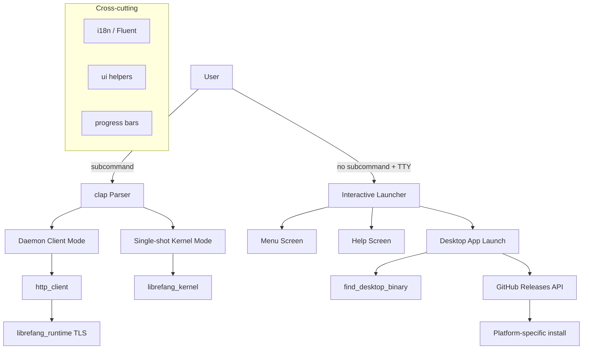

# CLI & Terminal UI

# CLI & Terminal UI Module

## Overview

The `librefang-cli` crate is the primary user interface for LibreFang. It provides a rich command-line interface built on `clap`, an interactive terminal launcher powered by `ratatui`, and platform-aware desktop app management. When invoked with a subcommand, it operates as a traditional CLI. When run bare in a TTY, it presents a full-screen interactive menu.

## Architecture



## Key Components

### Entry Point — `main.rs`

The binary entry point handles:

1. **Global allocator** — Uses `tikv_jemallocator` on non-MSVC targets for better performance.
2. **Ctrl+C handling** — Platform-specific: on Windows, installs a custom `SetConsoleCtrlHandler` that force-exits on double-press; on Unix, relies on default SIGINT behavior.
3. **Tracing setup** — Two paths:
   - `init_tracing_stderr` for short-lived CLI commands (filters out noisy kernel config logs)
   - `init_tracing_file` for daemon/foreground mode (writes to the LibreFang home directory)
4. **Command dispatch** — The `Cli` struct derives `Parser` with ~30 top-level subcommands, each with extensive `long_about` help text.

**Execution modes:**

- **Daemon client mode**: Most commands (`status`, `chat`, `agent list`, etc.) detect a running daemon via `find_daemon()` and communicate over HTTP.
- **Single-shot mode**: If no daemon is running, commands like `chat` boot an in-process `LibreFangKernel` instance.
- **Daemon spawn mode**: `start` launches the kernel as a detached background process; `start --spawned` is the internal flag the child process receives.

**Key dispatch functions** called from `main`:

| Function | Command |
|---|---|
| `cmd_start` / `cmd_stop` | `start`, `stop`, `restart`, `gateway *` |
| `cmd_init` / `cmd_init_upgrade` | `init`, `setup`, `onboard` |
| `cmd_status` | `status` (with `--watch`, `--json`, `--verbose`, `--quiet`) |
| `cmd_migrate` | `migrate --from <source>` |
| `cmd_config_get` / `cmd_config_set` | `config get/set/unset/set-key/test-key` |
| `cmd_trigger_list` | `trigger list` |
| `cmd_workflow_run` | `workflow run` |
| `cmd_devices_pair` | `devices pair` |
| `cmd_vault_set` | `vault set` |
| `cmd_service_status` | `service status` |
| `cmd_system_version` | `system version` |
| `cmd_hand_check_deps` / `cmd_hand_status` | `hand check-deps/status` |

The `daemon_client` / `daemon_client_with_api_key` helpers construct an authenticated HTTP client pointing at the running daemon's base URL, using `read_daemon_info` to discover the daemon's port and auth token.

### Interactive Launcher — `launcher.rs`

When `librefang` is run with no subcommand inside a TTY, `launcher::run()` takes over. It renders a Ratatui-based fullscreen menu that adapts its layout and options based on the user's state.

**Screen states:**

- `Screen::Menu` — The main selection menu
- `Screen::Help` — Full `--help` output rendered as a scrollable view with scrollbar

**First-run vs returning user detection:**

- `is_first_run()` checks whether `~/.librefang/config.toml` exists
- First-run users see "Get started" as the primary (highlighted) option
- Returning users see "Chat" first, with settings demoted to the bottom

**Background daemon detection:**

On launch, a background thread calls `find_daemon()` and queries `/api/agents` for a running count. The main loop polls for this result on each 50ms tick, updating the status indicator from a spinner to a live status line showing daemon URL and agent count.

**Provider detection:**

`detect_provider()` scans a prioritized list of environment variables (`ANTHROPIC_API_KEY`, `OPENAI_API_KEY`, `DEEPSEEK_API_KEY`, `GEMINI_API_KEY`, `GROQ_API_KEY`, etc.) and displays the first match in the status area.

**Migration hints:**

If `~/.openclaw` or `~/.openfang` directories are detected during first run, the launcher shows a hint suggesting "Get started" includes automatic migration.

**Key bindings:**

| Key | Action |
|---|---|
| `↑`/`k` | Move selection up |
| `↓`/`j` | Move selection down |
| `1`–`9` | Quick-select menu item (also confirms) |
| `Enter` | Confirm selection |
| `q`/`Esc` | Quit (or back from help) |

**Help screen navigation:** `j`/`k`, `PgUp`/`PgDn`, `g`/`G` for top/bottom, with scroll-bound clamping that prevents over-scrolling past the last line.

**Rendering:**

- Content is constrained to a max width of 80 columns with a 3-character left margin (`MARGIN_LEFT`)
- Vertical centering places content in the upper third of the terminal
- The `theme` module (from `crate::tui::theme`) provides consistent colors: `BG_PRIMARY`, `ACCENT`, `TEXT_PRIMARY`, `TEXT_TERTIARY`, `GREEN`, `YELLOW`, `BLUE`, `BG_HOVER`, `BORDER`
- A panic hook is installed after `ratatui::init()` to ensure `ratatui::try_restore()` is called on panic

**`LauncherChoice` variants:**

`GetStarted`, `Chat`, `Dashboard`, `DesktopApp`, `TerminalUI`, `ShowHelp`, `Quit` — returned to `main()` for dispatch.

### Desktop App Management — `desktop_install.rs`

Handles discovery, download, and installation of the LibreFang desktop application.

**Binary discovery (`find_desktop_binary`):**

Search order:
1. Sibling of the current CLI executable
2. PATH lookup via `which_lookup()`
3. Platform-specific standard locations:
   - macOS: `/Applications/LibreFang.app/Contents/MacOS/LibreFang`
   - Windows: `%LOCALAPPDATA%\LibreFang\LibreFang.exe`
   - Linux: `~/.local/bin/librefang-desktop` or `~/Applications/LibreFang.AppImage`

**Download and install flow (`prompt_and_install` → `download_and_install`):**

1. Check if platform is supported (`platform_asset_suffix`)
2. Query `https://api.github.com/repos/librefang/librefang/releases/latest`
3. Find the asset matching the platform suffix
4. Stream-download to a temp directory via `download_file`
5. Delegate to platform-specific installer

**Platform-specific installers:**

| Platform | Asset | Install method |
|---|---|---|
| macOS (aarch64) | `*_aarch64.dmg` | Mount with `hdiutil`, copy `.app` to `/Applications`, clear quarantine with `xattr -rd com.apple.quarantine` |
| macOS (x86_64) | `*_x64.dmg` | Same as above |
| Windows (x86_64) | `*_x64-setup.exe` | Run NSIS installer with `/S` (silent), installs to `%LOCALAPPDATA%\LibreFang\` |
| Windows (aarch64) | `*_aarch64-setup.exe` | Same as above |
| Linux (x86_64) | `*_amd64.AppImage` | Copy to `~/.local/bin/librefang-desktop`, `chmod 755` |

**Launching (`launch`):**

On macOS, if the binary path is inside a `.app` bundle (detected via `find_parent_app_bundle`), it uses `open -a` to launch the bundle. Otherwise, it spawns the binary with stdin/stdout/stderr set to `null` (detached).

### Internationalization — `i18n.rs`

Thread-local Fluent-based i18n with two supported languages: `en` (default) and `zh-CN`.

**API:**

- `init(language)` — Initialize the thread-local bundle. Falls back to English if the requested language is unsupported or fails to load.
- `t(key)` — Translate a key with no arguments. Returns `[key]` if not initialized or key is missing.
- `t_args(key, &[("name", "value"), ...])` — Translate with interpolation parameters.

**FTL files** are compiled in via `include_str!` from `locales/en/main.ftl` and `locales/zh-CN/main.ftl`.

**Usage pattern:** `init()` is called once during startup (from both CLI and desktop), then `t()` / `t_args()` are called freely throughout the codebase.

### HTTP Client — `http_client.rs`

Wraps `reqwest::blocking::Client` with TLS configured from `librefang_runtime::http_client::tls_config()`, which bundles CA roots for environments where system roots are unavailable.

Two functions:
- `client_builder()` — Returns a `ClientBuilder` with preconfigured TLS
- `new_client()` — Builds and returns a `Client`, panicking on failure (should never fail with bundled roots)

### Registry Sync — `bundled_agents.rs`

A thin backwards-compatibility wrapper around `librefang_runtime::registry_sync::sync_registry`. Called during `init` to sync agent templates from the registry to the local LibreFang home directory.

### Supporting Modules (referenced but implementation in crate)

| Module | Purpose |
|---|---|
| `ui` | Console output helpers (`success`, `error`, `hint`, `step`, `kv`) used by `desktop_install` and other modules |
| `progress` | Terminal progress bars with OSC 52 progress sequence support |
| `table` | Columnar table formatting for agent lists, models, etc. |
| `templates` | Agent template discovery and loading |
| `tui` | Full-screen TUI dashboard (separate from the launcher — provides tab-based agent management, logs, dashboard) |
| `mcp` | MCP stdio server and catalog management |

## Command Structure

The CLI defines a deeply nested command tree. The top-level commands with their subcommand groups:

```
librefang
├── init / setup / onboard / configure    # Setup commands
├── start / stop / restart                # Daemon lifecycle
├── chat / message                        # Agent interaction
├── spawn / agents / kill                 # Agent management shortcuts
├── agent *                               # Full agent management
│   ├── new / spawn / list / chat / kill / set
├── models *                              # LLM model management
│   ├── list / aliases / providers / set
├── config *                              # Configuration management
│   ├── show / edit / get / set / unset / set-key / delete-key / test-key
├── skill *                               # Skill management
│   ├── install / list / remove / search / test / publish / create / evolve *
├── channel *                             # Channel integrations
│   ├── list / setup / test / enable / disable
├── hand *                                # Hand management
│   ├── list / active / status / install / activate / deactivate / info
│   ├── check-deps / install-deps / pause / resume / settings / set / reload / chat
├── workflow * / trigger * / cron *        # Automation
├── mcp *                                 # MCP server management
│   ├── list / catalog / add / remove
├── security *                            # Security & audit
│   ├── status / audit / verify / audit-reset
├── memory *                              # Agent KV store
├── devices * / qr                        # Device pairing
├── webhooks *                            # Webhook management
├── vault * / auth *                      # Credentials & auth
├── service *                             # Boot service management
├── status / health / doctor / logs       # Diagnostics
├── dashboard / tui / desktop             # UI launchers
├── update / migrate / reset / uninstall  # Lifecycle
├── gateway * / system * / new / completion / hash-password  # Utilities
```

## Adding a New Command

1. Add a variant to the appropriate `Commands` enum (or create a new subcommand enum).
2. Add `#[command(long_about = "...")]` with examples.
3. Add a `cmd_*` function in `main.rs` (or a dedicated module for complex commands).
4. Add a match arm in the `main()` dispatch block.
5. If the command talks to the daemon, use `daemon_client()` / `daemon_client_with_api_key()`.
6. If it needs in-process execution, use `LibreFangKernel::new()` with `load_config()`.

## Testing Conventions

- `i18n` module includes inline `#[cfg(test)]` verifying fallback behavior, Chinese rendering, and parameterized strings.
- The `mcp` module tests JSON-RPC message parsing and response construction.
- Integration tests across the workspace call `spawn_agent` from the TUI module to create test agents.
- The `table` module is reused by `librefang-migrate`, `librefang-hands`, and config resolution code.