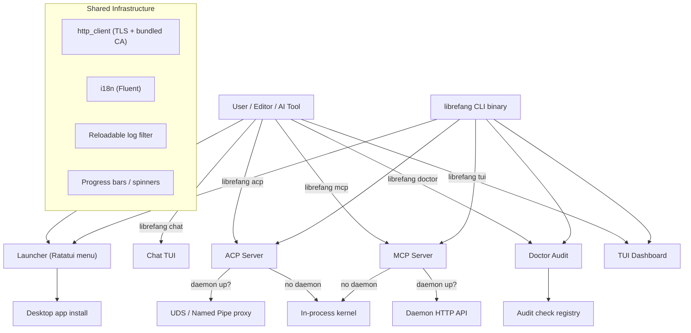

# CLI & Terminal UI

# CLI & Terminal UI Module

The `librefang-cli` crate is the primary user-facing entry point for LibreFang. It provides the command-line binary, an interactive launcher menu, a full Terminal UI (TUI) dashboard, and several protocol servers that let external tools (editors, AI agents) communicate with LibreFang kernels.

## Architecture Overview



## Key Components

### ACP Server — `acp.rs`

The Agent Client Protocol server lets editors (Zed, VS Code, JetBrains) embed LibreFang as a native agent over stdio. It operates in two mutually exclusive modes:

1. **Daemon-attached (proxy mode)** — When the daemon is running, the CLI becomes a thin bidirectional pipe between stdin/stdout and the daemon's ACP listener. On Unix this connects via a Unix Domain Socket at `~/.librefang/acp.sock`; on Windows via the named pipe `\\.\pipe\librefang-acp`. Multiple editors share the same kernel state, agent history, and approval decisions.

2. **In-process** — When no daemon is detected, the CLI boots a fresh `LibreFangKernel` in the current process and serves ACP on stdio until stdin EOF.

The mode is selected automatically at startup. The chosen mode is logged to stderr because approval caches (`allow_always`) are **not shared** between in-process and daemon-attached runs — a user who approved a tool in one mode will be re-prompted in the other.

**Entry point:** `run_acp_server(config, agent)`  
**Default agent:** `"assistant"` (mirrors dashboard/TUI default)

Key internals:
- `locate_acp_socket()` — checks daemon reachability *and* socket file existence; stale sockets from crashed daemons fall back to in-process mode (Unix only).
- `run_uds_proxy()` / `run_pipe_proxy()` — bidirectional stdin↔socket/stdout pump using `tokio::select!`. Either direction closing ends the session.

### MCP Server — `mcp.rs`

Exposes LibreFang agents as MCP (Model Context Protocol) tools over JSON-RPC 2.0 on stdio with Content-Length framing. Each registered agent appears as a callable tool named `librefang_agent_{name}`.

**Backend selection** (same pattern as ACP):
- Daemon mode: HTTP client hitting the daemon's REST API.
- In-process mode: direct `LibreFangKernel` calls via a Tokio runtime.

**Protocol methods handled:**

| Method | Behavior |
|---|---|
| `initialize` | Returns server info and capabilities (`tools: {}`) |
| `notifications/initialized` | No response (notification) |
| `tools/list` | Enumerates agents as tool descriptors |
| `tools/call` | Routes `message` argument to the resolved agent |
| Unknown | Returns JSON-RPC error `-32601` |

**Security:** Messages larger than 10 MB (`MAX_MCP_MESSAGE_SIZE`) are rejected and drained to prevent OOM.

### Interactive Launcher — `launcher.rs`

Displayed when `librefang` is run with no subcommand in a TTY. A Ratatui-based one-shot menu with two variants:

- **First-run menu** — "Get started" is the top entry; includes migration hints for OpenClaw/OpenFang users.
- **Returning-user menu** — "Chat with an agent" is first; setup relegated to "Settings" at the bottom.

The launcher detects daemon status and provider API keys in a background thread, shows a spinner while detecting, and surfaces results as status indicators.

```rust
pub enum LauncherChoice {
    GetStarted, Chat, Dashboard, DesktopApp,
    TerminalUI, ShowHelp, Quit,
}
```

**Navigation:** ↑/k, ↓/j, digits 1–9 for direct selection, Enter to confirm, q/Esc to quit. The help screen is a scrollable view of the full `--help` output with PgUp/PgDn and g/G shortcuts.

**Desktop app launch:** `launch_desktop_app()` searches for an existing binary, and if not found, offers to download and install it via `desktop_install`.

### Desktop Install — `desktop_install.rs`

Handles discovery, download, and installation of the LibreFang Desktop app from GitHub releases.

**Binary discovery order:**
1. Sibling of the current CLI executable
2. `PATH` lookup (`which_lookup`)
3. Platform-specific standard install location

**Download flow:** Queries `https://api.github.com/repos/librefang/librefang/releases/latest`, selects the asset matching the current platform/arch suffix, streams it to a temp directory, then runs platform-specific installation:

| Platform | Asset | Install method |
|---|---|---|
| macOS (aarch64/x86_64) | `.dmg` | `hdiutil attach`, copy to `/Applications`, clear quarantine |
| Windows (x86_64/aarch64) | `-setup.exe` | Silent NSIS install (`/S`) |
| Linux (x86_64) | `.AppImage` | Copy to `~/.local/bin/`, `chmod 755` |

macOS launch detects `.app` bundles via `find_parent_app_bundle` and uses `open -a` for proper bundle activation.

### Doctor — `doctor.rs`

A trait-based audit framework for `librefang doctor`. Each check is an independent struct implementing `AuditCheck`:

```rust
pub trait AuditCheck {
    fn run(&self, ctx: &AuditContext) -> AuditResult;
}
```

Results carry a `Severity` (`Pass`, `Info`, `Warn`, `Error`), a machine-readable `name`, a human `summary`, and an optional remediation `hint`.

**Registered checks (add new ones to `registered_checks()`):**

| Check | What it validates |
|---|---|
| `VaultKeyCheck` | `LIBREFANG_VAULT_KEY` base64-decodes to exactly 32 bytes (catches the common "32 ASCII chars ≠ 32 bytes" mistake) |
| `ApiListenAddrCheck` | `api_listen` in `config.toml` parses as `SocketAddr`; warns on privileged ports (<1024) and port 0 |
| `ConfigTomlSchemaCheck` | `config.toml` exists and parses as valid TOML |

**Adding a check:** Create a unit struct, implement `AuditCheck`, add it to `registered_checks()`. No other wiring needed.

`AuditContext` holds pre-resolved paths (`librefang_home`) so checks don't repeat lookups.

### HTTP Client — `http_client.rs`

Thin wrapper providing a `reqwest::blocking::Client` with bundled TLS CA roots (via `librefang_runtime::http_client::tls_config`). Used throughout the CLI for daemon communication and GitHub API calls.

```rust
pub fn client_builder() -> reqwest::blocking::ClientBuilder
pub fn new_client() -> reqwest::blocking::Client
```

### i18n — `i18n.rs`

Internationalization using [Fluent](https://projectfluent.org/). Supports `en` and `zh-CN`, with Fluent message files embedded at compile time via `include_str!`.

**Thread-local storage:** The active `I18n` bundle is stored in a `thread_local!` `RefCell`. Initialize once with `init(language)`, then use the `t()` / `t_args()` helpers:

```rust
i18n::init("zh-CN");
let label = i18n::t("label-dashboard"); // "控制台"
let msg = i18n::t_args("models-available", &[("count", "12")]); // "12 models available"
```

Falls back to English for unsupported languages. Missing keys render as `[key_name]`.

### Reloadable Log Filter — `log_filter.rs`

A per-layer `tracing` filter that can be hot-reloaded at runtime (e.g., from the dashboard's log level control). Built on `ArcSwap<EnvFilter>` instead of `tracing_subscriber::reload` to avoid complex generic type signatures in the daemon's subscriber stack.

**Key design points:**
- `ReloadableEnvFilter` implements `Filter<S>` by forwarding every hook to the current inner `EnvFilter`.
- `install_with_baseline(initial, baseline)` stores baseline directives (e.g., `librefang_kernel=warn`) that are reapplied on every reload. This prevents a dashboard "debug" toggle from unmasking kernel noise that was specifically silenced at boot.
- `reload_log_level(directive)` swaps the inner filter and calls `tracing_core::callsite::rebuild_interest_cache()` to invalidate per-callsite interest caching.

`CliLogLevelReloader` adapts this for the kernel's `LogLevelReloader` trait.

### Progress — `progress.rs`

ANSI-based progress bars and spinners with no external dependency. Features:
- Percentage bar with unicode block characters
- Braille spinner animation
- OSC 9;4 terminal progress protocol (Windows Terminal, iTerm2)
- Delay suppression: operations completing under 200ms produce no output
- `ProgressReporter` trait for TTY/non-TTY abstraction

Use `auto(label, total)` to get an appropriate reporter for the current environment.

### Bundled Agents — `bundled_agents.rs`

Backwards-compatible wrapper that delegates to `librefang_runtime::registry_sync::sync_registry`. Syncs registry content to the local LibreFang home directory.

## Connecting to the Rest of the Codebase

**Kernel interaction:** Both ACP and MCP servers can operate against either a running daemon (via HTTP/UDS/named pipe) or an in-process `LibreFangKernel`. The in-process path calls `LibreFangKernel::boot()` and `spawn_approval_sweep_task()` to get a fully functional kernel.

**TUI event system:** The TUI dashboard (`src/tui/`) uses a channel-based event loop. Background threads spawned by `spawn_fetch_*` functions in `src/tui/event.rs` communicate with the daemon API and send results back to the main event loop. The TUI screens consume these events to populate lists, status cards, and interactive forms.

**Config and state:** The CLI reads `$LIBREFANG_HOME` (defaulting to `~/.librefang`) for all configuration. The doctor checks, first-run detection, and socket discovery all key off this path. The `config.toml` file at this location is the single source of truth for settings like `api_listen`.

**Migration:** The launcher detects existing `~/.openclaw` or `~/.openfang` directories on first run and surfaces a migration hint pointing users to the "Get started" flow.

## Testing Conventions

Tests across this module follow a consistent pattern:

- **TempDir isolation:** All filesystem mutations use `tempfile::TempDir` so nothing escapes to the user's real home.
- **Env var serialization:** Tests that mutate process-global env vars (`LIBREFANG_VAULT_KEY`, `LIBREFANG_HOME`, `PATH`) use a `Mutex` lock (`env_lock` / `ENV_LOCK`) and restore the original value in the same scope.
- **Dependency injection:** Platform-specific install functions have `_in` / `_to` variants (e.g., `install_linux_appimage_to`, `linux_install_path_in`) that accept explicit paths for testability.
- **Process-wide singletons:** `OnceLock`-based globals (`LIVE_FILTER`, `BASELINE_DIRECTIVES`) are exercised in a single sequential test function rather than parallel `#[test]` fns, since `OnceLock` semantics mean only the first `install()` call actually seeds the slot.