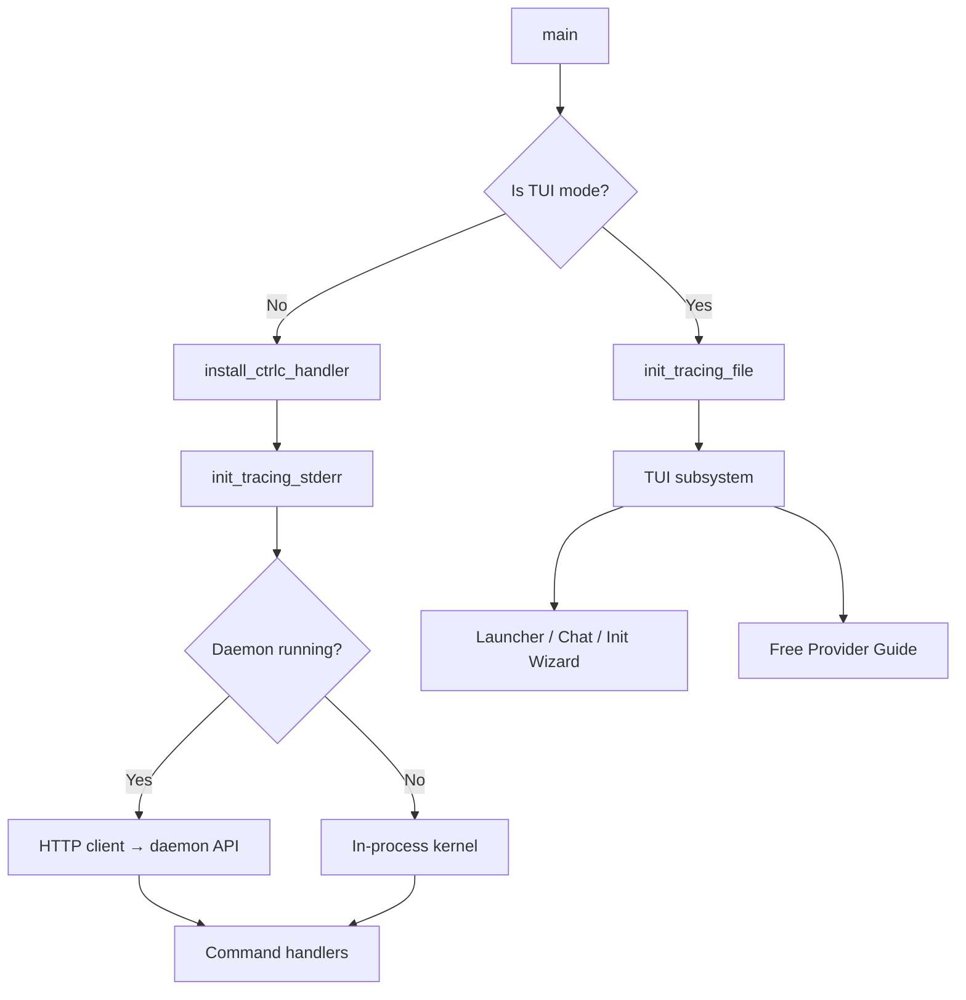

# CLI & Terminal UI

# CLI & Terminal UI Module

## Overview

`librefang-cli` is the command-line interface for the LibreFang Agent OS. It provides over 40 top-level commands and subcommands for deploying, managing, and orchestrating AI agents from the terminal. The CLI operates in two modes:

- **Daemon mode** — when the kernel daemon is running (`librefang start`), the CLI communicates over HTTP to a background API server.
- **Single-shot mode** — when no daemon is available, commands boot an in-process `LibreFangKernel` instance for the duration of the command.

The module also contains a full-screen terminal UI (TUI) built with ratatui, used for the interactive setup wizard, chat sessions, and the launcher dashboard.

## Architecture



## Entry Point

`main()` in `src/main.rs` performs this initialization sequence:

1. **Crypto provider** — installs `aws_lc_rs` as the rustls default (required before any async/TLS work).
2. **Dotenv** — loads `~/.librefang/.env` into the process environment via `librefang_extensions::dotenv::load_dotenv()`. System environment variables take priority.
3. **i18n** — reads the `language` field from `config.toml` and initializes the translation system via `i18n::init()`.
4. **CLI parsing** — `Cli::parse()` using clap with a `--config` global flag and a `Commands` subcommand enum.
5. **TUI detection** — determines if this invocation needs the terminal in raw mode (launcher with no subcommand, `tui`, `chat`, or `agent chat`). TUI modes get file-based tracing and skip the Ctrl+C handler.
6. **Tracing** — see [Tracing & Logging](#tracing--logging) below.
7. **Command dispatch** — a `match` on `cli.command` routes to `cmd_*` handler functions.

## Execution Modes

### TUI Mode

Activated when the command is `tui`, `chat`, `agent chat`, or when the binary is launched with no subcommand on an interactive terminal.

Key differences from CLI mode:
- Tracing writes to `~/.librefang/tui.log` (stderr output corrupts ratatui's raw terminal).
- No Ctrl+C handler is installed — ratatui needs to restore the terminal state on exit.
- The launcher screen presents a menu: Get Started, Chat, Dashboard, Desktop App, Terminal UI, Show Help, Quit.

### CLI Mode

All other subcommands. Tracing goes to stderr with a compact, timestamp-free format. A Ctrl+C handler is installed that cleanly exits on first press and force-exits on second.

### Daemon vs. Single-Shot

Each `cmd_*` handler checks for a running daemon via `find_daemon()`:

```rust
pub(crate) fn find_daemon() -> Option<String>
```

This reads `~/.librefang/daemon.json` (written by the daemon at startup), normalizes `0.0.0.0` to `127.0.0.1`, and probes the `/api/health` endpoint. If the daemon is reachable, commands use `daemon_client()` (an HTTP client with optional `Authorization: Bearer` header). If not, they fall back to loading config and creating an in-process kernel.

## Command Structure

Commands are defined via clap's `#[derive(Subcommand)]` on the `Commands` enum. The hierarchy is:

| Top-level | Subcommands | Purpose |
|-----------|-------------|---------|
| `init` | — | Create `~/.librefang/`, write defaults |
| `start` | — | Launch daemon (background, foreground, or tail) |
| `stop` | — | Stop running daemon |
| `restart` | — | Stop then start |
| `chat` | — | Interactive chat with default agent |
| `message` | — | One-shot message + response |
| `tui` | — | Full-screen terminal dashboard |
| `status` | — | Daemon health and uptime |
| `doctor` | — | Diagnostic checks |
| `agent` | `new`, `spawn`, `list`, `chat`, `kill`, `set` | Agent lifecycle |
| `workflow` | `list`, `create`, `run` | Multi-step workflows |
| `trigger` | `list`, `create`, `delete` | Event triggers |
| `skill` | `install`, `list`, `remove`, `search`, `test`, `publish`, `create`, `evolve` | Skill management |
| `channel` | `list`, `setup`, `test`, `enable`, `disable` | Messaging integrations |
| `hand` | `list`, `active`, `activate`, `deactivate`, `info`, `check-deps`, `install-deps`, `pause`, `resume`, `settings`, `set`, `reload`, `chat` | Autonomous execution modules |
| `config` | `show`, `edit`, `get`, `set`, `unset`, `set-key`, `delete-key`, `test-key` | Configuration management |
| `models` | `list`, `aliases`, `providers`, `set` | LLM model browsing |
| `mcp` | `list`, `catalog`, `add`, `remove` | Model Context Protocol servers |
| `cron` | `list`, `create`, `delete`, `enable`, `disable` | Scheduled jobs |
| `security` | `status`, `audit`, `verify`, `audit-reset` | Security and audit trail |
| `memory` | `list`, `get`, `set`, `delete` | Agent KV store |
| `vault` | `init`, `set`, `list`, `remove` | Encrypted credential storage |
| `webhooks` | `list`, `create`, `delete`, `test` | HTTP callback triggers |
| `gateway` | `start`, `stop`, `restart`, `status` | Low-level daemon control |
| `service` | `install`, `uninstall`, `status` | OS auto-start (systemd/launchd/Windows) |

Several convenience aliases exist: `spawn` → `agent new`, `agents` → `agent list`, `kill` → `agent kill`, `setup` → `init --quick`, `configure` → `init` (interactive), `onboard` → interactive wizard.

## Initialization & Onboarding

### `cmd_init(quick: bool)`

The init flow creates `~/.librefang/` and all required state:

1. **Directory creation** — `~/.librefang/` and `~/.librefang/data/`, with `restrict_dir_permissions()` enforcing `0700` on Unix.
2. **Registry sync** — `librefang_runtime::registry_sync::sync_registry()` downloads provider configs and integrations.
3. **Vault init** — `init_vault_if_missing()` creates the encrypted credential vault at `vault.enc`.
4. **Git init** — `init_git_if_missing()` creates a git repo for config versioning, with a `.gitignore` excluding secrets, cache, DB files, and backups.
5. **Existing config detection** — if `config.toml` already exists in interactive mode, the user is redirected to `cmd_init_upgrade()` to avoid overwriting their settings (#1862).
6. **Provider detection** — `detect_best_provider()` probes environment variables for 13+ cloud providers, checks local Ollama, and falls back to an interactive TUI guide for free providers.

**Quick mode** (`--quick`) skips all prompts and writes sensible defaults. **Interactive mode** launches the ratatui-based `init_wizard` with a 5-step flow (provider selection, API key, model, daemon start, launch choice).

### `cmd_init_upgrade()`

Handles upgrades of existing installations:

1. Backs up `config.toml` with a timestamp (e.g., `config.toml.bak.20240315-093000`).
2. Forces registry sync (TTL=0).
3. Finds top-level keys present in the default template but missing from the user's config.
4. Appends missing scalars before the first `[table]` header and missing tables at end of file — preserving the user's comments and formatting.
5. Warns about legacy `~/.openclaw` installations and outdated `require_approval` lists.

## Daemon Communication

### `find_daemon()` / `find_daemon_in_home()`

Reads `~/.librefang/daemon.json` via `librefang_api::server::read_daemon_info()`, then probes `http://{addr}/api/health` with a 1-second connect timeout. Returns the base URL on success.

### `daemon_client()`

Builds a `reqwest::blocking::Client` with:
- 120-second request timeout
- Optional `Authorization: Bearer <api_key>` header (read from config via `read_api_key()`)

### `daemon_json()`

Utility that sends a request, checks the response status, and parses the JSON body. On connection failures, it exits with i18n-localized error messages and suggested fixes (timeout, connection refused, generic).

### `read_api_key()`

Reads the `api_key` field from `config.toml`. When set, all daemon HTTP requests include the bearer token. When empty/missing, requests are unauthenticated.

## Terminal UI (TUI)

The TUI subsystem lives in the `tui` module and uses ratatui for full-screen terminal rendering. Key screens:

- **Launcher** — shown when running `librefang` with no arguments on an interactive terminal. Presents: Get Started, Chat, Dashboard, Desktop App, Terminal UI, Help, Quit.
- **Init wizard** (`tui::screens::init_wizard`) — 5-step interactive onboarding (provider, key, model, daemon, launch).
- **Free provider guide** (`tui::screens::free_provider_guide`) — helps users pick a free LLM provider (Groq, Gemini, etc.) and configure an API key.
- **Chat** — interactive chat with streaming agent responses.
- **Agent management** — list, spawn, and monitor agents.

The TUI event loop runs on a background thread (`spawn_event_thread`), with key events dispatched through `handle_key` to tab-specific handlers.

## Key Internal Modules

| Module | Purpose |
|--------|---------|
| `desktop_install` | Locates and launches the Tauri desktop app binary, offers to download if missing |
| `http_client` | Shared `reqwest::blocking::Client` builder (TLS config, timeouts) |
| `i18n` | Translation system — `init(&language)` loads catalogs, `t()` / `t_args()` look up strings |
| `launcher` | Launcher menu — returns `LauncherChoice` enum |
| `mcp` | MCP stdio server — reads JSON-RPC from stdin, dispatches to `create_backend()`, writes responses |
| `progress` | Terminal progress bars with OSC 9/4 support; handles zero-total edge case gracefully |
| `table` | `Table` builder for pretty-printed tabular output (used across the codebase) |
| `templates` | `load_all_templates()` discovers agent templates from registry and `~/.librefang/templates/` |
| `tui` | Full ratatui application: event loop, screens, widgets |
| `ui` | CLI output helpers: `banner()`, `success()`, `error()`, `error_with_fix()`, `hint()`, `kv()`, `section()`, `next_steps()`, `blank()` |

## Tracing & Logging

Two tracing initializers, selected based on execution mode:

### `init_tracing_stderr(log_level)`

For CLI subcommands. Layers:
- **EnvFilter** — reads `RUST_LOG`, falls back to the configured `log_level`. When `RUST_LOG` is not set explicitly, library crates (`librefang_kernel`, `librefang_runtime`, `librefang_extensions`) are muted to `warn`/`error` to prevent config-load chatter from leaking into one-shot commands.
- **Compact stderr layer** — no timestamps, no target prefix.
- **File layer** — appends to `~/.librefang/daemon.log` with full format.
- **OTel reload layer** (feature-gated `telemetry`) — a no-op slot that `init_otel_tracing` can swap in later.

### `init_tracing_file(log_level, custom_log_dir)`

For TUI modes. Writes to `~/.librefang/tui.log` (or custom `log_dir`). If file creation fails, falls back to `/dev/null` suppression rather than corrupting the terminal.

The `log_level` is read from `config.toml`'s `log_level` field via `load_log_level_from_config()`, defaulting to `"info"`.

## Platform-Specific Behavior

### Ctrl+C Handling

- **Windows** — installs a custom `SetConsoleCtrlHandler` because the default handler doesn't reliably interrupt blocking `read_line` calls in MINGW. First Ctrl+C prints "Interrupted." and exits cleanly; second press calls `process::exit(130)`.
- **Unix** — no custom handler needed; the default SIGINT handler already interrupts `read_line` and terminates.

### File Permissions

On Unix, `restrict_file_permissions()` enforces `0600` on sensitive files (config, vault, backups) and `restrict_dir_permissions()` enforces `0700` on `~/.librefang/`. These are no-ops on non-Unix platforms.

### Auto-Start Service

The `service` subcommand manages OS-specific auto-start:
- **Linux**: systemd user service at `~/.config/systemd/user/librefang.service`
- **macOS**: LaunchAgent at `~/Library/LaunchAgents/ai.librefang.daemon.plist`
- **Windows**: registry entry under `HKCU\...\Run`

## Configuration

The CLI reads from `~/.librefang/config.toml` (overridable via `LIBREFANG_HOME` env var or `--config` flag). Key config fields used by the CLI:

| Field | Used by |
|-------|---------|
| `api_key` | `daemon_client()` for bearer auth |
| `home_dir` | `DaemonConfigContext` for daemon paths |
| `log_dir` | Custom log output directory |
| `log_level` | Tracing verbosity |
| `language` | i18n locale |
| `update_channel` | `stable`/`beta`/`rc` for self-update |

API keys are stored in `~/.librefang/.env` (dotenv format) or in the encrypted `vault.enc` via the `vault` subcommand.

## Dependency Graph

The CLI sits at the top of the dependency tree:

```
librefang-cli
├── librefang-api        (daemon info reading, telemetry)
├── librefang-kernel     (in-process kernel, config loading)
├── librefang-types      (AgentId, AgentManifest, config types)
├── librefang-extensions (dotenv, vault, credential encryption)
├── librefang-runtime    (provider detection, model catalog, registry sync)
├── librefang-hands      (hand management)
├── librefang-migrate    (framework migration: openclaw, langchain, autogpt)
├── clap / clap_complete (arg parsing, shell completions)
├── ratatui              (TUI rendering)
├── reqwest              (HTTP client for daemon communication)
├── colored              (terminal color output)
└── tracing / tracing-subscriber (structured logging)
```